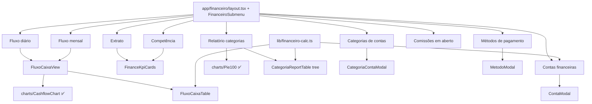

# Financeiro — Relatórios & Cadastros (lote 4) — Design

**Spec**: `.specs/features/financeiro-relatorios/spec.md`
**Status**: Draft

---

## Architecture Overview

9 telas sob `/financeiro/*`, agrupadas por um **submenu lateral** (padrão `EstoqueSubmenu` + `estoque/layout.tsx`).
Cada página é Server Component fino: `Breadcrumb` + `View` client. Toda interatividade (expand de tree,
filtros de KPI, modais, charts) é client. Dados em `lib/mock.ts` (estende o que já existe); cálculos puros
e testáveis em `lib/financeiro-calc.ts` (padrão `pacote-calc.ts`).



---

## Code Reuse Analysis

### Existing Components to Leverage

| Component | Location | How to Use |
|---|---|---|
| `CashflowChart`, `CashflowLegend` | `components/charts/cashflow-chart.tsx` | Charts 17/18 direto (recebe `CashflowPoint[]`) |
| `Pie100` / `Donut` | `components/charts/donut.tsx` | 2 donuts da tela 19 |
| `FinanceTable` | `components/financeiro/finance-table.tsx` | **Refatorar**: extrair header de KPIs → `FinanceKpiCards` (sem mudar API pública; telas 13/14 intactas) |
| `ListShell` | `components/ui/list-shell.tsx` | Chrome (header+count+filtros+paginação) de 21/22/23 |
| `Modal` | `components/ui/modal.tsx` | Base dos 3 modais P3 |
| `Field`/`Input`/`Select` | `components/ui/field.tsx` | Campos dos modais |
| `StatusBadge` | `components/ui/status-badge.tsx` | Situação no Extrato (15) |
| `Toggle` | `components/ui/toggle.tsx` | Ativo em métodos (22) / categorias (21) |
| `EmptyState` | `components/ui/empty-state.tsx` | Comissões vazia (23) + fallbacks |
| `Card`/`CardHeader`/`CardTitle`/`CardContent`/`InfoDot` | `components/ui/card.tsx` | Cards de conta (20) |
| `Breadcrumb` | `components/ui/breadcrumb.tsx` | Todas as páginas |
| `Button` | `components/ui/button.tsx` | CTAs, FABs, Exportar |
| `brl()` | `lib/utils.ts` | Toda formatação monetária |
| `EstoqueSubmenu` + `estoque/layout.tsx` | `components/estoque/` + `app/estoque/layout.tsx` | **Modelo** p/ `FinanceiroSubmenu` + `app/financeiro/layout.tsx` |
| `EstoqueView`/`EstoqueIndicators` | `components/estoque/` | **Padrão** p/ view com filtro de KPI (Extrato) |
| `pacote-calc.ts` | `lib/pacote-calc.ts` | **Padrão** p/ `financeiro-calc.ts` (funções puras + testáveis) |
| Mock financeiro existente | `lib/mock.ts` | `financeCashflow`, `contasFinanceiras`, `categoriasReceita`, `aReceber`, `aPagar`, `periodoFinanceiro` reaproveitados/estendidos |

### Integration Points

| Sistema | Integração |
|---|---|
| `IconSidebar` | `Financeiro` já tem `href:"/financeiro"`; adicionar `match:"/financeiro"` p/ destacar em todas as subrotas |
| `app/financeiro/page.tsx` (Visão geral, tela 12) | Passa a viver sob o novo layout c/ submenu |
| Rotas root existentes `/contas-a-receber`, `/contas-a-pagar` | Submenu linka p/ elas; ficam fora do layout (sem submenu) nesta fase — ver Tech Decisions |

---

## Components

### FinanceiroSubmenu (novo)
- **Purpose**: Submenu lateral do módulo Financeiro com 12 itens, destaca rota ativa.
- **Location**: `components/financeiro/financeiro-submenu.tsx` (`"use client"`, `usePathname`)
- **Interface**: sem props; `ITEMS: { label: string; href: string }[]`
- **Itens (ordem)**: Visão geral `/financeiro` · Extrato de movimentação · Relatório de competência · Fluxo de caixa diário · Fluxo de caixa mensal · Relatório de categorias · Contas financeiras · Categorias de contas · Métodos de pagamento · Contas a receber `/contas-a-receber` · Contas a pagar `/contas-a-pagar` · Comissões em aberto.
- **Reuses**: estrutura/estilo de `EstoqueSubmenu`.

### app/financeiro/layout.tsx (novo)
- **Purpose**: Layout flex `FinanceiroSubmenu` + `flex-1` content (igual `estoque/layout.tsx`).
- **Reuses**: `estoque/layout.tsx`.

### FinanceKpiCards (novo — refactor)
- **Purpose**: Faixa de KPI-cards clicáveis (tone danger/warning/info/success, ativo).
- **Location**: `components/financeiro/finance-kpi-cards.tsx` (`"use client"`)
- **Interface**: `{ kpis: FinanceKpi[]; total?: number }`
- **Reuses**: extraído do header atual de `FinanceTable` (que passa a importá-lo — API pública de `FinanceTable` inalterada).

### ExtratoView + ExtratoTable (15)
- **Purpose**: Tela de extrato: 5 KPIs + tabela de lançamentos com método (ícone) e realce "Em atraso".
- **Location**: `components/financeiro/extrato-view.tsx`, `extrato-table.tsx` (`"use client"`)
- **Interface**: `ExtratoView({ data: ExtratoData })`
- **Cols**: Vencimento · Execução · Descrição · Categoria · Método · Situação · Valor líquido (R$)
- **Reuses**: `FinanceKpiCards`, `StatusBadge`, `ListShell`, `brl`, lucide icons p/ método.

### CompetenciaView + CompetenciaTable (16)
- **Purpose**: Relatório de competência: 3 KPIs + tabela bruto/líquido + linha total + seletor de mês.
- **Location**: `components/financeiro/competencia-view.tsx`, `competencia-table.tsx`
- **Cols**: Competência · Descrição · Contato · Valor bruto (R$) · Valor líquido (R$); rodapé total.
- **Reuses**: `FinanceKpiCards`, `ListShell`, `brl`.

### FluxoCaixaView + FluxoCaixaTable (17 & 18)
- **Purpose**: Componente único parametrizado por granularidade p/ fluxo diário e mensal.
- **Location**: `components/financeiro/fluxo-caixa-view.tsx`, `fluxo-caixa-table.tsx`
- **Interface**: `FluxoCaixaView({ granularidade: "dia" | "mes"; points: CashflowPoint[]; rows: FluxoRow[] })`
- **Chart**: `CashflowChart` (já existe) + `CashflowLegend`.
- **Cols**: {Dia|Mês} · Saldo inicial · Entrada · Saída · Lucro/Prejuizo · Saldo final (grafia "Prejuizo" sem acento).
- **Reuses**: `charts/CashflowChart`, `brl`, `financeiro-calc.fluxoRows`.

### RelatorioCategoriasView + CategoriaReportTable (19)
- **Purpose**: 2 donuts (Receitas/Despesas) + 2 tabelas hierárquicas com %.
- **Location**: `components/financeiro/relatorio-categorias-view.tsx`, `categoria-report-table.tsx`
- **Cols por tabela**: Categorias · Percentual · Valor; linhas pai expansíveis (▾) → subcategorias indentadas + linha Total.
- **Reuses**: `charts/Pie100`, `brl`, `financeiro-calc.percentual`. Expand via `useState<Set<string>>`.

### ContasFinanceirasView + ContaModal (20 + P3)
- **Purpose**: Grid de cards de conta + card "Saldo total"; modal Nova/Editar conta.
- **Location**: `components/financeiro/contas-financeiras-view.tsx`, `conta-modal.tsx`
- **Card**: ícone · nome · Tipo · "Saldo Atual" (brl) · ⋮ (Editar/Excluir).
- **Modal**: Nome\* · Tipo (Caixa/Conta Corrente/Carteira) · Saldo inicial.
- **Reuses**: `Card*`, `Modal`, `Field/Input/Select`, `brl`, `contasFinanceiras` (mock), `financeiro-calc.somaSaldos`.

### CategoriasContasView + CategoriaContaModal (21 + P3)
- **Purpose**: Tree-list Descrição/Status/Ações (pai ▾ → subcategorias + "+ Adicionar subcategoria"); modal.
- **Location**: `components/financeiro/categorias-contas-view.tsx`, `categoria-conta-modal.tsx`
- **Modal**: Descrição\* · Tipo (Receita/Despesa) · Categoria pai (select opcional) · Ativo.
- **Reuses**: `ListShell`, `Toggle`, `Modal`, `Field`. Expand via `useState<Set>`.

### MetodosPagamentoView + MetodoModal (22 + P3)
- **Purpose**: Tabela Descrição/Tipo/Marca/Ativo/Ações (8 linhas) + modal.
- **Location**: `components/financeiro/metodos-pagamento-view.tsx`, `metodo-modal.tsx`
- **Modal**: Descrição\* · Tipo · Marca/Bandeira · Ativo.
- **Reuses**: `ListShell`, `Toggle`, `Modal`, `Field`.

### ComissoesView (23)
- **Purpose**: Tela vazia fiel: chip de período + tabela vazia (estrutura) + `EmptyState` + linha "Total do período" R$ 0,00.
- **Location**: `components/financeiro/comissoes-view.tsx`
- **Reuses**: `ListShell`, `EmptyState`, `brl`.

### Páginas (Server Components finos)
`app/financeiro/{extrato-de-movimentacao,relatorio-de-competencia,fluxo-de-caixa-diario,fluxo-de-caixa-mensal,relatorio-de-categorias,contas,categorias-de-contas,metodos-de-pagamento,comissoes-em-aberto}/page.tsx`
— cada uma: `Breadcrumb` + `<XView … />` com mock. Padrão de `app/configuracoes/procedimentos/page.tsx`.

---

## Data Models (estende `lib/mock.ts`)

```typescript
// 15 — Extrato
type ExtratoRow = {
  vencimento: string; execucao: string; atrasado?: boolean;
  descricao: string; categoria: string;
  metodo: "pix" | "dinheiro" | "cartao" | "boleto" | "transferencia";
  situacao: FinanceStatus; valor: number;
};
type ExtratoData = { periodo: string; kpis: FinanceKpi[]; rows: ExtratoRow[] };

// 16 — Competência
type CompetenciaRow = {
  competencia: string; descricao: string; contato: string;
  bruto: number; liquido: number; tipo: "receita" | "despesa" | "saldo";
};
type CompetenciaData = { mes: string; kpis: FinanceKpi[]; rows: CompetenciaRow[] };

// 17/18 — Fluxo de caixa (reusa CashflowPoint p/ chart; linha de tabela derivada)
type FluxoRow = {
  label: string; saldoInicial: number; entrada: number; saida: number;
  lucro: number; saldoFinal: number;
};

// 19 — Relatório de categorias
type CategoriaReportNode = {
  nome: string; valor: number; cor: string;
  filhos?: { nome: string; valor: number }[];
};
// receitasReport: CategoriaReportNode[]; despesasReport: CategoriaReportNode[]

// 20 — Conta financeira (estende contasFinanceiras existente se preciso)
type ContaFinanceira = { id: string; nome: string; tipo: string; saldo: number; icon: string };

// 21 — Categoria de contas (tree)
type CategoriaConta = {
  id: string; descricao: string; ativo: boolean;
  filhos?: { id: string; descricao: string; ativo: boolean }[];
};

// 22 — Método de pagamento
type MetodoPagamento = {
  id: string; descricao: string; tipo: string; marca: string; ativo: boolean;
};

// 23 — Comissão (vazio nesta fase)
type Comissao = {
  profissional: string; referencia: string; data: string;
  base: number; percentual: number; valor: number; status: FinanceStatus;
};
```

Novos consts: `extrato`, `competencia`, `fluxoCaixaMensal: CashflowPoint[]`, `receitasReport`, `despesasReport`,
`categoriasContas: CategoriaConta[]`, `metodosPagamento: MetodoPagamento[]`, `comissoes: Comissao[]` (vazio),
`periodoComissoes`. Reusa `financeCashflow`/`cashflowDaily` p/ tela 17.

---

## lib/financeiro-calc.ts (novo — funções puras, testáveis)

```typescript
// Encadeia saldo: final = inicial + entrada - saida; inicial[n+1] = final[n]; lucro = entrada - saida
function fluxoRows(points: CashflowPoint[], saldoInicial: number): FluxoRow[]

// Percentual de uma parte sobre o total (0 quando total=0), arredondado p/ exibição
function percentual(valor: number, total: number): number

// Soma de saldos das contas
function somaSaldos(contas: ContaFinanceira[]): number

// Total de um nó (pai = soma dos filhos, ou valor próprio)
function totalNode(node: CategoriaReportNode): number
```

---

## Error Handling Strategy

| Cenário | Tratamento | Impacto |
|---|---|---|
| Mock vazio (comissões, qualquer lista) | `EmptyState` "Hmm, está vazio por aqui!" | Usuário vê estado vazio padrão |
| `total = 0` em `percentual()` | Retorna 0 (sem divisão por zero) | Sem NaN na UI |
| Lucro/Prejuizo negativo | Vermelho + sinal; positivo verde | Cor correta |
| Server Component passando função a Client (L1) | Charts/tables são client; nada de fn como prop | Build não quebra |

---

## Tech Decisions

| Decisão | Escolha | Razão |
|---|---|---|
| Agrupamento das telas | Submenu lateral `/financeiro/*` + `app/financeiro/layout.tsx` | Fiel ao app real; reusa padrão Estoque |
| Rotas root antigas (`/contas-a-receber`, `/contas-a-pagar`) | Submenu **linka** mas não as move nesta fase | Evita mexer em telas que já funcionam; submenu nelas fica deferido |
| KPI header | Extrair `FinanceKpiCards` de `FinanceTable` | Reuso em 15/16 sem duplicar; API de `FinanceTable` preservada (13/14 intactas) |
| Fluxo diário × mensal | **1 componente** `FluxoCaixaView` param. `granularidade` | DRY; só muda label de coluna e dataset |
| Chart de fluxo | Reusar `CashflowChart` existente | Já recebe `CashflowPoint[]`; zero componente novo |
| Cálculos de saldo/% | `lib/financeiro-calc.ts` puro | Testável isolado (padrão `pacote-calc`); evita lógica na view |
| Tree (19 e 21) | `useState<Set<string>>` por view (sem lib) | Hierarquia rasa (2 níveis); colunas diferentes não justificam abstração comum |

---

## Deferred (fora deste lote, anotar no STATE)

- Mover `/contas-a-receber` e `/contas-a-pagar` p/ sob o layout do submenu Financeiro.
- Filtros/busca/exportar/período funcionais (visual apenas, igual lotes anteriores).
- Modal "Pagar comissão" gerando lançamento.
