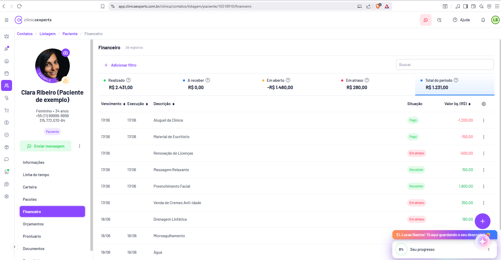
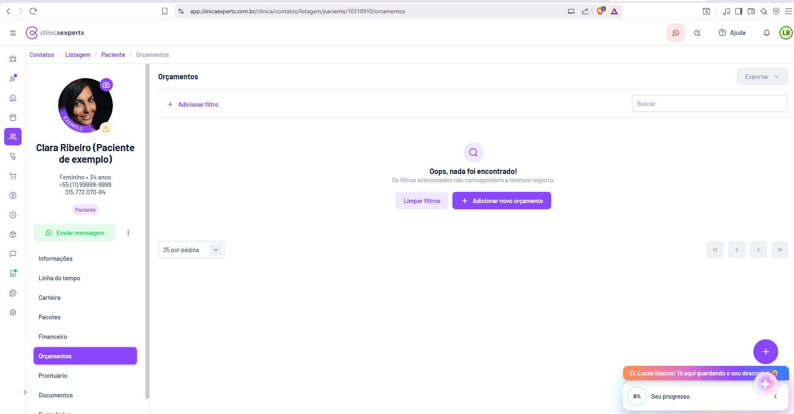
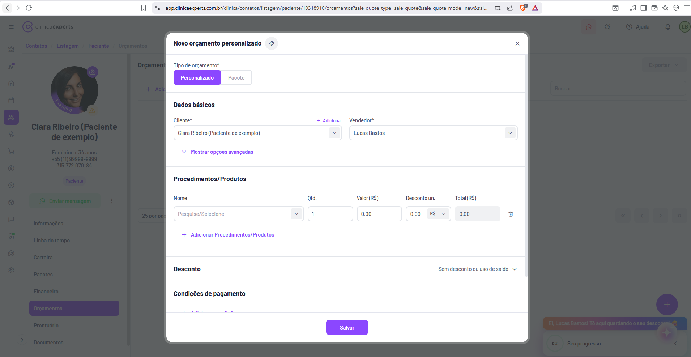
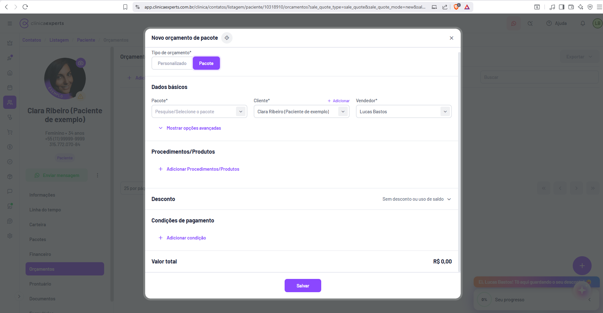
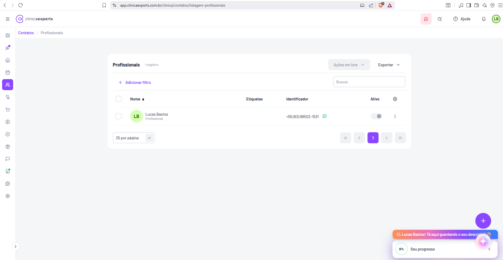
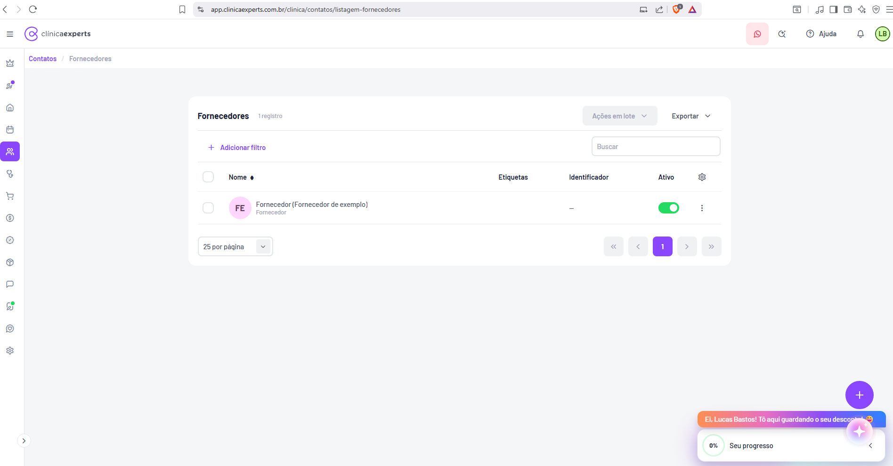
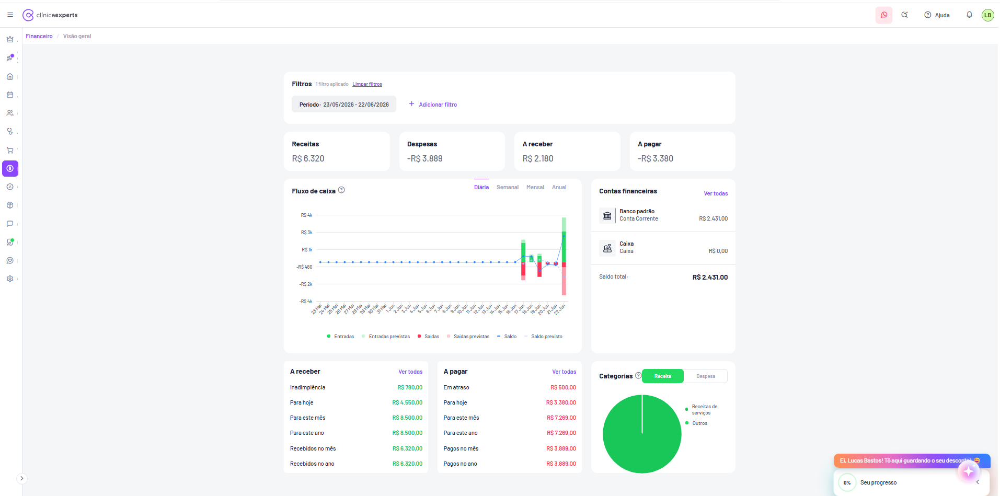
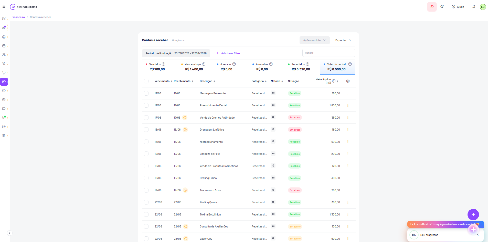
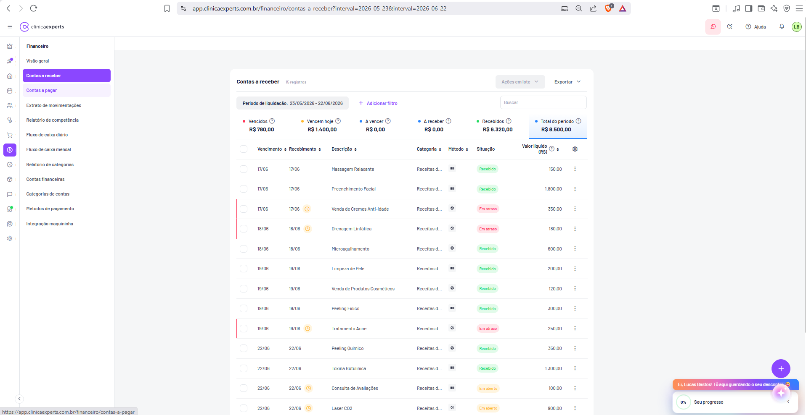
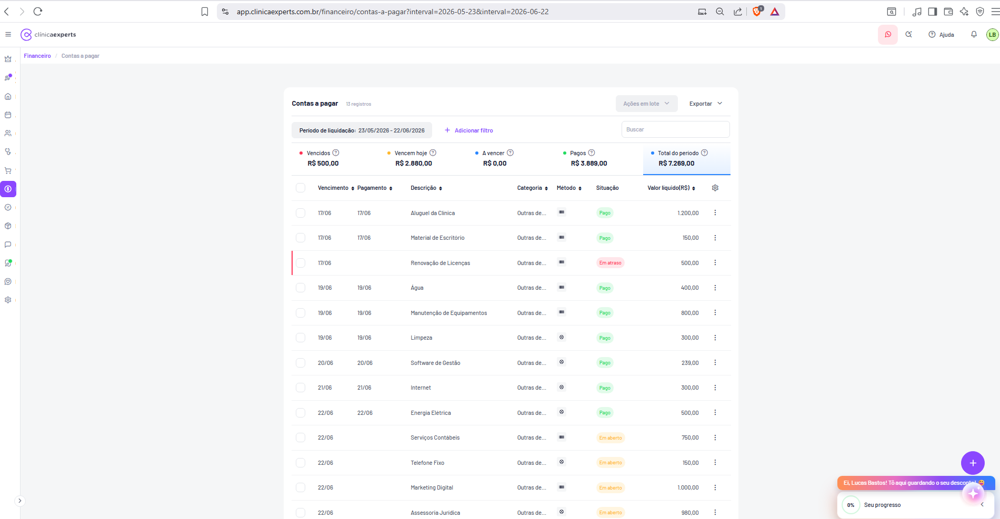

# Clínica Experts — Documentação de Telas (21 a 30)

Este documento descreve em detalhes dez telas do sistema SaaS de gestão de clínicas **Clínica Experts** (app.clinicaexperts.com.br), cobrindo o módulo financeiro do paciente, orçamentos (personalizado e de pacote), listagens de profissionais e fornecedores e o módulo Financeiro global (visão geral, contas a receber e contas a pagar). O objetivo é fornecer informação suficiente para reconstruir cada tela.

---

## Convenções visuais comuns

Antes das telas individuais, registram-se os elementos recorrentes da interface, observados em todas as capturas:

- **Header (topo):** logo **clínicaexperts** (símbolo de "C" roxo + wordmark) à esquerda; botão de menu hambúrguer (☰) que colapsa/expande a sidebar. À direita: ícone do **WhatsApp** (fundo rosa claro), ícone de **busca/atalhos** (lupa com "+"), link **Ajuda** (ícone "?"), ícone de **notificações** (sino, com badge), e **avatar do usuário** ("LB", círculo verde — Lucas Bastos).
- **Sidebar esquerda (ícones verticais):** barra estreita roxa/branca com ícones de módulos, de cima para baixo: coroa (planos/upgrade, com badge), foguete/atalho (com indicador roxo), casa (início/dashboard), calendário/agenda, pessoas (Contatos — destacado em roxo nas telas deste lote), estetoscópio (clínico), carrinho (vendas/PDV), cifrão "$" (Financeiro — destacado em roxo nas telas financeiras), selo/percentual (marketing/promoções), caixa/cubo (estoque/produtos), balão de chat (mensagens/atendimento), ícone de campanha/automação (com badge verde), coração (fidelização/CRM), engrenagem (configurações). Há uma seta ">" no rodapé da sidebar para expandir os rótulos.
- **Breadcrumb:** logo abaixo do header, em roxo, indicando o caminho (ex.: `Contatos / Listagem / Paciente / Orçamentos`).
- **Botão flutuante "+":** círculo roxo no canto inferior direito (criação rápida de registro).
- **Widget de progresso/onboarding:** banner laranja "**Ei, Lucas Bastos! Tô aqui guardando o seu desconto!**" e card "**Seu progresso 0%**" (com seta de recolher) no canto inferior direito. É um elemento de gamificação/onboarding, presente em todas as telas.
- **Paginação padrão das listagens:** seletor "**25 por página**" (dropdown) à esquerda; controles `«  ‹  [1]  ›  »` à direita, com a página atual em roxo.
- **Filtros padrão:** link "**+ Adicionar filtro**" (roxo) e campo "**Buscar**" no canto direito.

---

## Tela 21 — Financeiro do Paciente (Lançamentos financeiros)

- **Rota/URL:** `app.clinicaexperts.com.br/clinica/contatos/listagem/paciente/10318910/financeiro` (aba **Financeiro** do paciente).
- **Breadcrumb:** `Contatos / Listagem / Paciente / Financeiro`.

**Propósito:** Exibir o extrato/lista de lançamentos financeiros de um paciente específico, com os valores realizados, a receber, em aberto, em atraso e o total, permitindo acompanhar receitas e despesas vinculadas ao cliente.

**Layout geral:**
- Sidebar de ícones à esquerda (Contatos destacado).
- **Painel lateral do paciente** (coluna esquerda do conteúdo): foto/avatar circular do paciente (mulher), badge de status, nome **Clara Ribeiro (Paciente de exemplo)**, dados resumidos **Feminino • 34 anos**, telefone **+55 (11) 99999-9999**, CPF **315.772.070-84**, badge **Paciente**. Botão verde **Enviar mensagem** (ícone WhatsApp) e menu de três pontos (⋮). Abaixo, **menu vertical de abas do paciente**: Informações, Linha do tempo, Carteira, Pacotes, **Financeiro** (destacado em roxo), Orçamentos, Prontuário, Documentos (lista continua para baixo).
- **Área principal:** título **Financeiro**.

**Elementos de UI da área principal:**
- Botão **+ Adicionar filtro** (roxo) e campo **Buscar** à direita.
- **Cards-resumo (KPIs) em linha**, cada um com rótulo + valor:
  - **Realizado** — R$ 2.421,00
  - **A receber** — R$ 0,00
  - **Em aberto** — R$ 1.485,00
  - **Em atraso** — R$ 280,00
  - **Total do período** — R$ 1.201,00 (este card aparece selecionado/destacado, com borda inferior roxa).
- **Tabela de lançamentos** com colunas: **Vencimento**, **Execução**, **Descrição**, **Situação**, **Valor liq (R$)** (valor líquido) e coluna de ações.
- **Dados de exemplo (linhas):**
  | Vencimento | Execução | Descrição | Situação | Valor líq |
  |---|---|---|---|---|
  | 17/06 | 17/06 | Aluguel da Clínica | (badge) | -1.200,00 |
  | 17/06 | 17/06 | Material de Escritório | — | -150,00 |
  | — | — | Renovação de Licenças | Em atraso | -500,00 |
  | — | — | Massagem Relaxante | (verde) | +... |
  | — | — | Venda de Cremes Anti-idade | Em atraso | ... |
  | — | — | Drenagem Linfática | Em atraso | ... |
  | — | — | Microagulhamento | (verde) | ... |
  | — | — | Água | — | ... |
  - Valores em **vermelho** (despesas/negativos) e **verde** (receitas/positivos). Badges de situação coloridos: verde (pago/recebido), laranja/vermelho (**Em atraso**).
  - Cada linha tem ícone de ação (⋮ / lápis) à direita.

**Funcionalidade inferida:** Centraliza o histórico financeiro do paciente (cobranças, pagamentos, vendas, mensalidades). Os KPIs filtram por status. Os filtros permitem segmentar por período/situação. Permite editar/baixar lançamentos individualmente.

**Estados/fluxos:** Linhas com situação "Em atraso" ficam destacadas. O KPI "Total do período" está ativo. Botão "Enviar mensagem" permite contato direto via WhatsApp.

---

## Tela 22 — Orçamentos do Paciente (lista vazia)

- **Rota/URL:** `app.clinicaexperts.com.br/clinica/contatos/listagem/paciente/10318910/orcamentos`.
- **Breadcrumb:** `Contatos / Listagem / Paciente / Orçamentos`.

**Propósito:** Listar os orçamentos de um paciente. No estado capturado, não há orçamentos correspondentes aos filtros (empty state).

**Layout geral:** Mesmo painel lateral do paciente da Tela 21 (avatar, **Clara Ribeiro (Paciente de exemplo)**, **Feminino • 34 anos**, +55 (11) 99999-9999, 315.772.070-84, badge **Paciente**, botão **Enviar mensagem**, menu de abas com **Orçamentos** destacado em roxo). Área principal com título **Orçamentos**.

**Elementos de UI:**
- Botão **Exportar** (canto superior direito, com seta dropdown, aparentemente desabilitado/cinza).
- Botão **+ Adicionar filtro** e campo **Buscar**.
- **Estado vazio (centralizado):** ícone de lupa em círculo roxo claro, título **Oops, nada foi encontrado!**, texto **Os filtros selecionados não correspondem a nenhum registro.**
- Dois botões abaixo do empty state:
  - **Limpar filtros** (contorno roxo).
  - **+ Adicionar novo orçamento** (roxo preenchido).
- Paginação padrão (**25 por página**, controles `« ‹ › »`).

**Funcionalidade inferida:** Gestão de orçamentos do paciente. Permite criar novo orçamento ou limpar filtros para reexibir registros. Exportação de lista.

**Estados/fluxos:** Estado vazio devido a filtros. Clicar em **+ Adicionar novo orçamento** abre o modal de criação (Telas 23 e 24).

---

## Tela 23 — Modal "Novo orçamento personalizado"

- **Rota/URL:** `app.clinicaexperts.com.br/clinica/contatos/listagem/paciente/10318910/orcamentos?sale_quote_type=sale_quote&sale_quote_mode=new&sal...`.
- Modal sobreposto à tela de Orçamentos.

**Propósito:** Criar um orçamento **personalizado** (itens avulsos) para o paciente.

**Layout geral:** **Modal centralizado** sobre fundo escurecido. Cabeçalho do modal: título **Novo orçamento personalizado** (ícone de diamante/edição ao lado) e botão **×** (fechar) no canto superior direito. Conteúdo em seções; rodapé com botão **Salvar** (roxo, centralizado).

**Elementos de UI (de cima para baixo):**
- **Tipo de orçamento\*** — toggle de dois botões: **Personalizado** (selecionado, roxo) | **Pacote**.
- Seção **Dados básicos:**
  - **Cliente\*** — dropdown com **Clara Ribeiro (Paciente de exemplo)**; link **+ Adicionar** à direita.
  - **Vendedor\*** — dropdown com **Lucas Bastos**.
  - Link **▾ Mostrar opções avançadas** (expansível, roxo).
- Seção **Procedimentos/Produtos** — tabela/linha de itens com colunas:
  - **Nome** (campo "Pesquise/Selecione" com dropdown), **Qtd.** (campo numérico, valor 1), **Valor (R$)** (0,00), **Desconto un.** (0,00 + seletor de unidade **R$**), **Total (R$)** (0,00), e ícone de **lixeira** (remover item).
  - Link **+ Adicionar Procedimentos/Produtos** (roxo).
- Seção **Desconto** — à direita, dropdown **Sem desconto ou uso de saldo ▾**.
- Seção **Condições de pagamento** (visível parcialmente, no rodapé do modal).
- Botão **Salvar** (roxo).

**Funcionalidade inferida:** Montar um orçamento somando procedimentos/produtos individuais, aplicar desconto (por valor R$ ou %) e definir condições de pagamento. Vincula cliente e vendedor.

**Estados/fluxos:** Campos obrigatórios marcados com asterisco (\*). Alternar para "Pacote" troca o modal (Tela 24). "Mostrar opções avançadas" expande campos extras. Cada item adicionado gera nova linha.

---

## Tela 24 — Modal "Novo orçamento de pacote"

- **Rota/URL:** mesma base de orçamentos com parâmetros `sale_quote_type=sale_quote&sale_quote_mode=new&...`.
- Modal sobreposto à tela de Orçamentos.

**Propósito:** Criar um orçamento baseado em um **Pacote** previamente cadastrado.

**Layout geral:** Modal centralizado idêntico em estrutura ao da Tela 23, mas com o toggle em **Pacote**. Cabeçalho: **Novo orçamento de pacote** + **×**. Rodapé com **Salvar**.

**Elementos de UI:**
- **Tipo de orçamento\*** — toggle: **Personalizado** | **Pacote** (selecionado, roxo).
- Seção **Dados básicos** (em três colunas):
  - **Pacote\*** — dropdown **Pesquise/Selecione o pacote**.
  - **Cliente\*** — dropdown **Clara Ribeiro (Paciente de exemplo)**; link **+ Adicionar**.
  - **Vendedor\*** — dropdown **Lucas Bastos**.
  - Link **▾ Mostrar opções avançadas**.
- Seção **Procedimentos/Produtos** — apenas link **+ Adicionar Procedimentos/Produtos** (sem itens, pois virão do pacote).
- Seção **Desconto** — dropdown **Sem desconto ou uso de saldo ▾** à direita.
- Seção **Condições de pagamento** — link **+ Adicionar condição** (roxo).
- **Valor total** — exibido à direita: **R$ 0,00**.
- Botão **Salvar** (roxo).

**Funcionalidade inferida:** Gerar orçamento a partir de um pacote de procedimentos pré-configurado; o sistema preenche itens automaticamente. Permite adicionar itens extras, descontos e condições de pagamento parceladas.

**Estados/fluxos:** Selecionar um pacote popula procedimentos e atualiza o **Valor total**. Diferença em relação à Tela 23: aqui há campo **Pacote\*** e o resumo **Valor total**; os procedimentos não são editados linha a linha por padrão.

---

## Tela 25 — Contatos: Profissionais (listagem)

- **Rota/URL:** `app.clinicaexperts.com.br/clinica/contatos/listagem-profissionais`.
- **Breadcrumb:** `Contatos / Profissionais`.

**Propósito:** Listar os profissionais cadastrados na clínica (médicos, terapeutas, atendentes), com status ativo/inativo.

**Layout geral:** Sidebar de ícones (Contatos destacado). Header padrão. Área principal centralizada em um **card branco**.

**Elementos de UI:**
- Título **Profissionais** + contador **1 registro**.
- Botões no topo direito: **Ações em lote ▾** (cinza/desabilitado até seleção) e **Exportar ▾**.
- **+ Adicionar filtro** e campo **Buscar**.
- **Tabela** com colunas: checkbox de seleção (cabeçalho com select-all), **Nome** (com ícone de ordenação ◆), **Etiquetas**, **Identificador**, **Ativo**, e ícone de **engrenagem** (configurar colunas).
- **Linha de dados de exemplo:**
  - Checkbox | avatar **LB** (círculo verde) | **Lucas Bastos** / subtítulo **Profissional** | Etiquetas: (vazio) | Identificador: **+55 (63) 98502-1531** (com ícone WhatsApp verde) | **Ativo**: toggle (desligado/cinza) | menu **⋮**.
- Paginação padrão: **25 por página**, `« ‹ [1] › »`.

**Funcionalidade inferida:** Cadastro e gestão de profissionais; ativar/desativar via toggle; filtrar, buscar, exportar e executar ações em lote (após seleção de linhas). O ícone WhatsApp no identificador permite contato direto.

**Estados/fluxos:** "Ações em lote" habilita ao marcar checkboxes. Toggle "Ativo" alterna status do profissional. Botão "+" flutuante cria novo profissional.

---

## Tela 26 — Contatos: Fornecedores (listagem)

- **Rota/URL:** `app.clinicaexperts.com.br/clinica/contatos/listagem-fornecedores`.
- **Breadcrumb:** `Contatos / Fornecedores`.

**Propósito:** Listar os fornecedores cadastrados (parceiros de insumos, produtos, serviços), com status ativo/inativo.

**Layout geral:** Estrutura idêntica à Tela 25 (Profissionais): sidebar de ícones, header padrão, card branco centralizado com tabela.

**Elementos de UI:**
- Título **Fornecedores** + contador **1 registro**.
- Botões: **Ações em lote ▾** (desabilitado) e **Exportar ▾**.
- **+ Adicionar filtro** e campo **Buscar**.
- **Tabela** com colunas: checkbox, **Nome** (◆ ordenação), **Etiquetas**, **Identificador**, **Ativo**, **engrenagem**.
- **Linha de dados de exemplo:**
  - Checkbox | avatar **FE** (círculo rosa/lilás) | **Fornecedor (Fornecedor de exemplo)** / subtítulo **Fornecedor** | Etiquetas: (vazio) | Identificador: **—** | **Ativo**: toggle **ligado** (verde) | menu **⋮**.
- Paginação padrão: **25 por página**, `« ‹ [1] › »`.

**Funcionalidade inferida:** Gestão de fornecedores para vincular a contas a pagar e compras. Ativar/desativar, filtrar, exportar e ações em lote.

**Estados/fluxos:** Toggle "Ativo" aqui está ligado (verde), diferindo do profissional desligado da Tela 25. Botão "+" flutuante cria novo fornecedor.

---

## Tela 27 — Financeiro: Visão geral (Dashboard financeiro)

- **Rota/URL (inferida):** `app.clinicaexperts.com.br/clinica/financeiro/visao-geral` (módulo Financeiro).
- **Breadcrumb:** `Financeiro / Visão geral`.

**Propósito:** Painel-resumo da saúde financeira da clínica no período selecionado: receitas, despesas, contas a receber/pagar, fluxo de caixa, contas bancárias e categorias.

**Layout geral:** Sidebar de ícones (Financeiro "$" destacado). Conteúdo centralizado em coluna larga, organizado em blocos verticais.

**Elementos de UI:**
- **Bloco Filtros:** título **Filtros**, indicador **1 filtro aplicado**, link **Limpar filtros**. Chip de filtro **Período: 23/05/2026 – 22/06/2026** e link **+ Adicionar filtro**.
- **Quatro cards-KPI em linha:**
  - **Receitas** — R$ 6.320
  - **Despesas** — -R$ 3.889
  - **A receber** — R$ 2.180
  - **A pagar** — -R$ 3.380
- **Card "Fluxo de caixa"** (com ícone "?" de ajuda):
  - Abas de granularidade: **Diária** (ativa, sublinhada em roxo) | **Semanal** | **Mensal** | **Anual**.
  - **Gráfico combinado** (barras + linha): eixo Y de **-R$ 4k** a **R$ 4k** (marcas R$ 4k, R$ 3k, R$ 1k, -R$ 480, -R$ 2k, -R$ 4k); eixo X com datas diárias **23.Mai → 22.Jun**. Barras verdes/vermelhas e linha de saldo azul pontilhada.
  - **Legenda:** ● **Entradas** (verde), ● **Entradas previstas** (verde claro), ● **Saídas** (vermelho), ● **Saídas previstas** (rosa), — **Saldo** (azul), — **Saldo previsto** (cinza).
- **Card "Contas financeiras"** (à direita) + link **Ver todas**:
  - **Banco padrão** / Conta Corrente — **R$ 2.431,00** (ícone de banco).
  - **Caixa** / Caixa — **R$ 0,00** (ícone de caixa).
  - **Saldo total: R$ 2.431,00**.
- **Card "A receber"** + link **Ver todas:**
  - Inadimplência — **R$ 780,00**
  - Para hoje — **R$ 4.550,00**
  - Para este mês — **R$ 8.500,00**
  - Para este ano — **R$ 8.500,00**
  - Recebidos no mês — **R$ 6.320,00**
  - Recebidos no ano — **R$ 6.320,00**
  (valores em verde)
- **Card "A pagar"** + link **Ver todas:**
  - Em atraso — **R$ 500,00**
  - Para hoje — **R$ 3.380,00**
  - Para este mês — **R$ 7.269,00**
  - Para este ano — **R$ 7.269,00**
  - Pagos no mês — **R$ 3.889,00**
  - Pagos no ano — **R$ 3.889,00**
  (valores em vermelho)
- **Card "Categorias"** (com "?"):
  - Toggle **Receita** (ativo, verde) | **Despesa**.
  - **Gráfico de pizza** (verde) com legenda: ● **Receitas de serviços**, ● **Outros**.

**Funcionalidade inferida:** Dashboard consolidado do financeiro. Filtra por período; alterna a granularidade do fluxo de caixa; alterna entre receita/despesa no gráfico de categorias; links "Ver todas" levam às telas de contas a receber/pagar e contas financeiras.

**Estados/fluxos:** Filtro de período aplicado (1). Aba "Diária" ativa no fluxo de caixa. Toggle "Receita" ativo nas categorias.

---

## Tela 28 — Financeiro: Contas a receber

- **Rota/URL:** `app.clinicaexperts.com.br/clinica/financeiro/contas-a-receber?interval=2026-05-23&interval=2026-06-22`.
- **Breadcrumb:** `Financeiro / Contas a receber`.

**Propósito:** Listar e gerenciar todas as contas a receber (receitas) da clínica no período, com status de cada cobrança.

**Layout geral:** Sidebar de ícones (Financeiro destacado). Card branco centralizado contendo filtros, KPIs e a tabela. (Esta captura está com a sidebar de rótulos colapsada; ver Tela 29 para a versão com sidebar de submenu expandida.)

**Elementos de UI:**
- Título **Contas a receber** + contador **15 registros**.
- Botões: **Ações em lote ▾** (desabilitado) e **Exportar ▾**.
- Chip de filtro **Período de liquidação: 23/05/2026 – 22/06/2026** + **+ Adicionar filtro** + campo **Buscar**.
- **KPIs em linha (com pontos coloridos e "?"):**
  - **Vencidos** (vermelho) — R$ 780,00
  - **Vencem hoje** (laranja) — R$ 1.400,00
  - **A vencer** (azul) — R$ 0,00
  - **A receber** (azul) — R$ 0,00
  - **Recebidos** (verde) — R$ 6.320,00
  - **Total do período** (selecionado, borda roxa) — R$ 8.500,00
- **Tabela** com colunas: checkbox, **Vencimento** (◆), **Recebimento** (◆), **Descrição** (◆), **Categoria** (◆), **Método** (◆, ícones), **Situação**, **Valor líquido (R$)** (◆, com "?"), **engrenagem**, ações **⋮**.
- **Dados de exemplo (linhas):**
  | Vencimento | Recebimento | Descrição | Categoria | Situação | Valor líq |
  |---|---|---|---|---|---|
  | 17/06 | 17/06 | Massagem Relaxante | Receitas d... | Recebido | 150,00 |
  | 17/06 | 17/06 | Preenchimento Facial | Receitas d... | Recebido | 1.800,00 |
  | 17/06 | 17/06 ⏱ | Venda de Cremes Anti-idade | Receitas d... | Em atraso | 350,00 |
  | 18/06 | 18/06 ⏱ | Drenagem Linfática | Receitas d... | Em atraso | 180,00 |
  | 18/06 | 18/06 | Microagulhamento | Receitas d... | Recebido | 600,00 |
  | 19/06 | 19/06 | Limpeza de Pele | Receitas d... | Recebido | 200,00 |
  | 19/06 | 19/06 | Venda de Produtos Cosméticos | Receitas d... | Recebido | 120,00 |
  | 19/06 | 19/06 | Peeling Físico | Receitas d... | Recebido | 300,00 |
  | 19/06 | 19/06 ⏱ | Tratamento Acne | Receitas d... | Em atraso | 250,00 |
  | 22/06 | 22/06 | Peeling Químico | Receitas d... | Recebido | 350,00 |
  | 22/06 | 22/06 | Toxina Botulínica | Receitas d... | Recebido | 1.300,00 |
  | 22/06 | 22/06 ⏱ | Consulta de Avaliações | Receitas d... | Em aberto | 100,00 |
  | 22/06 | 22/06 ⏱ | Laser CO2 | Receitas d... | Em aberto | 900,00 |
  - **Badges de situação:** **Recebido** (verde), **Em atraso** (vermelho), **Em aberto** (laranja).
  - Linhas "Em atraso" têm **barra vermelha** na borda esquerda e ícone de **relógio** (⏱) na coluna Recebimento.
  - Coluna **Método** exibe ícones (cartão, dinheiro, etc.).

**Funcionalidade inferida:** Gestão de recebíveis. KPIs filtram por status (clicáveis). Permite ações em lote (baixar, conciliar), exportar, filtrar por período de liquidação, ordenar colunas e configurar colunas visíveis. Botão "+" flutuante cria nova conta a receber.

**Estados/fluxos:** KPI "Total do período" ativo. Inadimplências destacadas em vermelho com relógio.

---

## Tela 29 — Financeiro: Contas a receber (com submenu lateral expandido)

- **Rota/URL:** `app.clinicaexperts.com.br/clinica/financeiro/contas-a-receber?interval=2026-05-23&interval=2026-06-22`.
- **Breadcrumb:** `Financeiro / Contas a receber`.

**Propósito:** Mesma tela da 28 (Contas a receber), porém com o **submenu lateral do módulo Financeiro expandido**, evidenciando a navegação interna do módulo.

**Layout geral:** Sidebar de ícones + **painel de submenu (rótulos) do Financeiro** expandido à esquerda. Área principal idêntica à Tela 28.

**Submenu "Financeiro" (itens, de cima para baixo):**
- **Visão geral**
- **Contas a receber** (destacado/ativo, roxo)
- **Contas a pagar**
- **Extrato de movimentações**
- **Relatório de competência**
- **Fluxo de caixa diário**
- **Fluxo de caixa mensal**
- **Relatório de categorias**
- **Contas financeiras**
- **Categorias de contas**
- **Métodos de pagamento**
- **Integração maquininha**

**Elementos de UI da área principal:** Idênticos à Tela 28 — título **Contas a receber** + **15 registros**, **Ações em lote ▾**, **Exportar ▾**, chip **Período de liquidação: 23/05/2026 – 22/06/2026**, **+ Adicionar filtro**, **Buscar**, os mesmos KPIs (**Vencidos** R$ 780,00 · **Vencem hoje** R$ 1.400,00 · **A vencer** R$ 0,00 · **A receber** R$ 0,00 · **Recebidos** R$ 6.320,00 · **Total do período** R$ 8.500,00) e a mesma tabela de lançamentos (Massagem Relaxante, Preenchimento Facial, Venda de Cremes Anti-idade, Drenagem Linfática, Microagulhamento, Limpeza de Pele, etc.).
- Observa-se um tooltip de link no rodapé do navegador apontando para `.../financeiro/contas-a-pagar` (hover sobre o item do submenu).

**Funcionalidade inferida:** Demonstra a estrutura de navegação completa do módulo Financeiro. Cada item do submenu abre uma sub-rota dedicada (relatórios, fluxos de caixa, configurações de contas/categorias/métodos de pagamento, integração com maquininha de cartão).

**Estados/fluxos:** Submenu expandido com "Contas a receber" ativo. Hover sobre "Contas a pagar" prepara navegação para a Tela 30.

---

## Tela 30 — Financeiro: Contas a pagar

- **Rota/URL:** `app.clinicaexperts.com.br/clinica/financeiro/contas-a-pagar?interval=2026-05-23&interval=2026-06-22`.
- **Breadcrumb:** `Financeiro / Contas a pagar`.

**Propósito:** Listar e gerenciar todas as contas a pagar (despesas) da clínica no período, com status de cada conta.

**Layout geral:** Sidebar de ícones (Financeiro destacado). Card branco centralizado com filtros, KPIs e tabela. Estrutura espelhada à de Contas a receber.

**Elementos de UI:**
- Título **Contas a pagar** + contador **13 registros**.
- Botões: **Ações em lote ▾** (desabilitado) e **Exportar ▾**.
- Chip de filtro **Período de liquidação: 23/05/2026 – 22/06/2026** + **+ Adicionar filtro** + campo **Buscar**.
- **KPIs em linha (com pontos coloridos e "?"):**
  - **Vencidos** (vermelho) — R$ 500,00
  - **Vencem hoje** (laranja) — R$ 2.880,00
  - **A vencer** (azul) — R$ 0,00
  - **Pagos** (verde) — R$ 3.889,00
  - **Total do período** (selecionado, borda roxa) — R$ 7.269,00
- **Tabela** com colunas: checkbox, **Vencimento**, **Pagamento**, **Descrição**, **Categoria**, **Método** (ícones), **Situação**, **Valor líquido (R$)**, **engrenagem**, ações **⋮**.
- **Dados de exemplo (linhas):**
  | Vencimento | Pagamento | Descrição | Categoria | Situação | Valor líq |
  |---|---|---|---|---|---|
  | 17/06 | 17/06 | Aluguel da Clínica | Outras de... | Pago | 1.200,00 |
  | 17/06 | 17/06 | Material de Escritório | Outras de... | Pago | 150,00 |
  | 17/06 | — | Renovação de Licenças | Outras de... | Em atraso | 500,00 |
  | 18/06 | 18/06 | Água | Outras de... | Pago | 400,00 |
  | 18/06 | 18/06 | Manutenção de Equipamentos | Outras de... | Pago | 800,00 |
  | 18/06 | 18/06 | Limpeza | Outras de... | Pago | 300,00 |
  | 20/06 | 20/06 | Software de Gestão | Outras de... | Pago | 239,00 |
  | 21/06 | 21/06 | Internet | Outras de... | Pago | 300,00 |
  | 22/06 | 22/06 | Energia Elétrica | Outras de... | Pago | 500,00 |
  | 22/06 | — | Serviços Contábeis | Outras de... | Em aberto | 750,00 |
  | 22/06 | — | Telefone Fixo | Outras de... | Em aberto | 150,00 |
  | 22/06 | — | Marketing Digital | Outras de... | Em aberto | 1.000,00 |
  | 22/06 | — | Assessoria Jurídica | Outras de... | Em aberto | 980,00 |
  - **Badges de situação:** **Pago** (verde), **Em atraso** (vermelho), **Em aberto** (laranja).
  - Linha "Em atraso" (Renovação de Licenças) com **barra vermelha** na borda esquerda.
  - Coluna **Método** com ícones de forma de pagamento.

**Funcionalidade inferida:** Gestão de pagamentos/despesas. KPIs filtram por status. Permite baixar/pagar contas, ações em lote, exportar, filtrar por período de liquidação e ordenar/configurar colunas. Botão "+" flutuante cria nova conta a pagar.

**Estados/fluxos:** KPI "Total do período" (R$ 7.269,00) ativo. Contas em aberto/atraso destacadas. Categorias predominantes "Outras despesas".

---

*Fim da documentação das telas 21 a 30.*
