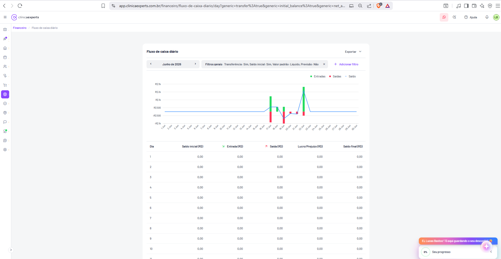
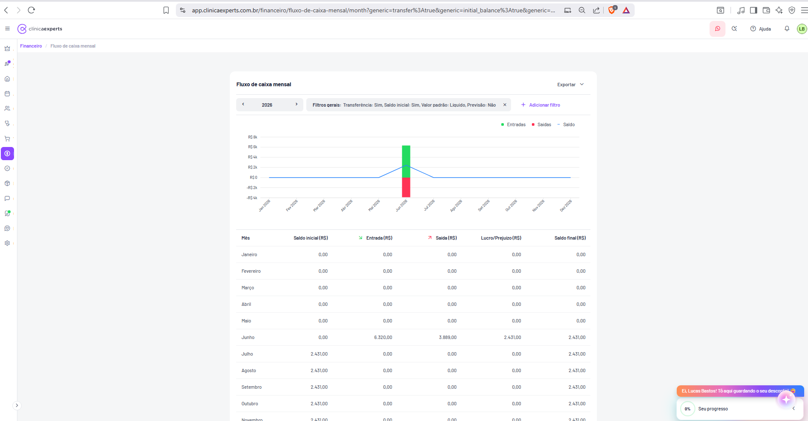
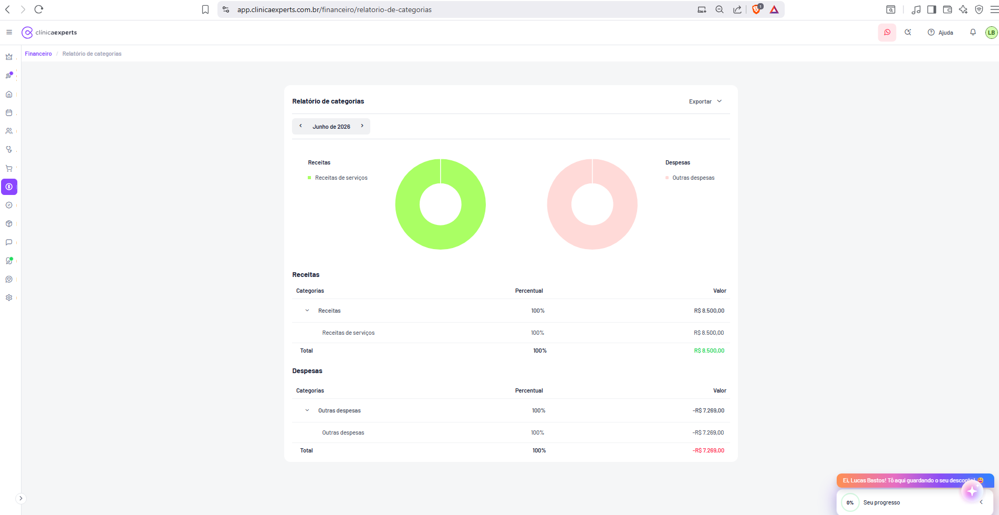
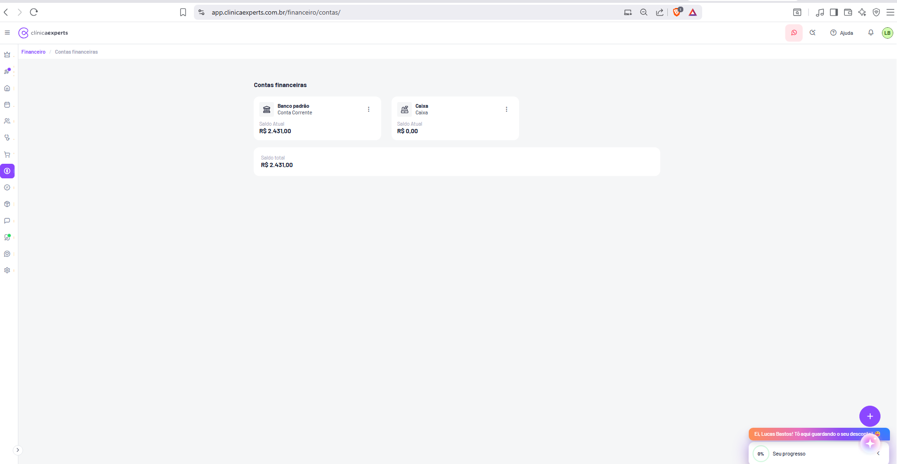
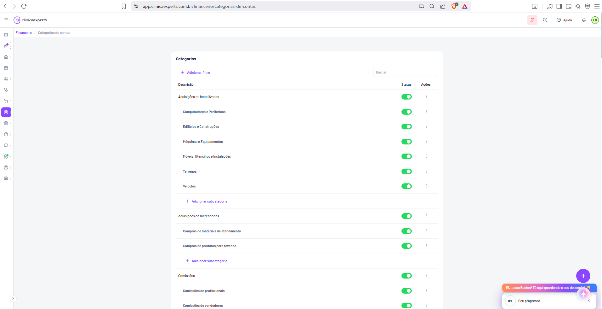
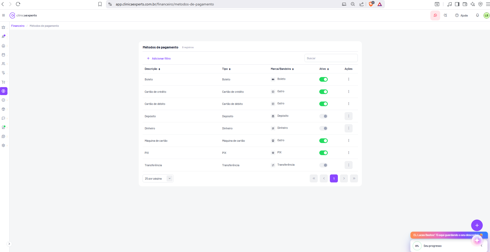
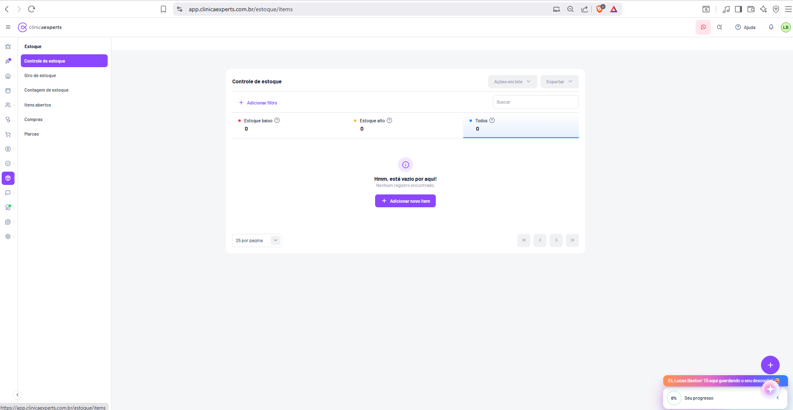

# Clínica Experts — Documentação de Telas (31 a 40)

Esta seção documenta dez telas do módulo **Financeiro** e início do módulo **Estoque** do sistema Clínica Experts (app.clinicaexperts.com.br), cobrindo relatórios financeiros (extrato de movimentação, competência, fluxo de caixa diário e mensal, categorias), cadastros financeiros (contas, categorias de contas, métodos de pagamento), comissões em aberto e controle de estoque. Cada subseção descreve rota, layout, elementos de UI, textos exatos e funcionalidade inferida, em detalhe suficiente para reconstrução por um desenvolvedor.

---

## Elementos comuns a todas as telas

Para evitar repetição, os elementos abaixo aparecem em (quase) todas as telas e só serão citados pontualmente nas seções seguintes.

**Header superior do navegador (ignorar — é o navegador Brave, não o app).** A barra de endereço mostra a URL de cada tela.

**Header do aplicativo (topo, fundo branco):**
- À esquerda: ícone de menu hambúrguer (☰) que recolhe/expande a sidebar; logotipo **clínicaexperts** (símbolo circular roxo + texto "clínica" em cinza e "experts" em escuro/negrito).
- À direita: ícone de WhatsApp (círculo rosa claro), ícone de busca/atalho, link **"Ajuda"** com ícone de interrogação, ícone de sino (notificações) e avatar circular do usuário com iniciais **"LB"** (Lucas Bastos), com borda verde.

**Sidebar vertical esquerda (estreita, fundo branco, ícones empilhados):** barra de navegação principal por ícones. De cima para baixo (aproximadamente): coroa/destaque, foguete/automação, casa (início), agenda/carteira, pessoas (clientes/pacientes), procedimentos/atendimentos, carrinho (vendas/PDV), **cifrão/financeiro (ícone roxo destacado nas telas financeiras)**, selo/CRM, cubo/estoque (destacado nas telas de estoque), balão de chat, marketing, suporte e engrenagem (configurações). O ícone ativo aparece com fundo roxo arredondado.

**Breadcrumb (logo abaixo do header):** caminho de navegação em roxo, ex.: **"Financeiro / Extrato de movimentação"**.

**Botão flutuante (canto inferior direito):** botão circular roxo com **"+"** (ação rápida de adicionar registro).

**Widget de progresso/promoção (canto inferior direito, sobreposto):** faixa laranja com texto **"Ei, Lucas Bastos! Tô aqui guardando o seu desconto!"** e um card branco abaixo com **"0%"** + **"Seu progresso"** e seta de recolher. É um elemento de onboarding/gamificação.

**Padrão de área principal:** fundo cinza claro; conteúdo centralizado em um card branco com cantos arredondados e sombra leve. Cabeçalho do card com título à esquerda e ações (ex.: **Exportar**) à direita.

---

## Tela 31 — Extrato de movimentação

- **Rota/URL:** `app.clinicaexperts.com.br/financeiro/extrato-de-movimentacao?interval=2026-05-23&interval=2026-06-22`
- **Breadcrumb:** Financeiro / Extrato de movimentação
- **Propósito:** Listar todas as movimentações financeiras (receitas e despesas) da clínica em um período, com situação de cada lançamento (pago/recebido/em atraso) e valores líquidos. É o extrato/livro-caixa detalhado.

**Layout geral:** Header e sidebar padrão (ícone Financeiro ativo). Card branco principal ocupando a área central.

**Cabeçalho do card:**
- Título **"Extrato de movimentação"** com badge cinza **"30 registros"** ao lado.
- À direita: botão **"Exportar"** com seta para baixo (dropdown de exportação).

**Barra de filtros:**
- Chip/pílula **"Período de liquidação: 23/05/2026 - 22/06/2026"** (intervalo de datas).
- Link/botão **"+ Adicionar filtro"** (roxo).
- Campo de busca à direita com placeholder **"Buscar"**.

**Faixa de indicadores (5 cards de resumo, cada um com bolinha colorida + ícone de ajuda "?"):**
- **Receitas em aberto** — **R$ 2.180,00** (bolinha verde)
- **Receitas realizadas** — **R$ 6.320,00** (bolinha verde)
- **Despesas em aberto** — **R$ 3.380,00** (bolinha vermelha)
- **Despesas realizadas** — **R$ 3.889,00** (bolinha vermelha)
- **Total do período** — **R$ 1.231,00** (bolinha azul; card destacado com linha azul inferior — aba/seleção ativa)

**Tabela de movimentações.** Colunas (todas com seta de ordenação ↕), com ícone de engrenagem (configurar colunas) à direita do cabeçalho:
- **Vencimento**
- **Execução**
- **Descrição**
- **Categoria**
- **Método** (exibido como ícone)
- **Situação** (badge colorido)
- **Valor líquido (R$)**
- (coluna de ações com menu de três pontos ⋮)

**Dados de exemplo (linhas):**

| Vencimento | Execução | Descrição | Categoria | Situação | Valor líquido (R$) |
|---|---|---|---|---|---|
| 17/06 | 17/06 | Aluguel de Clínica | Outras des... | Pago | 1.200,00 |
| 17/06 | 17/06 | Material de Escritório | Outras des... | Pago | 150,00 |
| 17/06 | — | Renovação de Licenças | Outras des... | Em atraso | 500,00 |
| 17/06 | 17/06 | Massagem Relaxante | Receitas d... | Recebido | 150,00 |
| 17/06 | 17/06 | Preenchimento Facial | Receitas d... | Recebido | 1.800,00 |
| 18/06 | — | Venda de Cremes Anti-idade | Receitas d... | Em atraso | 350,00 |
| 18/06 | — | Drenagem Linfática | Receitas d... | Em atraso | 180,00 |
| 18/06 | 18/06 | Microagulhamento | Receitas d... | Recebido | 600,00 |
| 18/06 | 18/06 | Água | Outras des... | Pago | 400,00 |
| 19/06 | 19/06 | Manutenção de Equipamentos | Outras des... | Pago | 800,00 |
| 19/06 | 19/06 | Limpeza | Outras des... | Pago | 300,00 |
| 19/06 | 19/06 | Limpeza de Pele | Receitas d... | Recebido | 200,00 |
| 19/06 | 19/06 | Venda de Produtos Cosméticos | Receitas d... | Recebido | 120,00 |

**Badges de situação:** **Pago** (verde), **Recebido** (verde), **Em atraso** (vermelho/rosa). Valores de receita aparecem em verde; valores de despesa em vermelho/laranja. Linhas em atraso possuem barra/realce vertical vermelho à esquerda.

**Funcionalidade inferida:** Filtrar por período de liquidação e filtros adicionais; buscar por texto; alternar o card de resumo ativo; ordenar colunas; configurar colunas visíveis (engrenagem); exportar (PDF/Excel/CSV via dropdown); ações por linha (editar/excluir/dar baixa) via menu ⋮.

**Estados/fluxos:** Estado populado com 30 registros e rolagem vertical. Lançamentos sem data de execução ficam **Em atraso**.

---

## Tela 32 — Relatório de competência

- **Rota/URL:** `app.clinicaexperts.com.br/financeiro/relatorio-de-competencia`
- **Breadcrumb:** Financeiro / Relatório de competência
- **Propósito:** Relatório de lançamentos pelo **regime de competência** (data de competência, não de caixa), agrupando receitas e despesas por mês, com contato vinculado e valores bruto/líquido.

**Cabeçalho do card:** Título **"Relatório de competência"** + badge **"30 registros"**. À direita botão **"Exportar"** com seta.

**Barra de filtros:**
- Seletor de período mensal: setas **‹** e **›** com rótulo central **"Junho de 2026"**.
- Link **"+ Adicionar filtro"**.
- Campo **"Buscar"** à direita.

**Cards de resumo (3, com bolinha + ícone "?"):**
- **Receitas** — **R$ 8.500,00** (verde)
- **Despesas** — **R$ 7.269,00** (vermelho)
- **Total do período** — **R$ 1.231,00** (azul; card destacado/ativo com linha azul)

**Tabela.** Colunas (com seta de ordenação) + engrenagem de configuração:
- **Competência**
- **Descrição**
- **Contato**
- **Valor bruto (R$)**
- **Valor líquido (R$)**
- (ações ⋮)

**Dados de exemplo:**

| Competência | Descrição | Contato | Valor bruto | Valor líquido |
|---|---|---|---|---|
| 22/06 | Tratamento de Manchas | Clara Ribeiro (Paciente de ... | 400,00 | 400,00 |
| 22/06 | Bioplastia | Clara Ribeiro (Paciente de ... | 1.500,00 | 1.500,00 |
| 22/06 | Laser CO2 | Clara Ribeiro (Paciente de ... | 900,00 | 900,00 |
| 22/06 | Consulta de Avaliações | Clara Ribeiro (Paciente de ... | 100,00 | 100,00 |
| 22/06 | Toxina Botulínica | Clara Ribeiro (Paciente de ... | 1.300,00 | 1.300,00 |
| 22/06 | Peeling Químico | Clara Ribeiro (Paciente de ... | 350,00 | 350,00 |
| 22/06 | Assessoria Jurídica | Clara Ribeiro (Paciente de ... | 980,00 | -980,00 |
| 22/06 | Marketing Digital | Clara Ribeiro (Paciente de ... | 1.000,00 | -1.000,00 |
| 22/06 | Telefone Fixo | Clara Ribeiro (Paciente de ... | 150,00 | -150,00 |
| 22/06 | Serviços Contábeis | Clara Ribeiro (Paciente de ... | 750,00 | -750,00 |
| 22/06 | Energia Elétrica | Clara Ribeiro (Paciente de ... | 500,00 | -500,00 |
| 22/06 | Saldo inicial da conta Banco padrão | Lucas Bastos | 0,00 | 0,00 |
| 22/06 | Saldo inicial da conta Caixa | Lucas Bastos | 0,00 | 0,00 |

**Cores/estados:** Receitas em verde; despesas em vermelho com valor líquido negativo (sinal "-"); linhas de despesa têm barra vertical vermelha à esquerda. Lançamentos de saldo inicial aparecem com valor 0,00 e contato do usuário.

**Funcionalidade inferida:** Navegar entre meses; filtrar/buscar; ordenar; exportar; ações por linha via ⋮. Diferencia-se do extrato por organizar por competência e por mostrar bruto x líquido lado a lado.

---

## Tela 33 — Fluxo de caixa diário

- **Rota/URL:** `app.clinicaexperts.com.br/financeiro/fluxo-de-caixa-diario/day?generic=transfer%3Atrue&generic=initial_balance%3Atrue&generic=net_a...`
- **Breadcrumb:** Financeiro / Fluxo de caixa diário
- **Propósito:** Mostrar o fluxo de caixa **dia a dia** dentro de um mês: entradas, saídas e saldo, em gráfico de barras/linha e em tabela detalhada por dia.

**Cabeçalho do card:** Título **"Fluxo de caixa diário"**; botão **"Exportar"** (com seta) à direita.

**Barra de filtros:**
- Seletor de período: **‹** **"Junho de 2026"** **›**.
- Chip de **"Filtros gerais:"** com o texto **"Transferência: Sim, Saldo inicial: Sim, Valor padrão: Líquido, Previsão: Não"** e um **"×"** para limpar.
- Link **"+ Adicionar filtro"**.

**Gráfico (parte superior do card):**
- Legenda no topo direito: **Entradas** (verde), **Saídas** (vermelho), **Saldo** (linha azul).
- Eixo Y com escala: **R$ 3k, R$ 2k, R$ 1k, R$ 500, -R$ 500, -R$ 1k**.
- Eixo X com os dias do mês: **1 Jun, 2 Jun, ... 30 Jun**.
- Tipo: barras verticais verdes (entradas) e vermelhas (saídas) sobre uma linha azul contínua de saldo acumulado. Há atividade concentrada entre os dias 17 e 22 (barras altas), com o restante do mês neutro.

**Tabela por dia.** Colunas:
- **Dia**
- **Saldo inicial (R$)**
- **Entrada (R$)** (com ícone de seta verde para baixo/entrada)
- **Saída (R$)** (com ícone de seta vermelha para cima/saída)
- **Lucro/Prejuízo (R$)**
- **Saldo final (R$)**

**Dados de exemplo:** linhas para os dias 1 a 11 (e seguintes via rolagem), todas com **0,00** em todas as colunas nas primeiras linhas visíveis (movimentação concentrada em dias posteriores, conforme o gráfico).

**Funcionalidade inferida:** Visualizar saúde de caixa diária; alternar mês; ajustar filtros gerais (incluir/excluir transferências, saldo inicial, usar valor bruto x líquido, considerar previsões); exportar. A linha de saldo permite leitura rápida do acumulado.

**Estados/fluxos:** Dias sem movimentação exibem 0,00; o gráfico evidencia visualmente os dias com lançamentos.

---

## Tela 34 — Fluxo de caixa mensal

- **Rota/URL:** `app.clinicaexperts.com.br/financeiro/fluxo-de-caixa-mensal/month?generic=transfer%3Atrue&generic=initial_balance%3Atrue&generic=...`
- **Breadcrumb:** Financeiro / Fluxo de caixa mensal
- **Propósito:** Visão **anual** do fluxo de caixa agregado por mês: entradas, saídas, saldo inicial/final, lucro/prejuízo. Mesma estrutura da tela diária, porém com granularidade mensal.

**Cabeçalho do card:** Título **"Fluxo de caixa mensal"**; botão **"Exportar"**.

**Barra de filtros:**
- Seletor de ano: **‹** **"2026"** **›**.
- Chip **"Filtros gerais: Transferência: Sim, Saldo inicial: Sim, Valor padrão: Líquido, Previsão: Não"** com **"×"**.
- Link **"+ Adicionar filtro"**.

**Gráfico:**
- Legenda: **Entradas** (verde), **Saídas** (vermelho), **Saldo** (linha azul).
- Eixo Y: **R$ 8k, R$ 6k, R$ 4k, R$ 2k, R$ 0, -R$ 2k, -R$ 4k**.
- Eixo X: meses **Jan 2026 ... Dez 2026**.
- Apenas **Junho/2026** apresenta barra significativa (entrada verde grande ~R$ 6k e saída vermelha ~R$ 4k), com a linha de saldo subindo no mês.

**Tabela por mês.** Colunas: **Mês**, **Saldo inicial (R$)**, **Entrada (R$)** (seta verde), **Saída (R$)** (seta vermelha), **Lucro/Prejuízo (R$)**, **Saldo final (R$)**.

**Dados de exemplo:**

| Mês | Saldo inicial | Entrada | Saída | Lucro/Prejuízo | Saldo final |
|---|---|---|---|---|---|
| Janeiro | 0,00 | 0,00 | 0,00 | 0,00 | 0,00 |
| Fevereiro | 0,00 | 0,00 | 0,00 | 0,00 | 0,00 |
| Março | 0,00 | 0,00 | 0,00 | 0,00 | 0,00 |
| Abril | 0,00 | 0,00 | 0,00 | 0,00 | 0,00 |
| Maio | 0,00 | 0,00 | 0,00 | 0,00 | 0,00 |
| Junho | 0,00 | 6.320,00 | 3.889,00 | 2.431,00 | 2.431,00 |
| Julho | 2.431,00 | 0,00 | 0,00 | 0,00 | 2.431,00 |
| Agosto | 2.431,00 | 0,00 | 0,00 | 0,00 | 2.431,00 |
| Setembro | 2.431,00 | 0,00 | 0,00 | 0,00 | 2.431,00 |
| Outubro | 2.431,00 | 0,00 | 0,00 | 0,00 | 2.431,00 |
| Novembro | 2.431,00 | 0,00 | 0,00 | 0,00 | 2.431,00 |

**Funcionalidade inferida:** Visão de planejamento anual; o saldo final de um mês vira o saldo inicial do mês seguinte (encadeamento contábil). Mesmos filtros gerais e exportação da tela diária.

---

## Tela 35 — Relatório de categorias

- **Rota/URL:** `app.clinicaexperts.com.br/financeiro/relatorio-de-categorias`
- **Breadcrumb:** Financeiro / Relatório de categorias
- **Propósito:** Distribuir receitas e despesas do mês por **categoria**, com representação percentual e em valores, usando gráficos de rosca e tabelas hierárquicas (categoria → subcategoria → total).

**Cabeçalho do card:** Título **"Relatório de categorias"**; botão **"Exportar"** à direita.

**Barra de filtros:** Seletor de período **‹** **"Junho de 2026"** **›**.

**Área de gráficos (dois donut charts lado a lado):**
- À esquerda, sob o rótulo **"Receitas"**, donut **verde** com legenda **"Receitas de serviços"** (quadrado verde).
- À direita, sob o rótulo **"Despesas"**, donut **vermelho/rosa** com legenda **"Outras despesas"** (quadrado rosa).

**Tabela "Receitas".** Colunas: **Categorias**, **Percentual**, **Valor**.
- (linha expansível ▾) **Receitas** — 100% — R$ 8.500,00
  - Subitem **Receitas de serviços** — 100% — R$ 8.500,00
- **Total** — 100% — **R$ 8.500,00** (em verde)

**Tabela "Despesas".** Colunas: **Categorias**, **Percentual**, **Valor**.
- (linha expansível ▾) **Outras despesas** — 100% — -R$ 7.269,00
  - Subitem **Outras despesas** — 100% — -R$ 7.269,00
- **Total** — 100% — **-R$ 7.269,00** (em vermelho)

**Funcionalidade inferida:** Análise gerencial de onde vêm as receitas e para onde vão as despesas; categorias expansíveis (seta ▾) para detalhar subcategorias; navegação por mês; exportação. Percentuais calculados sobre o total de cada grupo.

**Estados/fluxos:** Mês com uma única categoria por grupo → ambos os donuts cheios (100%). Donuts seriam fatiados quando houver mais categorias.

---

## Tela 36 — Contas financeiras

- **Rota/URL:** `app.clinicaexperts.com.br/financeiro/contas/`
- **Breadcrumb:** Financeiro / Contas financeiras
- **Propósito:** Cadastro e visão de saldos das **contas financeiras** da clínica (conta corrente, caixa etc.), com saldo atual por conta e saldo total consolidado.

**Layout geral:** Card branco com título **"Contas financeiras"** no topo. Abaixo, grade de cards de conta; ao final, card de saldo total.

**Cards de conta (lado a lado):**

1. **Banco padrão**
   - Ícone de banco/instituição (à esquerda).
   - Tipo: **Conta Corrente**.
   - Menu de ações **⋮** (três pontos) no canto superior direito do card.
   - Rótulo **"Saldo Atual"** e valor **R$ 2.431,00**.

2. **Caixa**
   - Ícone de caixa/registradora.
   - Tipo: **Caixa**.
   - Menu **⋮**.
   - **"Saldo Atual"** — **R$ 0,00**.

**Card de saldo total (faixa larga abaixo):**
- Rótulo **"Saldo total"** e valor **R$ 2.431,00**.

**Botão flutuante "+"** (canto inferior direito) para adicionar nova conta.

**Funcionalidade inferida:** Criar/editar/excluir contas (via ⋮ e botão +); cada conta acumula seus lançamentos formando o saldo atual; o saldo total soma todas as contas. Tipos suportados ao menos: Conta Corrente e Caixa.

---

## Tela 37 — Categorias de contas

- **Rota/URL:** `app.clinicaexperts.com.br/financeiro/categorias-de-contas`
- **Breadcrumb:** Financeiro / Categorias de contas
- **Propósito:** Gerenciar o **plano de categorias** de receitas/despesas, organizado em categorias-pai e subcategorias, com possibilidade de ativar/desativar e adicionar subcategorias.

**Cabeçalho do card:** Título **"Categorias"**.

**Barra de filtros:** Link **"+ Adicionar filtro"** à esquerda; campo **"Buscar"** à direita.

**Tabela.** Colunas: **Descrição** | **Status** (toggle verde liga/desliga) | **Ações** (⋮).

A lista é hierárquica: cada **categoria-pai** (texto mais escuro/negrito) é seguida por suas **subcategorias** (indentadas) e, ao fim de cada grupo, um link **"+ Adicionar subcategoria"** (roxo).

**Dados de exemplo (estrutura visível):**

- **Aquisições de imobilizados** (toggle ativo)
  - Computadores e Periféricos (ativo)
  - Edifícios e Construções (ativo)
  - Máquinas e Equipamentos (ativo)
  - Móveis, Utensílios e Instalações (ativo)
  - Terrenos (ativo)
  - Veículos (ativo)
  - **+ Adicionar subcategoria**
- **Aquisições de mercadorias** (ativo)
  - Compras de materiais de atendimento (ativo)
  - Compras de produtos para revenda (ativo)
  - **+ Adicionar subcategoria**
- **Comissões** (ativo)
  - Comissões de profissionais (ativo)
  - Comissões de vendedores (ativo)
  - *(continua via rolagem)*

**Toggles:** todos em verde (ativos) nas linhas visíveis.

**Funcionalidade inferida:** Ativar/desativar categorias e subcategorias pelo toggle; adicionar subcategorias por grupo; editar/excluir via ⋮; filtrar e buscar categorias. Estrutura em árvore de dois níveis (categoria → subcategoria).

---

## Tela 38 — Métodos de pagamento

- **Rota/URL:** `app.clinicaexperts.com.br/financeiro/metodos-de-pagamento`
- **Breadcrumb:** Financeiro / Métodos de pagamento
- **Propósito:** Cadastro dos **meios de pagamento** aceitos pela clínica, com tipo, marca/bandeira e status (ativo/inativo).

**Cabeçalho do card:** Título **"Métodos de pagamento"** + badge **"8 registros"**.

**Barra de filtros:** **"+ Adicionar filtro"** à esquerda; campo **"Buscar"** à direita.

**Tabela.** Colunas (com seta de ordenação): **Descrição** | **Tipo** | **Marca/Bandeira** (com ícone) | **Ativo** (toggle) | **Ações** (⋮).

**Dados de exemplo:**

| Descrição | Tipo | Marca/Bandeira | Ativo |
|---|---|---|---|
| Boleto | Boleto | Boleto | Ligado (verde) |
| Cartão de crédito | Cartão de crédito | Outro | Ligado (verde) |
| Cartão de débito | Cartão de débito | Outro | Ligado (verde) |
| Depósito | Depósito | Depósito | Desligado (cinza) |
| Dinheiro | Dinheiro | Dinheiro | Desligado (cinza) |
| Máquina de cartão | Máquina de cartão | Outro | Ligado (verde) |
| PIX | PIX | PIX | Ligado (verde) |
| Transferência | Transferência | Transferência | Desligado (cinza) |

Observação: nas linhas **inativas** (Depósito, Dinheiro, Transferência), o botão de ações ⋮ aparece em estado esmaecido/desabilitado (fundo cinza).

**Rodapé/paginação:** seletor **"25 por página"** (dropdown) à esquerda; controles de paginação à direita: **«** (primeira), **‹** (anterior), botão **"1"** (página atual, roxo), **›** (próxima), **»** (última).

**Funcionalidade inferida:** Ativar/desativar métodos pelo toggle; editar/excluir via ⋮ (somente em métodos ativos); ordenar colunas; buscar/filtrar; paginar. Tipos correspondem 1:1 à descrição; o campo Marca/Bandeira normaliza "Outro" para cartões.

---

## Tela 39 — Comissões em aberto

- **Rota/URL:** `app.clinicaexperts.com.br/comissoes-em-aberto?interval=2026-05-23&interval=2026-06-22`
- **Propósito:** Listar **comissões a pagar** (de profissionais/vendedores) ainda não quitadas em um período. Tela acessada a partir do submenu de Estoque/Financeiro (ver painel lateral secundário).

**Painel lateral secundário (submenu, à esquerda da área principal):** título **"Estoque"** com itens de navegação:
- **Controle de estoque**
- **Giro de estoque**
- **Contagem de estoque**
- **Itens abertos**
- **Compras**
- **Marcas**

(Este submenu pertence ao módulo Estoque; a tela de comissões é exibida nessa área de conteúdo.)

**Card principal:**
- Título **"Comissões em aberto"**.
- Barra de filtros: chip **"Período: 23/05/2026 - 22/06/2026"** + link **"+ Adicionar filtro"**.
- **Estado vazio:** ícone circular de informação (ⓘ) roxo centralizado, com texto **"Hmm, está vazio por aqui!"** e subtexto **"Nenhum registro encontrado."**

**Rodapé:** seletor **"25 por página"**; paginação **«** **‹** **›** **»** (desabilitada); à direita texto **"Mostrando 0 a 0 de 0"**.

**Linha de total:** **"Total do período"** com período entre parênteses **(23/05/2026 - 22/06/2026)** e valor **R$ 0,00** à direita.

**Funcionalidade inferida:** Apurar comissões pendentes por período; filtrar; paginar; somar total a pagar. No print não há comissões geradas (período sem comissões), exibindo estado vazio.

---

## Tela 40 — Controle de estoque

- **Rota/URL:** `app.clinicaexperts.com.br/estoque/items`
- **Propósito:** Tela principal do módulo **Estoque** — gerenciar os itens em estoque, com indicadores de nível (baixo/alto/todos) e ações em lote.

**Painel lateral secundário (submenu "Estoque"):** mesmos itens da Tela 39, com **"Controle de estoque"** destacado/ativo (fundo roxo):
- **Controle de estoque** (ativo)
- Giro de estoque
- Contagem de estoque
- Itens abertos
- Compras
- Marcas

**Cabeçalho do card:**
- Título **"Controle de estoque"**.
- À direita: botão **"Ações em lote"** (com seta, esmaecido/desabilitado por não haver itens) e botão **"Exportar"** (com seta, também esmaecido).

**Barra de filtros:** **"+ Adicionar filtro"** à esquerda; campo **"Buscar"** à direita.

**Faixa de indicadores (3 cards com bolinha + ícone "?"):**
- **Estoque baixo** (bolinha vermelha) — **0**
- **Estoque alto** (bolinha amarela) — **0**
- **Todos** (bolinha azul) — **0** (card destacado/ativo com linha azul inferior)

**Estado vazio (área central):** ícone ⓘ roxo, texto **"Hmm, está vazio por aqui!"**, subtexto **"Nenhum registro encontrado."** e botão roxo **"+ Adicionar novo item"**.

**Rodapé:** seletor **"25 por página"**; paginação **«** **‹** **›** **»** (desabilitada).

**Funcionalidade inferida:** Cadastrar itens de estoque (produtos para revenda, materiais de atendimento); filtrar por nível de estoque (baixo/alto/todos) clicando nos cards; buscar; aplicar ações em lote e exportar quando houver itens; adicionar novo item pelo botão central ou pelo "+" flutuante.

**Estados/fluxos:** Sem itens cadastrados → indicadores zerados, ações em lote/exportar desabilitadas e CTA de adicionar item em destaque.

---
