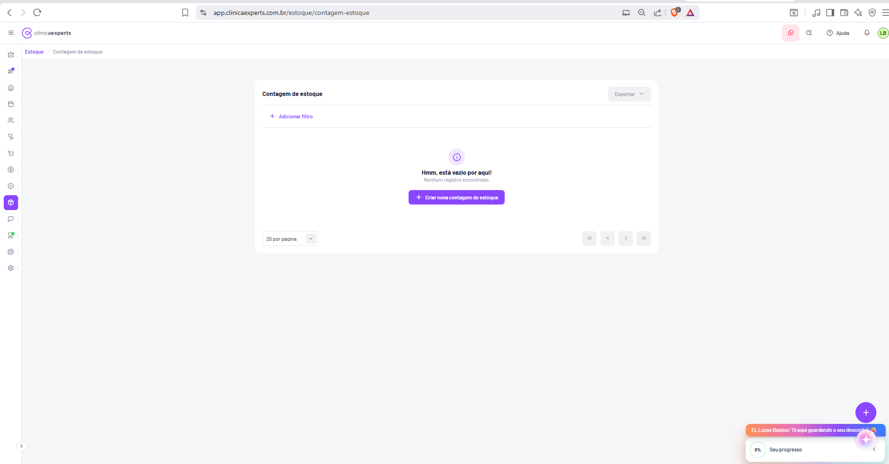
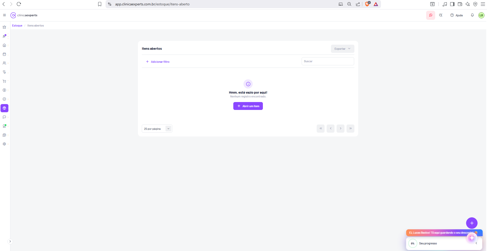
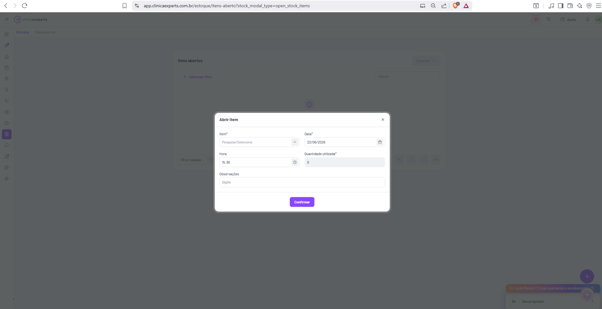
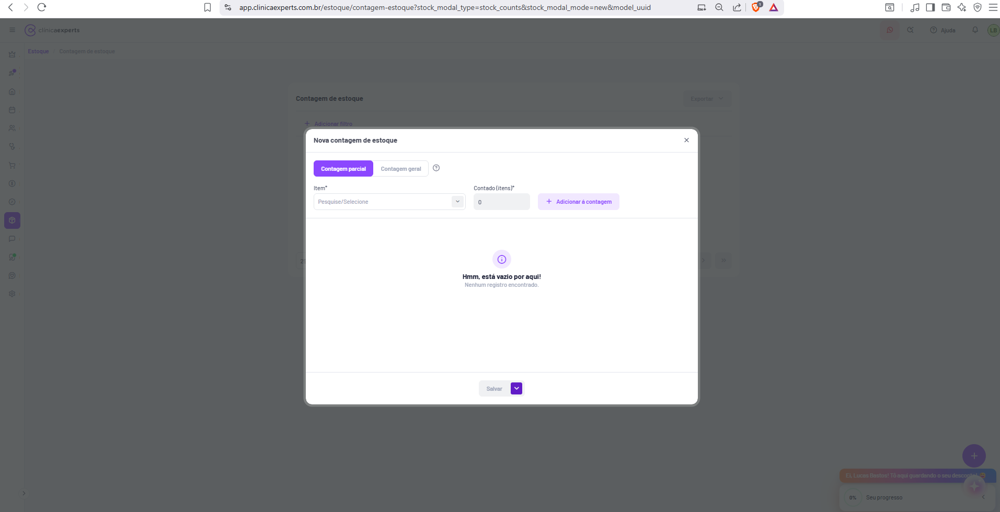
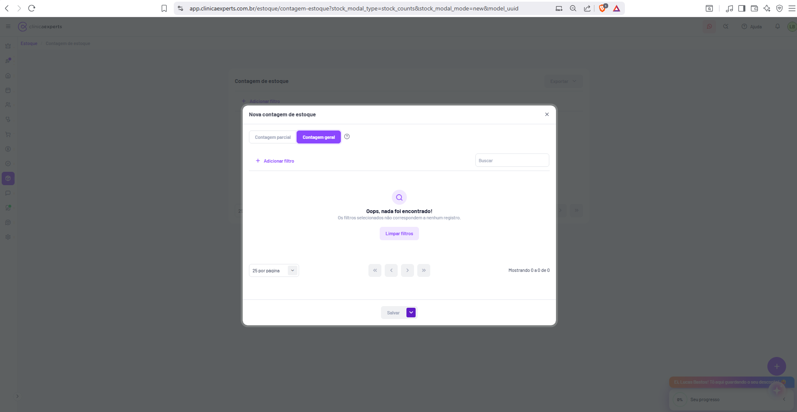
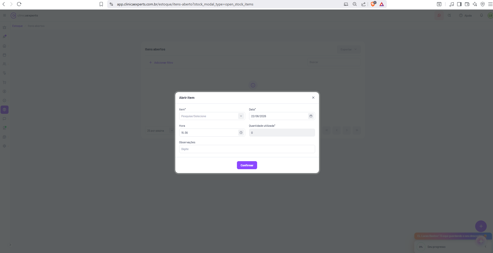
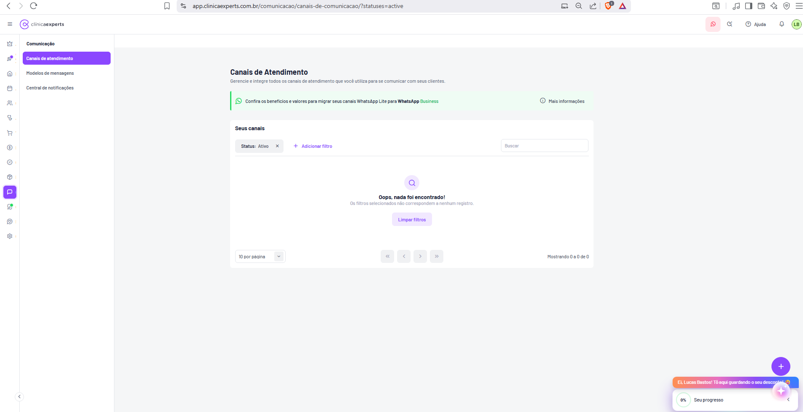

# Clínica Experts — Documentação de Telas (41 a 50)

Este documento detalha dez telas do sistema SaaS **Clínica Experts** (app.clinicaexperts.com.br), cobrindo os módulos de **Estoque** (Giro de estoque, Contagem de estoque, Itens abertos e seus modais), **Comunicação** (Canais de atendimento e Mensagens do sistema) e **Configurações** (Preferências do sistema). O objetivo é fornecer detalhamento suficiente para um desenvolvedor reconstruir cada tela: layout, navegação, elementos de UI, textos exatos, dados de exemplo, estados e fluxos inferidos.

---

## Elementos globais comuns (presentes em quase todas as telas)

Para evitar repetição, descrevemos aqui os componentes de chrome que se repetem em todas as telas internas do app.

- **Header (topo, faixa branca, fixo):**
  - À esquerda: ícone de menu hambúrguer (três linhas) para recolher/expandir a sidebar + logotipo **clínicaexperts** (símbolo circular roxo "CX" + wordmark, "clínica" em peso normal e "experts" em negrito).
  - À direita (da esquerda para a direita): ícone do WhatsApp em badge rosa/vermelho (atendimento/suporte), ícone de busca/atalho, link **"Ajuda"** com ícone de interrogação, ícone de sino (notificações), avatar circular com iniciais **"LB"** (Lucas Bastos — usuário logado; cor da borda varia verde/cinza).
- **Sidebar (barra lateral esquerda, estreita, fundo branco, ícones verticais):** coluna de ícones de navegação entre módulos, com tooltip ao passar o mouse. De cima para baixo (inferido pelos módulos do produto): coroa/estrela (planos/novidades), ícone com badge de notificação (roxo, item destacado), casa (Início/Dashboard), maleta/agenda, pessoas (Clientes/Pacientes), prontuário/saúde, carrinho (Vendas), cifrão (Financeiro), velocímetro/relatórios, **cubo (Estoque — destacado em roxo nas telas de estoque)**, balão de conversa (**Comunicação** — destacado em roxo nas telas de comunicação), ícone de marketing/foguete (com badge verde), megafone/alcance, engrenagem (**Configurações** — destacado nas telas de config) no rodapé.
  - No rodapé da sidebar há uma seta (`›` / `‹`) para expandir/recolher a navegação.
- **Botão flutuante de ação (FAB):** botão circular roxo com ícone **"+"** no canto inferior direito (criação rápida / atalho de novo registro).
- **Widget de progresso/promoção (canto inferior direito):** faixa laranja com texto **"Ei, Lucas Bastos! Tô aqui guardando o seu desconto!"** e, abaixo, um card branco **"Seu progresso"** com indicador **"0%"** e uma seta para expandir/recolher. É um componente de onboarding/gamificação/upsell.
- **Breadcrumb:** logo abaixo do header, trilha de navegação em roxo (ex.: **Estoque / Giro de estoque**), com o módulo-pai clicável (roxo) e a página atual em cinza.
- **Área principal:** fundo cinza-claro (`#f5f5f7` aprox.), com o conteúdo centralizado dentro de um **card branco** com cantos arredondados e leve sombra.

> Observação: o navegador é o Brave; toda a barra de abas/extensões e o "segundo monitor" (site de jogo) são ignorados conforme instrução. Documenta-se apenas a aba `app.clinicaexperts.com.br`.

---

## Tela 41 — Estoque › Giro de estoque

- **Rota/URL:** `app.clinicaexperts.com.br/estoque/giro?interval=2026-05-23&interval=2026-06-22`
- **Breadcrumb:** **Estoque / Giro de estoque**

### Propósito
Relatório de **movimentação de estoque** (giro) num período: mostra as **entradas**, **saídas** e o total geral de itens movimentados, com valores monetários. Permite filtrar por período e tipo de movimentação e exportar o resultado.

### Layout geral
Header e sidebar globais (cubo de Estoque destacado em roxo). Área principal com um único card branco centralizado contendo: título, barra de filtros, três cards-resumo (abas de tipo de movimentação), área de listagem/estado vazio e rodapé de paginação.

### Elementos de UI
- **Título do card:** **"Giro de estoque"** (canto superior esquerdo).
- **Botão "Exportar"** (canto superior direito, com chevron `▾` — dropdown; aparenta estado desabilitado/cinza por não haver dados).
- **Barra de filtros (linha sob o título):**
  - Chip de filtro **"Período: 23/05/2026 - 22/06/2026"** (intervalo de datas pré-aplicado, condizente com a URL).
  - Link **"+ Adicionar filtro"** (roxo) para incluir filtros adicionais.
  - Campo de busca à direita com placeholder **"Buscar"**.
- **Cards-resumo / abas de tipo de movimentação (três colunas):**
  - **"Entradas"** com ícone/ponto verde e ícone de interrogação (tooltip) — valor **"0 · R$ 0,00"**.
  - **"Saídas"** com ponto vermelho e tooltip — valor **"0 · R$ 0,00"**.
  - **"Todos"** com ponto azul e tooltip — valor **"0 · R$ 0,00"** — esta aba está **selecionada** (sublinhado/borda inferior roxa e fundo levemente destacado).
  - Cada card mostra **quantidade · valor em R$** das movimentações daquele tipo. Funcionam como filtro-aba (clicar alterna a listagem entre Entradas/Saídas/Todos).
- **Estado vazio (centro):** ícone de lupa em círculo roxo-claro + título em negrito **"Oops, nada foi encontrado!"** + subtexto **"Os filtros selecionados não correspondem a nenhum registro."** + botão roxo-claro/outline **"Limpar filtros"**.
- **Rodapé do card:**
  - À esquerda: seletor **"25 por página"** (dropdown de tamanho de página).
  - À direita: controles de paginação — botões **«** (primeira), **‹** (anterior), **›** (próxima), **»** (última), todos desabilitados (sem dados).

### Funcionalidade inferida
Tela de **relatório analítico de movimentações de estoque**. O usuário define um período e o sistema agrega entradas e saídas (quantidade e valor financeiro). As três abas filtram a tabela por direção do movimento. "Exportar" gera arquivo (provavelmente CSV/Excel/PDF) do giro. Como o período (23/05–22/06/2026) não retornou registros, exibe-se o estado vazio.

### Estados/fluxos
- **Estado atual:** vazio (nenhuma movimentação no período) → mostra "Oops, nada foi encontrado!".
- **Fluxo:** ajustar/limpar filtros → recarrega listagem; selecionar aba (Entradas/Saídas/Todos) → filtra direção; Exportar → download do relatório.

---

## Tela 42 — Estoque › Contagem de estoque (lista)

- **Rota/URL:** `app.clinicaexperts.com.br/estoque/contagem-estoque`
- **Breadcrumb:** **Estoque / Contagem de estoque**

### Propósito
Listagem das **contagens de estoque** (inventários) realizadas. Ponto de partida para criar uma nova contagem e auditar/conferir o estoque físico contra o sistema.

### Layout geral
Header e sidebar globais (Estoque ativo). Card branco central com título, barra de filtro, estado vazio e rodapé de paginação.

### Elementos de UI
- **Título do card:** **"Contagem de estoque"**.
- **Botão "Exportar"** (canto superior direito, chevron `▾`, aparência desabilitada/cinza).
- **Barra de filtros:** apenas o link **"+ Adicionar filtro"** (roxo). Não há campo de busca visível nesta tela.
- **Estado vazio (centro):** ícone de informação **(i)** em círculo roxo-claro + título **"Hmm, está vazio por aqui!"** + subtexto **"Nenhum registro encontrado."** + botão roxo sólido **"+ Criar nova contagem de estoque"**.
- **Rodapé do card:** seletor **"25 por página"** à esquerda; paginação **« ‹ › »** à direita (desabilitada).

### Funcionalidade inferida
Gerencia inventários/contagens de estoque. O botão "Criar nova contagem de estoque" abre o modal de criação (ver Telas 44 e 45). Quando houver contagens, esta tela exibirá uma tabela com as contagens já registradas (presumivelmente data, tipo, status, responsável, divergências).

### Estados/fluxos
- **Estado atual:** vazio (nenhuma contagem cadastrada).
- **Fluxo:** clicar em "Criar nova contagem de estoque" → abre modal "Nova contagem de estoque".

---

## Tela 43 — Estoque › Itens abertos (lista)

- **Rota/URL:** `app.clinicaexperts.com.br/estoque/itens-aberto`
- **Breadcrumb:** **Estoque / Itens abertos**

### Propósito
Controle de **itens abertos** — produtos/insumos que foram fracionados ou "abertos" para uso (ex.: frascos, ampolas, kits) e cujo consumo parcial precisa ser registrado e acompanhado. Lista os itens atualmente em uso/aberto.

### Layout geral
Header e sidebar globais (Estoque ativo). Card branco central com título, barra de filtros com busca, estado vazio e rodapé de paginação.

### Elementos de UI
- **Título do card:** **"Itens abertos"**.
- **Botão "Exportar"** (canto superior direito, chevron `▾`, aparência desabilitada).
- **Barra de filtros:** link **"+ Adicionar filtro"** (roxo) + campo de busca à direita com placeholder **"Buscar"**.
- **Estado vazio (centro):** ícone **(i)** em círculo roxo-claro + título **"Hmm, está vazio por aqui!"** + subtexto **"Nenhum registro encontrado."** + botão roxo sólido **"+ Abrir um item"**.
- **Rodapé do card:** seletor **"25 por página"**; paginação **« ‹ › »** (desabilitada).

### Funcionalidade inferida
Registra o "abrir" de um item de estoque para controle de consumo de produtos fracionáveis. Clicar em "Abrir um item" abre o modal "Abrir item" (Telas 44/46). Quando houver itens abertos, a tabela listará item, data/hora de abertura, quantidade utilizada, observações etc.

### Estados/fluxos
- **Estado atual:** vazio.
- **Fluxo:** "Abrir um item" → modal "Abrir item".

---

## Tela 44 — Estoque › Itens abertos › Modal "Abrir item"

- **Rota/URL:** `app.clinicaexperts.com.br/estoque/itens-aberto?stock_modal_type=open_stock_items`
- **Contexto:** Modal sobreposto à tela "Itens abertos" (Tela 43), com overlay escurecido sobre o conteúdo.

### Propósito
Formulário para **abrir/registrar o uso de um item de estoque**, informando qual item, data, hora, quantidade utilizada e observações.

### Layout geral
Modal centralizado (card branco, cantos arredondados) com cabeçalho, corpo com formulário em **grid de duas colunas** e rodapé com botão de confirmação.

### Elementos de UI
- **Cabeçalho do modal:** título **"Abrir item"** à esquerda; botão **"×"** (fechar) à direita.
- **Formulário (campos; `*` indica obrigatório):**
  - **"Item*"** — dropdown/select de busca com placeholder **"Pesquise/Selecione"** (chevron `▾`). (coluna esquerda)
  - **"Data*"** — campo de data com valor **"22/06/2026"** e ícone de calendário. (coluna direita)
  - **"Hora"** — campo de hora com valor **"15:36"** e ícone de relógio. (coluna esquerda)
  - **"Quantidade utilizada*"** — campo numérico com valor **"0"**. (coluna direita)
  - **"Observações"** — campo de texto (largura total) com placeholder **"Digite"**.
- **Rodapé:** botão roxo sólido **"Confirmar"** (centralizado).

### Funcionalidade inferida
Ao confirmar, cria um registro de item aberto: vincula o item ao consumo na data/hora informada, abate a quantidade utilizada do estoque e armazena observações. Campos obrigatórios: Item, Data e Quantidade utilizada.

### Estados/fluxos
- Abre a partir do botão "Abrir um item" (Tela 43) ou via FAB.
- **Confirmar** → salva e (presumivelmente) fecha o modal e atualiza a lista de itens abertos.
- **×** → fecha sem salvar.

---

## Tela 45 — Estoque › Contagem de estoque › Modal "Nova contagem de estoque" (Contagem parcial)

- **Rota/URL:** `app.clinicaexperts.com.br/estoque/contagem-estoque?stock_modal_type=stock_counts&stock_modal_mode=new&model_uuid`
- **Contexto:** Modal sobreposto à tela "Contagem de estoque" (Tela 42).

### Propósito
Criar uma **nova contagem de estoque**. Esta visão mostra a aba **"Contagem parcial"**, na qual o usuário adiciona item a item os produtos a serem contados e a quantidade contada.

### Layout geral
Modal amplo (mais largo e alto que o de "Abrir item"), com cabeçalho, **alternador de abas (toggle)**, linha de adição de item, área de listagem (estado vazio) e rodapé com botão de salvar.

### Elementos de UI
- **Cabeçalho:** título **"Nova contagem de estoque"** + botão **"×"** (fechar).
- **Alternador de modo (segmented control, duas opções):**
  - **"Contagem parcial"** — selecionado (roxo sólido).
  - **"Contagem geral"** — não selecionado (texto).
  - Ícone de interrogação **(?)** à direita das abas (tooltip explicando a diferença entre os modos).
- **Linha de adição de item (grid):**
  - **"Item*"** — dropdown com placeholder **"Pesquise/Selecione"** (chevron `▾`).
  - **"Contado (itens)*"** — campo numérico com valor **"0"**.
  - Botão **"+ Adicionar à contagem"** (roxo-claro/outline) para incluir o item na lista de contagem.
- **Área de listagem (estado vazio):** ícone **(i)** em círculo roxo-claro + **"Hmm, está vazio por aqui!"** + **"Nenhum registro encontrado."**
- **Rodapé:** botão **"Salvar"** (cinza/desabilitado enquanto não há itens) com um **dropdown anexo** (chevron `▾` roxo ao lado — provavelmente "Salvar e..." outras ações, como salvar e finalizar).

### Funcionalidade inferida
**Contagem parcial:** o usuário seleciona itens específicos e informa a quantidade física contada de cada um, montando uma lista. Ao salvar, o sistema registra a contagem e compara com o saldo do sistema para apontar divergências.

### Estados/fluxos
- Abre via "Criar nova contagem de estoque" (Tela 42).
- Alternar para "Contagem geral" → muda o corpo do modal (ver Tela 46).
- Adicionar itens → preenche a lista; **Salvar** habilita quando há itens.

---

## Tela 46 — Estoque › Contagem de estoque › Modal "Nova contagem de estoque" (Contagem geral)

- **Rota/URL:** `app.clinicaexperts.com.br/estoque/contagem-estoque?stock_modal_type=stock_counts&stock_modal_mode=new&model_uuid`
- **Contexto:** Mesmo modal da Tela 45, agora com a aba **"Contagem geral"** selecionada.

### Propósito
Criar uma contagem de estoque no modo **geral** — contagem do **estoque inteiro** (todos os itens cadastrados são carregados para serem contados), em oposição à contagem parcial (itens avulsos).

### Layout geral
Mesmo modal; o corpo muda: em vez da linha "Item + Contado + Adicionar", apresenta uma **barra de filtros com busca** e uma **área de tabela** (aqui em estado vazio por filtro sem correspondência).

### Elementos de UI
- **Cabeçalho:** **"Nova contagem de estoque"** + **"×"**.
- **Alternador de modo:** **"Contagem parcial"** (texto, não selecionado) | **"Contagem geral"** (roxo sólido, selecionado) + ícone **(?)**.
- **Barra de filtros:** link **"+ Adicionar filtro"** (roxo) + campo de busca **"Buscar"** à direita.
- **Estado vazio (centro):** ícone de lupa em círculo roxo-claro + **"Oops, nada foi encontrado!"** + **"Os filtros selecionados não correspondem a nenhum registro."** + botão **"Limpar filtros"**.
- **Rodapé interno (paginação da listagem):** seletor **"25 por página"** à esquerda; paginação **« ‹ › »**; texto **"Mostrando 0 a 0 de 0"** à direita.
- **Rodapé do modal:** botão **"Salvar"** (desabilitado) com dropdown anexo (chevron `▾`).

### Funcionalidade inferida
**Contagem geral:** carrega todos os itens de estoque numa tabela paginada para que o usuário informe a quantidade contada de cada um (inventário completo). Filtros e busca ajudam a localizar itens. Como nenhum item foi cadastrado/correspondeu ao filtro, exibe o estado vazio com "Mostrando 0 a 0 de 0".

### Estados/fluxos
- Alternar entre "Contagem parcial" (Tela 45) e "Contagem geral" (Tela 46) reaproveita o mesmo modal, trocando o corpo.
- **Limpar filtros** → recarrega a tabela completa.
- **Salvar** → grava a contagem (com dropdown para variações da ação de salvar).

---

## Tela 47 — Estoque › Itens abertos › Modal "Abrir item" (repetição/variante)

- **Rota/URL:** `app.clinicaexperts.com.br/estoque/itens-aberto?stock_modal_type=open_stock_items`
- **Contexto:** Mesmo modal **"Abrir item"** da Tela 44, capturado novamente sobre a tela "Itens abertos".

### Propósito
Idêntico à Tela 44 — formulário de **abertura/registro de uso de item de estoque**. Reaparece aqui (provavelmente outra captura do mesmo fluxo) confirmando a consistência do modal.

### Layout geral
Modal centralizado com cabeçalho, formulário em grid de duas colunas e rodapé com botão.

### Elementos de UI (idênticos à Tela 44)
- **Cabeçalho:** **"Abrir item"** + **"×"**.
- **Campos:**
  - **"Item*"** — dropdown **"Pesquise/Selecione"** (`▾`).
  - **"Data*"** — **"22/06/2026"** (ícone de calendário).
  - **"Hora"** — **"15:36"** (ícone de relógio).
  - **"Quantidade utilizada*"** — **"0"**.
  - **"Observações"** — placeholder **"Digite"**.
- **Rodapé:** botão roxo **"Confirmar"**.

### Funcionalidade inferida / Estados
Igual à Tela 44 (criar registro de item aberto; Confirmar salva, × fecha). Sem diferenças funcionais observáveis.

---

## Tela 48 — Comunicação › Canais de Atendimento

- **Rota/URL:** `app.clinicaexperts.com.br/comunicacao/canais-de-comunicacao/?statuses=active`
- **Breadcrumb:** **Comunicação / Canais de atendimento** (na sidebar interna do módulo)

### Propósito
Gerenciar e integrar os **canais de atendimento/comunicação** que a clínica usa para falar com seus clientes (ex.: WhatsApp). Tela inicial do módulo **Comunicação**.

### Layout geral
Diferentemente das telas de Estoque, este módulo exibe uma **segunda sidebar (submenu vertical)** entre a sidebar global de ícones e a área principal. A área principal traz título, banner promocional, e um card "Seus canais" com filtros e listagem.

### Elementos de UI
- **Sidebar global:** ícone de balão de conversa (Comunicação) destacado em roxo.
- **Submenu do módulo (coluna à esquerda da área principal):**
  - Cabeçalho **"Comunicação"** (negrito).
  - **"Canais de atendimento"** — item **ativo** (fundo roxo).
  - **"Modelos de mensagens"**.
  - **"Central de notificações"**.
- **Área principal:**
  - **Título:** **"Canais de Atendimento"**.
  - **Subtítulo:** **"Gerencie e integre todos os canais de atendimento que você utiliza para se comunicar com seus clientes."**
  - **Banner informativo (faixa verde-clara com barra lateral verde):** ícone do WhatsApp + texto **"Confira os benefícios e valores para migrar seus canais WhatsApp Lite para WhatsApp Business"**; à direita, link **"ⓘ Mais informações"**.
  - **Card "Seus canais":**
    - Título **"Seus canais"**.
    - **Filtros:** chip **"Status: Ativo ✕"** (filtro pré-aplicado, condizente com `?statuses=active`) + link **"+ Adicionar filtro"** + campo de busca **"Buscar"** à direita.
    - **Estado vazio:** ícone de lupa em círculo roxo-claro + **"Oops, nada foi encontrado!"** + **"Os filtros selecionados não correspondem a nenhum registro."** + botão **"Limpar filtros"**.
    - **Rodapé:** seletor **"10 por página"** (note: 10, não 25); paginação **« ‹ › »**; texto **"Mostrando 0 a 0 de 0"**.

### Funcionalidade inferida
Hub para conectar canais de comunicação (principalmente WhatsApp Lite e WhatsApp Business). O banner faz upsell/migração para o WhatsApp Business. A listagem mostra os canais conectados e seus status; aqui está vazia (nenhum canal ativo cadastrado).

### Estados/fluxos
- **Estado atual:** filtrado por "Ativo", sem canais → estado vazio.
- **Fluxos:** "Limpar filtros" para ver todos; "Mais informações" abre detalhes da migração; navegar pelo submenu para "Modelos de mensagens" (Tela 49) ou "Central de notificações".

---

## Tela 49 — Comunicação › Modelos de mensagens (Mensagens do sistema)

- **Rota/URL:** `app.clinicaexperts.com.br/comunicacao/mensagens/mensagens-do-sistema` (módulo **Comunicação › Modelos de mensagens**)
- **Breadcrumb/submenu:** **Comunicação / Modelos de mensagens** → aba **Mensagens do sistema**

### Propósito
Gerenciar os **modelos/templates de mensagens automáticas do sistema** enviadas aos clientes em diferentes eventos (aniversário, lembretes, agendamentos, confirmações etc.), com possibilidade de personalizar cada um.

### Layout geral
Header e sidebar global (Comunicação ativo) + submenu do módulo à esquerda. Área principal com título de seção e uma **grade (grid) de cards de modelos de mensagem**, organizados em colunas (aprox. 4 por linha), com rolagem vertical para ver mais.

### Elementos de UI
- **Título da seção:** **"Mensagens do sistema"** (topo da área de conteúdo).
- **Cards de modelos de mensagem (grade):** cada card contém um **ícone** ilustrativo no topo, um **título** em negrito, um **texto descritivo** explicando quando/como a mensagem é usada, **badges/tags** de canal (ex.: **"WhatsApp"**, e-mail/SMS — pequenos rótulos indicando por quais canais o template dispara) e um botão roxo **"Personalizar"** na base do card.
- **Modelos identificáveis (primeira(s) linha(s) da grade), com títulos:**
  - **"Aniversário"** — mensagem de felicitação de aniversário ao cliente.
  - **"Boas-vindas"** (card com ícone de coração) — mensagem de boas-vindas a novos clientes.
  - **"Lembrete de retorno"** — lembrete para o cliente retornar/reagendar.
  - **"Lembrete de agendamento"** — lembrete do agendamento marcado.
  - **"Agendamento criado"** — confirmação de criação de agendamento.
  - **"Agendamento alterado"** — aviso de alteração de agendamento.
  - **"Confirmação de agendamento"** — solicitação/confirmação do agendamento.
  - **"Agendamento confirmado"** — aviso de agendamento confirmado.
  - (Linha seguinte, parcialmente visível) **"Agendamento cancelado"**, **"Formulário de pré-atendimento"**, **"Envio de orçamento"**, **"Lembrete de fatura"** entre outros.
- Cada card repete o botão **"Personalizar"** (roxo sólido) e as tags de canal de envio.

### Funcionalidade inferida
Catálogo de templates de comunicação automática disparados por eventos do sistema. "Personalizar" abre o editor do template (texto, variáveis dinâmicas como nome do cliente/data, canais habilitados). As badges indicam por quais canais (WhatsApp, e-mail, SMS) cada mensagem é enviada.

### Estados/fluxos
- A grade lista todos os modelos disponíveis (cada um habilitável/personalizável).
- **Fluxo:** clicar em "Personalizar" → tela/modal de edição do modelo; alternar pelas abas/itens do submenu Comunicação.

> Nota: esta captura está em resolução reduzida; os textos descritivos completos de cada card não são totalmente legíveis, mas os títulos e a estrutura (ícone + título + descrição + tags de canal + botão "Personalizar") são claros.

---

## Tela 50 — Configurações › Preferências do sistema

- **Rota/URL:** `app.clinicaexperts.com.br/configuracoes/preferencias-do-sistema`
- **Breadcrumb/submenu:** **Configurações / Preferências do sistema**

### Propósito
Central de **configurações gerais e financeiras** da clínica: fuso horário, moeda, comportamento do módulo financeiro (caixa, DRE, conciliação), categorias e métodos/contas padrão para receitas, despesas e transferências.

### Layout geral
Header e sidebar global (engrenagem de Configurações ativa) + **submenu do módulo Configurações** à esquerda. Área principal com formulário de preferências em **seções**, cada linha com **rótulo + descrição à esquerda** e **controle (toggle ou dropdown) à direita**.

### Elementos de UI
- **Submenu "Configurações" (coluna esquerda):**
  - **"Preferências do sistema"** — item **ativo** (roxo).
  - **"Dados da clínica"**
  - **"Assinatura"**
  - **"Procedimentos"**
  - **"Categorias de procedimentos"**
  - **"Pacotes"**
  - **"Salas de atendimento"**
  - **"Fichas de atendimentos"**
  - **"Modelos de atestados e prescrições"**
  - **"Etiquetas"**
  - **"Horários de funcionamento"**
- **Conteúdo — Título:** **"Preferências do sistema"**.

- **Seção "Geral":**
  - **"Fuso horário"** — descrição "Fuso horário da localidade da clínica. (Padrão: (GMT-03:00) São Paulo)" — dropdown com valor **"(GMT-03:00) São Paulo"**.
  - **"Moeda"** — descrição "Moeda padrão da localidade da clínica. (Padrão: BRL - R$)" — dropdown com valor **"BRL - R$"**.

- **Seção "Financeiro":** (linhas com toggle on/off à direita)
  - **"Ocultar dados financeiros"** — "Se habilitado, esconde as informações financeiras da página inicial. (Padrão: Desabilitado)" — **toggle** (desligado).
  - **"Usar DRE"** — "Se habilitado, o sistema irá habilitar as categorias do DRE. (Padrão: Desabilitado)" — **toggle**.
  - **"Usar abertura de caixa"** — "Se habilitado, o sistema irá habilitar a abertura de caixa. (Padrão: Desabilitado)" — **toggle**.
  - **"Mostrar apenas movimentações de Dinheiro no caixa"** — "Se habilitado, apenas movimentações com método 'Dinheiro' serão exibidas no resumo do caixa. (Padrão: Desabilitado)" — **toggle**.
  - **"Conciliação bancária"** — "Se habilitado, o sistema irá habilitar a conciliação bancária. (Padrão: Desabilitado)" — **toggle**.
  - **"Categoria de receitas"** — "Categoria padrão para entradas no financeiro. (Padrão: Receitas de serviços)" — dropdown com valor **"Receitas de serviços"**.
  - **"Método de receitas"** — "Método de pagamento padrão para entradas no financeiro. (Padrão: Dinheiro)" — dropdown com valor **"PIX"** (ícone PIX).
  - **"Método de despesas"** — "Método de pagamento padrão para saídas no financeiro. (Padrão: Dinheiro)" — dropdown com valor **"PIX"** (ícone PIX).
  - **"Conta de receitas"** — "Conta padrão para entradas no financeiro." — dropdown com valor **"Banco padrão"**.
  - **"Conta de despesas"** — "Conta padrão para saídas no financeiro." — dropdown com valor **"Banco padrão"**.
  - **"Categoria de transferências"** — "Categoria padrão para transferências no financeiro. (Padrão: Transferências)" — dropdown com valor **"Transferências"** (parcialmente visível no rodapé; a página tem rolagem para mais itens).

### Funcionalidade inferida
Configura o comportamento padrão do sistema, especialmente do módulo financeiro. Os toggles ligam/desligam recursos (DRE, abertura de caixa, conciliação bancária, ocultação de dados financeiros, filtro de movimentações em dinheiro). Os dropdowns definem valores padrão (categoria/método/conta) que serão pré-selecionados ao registrar receitas, despesas e transferências, agilizando lançamentos. Cada linha indica o valor "(Padrão: …)" para referência.

### Estados/fluxos
- Alterações são aplicadas por linha (toggle imediato ou seleção em dropdown); presumivelmente salvas automaticamente ou via botão de salvar fora da área visível.
- Navegação por outras telas de configuração via submenu (Dados da clínica, Assinatura, Procedimentos, etc.).

> Nota: esta captura está em resolução reduzida (zoom out); todos os rótulos, descrições e valores acima foram lidos diretamente da tela, mas a página continua abaixo do recorte (há mais preferências por rolagem).

---

*Fim do documento — Telas 41 a 50.*
