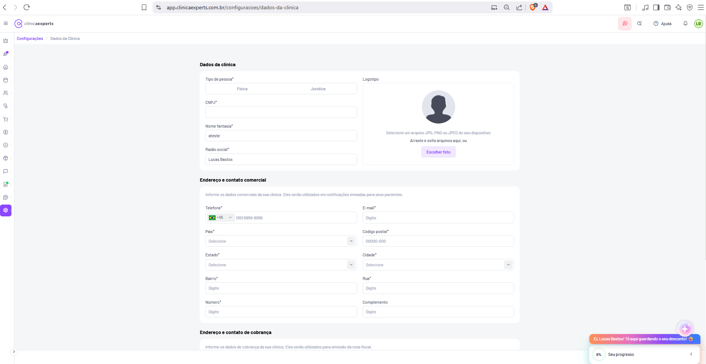
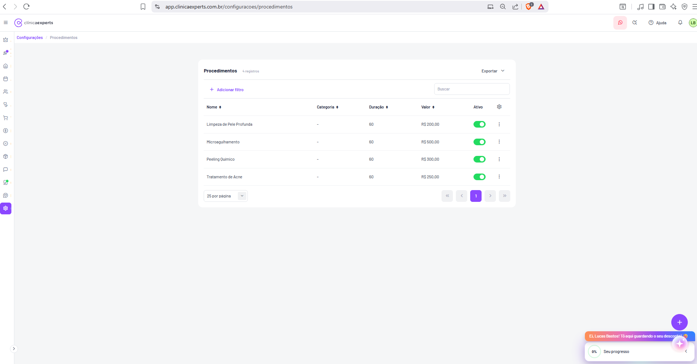
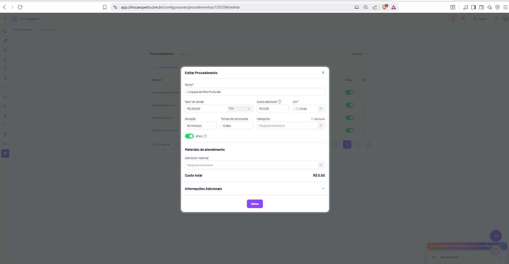
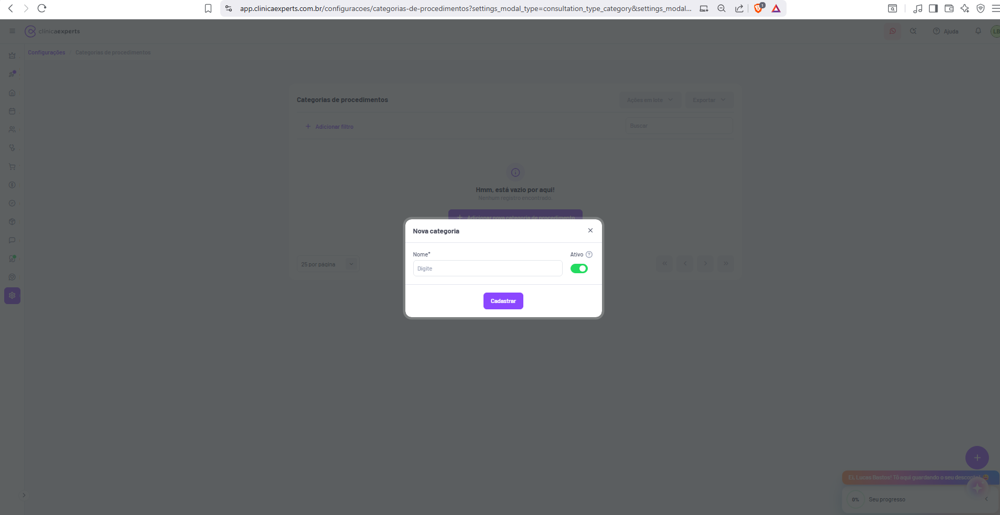
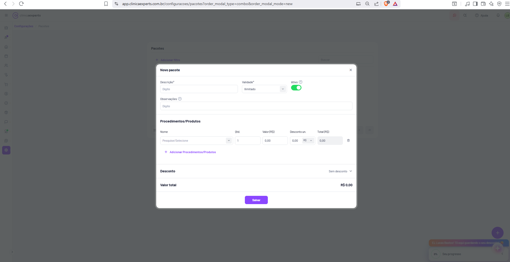
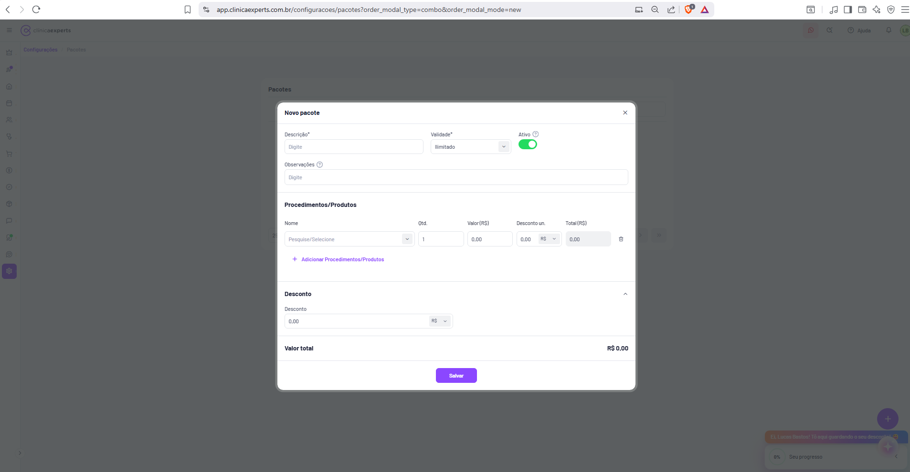
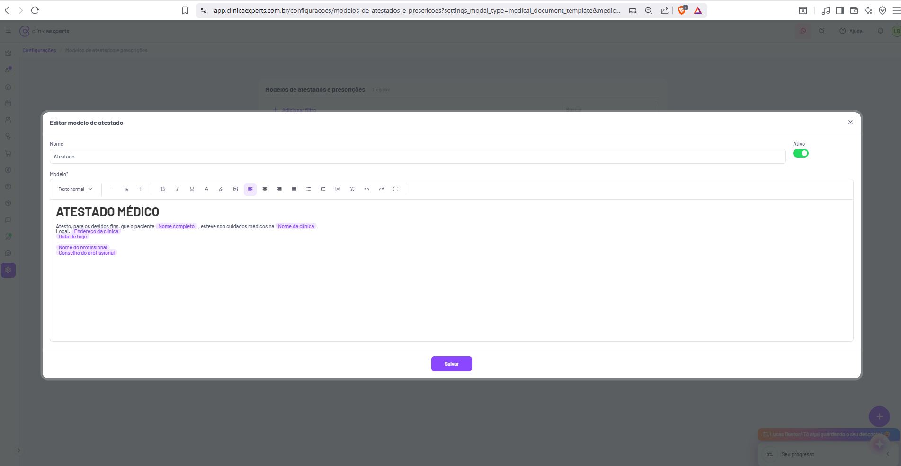

# Clínica Experts — Documentação de Telas (51 a 58)

Este documento detalha oito telas do módulo **Configurações** do sistema SaaS de gestão de clínicas "Clínica Experts" (app.clinicaexperts.com.br), cobrindo o cadastro de dados da clínica, procedimentos, categorias de procedimentos, pacotes, fichas de atendimento e modelos de atestados/prescrições. Cada seção descreve layout, elementos de UI, textos exatos e funcionalidade inferida, com nível de detalhe suficiente para reconstrução por um desenvolvedor.

---

## Elementos comuns a todas as telas

Antes das seções individuais, registro os componentes de chrome que se repetem em todas as telas do app:

- **Barra do navegador (Brave):** URL no padrão `app.clinicaexperts.com.br/...`. Ignorada para fins de documentação do produto.
- **Header superior (faixa branca):**
  - À esquerda: ícone de menu hambúrguer (☰) e logotipo **"clínicaexperts"** (marca em duas cores: "clínica" em cinza/escuro, "experts" em destaque; ícone circular com monograma "C" à esquerda do texto).
  - À direita: ícone do WhatsApp (botão circular rosa/vermelho), ícone de busca/atalhos (lupa), link **"Ajuda"** com ícone de interrogação, ícone de sino (notificações) e avatar circular do usuário com iniciais **"LB"** (Lucas Bastos).
- **Sidebar esquerda (estreita, ícones verticais):** barra fina de navegação principal com ícones empilhados (de cima para baixo, aproximadamente): coroa/upgrade, foguete (com badge), casa (início), agenda/calendário, pessoas (pacientes/equipe), serviço/tesoura, carrinho (vendas), cifrão (financeiro), bússola/CRM, caixa/produtos, balão de chat, marketing/megafone, suporte/headset e, ao final, ícone de engrenagem (**Configurações**) destacado em roxo, indicando o módulo ativo em todas estas telas. Rodapé da sidebar tem uma seta (›) para expandir/recolher.
- **Breadcrumb (área principal, topo):** padrão `Configurações / <Nome da subseção>`, com "Configurações" como link clicável em roxo.
- **Fundo da área principal:** cinza muito claro (#f5f5f7 aprox.), com cards/painéis brancos centralizados.
- **Widgets fixos (canto inferior direito):**
  - Balão laranja de gamificação/marketing: **"Ei, Lucas Bastos! Tô aqui guardando o seu desconto! 😅"**
  - Botão flutuante roxo com ícone de "estrela/sparkle" (assistente/IA).
  - Card **"Seu progresso"** com indicador **"0%"** (onboarding) e seta de expandir/recolher.
- **Botão flutuante de ação (FAB):** botão circular roxo com **"+"** no canto inferior direito, presente nas telas de listagem para criar novo registro.

---

## Tela 51 — Configurações › Dados da Clínica

**Rota:** `app.clinicaexperts.com.br/configuracoes/dados-da-clinica`

**Propósito:** Cadastro/edição dos dados cadastrais da clínica (identificação fiscal, logotipo, endereço comercial e endereço/contato de cobrança). É a tela de identidade da empresa usada em documentos e notificações.

**Layout geral:** Header e sidebar padrão. Área principal com formulário em uma única coluna larga (sem card delimitador visível — fundo branco), organizado em seções com títulos em negrito. O formulário é longo e rolável.

**Breadcrumb:** `Configurações / Dados da Clínica`

### Seção "Dados da clínica"
Layout em duas colunas:
- **Coluna esquerda (campos):**
  - **"Tipo de pessoa*"** — seletor segmentado (toggle) com duas opções: **"Física"** e **"Jurídica"** (lado a lado em um único controle).
  - **"CNPJ*"** — campo de texto (vazio).
  - **"Nome fantasia*"** — campo de texto preenchido com **"ateste"**.
  - **"Razão social*"** — campo de texto preenchido com **"Lucas Bastos"**.
- **Coluna direita ("Logotipo"):**
  - Rótulo **"Logotipo"**.
  - Área de upload com avatar circular placeholder (ícone de pessoa cinza).
  - Texto de instrução: **"Selecione um arquivo JPG, PNG ou JPEG do seu dispositivo"** e **"Arraste e solte arquivos aqui, ou"**.
  - Botão **"Escolher foto"** (roxo claro/lavanda).

### Seção "Endereço e contato comercial"
- Texto auxiliar (cinza): **"Informe os dados comerciais da sua clínica. Eles serão utilizados em notificações enviadas para seus pacientes."**
- Campos em grade de duas colunas:
  - **"Telefone*"** — campo com seletor de DDI à esquerda (bandeira do Brasil + **"+55"**, dropdown) e placeholder **"(99) 9999-9999"**.
  - **"E-mail*"** — placeholder **"Digite"**.
  - **"País*"** — dropdown com placeholder **"Selecione"**.
  - **"Código postal*"** — placeholder **"00000-000"**.
  - **"Estado*"** — dropdown **"Selecione"**.
  - **"Cidade*"** — dropdown **"Selecione"**.
  - **"Bairro*"** — placeholder **"Digite"**.
  - **"Rua*"** — placeholder **"Digite"**.
  - **"Número*"** — placeholder **"Digite"**.
  - **"Complemento"** (sem asterisco — opcional) — placeholder **"Digite"**.

### Seção "Endereço e contato de cobrança" (parcialmente visível no rodapé)
- Texto auxiliar: **"Informe os dados de cobrança da sua clínica. Eles serão utilizados para emissão da nota fiscal."**
- Campos cortados pela borda inferior; presume-se estrutura semelhante à do endereço comercial.

**Funcionalidade inferida:** Persistência dos dados cadastrais da clínica. O asterisco (*) indica campos obrigatórios. CEP provavelmente autocompleta Estado/Cidade/Bairro/Rua via integração de busca de endereço. O tipo de pessoa (Física/Jurídica) deve alternar o rótulo/validação do documento (CPF vs CNPJ). Botão "Salvar" presumivelmente no fim do formulário (fora do recorte).

**Estados/fluxos:** Formulário de edição com dados parcialmente preenchidos. Upload de logo por seleção ou drag-and-drop.

---

## Tela 52 — Configurações › Procedimentos (listagem)

**Rota:** `app.clinicaexperts.com.br/configuracoes/procedimentos`

**Propósito:** Listar e gerenciar os procedimentos (serviços) oferecidos pela clínica, com preço, duração e status ativo/inativo.

**Layout geral:** Card branco centralizado na área principal. Título do card, ações no topo, barra de filtro/busca e tabela.

**Breadcrumb:** `Configurações / Procedimentos`

### Cabeçalho do card
- Título **"Procedimentos"** com contador secundário em cinza **"4 registros"**.
- À direita: botão **"Exportar"** com seta dropdown (▾).

### Barra de filtros
- Link/botão **"+ Adicionar filtro"** (roxo, à esquerda).
- Campo de busca à direita com placeholder **"Buscar"**.

### Tabela
Colunas (cabeçalhos com ícone de ordenação ⇅):
- **"Nome"**
- **"Categoria"**
- **"Duração"**
- **"Valor"**
- **"Ativo"**
- Ícone de engrenagem (⚙) no canto direito do cabeçalho (configurar colunas visíveis).

Linhas (dados de exemplo):
| Nome | Categoria | Duração | Valor | Ativo | Ações |
|------|-----------|---------|-------|-------|-------|
| Limpeza de Pele Profunda | - | 60 | R$ 200,00 | toggle verde (ligado) | ⋮ |
| Microagulhamento | - | 60 | R$ 500,00 | toggle verde (ligado) | ⋮ |
| Peeling Químico | - | 60 | R$ 300,00 | toggle verde (ligado) | ⋮ |
| Tratamento de Acne | - | 60 | R$ 250,00 | toggle verde (ligado) | ⋮ |

- Coluna **Categoria** exibe **"-"** (sem categoria atribuída).
- Coluna **Ativo:** toggle/switch verde (todos ativos).
- Cada linha tem um menu de ações (ícone de três pontos verticais **⋮**) à direita.

### Rodapé da tabela / paginação
- À esquerda: seletor **"25 por página"** (dropdown).
- À direita: controles de paginação — botões **«** (primeira), **‹** (anterior), página **"1"** (ativa, destaque roxo), **›** (próxima), **»** (última).

### FAB
- Botão flutuante roxo **"+"** no canto inferior direito (adicionar novo procedimento).

**Funcionalidade inferida:** CRUD de procedimentos. Ordenação por coluna, busca textual, filtros configuráveis, exportação (CSV/Excel), ativação/desativação inline via toggle, ações por linha (editar/excluir) no menu ⋮, e criação via FAB.

**Estados/fluxos:** Lista populada com 4 itens, todos ativos, paginação em uma única página.

---

## Tela 53 — Editar Procedimento (modal)

**Rota:** `app.clinicaexperts.com.br/configuracoes/procedimentos/1353394/editar` (modal sobre a listagem de procedimentos)

**Propósito:** Editar os detalhes de um procedimento existente ("Limpeza de Pele Profunda"), incluindo precificação, custo, duração, categoria, materiais de atendimento e informações adicionais.

**Layout geral:** Modal centralizado sobre a listagem (fundo escurecido/overlay). Modal branco com título, botão de fechar (X) no canto superior direito, formulário em seções e botão de ação no rodapé.

**Cabeçalho do modal:** Título **"Editar Procedimento"** + botão **"X"** (fechar).

### Campos do formulário
- **"Nome*"** — campo texto preenchido **"Limpeza de Pele Profunda"** (largura total).
- Linha de três campos:
  - **"Valor de venda"** — campo de valor **"R$ 200,00"** com dropdown adjacente **"Fixo"** (tipo de precificação).
  - **"Custo adicional"** (com ícone de ajuda ⓘ) — **"R$ 0,00"**.
  - **"Cor*"** — dropdown com swatch + texto **"Cinza"** (cor de identificação na agenda).
- Linha de três campos:
  - **"Duração"** — **"60 minutos"**.
  - **"Tempo de reconsulta"** — **"0 dias"**.
  - **"Categoria"** — dropdown com placeholder **"Pesquise/Selecione"**, com link **"+ Adicionar"** acima/à direita (criar nova categoria inline).
- **Toggle "Ativo"** (verde/ligado) com ícone de ajuda ⓘ.

### Seção "Materiais de atendimento"
- Rótulo **"Adicionar material"** — dropdown **"Pesquise/Selecione"**.
- Linha **"Custo total"** (negrito à esquerda) com valor **"R$ 0,00"** à direita.

### Seção "Informações Adicionais"
- Cabeçalho recolhível **"Informações Adicionais"** com seta (▾) para expandir.

### Rodapé do modal
- Botão **"Salvar"** (roxo, centralizado).

**Funcionalidade inferida:** Edição completa do procedimento. O dropdown "Fixo" sugere modos de precificação alternativos (ex.: percentual/variável). "Tempo de reconsulta" agenda automaticamente retorno. "Custo adicional" + materiais somam o "Custo total" (margem). "Cor" define identificação visual na agenda. "Categoria" liga à tela de categorias (Tela 54). Seção recolhível para campos opcionais.

**Estados/fluxos:** Modal de edição com dados preenchidos. Campos de custo zerados. Seção "Informações Adicionais" recolhida.

---

## Tela 54 — Configurações › Categorias de Procedimentos (vazia + modal "Nova categoria")

**Rota:** `app.clinicaexperts.com.br/configuracoes/categorias-de-procedimentos?settings_modal_type=consultation_type_category&settings_modal_...` (a query string indica modal aberto)

**Propósito:** Gerenciar as categorias usadas para classificar procedimentos. A tela está em estado vazio (sem registros) com o modal de criação aberto.

**Layout geral:** Card branco com a listagem (vazia) ao fundo, escurecido pelo overlay do modal centralizado.

**Breadcrumb:** `Configurações / Categorias de procedimentos`

### Card de listagem (ao fundo)
- Título **"Categorias de procedimentos"**.
- À direita do topo: botão **"Ações em lote"** (com seta ▾) e botão **"Exportar"** (com seta ▾) — ambos atenuados pelo overlay.
- **"+ Adicionar filtro"** e campo **"Buscar"**.
- **Estado vazio (empty state):** ícone informativo (ⓘ) circular, título **"Hmm, está vazio por aqui!"** e subtítulo **"Nenhum registro encontrado."**, seguido de um botão (parcialmente coberto pelo modal) **"+ Adicionar nova categoria de procedimento"** (roxo).
- Rodapé: seletor **"25 por página"** e paginação **«  ‹  ›  »** (desabilitada, sem páginas).

### Modal "Nova categoria"
- Cabeçalho **"Nova categoria"** + botão **"X"**.
- Campo **"Nome*"** — placeholder **"Digite"**.
- À direita: rótulo **"Ativo"** (com ícone de ajuda ⓘ) e toggle verde (ligado).
- Botão **"Cadastrar"** (roxo, centralizado no rodapé do modal).

**Funcionalidade inferida:** Criação de categorias de procedimentos com nome e status ativo. As categorias criadas alimentam o dropdown "Categoria" do modal de procedimento (Tela 53). "Ações em lote" permite operações em múltiplos registros selecionados. O empty state convida o usuário a criar o primeiro registro.

**Estados/fluxos:** Estado vazio + modal de criação aberto (acessível via FAB ou botão do empty state).

---

## Tela 55 — Configurações › Pacotes (modal "Novo pacote", seção Desconto recolhida)

**Rota:** `app.clinicaexperts.com.br/configuracoes/pacotes?order_modal_type=combo&order_modal_mode=new`

**Propósito:** Criar um pacote (combo) que agrupa procedimentos/produtos com preço e desconto consolidados, para venda conjunta.

**Layout geral:** Card de listagem "Pacotes" ao fundo (atenuado pelo overlay), com modal centralizado "Novo pacote".

**Breadcrumb:** `Configurações / Pacotes`

### Modal "Novo pacote"
**Cabeçalho:** **"Novo pacote"** + botão **"X"**.

Campos do topo (linha de três):
- **"Descrição*"** — campo texto, placeholder **"Digite"**.
- **"Validade*"** — dropdown com valor **"Ilimitado"**.
- **"Ativo"** (com ícone de ajuda ⓘ) — toggle verde (ligado).

- **"Observações"** (com ícone de ajuda ⓘ) — campo texto largura total, placeholder **"Digite"**.

### Seção "Procedimentos/Produtos"
Tabela/linha de itens com colunas:
- **"Nome"** — dropdown **"Pesquise/Selecione"**.
- **"Qtd."** — campo numérico, valor **"1"**.
- **"Valor (R$)"** — **"0,00"**.
- **"Desconto un."** — campo **"0,00"** com seletor de unidade **"R$"** (dropdown ▾; presume alternar entre R$ e %).
- **"Total (R$)"** — **"0,00"** (somente leitura/calculado).
- Ícone de lixeira (🗑) à direita para remover o item.
- Link **"+ Adicionar Procedimentos/Produtos"** (roxo) abaixo da linha.

### Seção "Desconto" (recolhida nesta captura)
- Cabeçalho **"Desconto"** com, à direita, indicador **"Sem desconto"** + seta (▾) para expandir.

### Total e ação
- Linha **"Valor total"** (negrito) com **"R$ 0,00"** à direita.
- Botão **"Salvar"** (roxo, centralizado).

**Funcionalidade inferida:** Montagem de pacotes com múltiplos itens; cada item permite quantidade, valor unitário e desconto por unidade (R$ ou %); o Total por linha e o Valor total são calculados automaticamente. "Validade" controla por quanto tempo o pacote pode ser usado após a venda. "Sem desconto" é o estado padrão da seção de desconto global do pacote.

**Estados/fluxos:** Modal de criação em branco, seção "Desconto" recolhida (estado "Sem desconto").

---

## Tela 56 — Configurações › Pacotes (modal "Novo pacote", seção Desconto expandida)

**Rota:** `app.clinicaexperts.com.br/configuracoes/pacotes?order_modal_type=combo&order_modal_mode=new`

**Propósito:** Mesma tela da Tela 55 (criação de pacote), agora com a seção **"Desconto"** expandida, revelando o controle de desconto global do pacote.

**Layout geral:** Idêntico à Tela 55 (modal "Novo pacote" sobre listagem). Diferença está na seção Desconto.

### Diferenças em relação à Tela 55
- O cabeçalho da seção **"Desconto"** está expandido (seta apontando para cima ▴).
- Conteúdo revelado:
  - Rótulo **"Desconto"**.
  - Campo de valor **"0,00"** com seletor de unidade **"R$"** (dropdown ▾, presume alternar R$ / %).
- O restante (Descrição, Validade "Ilimitado", Ativo, Observações, lista de Procedimentos/Produtos com colunas Nome/Qtd./Valor(R$)/Desconto un./Total(R$), link "+ Adicionar Procedimentos/Produtos", "Valor total R$ 0,00" e botão **"Salvar"**) é idêntico à Tela 55.

**Funcionalidade inferida:** O desconto global aplica-se ao pacote inteiro (além dos descontos por item). A unidade R$/% permite desconto fixo ou percentual sobre o total. Ao expandir/recolher, o estado do cabeçalho alterna entre "Sem desconto" (recolhido) e o formulário de valor (expandido).

**Estados/fluxos:** Mesmo modal de criação, com a seção de desconto aberta para edição.

---

## Tela 57 — Configurações › Fichas de Atendimentos (listagem)

> Observação: a rota e o conteúdo abaixo correspondem ao arquivo `Captura de tela 2026-06-22 154000.png`.

**Rota:** `app.clinicaexperts.com.br/configuracoes/fichas-de-atendimentos/`

**Propósito:** Gerenciar os tipos/modelos de fichas de atendimento (formulários clínicos: anamnese, avaliações por especialidade, fotos, orçamento, plano de tratamento etc.) disponíveis para uso durante os atendimentos.

**Layout geral:** Card branco centralizado com título, ações, filtro/busca e tabela. Header e sidebar padrão.

**Breadcrumb:** `Configurações / Fichas de atendimentos`

### Cabeçalho do card
- Título **"Fichas de atendimentos"** + contador **"10 registros"** (cinza).
- À direita: link **"Editar minhas fichas"** com ícone de link externo/seta diagonal (↗), em roxo.

### Barra de filtros
- **"+ Adicionar filtro"** (roxo).
- Campo **"Buscar"** à direita.

### Tabela
Colunas:
- **"Nome"** (com ícone de ordenação ⇅).
- **"Ativo"**.
- Ícone de engrenagem (⚙) no cabeçalho à direita (configurar colunas).

Linhas (dados de exemplo, todas com toggle **Ativo** verde/ligado e menu de ações **⋮**):
1. **Anamnese**
2. **Capilar**
3. **Corporal**
4. **Epilação**
5. **Estética Facial**
6. **Facial**
7. **Fotos e anexos**
8. **Injetáveis**
9. **Orçamento**
10. **Plano de tratamento**

### Rodapé / paginação
- Seletor **"25 por página"**.
- Paginação **«  ‹  1  ›  »** (página 1 ativa, destaque roxo).

### FAB
- Botão flutuante roxo **"+"** (criar nova ficha).

**Funcionalidade inferida:** Catálogo de modelos de fichas clínicas pré-definidos, ativáveis/desativáveis por toggle. "Editar minhas fichas" abre um editor (provavelmente em outra tela/aba) para personalizar os campos das fichas. Menu ⋮ por linha para editar/duplicar/excluir. FAB cria nova ficha personalizada.

**Estados/fluxos:** Lista populada com 10 modelos padrão, todos ativos, em página única.

---

## Tela 58 — Configurações › Modelos de Atestados e Prescrições (modal "Editar modelo de atestado")

**Rota:** `app.clinicaexperts.com.br/configuracoes/modelos-de-atestados-e-prescricoes?settings_modal_type=medical_document_template&medic...` (modal de edição aberto)

**Propósito:** Editar um modelo de documento médico (atestado) com editor de texto rico e variáveis dinâmicas (placeholders) que são substituídas por dados reais ao gerar o documento.

**Layout geral:** Modal grande (quase tela cheia) sobre a listagem "Modelos de atestados e prescrições" (atenuada pelo overlay). Modal branco com cabeçalho, campo de nome, editor WYSIWYG e botão de ação.

**Breadcrumb (ao fundo):** `Configurações / Modelos de atestados e prescrições`. Título do card ao fundo: **"Modelos de atestados e prescrições"** com contador **"1 registro"**.

### Cabeçalho do modal
- Título **"Editar modelo de atestado"** + botão **"X"** (canto superior direito).

### Campos
- **"Nome"** — campo texto preenchido **"Atestado"** (largura quase total).
- **"Ativo"** (canto direito) — toggle verde (ligado).
- **"Modelo*"** — editor de texto rico (rich text / WYSIWYG).

### Barra de ferramentas do editor (da esquerda para a direita)
- Dropdown de estilo de parágrafo **"Texto normal"** (▾).
- Controle de tamanho de fonte: **"−"**, valor **"15"**, **"+"**.
- **B** (negrito), **I** (itálico), **U** (sublinhado).
- **A** (cor do texto), ícone de marca-texto/realce, ícone de imagem.
- Alinhamento: esquerda (destacado/ativo em roxo), centro, direita, justificado.
- Listas: com marcadores, numerada.
- Ícone de código `{}` (inserir variável/código) e ícone "Tₓ" (limpar formatação).
- Desfazer (↶) e Refazer (↷).
- Ícone de expandir/tela cheia (⛶).

### Corpo do editor (conteúdo do modelo)
- Título em destaque: **"ATESTADO MÉDICO"** (fonte grande/bold).
- Texto corrido com variáveis dinâmicas destacadas (chips em fundo lilás):
  > "Atesto, para os devidos fins, que o paciente **`Nome completo`** , esteve sob cuidados médicos na **`Nome da clínica`** ."
- Linha: **"Local:"** **`Endereço da clínica`**
- **`Data de hoje`**
- (espaço)
- **`Nome do profissional`**
- **`Conselho do profissional`**

As variáveis (`Nome completo`, `Nome da clínica`, `Endereço da clínica`, `Data de hoje`, `Nome do profissional`, `Conselho do profissional`) aparecem como tokens/chips destacados, inseridos no texto e substituídos automaticamente na geração do documento.

### Rodapé do modal
- Botão **"Salvar"** (roxo, centralizado).

**Funcionalidade inferida:** Editor de modelos de documentos médicos (atestados, e por extensão prescrições) com suporte a formatação rica e a variáveis/placeholders dinâmicos preenchidos a partir dos dados do paciente, da clínica e do profissional. O botão de código `{}` na toolbar provavelmente abre a paleta de inserção de variáveis. Modelos ativos ficam disponíveis para seleção durante o atendimento.

**Estados/fluxos:** Modal de edição com um modelo "Atestado" já preenchido contendo o texto-padrão de atestado médico e variáveis dinâmicas.
