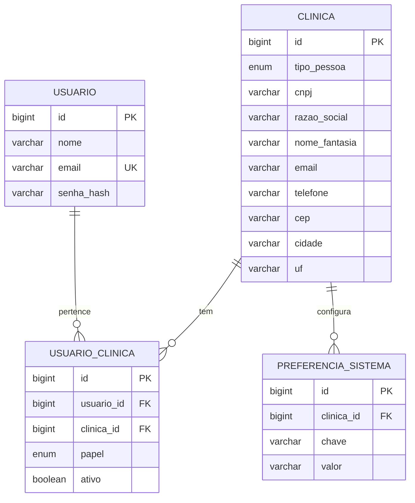
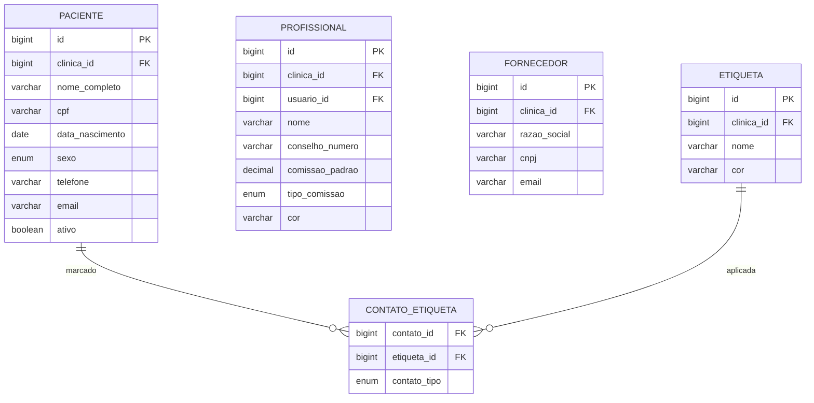
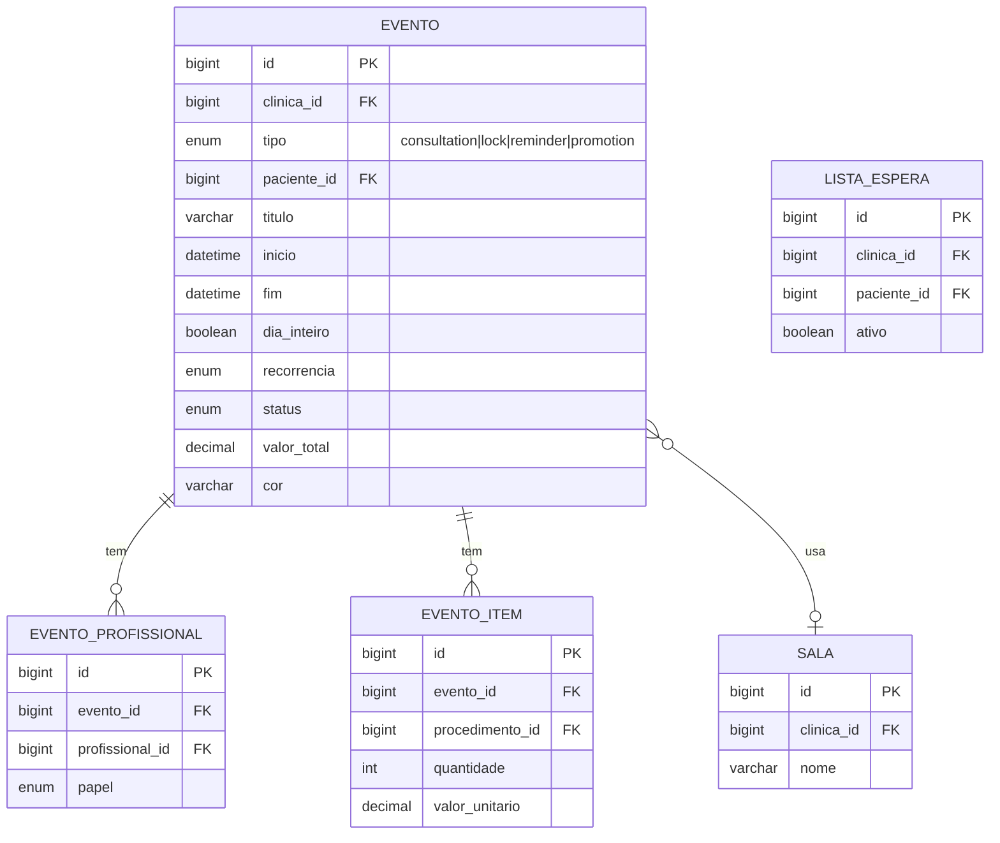
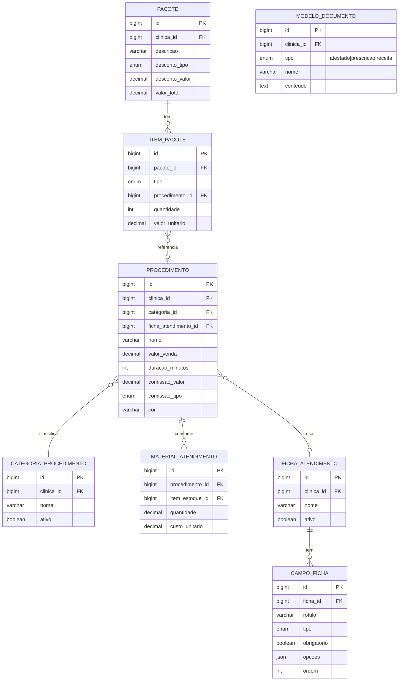
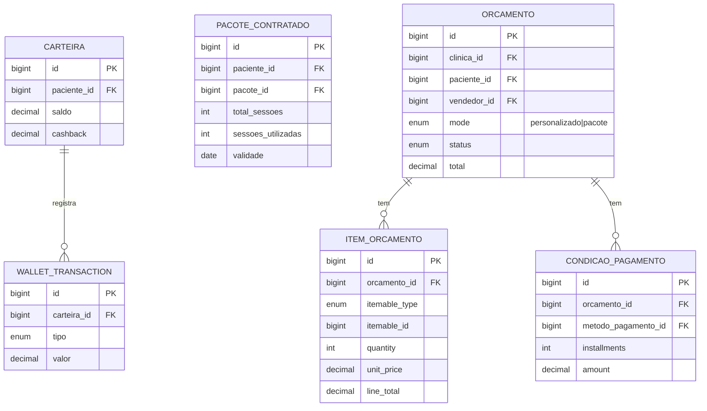
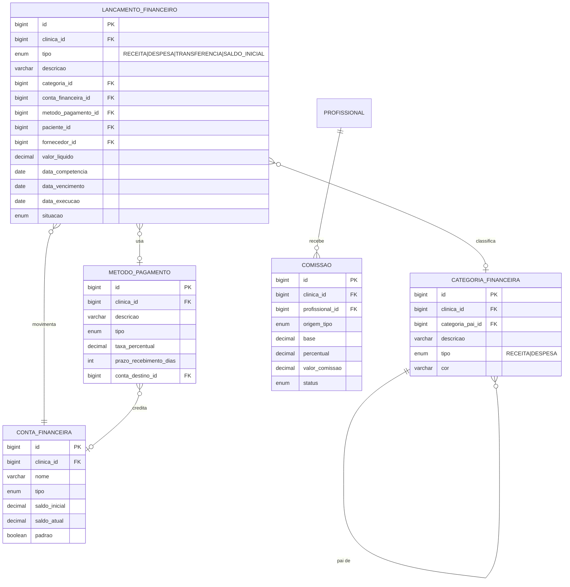
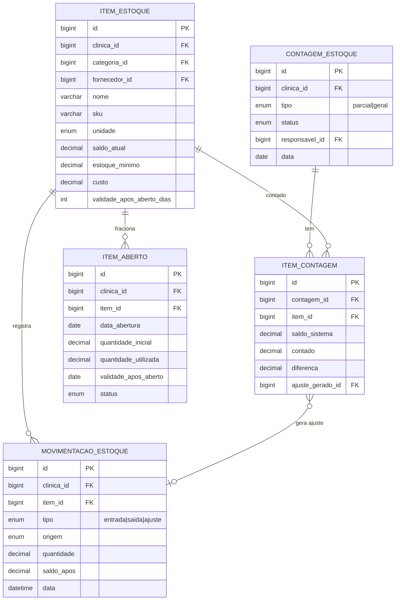
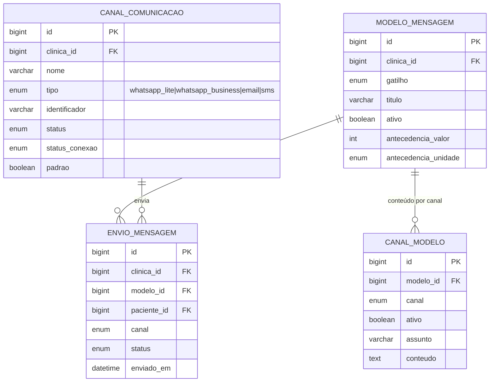

# Clínica Experts — Modelo de Dados (ERD) e Multi-tenancy

Modelo de dados consolidado a partir das 36 specs de página (`docs/paginas/`). Cobre ~40 tabelas em 8 módulos. Tudo **inferido** das telas — validar contra o sistema real antes de migrar para produção.

- **SGBD-alvo sugerido:** PostgreSQL 15+
- **DDL completo:** [`schema.sql`](schema.sql)
- **Convenções:** `snake_case`, PK `id bigint` (identity), timestamps `created_at`/`updated_at`, soft-delete `deleted_at` onde aplicável, dinheiro `numeric(12,2)`.

---

## 1. Estratégia multi-tenant

**Decisão: banco único, schema único, isolamento por coluna `clinica_id` (tenant discriminator) + Row-Level Security (RLS) do Postgres.**

A entidade `clinica` é a **raiz do tenant**: o `id` dela é o `tenant_id`. Toda tabela de negócio carrega `clinica_id NOT NULL` referenciando `clinica(id)`.

### Por que esse modelo (shared DB / shared schema)
| Estratégia | Isolamento | Custo operacional | Escala de tenants | Veredito |
|-----------|-----------|-------------------|-------------------|----------|
| Banco por tenant | Máximo | Alto (N bancos, N migrations) | Dezenas | Exagero p/ SaaS de clínicas |
| Schema por tenant | Alto | Médio (N schemas) | Centenas | Possível, mas migrations custosas |
| **Coluna `clinica_id` + RLS** | Bom (forçado no banco) | Baixo (1 schema, 1 migration) | Milhares | ✅ **Escolhido** |

### Regras de implementação
1. **Toda tabela de negócio tem `clinica_id bigint NOT NULL REFERENCES clinica(id)`.** Exceções: `clinica`, `usuario` (global), e catálogos estáticos (`variavel_documento`, `variavel_mensagem`).
2. **RLS habilitado** em todas as tabelas com `clinica_id`. A aplicação seta o tenant por conexão/transação:
   ```sql
   SET app.current_tenant = '42';
   ```
   E a policy filtra automaticamente:
   ```sql
   CREATE POLICY tenant_isolation ON paciente
     USING (clinica_id = current_setting('app.current_tenant')::bigint);
   ```
   Nenhuma query da aplicação precisa lembrar do `WHERE clinica_id = ?` — o banco força.
3. **Unicidade sempre escopada ao tenant.** Ex.: CPF é único *dentro da clínica*, não global:
   ```sql
   UNIQUE (clinica_id, cpf)
   ```
4. **Índice em `clinica_id`** (e índices compostos `(clinica_id, <coluna de filtro>)`) em toda tabela — é o filtro mais quente do sistema.
5. **FK sempre dentro do mesmo tenant.** Garantir por aplicação/trigger que `filho.clinica_id = pai.clinica_id` (RLS já barra leitura cruzada, mas escrita precisa de checagem).
6. **Usuários multi-clínica:** `usuario` é global; o vínculo (e o papel) com cada clínica vive em `usuario_clinica` (N:N). O login resolve quais tenants o usuário acessa; ao entrar numa clínica, seta `app.current_tenant`.

### Camada de aplicação
- Middleware resolve o tenant (subdomínio, claim do JWT, ou clínica selecionada) → abre transação → `SET app.current_tenant`.
- Pool de conexões: setar o tenant no início de cada request/transação e resetar ao devolver a conexão.
- Migrations: uma só, para todos os tenants.

---

## 2. Diagrama de alto nível (todos os módulos)

```mermaid
erDiagram
    CLINICA ||--o{ USUARIO_CLINICA : "tem membros"
    USUARIO ||--o{ USUARIO_CLINICA : "acessa"

    CLINICA ||--o{ PACIENTE : possui
    CLINICA ||--o{ PROFISSIONAL : possui
    CLINICA ||--o{ FORNECEDOR : possui
    CLINICA ||--o{ EVENTO : possui
    CLINICA ||--o{ PROCEDIMENTO : possui
    CLINICA ||--o{ PACOTE : possui
    CLINICA ||--o{ LANCAMENTO_FINANCEIRO : possui
    CLINICA ||--o{ ITEM_ESTOQUE : possui
    CLINICA ||--o{ MODELO_MENSAGEM : possui
    CLINICA ||--|| PREFERENCIA_SISTEMA : configura

    PACIENTE ||--o{ EVENTO : "agenda"
    PROFISSIONAL ||--o{ EVENTO_PROFISSIONAL : "participa"
    EVENTO ||--o{ EVENTO_PROFISSIONAL : "tem"
    EVENTO ||--o{ EVENTO_ITEM : "tem"
    PROCEDIMENTO ||--o{ EVENTO_ITEM : "usado em"

    PACIENTE ||--|| CARTEIRA : tem
    PACIENTE ||--o{ PACOTE_CONTRATADO : compra
    PACIENTE ||--o{ ORCAMENTO : recebe
    ORCAMENTO ||--o{ ITEM_ORCAMENTO : "tem"
    ORCAMENTO ||--o{ CONDICAO_PAGAMENTO : "tem"

    PACOTE ||--o{ ITEM_PACOTE : "tem"
    PROCEDIMENTO }o--|| CATEGORIA_PROCEDIMENTO : classifica
    PROCEDIMENTO ||--o{ MATERIAL_ATENDIMENTO : consome
    PROCEDIMENTO }o--o| FICHA_ATENDIMENTO : usa
    FICHA_ATENDIMENTO ||--o{ CAMPO_FICHA : "tem"

    LANCAMENTO_FINANCEIRO }o--|| CONTA_FINANCEIRA : movimenta
    LANCAMENTO_FINANCEIRO }o--o| CATEGORIA_FINANCEIRA : classifica
    LANCAMENTO_FINANCEIRO }o--o| METODO_PAGAMENTO : usa
    CATEGORIA_FINANCEIRA ||--o{ CATEGORIA_FINANCEIRA : "pai de"
    PROFISSIONAL ||--o{ COMISSAO : recebe
    METODO_PAGAMENTO ||--o{ CONTA_FINANCEIRA : "credita em"

    ITEM_ESTOQUE ||--o{ MOVIMENTACAO_ESTOQUE : registra
    ITEM_ESTOQUE ||--o{ ITEM_CONTAGEM : "contado em"
    CONTAGEM_ESTOQUE ||--o{ ITEM_CONTAGEM : "tem"
    ITEM_ESTOQUE ||--o{ ITEM_ABERTO : fraciona

    MODELO_MENSAGEM ||--o{ CANAL_MODELO : "conteúdo por canal"
    MODELO_MENSAGEM ||--o{ ENVIO_MENSAGEM : dispara
    CANAL_COMUNICACAO ||--o{ ENVIO_MENSAGEM : "envia por"
```



> Atributos omitidos no alto nível para legibilidade. Diagramas por módulo (com campos) abaixo.

---

## 3. Diagramas por módulo

### 3.1 Núcleo / Tenant


### 3.2 Contatos


### 3.3 Agenda


### 3.4 Catálogo clínico (procedimentos, pacotes, fichas, documentos)


### 3.5 Carteira, créditos e orçamentos (paciente)


### 3.6 Financeiro


> **ContaReceber** e **ContaPagar** **não são tabelas** — são *views/escopos* de `lancamento_financeiro` filtrando `tipo = 'RECEITA'` (com `paciente_id`) e `tipo = 'DESPESA'` (com `fornecedor_id`). Evita duplicar os campos comuns. Ver §6.

### 3.7 Estoque


### 3.8 Comunicação


---

## 4. Catálogo de enums

| Enum | Valores | Usado em |
|------|---------|----------|
| `evento_tipo` | consultation, lock, reminder, promotion | evento |
| `evento_status` | scheduled, confirmed, no_show, completed, canceled | evento |
| `recorrencia` | none, daily, weekly, monthly, yearly, custom | evento |
| `evento_profissional_papel` | profissional, participante | evento_profissional |
| `sexo` | feminino, masculino, outro | paciente |
| `tipo_comissao` | percentual, valor | profissional, procedimento |
| `orcamento_mode` | personalizado, pacote | orcamento |
| `orcamento_status` | rascunho, aberto, aprovado, convertido, cancelado | orcamento |
| `itemable_type` | procedure, product | item_orcamento, item_pacote |
| `wallet_tx_tipo` | credito, debito, cashback | wallet_transaction |
| `lancamento_tipo` | RECEITA, DESPESA, TRANSFERENCIA, SALDO_INICIAL | lancamento_financeiro |
| `lancamento_situacao` | pago, recebido, em_aberto, em_atraso | lancamento_financeiro |
| `conta_financeira_tipo` | caixa, conta_corrente, carteira | conta_financeira |
| `categoria_financeira_tipo` | RECEITA, DESPESA | categoria_financeira |
| `metodo_pagamento_tipo` | dinheiro, pix, cartao_credito, cartao_debito, maquina_cartao, boleto, deposito, transferencia | metodo_pagamento |
| `comissao_origem` | VENDA, PROCEDIMENTO | comissao |
| `comissao_status` | em_aberto, pago, cancelado | comissao |
| `estoque_unidade` | un, ml, g, mg, l, cx | item_estoque |
| `movimentacao_tipo` | entrada, saida, ajuste | movimentacao_estoque |
| `movimentacao_origem` | compra, venda, ajuste, contagem, abertura, transferencia | movimentacao_estoque |
| `contagem_tipo` | parcial, geral | contagem_estoque |
| `contagem_status` | rascunho, em_andamento, finalizada, ajustada | contagem_estoque |
| `item_aberto_status` | aberto, proximo_vencimento, vencido, esgotado | item_aberto |
| `canal_tipo` | whatsapp_lite, whatsapp_business, email, sms | canal_comunicacao, canal_modelo |
| `canal_status_conexao` | connected, disconnected, pending, error | canal_comunicacao |
| `mensagem_gatilho` | aniversario, boas_vindas, agendamento_criado, agendamento_alterado, agendamento_cancelado, agendamento_confirmado, confirmacao_agendamento, lembrete_agendamento, lembrete_retorno, lembrete_fatura, formulario_pre_atendimento | modelo_mensagem |
| `envio_status` | agendado, enviado, entregue, lido, falhou, respondido | envio_mensagem |
| `campo_ficha_tipo` | text, textarea, number, select, radio, checkbox, multiselect, date, boolean, image, file, signature, currency, section | campo_ficha |
| `documento_tipo` | atestado, prescricao, receita | modelo_documento |
| `usuario_clinica_papel` | owner, admin, profissional, recepcao, financeiro | usuario_clinica |

---

## 5. Campos derivados (não persistir — calcular)

| Entidade | Campo | Fórmula |
|----------|-------|---------|
| carteira | total | saldo + cashback |
| pacote_contratado | creditos_restantes | total_sessoes − sessoes_utilizadas |
| orcamento | subtotal / total | Σ item.line_total / subtotal − desconto |
| item_orcamento | line_total | (unit_price − desconto) × quantity |
| pacote | valor_total | subtotal − desconto_global |
| lancamento_financeiro | situacao=em_atraso | pendente E data_vencimento < hoje |
| conta_financeira | saldo_atual | saldo_inicial + Σ movimentações |
| metodo_pagamento | valor_liquido | bruto − (bruto × taxa%/100) |
| comissao | valor_comissao | base × (percentual/100) |
| item_estoque | valor (valorização) | saldo_atual × custo |
| item_contagem | diferenca | contado − saldo_sistema |
| item_aberto | quantidade_restante | inicial − Σ utilizada |

## 6. Views / agregações (relatórios — não viram tabela)

- **vw_contas_a_receber** = `lancamento_financeiro WHERE tipo='RECEITA'`
- **vw_contas_a_pagar** = `lancamento_financeiro WHERE tipo='DESPESA'`
- **vw_extrato_movimentacao** — lançamentos por período de liquidação + saldo acumulado
- **vw_relatorio_competencia** — agregação por mês de competência (receitas − despesas)
- **vw_fluxo_caixa_diario / mensal** — buckets por dia/mês: saldo inicial, entradas, saídas, resultado, saldo final encadeado
- **vw_relatorio_categorias** — Σ por categoria + % do grupo
- **vw_giro_estoque** — por item/período: saldo inicial, entradas, saídas, saldo final, índice de giro
- **timeline_paciente** — feed cronológico unindo eventos de agenda + financeiro + carteira

## 7. Notas e pontos a validar

1. **Contato unificado:** `paciente`, `profissional`, `fornecedor` compartilham padrão (rotas/UI idênticas). Mantidos como 3 tabelas por clareza; alternativa é tabela `contato` única com discriminador `papel`. Decidir no design.
2. **`lancamento_financeiro` unificado** absorve ContaReceber/ContaPagar — recomendado. As specs 13/14 tratavam como separadas; 15–18 como livro-caixa único.
3. **Divergência de cálculo** no Extrato (spec 15): `total_periodo` do print não bateu com `receitas − despesas`. Confirmar fórmula com backend real.
4. **Grafia de status:** padronizado `canceled` (havia `cancelled` em telas distintas).
5. **`SALDO_INICIAL`** é tipo especial de lançamento (abertura de conta), fora das somas de receita/despesa.
6. Muitos campos vêm de **telas vazias** (estado sem dados) — tipos/larguras são propostas, não confirmadas.
