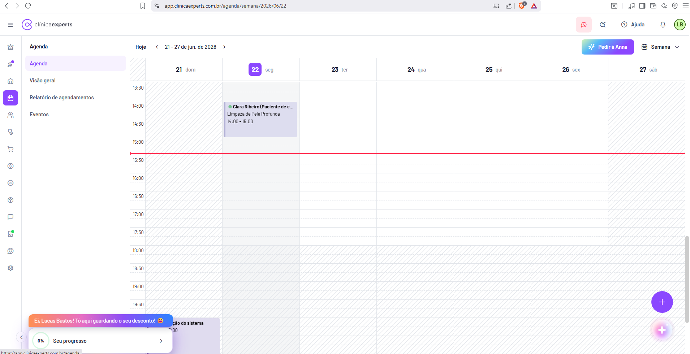

# Agenda / Calendário

> Spec de desenvolvimento — reconstrução completa da página de **Agenda / Calendário (visão semanal)** do SaaS **Clínica Experts** (`app.clinicaexperts.com.br`). Destinada a um desenvolvedor reconstruir a página do zero.

| Metadado | Valor |
|---|---|
| **Tela** | Agenda / Calendário (visão semanal) |
| **Produto** | Clínica Experts — gestão de clínicas (SaaS) |
| **Host** | `app.clinicaexperts.com.br` |
| **Rota visível** | `/agenda/[...]/2026/06/22` (calendário; URL contém a data atual `2026/06/22`) |
| **Rota canônica (inferida)** | `/agenda` → redireciona/expande para `/agenda/calendario/{ano}/{mes}/{dia}` |
| **Módulo** | Agenda |
| **Idioma** | pt-BR |
| **Tipo** | Página autenticada (pós-login) |
| **Referência cruzada** | `docs/01-telas-01-a-10.md` → **Tela 4** |
| **Captura** | `Captura de tela 2026-06-22 152801.png` (22/06/2026) |
| **Data de referência dos dados** | 22/06/2026 (segunda-feira; "agora" ≈ 15:28) |
| **Versão da spec** | 1.0 |



> **Nota sobre a captura:** a imagem foi tirada em ambiente de dois monitores. O segundo monitor (jogo) é **irrelevante** e ignorado nesta spec. Documenta-se **apenas** a aba `app.clinicaexperts.com.br`.

---

## 1. Identificação

- **Nome da página:** Agenda / Calendário (visão semanal).
- **Função no produto:** tela central operacional do dia a dia da clínica — visualização da agenda de **agendamentos** e **eventos** em grade de horários por dia, na semana corrente.
- **Rota observada na barra de endereços:** `app.clinicaexperts.com.br/agenda/.../2026/06/22` (a URL embute a data focada `2026/06/22`).
- **Ícone de menu correspondente:** ícone de **calendário/agenda** na sidebar global (4º item, destacado em roxo quando a Agenda está ativa).
- **Sub-aba ativa:** **"Agenda"** (calendário) dentro do submenu do módulo.
- **Estado dos dados:** conta de onboarding/demonstração — 1 agendamento de exemplo (paciente "Clara Ribeiro", procedimento "Limpeza de Pele Profunda").

---

## 2. Objetivo & contexto

- **Objetivo:** permitir que recepção/profissionais **vejam, criem, movam e gerenciem** agendamentos e eventos numa grade temporal semanal, com leitura imediata da ocupação de cada dia/horário.
- **Contexto de uso:**
  - É a tela "operacional" mais acessada do módulo Agenda (tela do balcão/recepção).
  - Complementa as demais sub-telas do módulo: **Visão geral** (dashboard de KPIs — Tela 5/6), **Relatório de agendamentos** (listagem tabular — Tela 7) e **Eventos / Sala de espera** (Tela 8).
  - O calendário lê eventos por **intervalo de datas** (a semana exibida) e renderiza cada item como um **card posicionado** pelo horário de início/fim.
- **Persona:** recepcionista, secretária ou o próprio profissional (no exemplo, "Lucas Bastos" — usuário "LB").
- **Resultado esperado:** o usuário enxerga a semana inteira de relance, identifica vagas livres e cria/edita agendamentos com poucos cliques.

---

## 3. Navegação

### 3.1. Header global (barra superior) — comum a todas as telas
Da esquerda para a direita:
1. Ícone **hambúrguer** (☰) — colapsa/expande a sidebar global.
2. **Logo "clínicaexperts"** (símbolo roxo + wordmark: "clínica" normal, "experts" em negrito).
3. (espaço central)
4. Botão circular **WhatsApp** (verde) — atalho de integração/atendimento.
5. Ícone de **busca/lupa** — busca global.
6. Item **"Ajuda"** com ícone de interrogação (ⓘ/?).
7. Ícone de **sino** — notificações.
8. **Avatar do usuário** com iniciais **"LB"** (Lucas Bastos) — menu de conta.

### 3.2. Sidebar global (coluna estreita de ícones à esquerda) — comum
Empilhamento vertical (somente ícones, com tooltip). Item da Agenda **destacado em roxo** nesta página. Ordem (de `docs/01-telas-01-a-10.md`):
1. Coroa/estrela (planos/novidades) · 2. Foguete/atalhos (com badge) · 3. Casa — Início (`/clinica/inicio`) · **4. Calendário — Agenda (ativo)** · 5. Pessoas — Pacientes · 6. Estetoscópio — Profissionais · 7. Carrinho — Vendas/PDV · 8. Cifrão — Financeiro · 9. Selo/% — Marketing · 10. Caixa — Estoque · 11. Balão — Mensagens/CRM · 12. Badge verde — Integrações · 13. Escudo/alvo — Segurança/Config. · 14. Engrenagem — Configurações (rodapé).

### 3.3. Submenu do módulo Agenda (2ª coluna, à esquerda da grade)
Lista de navegação interna do módulo, em texto. Item ativo destacado (fundo lilás/realce roxo):

| Item | Estado | Rota inferida |
|---|---|---|
| **"Agenda"** | **Ativo** (esta tela) | `/agenda/.../{ano}/{mes}/{dia}` (calendário) |
| **"Visão geral"** | inativo | `/calendar/dashboard?interval=...&interval=...` |
| **"Relatório de agendamentos"** | inativo | `/calendar/listagem?interval=...&interval=...` |
| **"Eventos"** | inativo | `/eventos?period=...&period=...` |

> Texto exato dos itens: **`Agenda`**, **`Visão geral`**, **`Relatório de agendamentos`**, **`Eventos`**.

---

## 4. Layout

Estrutura de 4 faixas/colunas:

```
┌──────────────────────────────────────────────────────────────────────┐
│ HEADER GLOBAL (logo • WhatsApp • busca • Ajuda • sino • avatar LB)     │
├───┬──────────────────┬─────────────────────────────────────────────────┤
│ S │  SUBMENU AGENDA  │  BARRA DE CONTROLES (Hoje  < >  intervalo  ...)  │
│ I │  • Agenda        ├─────────────────────────────────────────────────┤
│ D │  • Visão geral   │  CABEÇALHO DE DIAS:  21 | 22 | 23 | 24 | 25 |…   │
│ E │  • Relatório...  ├──┬──────┬──────┬──────┬──────┬──────┬──────┬─────┤
│ B │  • Eventos       │HH│ seg  │ ter  │ qua  │ qui  │ sex  │ sáb  │ dom │
│ A │                  │08│      │      │      │      │      │      │     │
│ R │                  │09│      │[card]│      │      │      │      │     │
│   │                  │..│      │ ───── linha vermelha "agora" ──────    │
│   │                  │..│      │      │      │      │      │      │     │
└───┴──────────────────┴──┴──────┴──────┴──────┴──────┴──────┴──────┴─────┘
        [banner laranja desconto]   [card 0% progresso]        [FAB +]
```

### 4.1. Header
Conforme §3.1. Altura fixa, fundo branco, sombra inferior leve.

### 4.2. Sidebar de agenda (submenu)
- Coluna vertical à esquerda da grade, fundo branco.
- 4 itens de texto (§3.3), item ativo com realce.
- Largura aprox. 180–220px (inferido).

### 4.3. Barra de controles (topo da área principal)
Da esquerda para a direita:
- Botão **"Hoje"** (volta ao dia atual).
- Setas **`<`** / **`>`** — navegação de período (semana anterior/seguinte).
- **Rótulo do intervalo exibido:** **`21 - 27 de jun. de 2026`**.
- (alinhado à direita) Seletor de visualização: **`Semana`** (dropdown ▾ — opções inferidas: **Dia / Semana / Mês**).
- (extrema direita) Botão de destaque roxo: **`Pedir à Mara`** *(rótulo do assistente de IA; na captura aparece parcialmente legível como "Pedir à libra/Mara" — tratar como CTA do assistente "Mara" para criar/sugerir agendamento)*. **(inferido)**

### 4.4. Grade de calendário
- **Cabeçalho de colunas (dias):** sete colunas, seg→dom, com número do dia: **`21`**, **`22`** (destacado — dia atual), **`23`**, **`24`**, **`25`**, **`26`**, **`27`**. Cada coluna exibe número + abreviação do dia da semana (ex.: seg, ter, qua… **inferido**). O dia **22** tem realce (círculo/badge roxo indicando "hoje").
- **Coluna de horários (gutter à esquerda):** rótulos de hora empilhados verticalmente (ex.: `08:00`, `09:00`, … `22:00` **inferido** pela faixa observada). Cada linha = 1 hora; subdivisões internas (30 min) prováveis.
- **Linhas de horário:** linhas horizontais separando as horas; fundo das células levemente listrado/zebrado.
- **Faixa "agora" (now line):** **linha horizontal vermelha** atravessando a grade na altura do horário atual (≈ 15:28 na captura), indicando o instante presente.
- **Card de agendamento:** bloco roxo posicionado na coluna do dia **22**, na faixa **14:00–15:00** (ver §5.5).

### 4.5. Widgets fixos (canto inferior esquerdo) — comuns
- **Banner laranja/gradiente:** **`Ei, Lucas Bastos! Tô aqui guardando o seu desconto! 🙂`** — CTA de conversão.
- **Card branco "progresso":** indicador circular **`0%`** + label **`Seu progresso`** + seta **`>`** — checklist de onboarding.

### 4.6. Botões flutuantes (canto inferior direito) — comuns
- **FAB roxo `+`** — criar novo agendamento/evento.
- **Botão gradiente com ícone de estrela/sparkle** — assistente/IA (premium).

---

## 5. Componentes

### 5.1. Botão "Hoje"
- **Texto:** `Hoje`.
- **Ação:** redefine o período exibido para a semana que contém a data atual e re-centraliza/scrolla até a "now line".

### 5.2. Setas de navegação `<` / `>`
- **Ação:** decrementa/incrementa o período pela granularidade ativa (semana ← → semana). Atualiza o rótulo de intervalo e recarrega os eventos.

### 5.3. Seletor de período (Dia / Semana / Mês)
- **Texto do valor atual:** `Semana`.
- **Tipo:** dropdown/segmented (▾).
- **Opções (inferidas):** `Dia`, `Semana`, `Mês`.
- **Ação:** troca o layout da grade (1 coluna no Dia; 7 colunas na Semana; grade mensal no Mês) e o intervalo consultado na API.

### 5.4. Botão "Pedir à Mara" / criar (assistente)
- **Texto:** `Pedir à Mara` **(inferido — leitura parcial)**.
- **Estilo:** botão primário roxo, destaque, com ícone (provável sparkle/estrela).
- **Ação inferida:** abre o assistente de IA "Mara" para criar/sugerir agendamentos por linguagem natural.

### 5.5. Card de agendamento na grade
- **Posição:** coluna do dia **22**, faixa de **14:00 às 15:00**.
- **Cor:** faixa/bloco **roxo** (cor primária da marca) com borda lateral mais saturada.
- **Textos exatos exibidos (truncados na UI):**
  - Linha 1 (paciente, truncada): **`Clara Ribeiro (Paciente de e...`** → valor completo: **`Clara Ribeiro (Paciente de exemplo)`**.
  - Linha 2 (procedimento): **`Limpeza de Pele Profunda`**.
  - Linha 3 (horário): **`14:00 - 15:00`**.
- **Altura do card:** proporcional à duração (60 min → 1 célula de hora).
- **Ações:** clique → abre o **painel de detalhes do evento** (drawer — Tela 9); arrastar → reagenda (§13/§14).

### 5.6. FAB "+"
- **Texto:** ícone `+` (sem rótulo).
- **Ação:** abre o modal **"Novo evento"** (Tela 10) para criação de agendamento/evento.

### 5.7. Mapa de cores (inferido a partir das telas de status)
| Status / elemento | Cor |
|---|---|
| Cor primária / marca / item ativo | Roxo |
| Agendado | Roxo |
| Confirmado | Azul |
| Não compareceu | Cinza |
| Concluído | Verde |
| Cancelado | Vermelho |
| Linha "agora" | Vermelho |
| Banner desconto | Laranja/gradiente |

> Observação: o card de exemplo está com status **Concluído** (verde nas demais telas), mas é renderizado em **roxo** na grade — a grade pode colorir por **tipo de evento** (agendamento = roxo) e não por status. **(inferido)**

---

## 6. Tabelas

- **Não há tabela** nesta página. A visualização é uma **grade de calendário** (não tabular).
- A listagem tabular dos mesmos dados existe na sub-aba **"Relatório de agendamentos"** (Tela 7), fora do escopo desta página. Lá as colunas são: Procedimentos, Paciente, Profissional, Duração, Agendado para, Status.

---

## 7. Formulários

- **Nenhum formulário inline** nesta página.
- A criação/edição ocorre via **modal "Novo evento"** (Tela 10), acionado pelo FAB `+` ou por clique em slot vazio. Campos do modal (referência — Tela 10):
  - **Tipo*** (segmented): `Agendamento` · `Bloqueio de horário` · `Lembrete` · `Evento`.
  - **Título do evento*** (texto, placeholder `Digite`).
  - **Data de início*** / **Hora de início*** / **Data de fim*** / **Hora de fim***.
  - **Profissionais** (multi-select, chip `Lucas Bastos ✕`).
  - **Procedimentos** (select de busca, placeholder `Pesquise/Selecione`).
  - Toggle: **`Permitir agendamentos de outros procedimentos nesta data`**.
  - Botão **`Salvar`** (roxo).

---

## 8. Filtros

- **Filtro de período (implícito):** a própria semana navegada via `Hoje` / `<` / `>` / seletor `Semana` define o intervalo consultado. Rótulo: `21 - 27 de jun. de 2026`.
- **Filtro por profissional (inferido):** a grade pode oferecer seleção de profissional/recurso (colunas por profissional ou filtro dropdown) — não visível explicitamente nesta captura, mas presente nas telas de Visão geral/Relatório ("Ociosidade por profissional"). **(inferido)**
- **Sem chips de filtro** visíveis na grade (diferente das telas de dashboard/listagem, que mostram chip `Período: dd/mm/aaaa - dd/mm/aaaa` e `+ Adicionar filtro`).

---

## 9. Estados

- **Estado com dados (capturado):** 1 card de agendamento no dia 22 (14:00–15:00); demais slots vazios.
- **Estado vazio (sem agendamentos) (inferido):** grade exibida normalmente, todas as células livres, sem cards; a "now line" continua visível. Possível CTA/empty hint sugerindo criar o primeiro agendamento. **(inferido)**
- **Estado de carregamento (inferido):** skeleton/placeholder sobre a grade enquanto a API responde o intervalo. **(inferido)**
- **Estado "hoje":** coluna do dia atual (22) destacada no cabeçalho.

---

## 10. Modais

- **Criar evento (slot vazio):** clique em um horário livre abre o modal **"Novo evento"** (referência: **Tela 10**, `docs/01-telas-01-a-10.md`), pré-preenchendo Data/Hora de início e fim com base no slot clicado. **(inferido)**
- **Detalhes do evento (card existente):** clique em um card abre o **drawer lateral "Detalhes do evento"** (referência: **Tela 9**) com informações e ações (Editar, Duplicar, Excluir, Iniciar atendimento, Iniciar comanda, etc.).
- **FAB `+`:** abre o mesmo modal "Novo evento", sem pré-preenchimento de slot.

---

## 11. Modelo de dados

### 11.1. Entidade `Evento` / `Agendamento` (inferido)
Tipo discriminado por `tipo` (segmented control do modal). "Agendamento" é uma especialização que referencia paciente e procedimento.

| Campo | Tipo | Obrigatório | Observações |
|---|---|---|---|
| `id` | UUID/string | sim | identificador do evento |
| `tipo` | enum: `agendamento` \| `bloqueio` \| `lembrete` \| `evento` | sim | discriminador (modal "Tipo*") |
| `titulo` | string | sim p/ evento | "Título do evento*" |
| `dataInicio` | date (ISO `YYYY-MM-DD`) | sim | "Data de início*" |
| `horaInicio` | time (`HH:mm`) | sim | "Hora de início*" |
| `dataFim` | date | sim | "Data de fim*" |
| `horaFim` | time | sim | "Hora de fim*" |
| `inicio` | datetime ISO | sim | combinação data+hora (derivado) |
| `fim` | datetime ISO | sim | combinação data+hora (derivado) |
| `duracaoMin` | int (minutos) | derivado | ex.: `60` (14:00–15:00) |
| `pacienteId` | FK → Paciente | p/ agendamento | ex.: "Clara Ribeiro (Paciente de exemplo)" |
| `profissionalIds` | FK[] → Profissional | sim | multi-select; ex.: "Lucas Bastos" (LB) |
| `procedimentoIds` | FK[] → Procedimento | p/ agendamento | ex.: "Limpeza de Pele Profunda" |
| `valor` | decimal (R$) | opcional | ex.: `200,00` (visto na Tela 9) |
| `status` | enum: `agendado` \| `confirmado` \| `nao_compareceu` \| `concluido` \| `cancelado` | sim | ex.: `concluido` |
| `permitirOutrosProcedimentos` | boolean | opcional | toggle do modal |
| `observacao` | string | opcional | ex.: "Esse agendamento é uma consulta de exemplo." |
| `corHex` / `cor` | string | derivado | cor de render na grade (por tipo/status) |
| `recorrencia` | objeto/null | opcional | regra de recorrência (inferido) |
| `criadoEm` / `atualizadoEm` | datetime | sistema | auditoria |

### 11.2. Relações
- `Agendamento` **N:1** `Paciente` (`pacienteId`).
- `Agendamento` **N:M** `Profissional` (`profissionalIds`) — multi-select no modal.
- `Agendamento` **N:M** `Procedimento` (`procedimentoIds`).
- `Evento` **1:N** ocorrências (se recorrente). **(inferido)**

### 11.3. Enum `StatusAgendamento`
`agendado` (roxo) · `confirmado` (azul) · `nao_compareceu` (cinza) · `concluido` (verde) · `cancelado` (vermelho).

---

## 12. Endpoints API inferidos

> Padrão observado nas demais telas: query string usa `interval=YYYY-MM-DD&interval=YYYY-MM-DD` (dashboard/listagem) e `period=YYYY-MM-DD&period=YYYY-MM-DD` (eventos). Todos **(inferidos)**.

| Ação | Método + rota (inferido) | Parâmetros |
|---|---|---|
| Listar eventos por intervalo (grade) | `GET /api/calendar/events` | `interval=2026-06-21&interval=2026-06-27` (início/fim da semana); opcional `professional_id`, `room_id` |
| Obter detalhe de um evento | `GET /api/calendar/events/{id}` | — |
| Criar evento/agendamento | `POST /api/calendar/events` | body com campos de §11 (`tipo`, `titulo`, `dataInicio`, `horaInicio`, `dataFim`, `horaFim`, `pacienteId`, `profissionalIds`, `procedimentoIds`, ...) |
| Atualizar/editar evento | `PUT`/`PATCH /api/calendar/events/{id}` | campos alterados |
| Mover/redimensionar (drag & drop) | `PATCH /api/calendar/events/{id}` | `{ inicio, fim }` (novo horário/duração) |
| Excluir evento | `DELETE /api/calendar/events/{id}` | — |
| Verificar conflito/disponibilidade | `GET /api/calendar/availability` | `profissionalId`, `inicio`, `fim` |
| Listar profissionais (filtro) | `GET /api/professionals` | — |
| Listar procedimentos (autocomplete) | `GET /api/procedures?q=` | busca |
| Listar pacientes (autocomplete) | `GET /api/patients?q=` | busca |

**Forma da resposta de listagem (inferida):**
```json
[
  {
    "id": "evt_123",
    "tipo": "agendamento",
    "titulo": "Limpeza de Pele Profunda",
    "inicio": "2026-06-22T14:00:00-03:00",
    "fim": "2026-06-22T15:00:00-03:00",
    "duracaoMin": 60,
    "status": "concluido",
    "paciente": { "id": "pac_1", "nome": "Clara Ribeiro (Paciente de exemplo)" },
    "profissionais": [{ "id": "prof_1", "nome": "Lucas Bastos", "iniciais": "LB" }],
    "procedimentos": [{ "id": "proc_1", "nome": "Limpeza de Pele Profunda" }],
    "valor": 200.00,
    "cor": "#7C3AED"
  }
]
```

---

## 13. Regras de negócio

- **Sobreposição (overlap):**
  - Eventos no mesmo dia/horário e mesmo profissional **conflitam**; a grade deve renderizá-los lado a lado (colunas internas) e/ou alertar conflito. **(inferido)**
  - O toggle **"Permitir agendamentos de outros procedimentos nesta data"** (modal) controla se o intervalo bloqueia ou não a marcação de outros procedimentos no mesmo período.
- **Duração:** definida por `horaInicio`/`horaFim`; a altura do card é proporcional (60 min = 1 célula de hora). Duração mínima sugerida = granularidade da grade (ex.: 15/30 min). **(inferido)**
- **Recorrência:** suportada para eventos (campo `recorrencia`); ocorrências geradas e exibidas individualmente na grade. **(inferido)**
- **Bloqueio de horário:** tipo `bloqueio` ocupa o slot sem paciente/procedimento, impedindo novas marcações naquele intervalo para o(s) profissional(is).
- **Now line:** renderizada apenas no dia atual, atualizada periodicamente (timer no cliente).
- **Fuso horário:** America/Sao_Paulo (-03:00); horários exibidos no fuso local da clínica.

---

## 14. Fluxos

1. **Visualizar a semana:** ao entrar em `/agenda`, carrega a semana corrente (rótulo `21 - 27 de jun. de 2026`), renderiza cards via `GET /events?interval=...&interval=...` e desenha a now line.
2. **Navegar período:** `<`/`>` muda a semana; `Hoje` retorna à atual; seletor `Semana`→`Dia`/`Mês` troca o layout e o intervalo consultado.
3. **Criar via clique em slot vazio:** clique em célula livre → modal "Novo evento" com data/hora pré-preenchidas pelo slot → preencher → `Salvar` (`POST`) → card aparece na grade.
4. **Criar via FAB `+`:** abre o modal sem pré-preenchimento de slot.
5. **Criar via assistente "Pedir à Mara":** abre o assistente de IA para criar agendamento por linguagem natural. **(inferido)**
6. **Abrir detalhes:** clique em um card → drawer "Detalhes do evento" (Tela 9) com ações (Editar, Duplicar, Excluir, Iniciar atendimento, Iniciar comanda).
7. **Arrastar (drag & drop):** arrastar um card para outro horário/dia → `PATCH {inicio, fim}` → re-render na nova posição; redimensionar a borda inferior altera a duração (`fim`). **(inferido)**
8. **Conflito:** ao criar/mover sobre horário ocupado do mesmo profissional, exibir aviso de sobreposição (respeitando o toggle de "permitir outros procedimentos"). **(inferido)**

---

## 15. Notas de implementação

- **Biblioteca de calendário:** usar uma lib de calendário com visão de grade temporal e drag & drop — ex.: **FullCalendar** (`timeGridWeek`/`timeGridDay`/`dayGridMonth`), **react-big-calendar** ou **Schedule-X/Toast UI Calendar**. O comportamento observado (colunas de dias, linhas de horário, now line, cards posicionados) é nativo do `timeGrid` do FullCalendar. **(inferido)**
- **Mapeamento de views:** `Dia` → `timeGridDay`; `Semana` → `timeGridWeek`; `Mês` → `dayGridMonth`.
- **Now indicator:** ativar `nowIndicator: true` (FullCalendar) — corresponde à linha vermelha.
- **Drag & drop / resize:** `editable: true`, `eventDrop`/`eventResize` → disparam `PATCH` de `{inicio, fim}`; aplicar **optimistic update** com rollback em erro.
- **Slot vazio:** `dateClick`/`select` → abre modal "Novo evento" com `start`/`end` pré-preenchidos.
- **Carregamento por intervalo:** usar `datesSet`/`eventSources` para refetch ao mudar de semana (`interval=...&interval=...`).
- **Coloração:** definir `eventClassNames`/`backgroundColor` por `tipo` (e opcionalmente por `status`), seguindo a paleta do §5.7 (agendamento = roxo).
- **Truncamento:** títulos longos no card são truncados com `...` (CSS `text-overflow: ellipsis`) — ex.: `Clara Ribeiro (Paciente de e...`. Tooltip com texto completo no hover.
- **Localização:** locale `pt-br` (FullCalendar) para abreviações de dia/mês e formato de data `dd 'de' MMM. 'de' yyyy`.
- **Fuso:** configurar `timeZone: 'America/Sao_Paulo'`.
- **Responsividade:** em telas estreitas, considerar fallback para `timeGridDay`.
- **Persistência de view/data na URL:** a rota embute a data (`.../2026/06/22`) — manter view + data atual sincronizadas na URL para deep-link e refresh.

---

### Referências cruzadas
- `docs/01-telas-01-a-10.md` — **Tela 4** (esta página), **Tela 9** (drawer "Detalhes do evento"), **Tela 10** (modal "Novo evento"), **Tela 5/6** (Visão geral), **Tela 7** (Relatório de agendamentos), **Tela 8** (Eventos).
