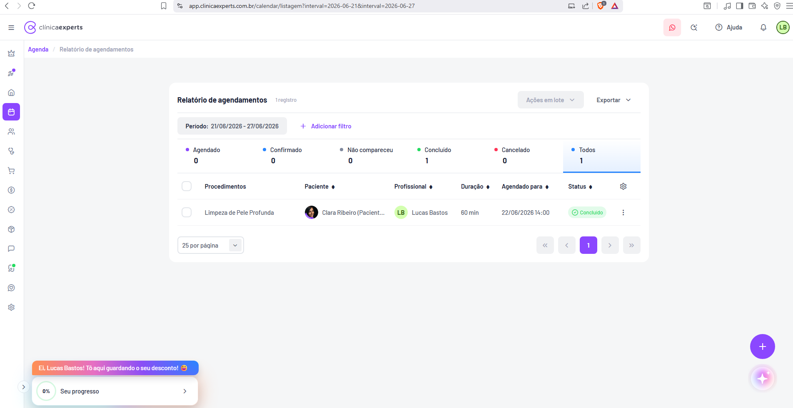

# Agenda / Relatório de Agendamentos

| Metadado | Valor |
|---|---|
| **Produto** | Clínica Experts (`app.clinicaexperts.com.br`) |
| **Módulo** | Agenda |
| **Página** | Relatório de agendamentos (listagem/tabela) |
| **Rota** | `/calendar/listagem?interval=2026-06-21&interval=2026-06-27` |
| **Breadcrumb** | Agenda / Relatório de agendamentos |
| **Tipo de tela** | Listagem tabular com filtros, abas de status e paginação |
| **Idioma** | pt-BR |
| **Referência cruzada** | `docs/01-telas-01-a-10.md` — Tela 7 |
| **Captura** | `../../images/Captura de tela 2026-06-22 152832.png` |
| **Data da captura** | 22/06/2026 |



---

## 1. Identificação

- **Nome exibido (título do card):** `Relatório de agendamentos`
- **Nome no breadcrumb:** `Agenda` / `Relatório de agendamentos` (segmento "Agenda" em roxo/clicável; "Relatório de agendamentos" em cinza/atual).
- **Rota visível na barra de endereços:** `app.clinicaexperts.com.br/calendar/listagem?interval=2026-06-21&interval=2026-06-27`
- **Query string:** o parâmetro `interval` aparece **duas vezes** (`interval=2026-06-21` e `interval=2026-06-27`), representando, respectivamente, a **data inicial** e a **data final** do período exibido (intervalo de datas em formato ISO `YYYY-MM-DD`). *(inferido: array de 2 datas que delimita o período do relatório)*.
- **Módulo na sidebar:** ícone de calendário/agenda (4º item da sidebar) destacado em roxo.
- **Submenu interno da Agenda (ver Tela 4):** `Agenda` · `Visão geral` · `Relatório de agendamentos` (item correspondente a esta página) · `Eventos`.

---

## 2. Objetivo

Apresentar uma **listagem tabular de todos os agendamentos** dentro de um período de datas selecionado, permitindo:

- Filtrar por **status** (via abas-resumo com contagem) e por **filtros adicionais** (período, profissional, tipo etc.).
- Visualizar, por linha, o procedimento, paciente, profissional, duração, data/hora agendada e status.
- Executar **ações em lote** sobre múltiplos agendamentos selecionados.
- **Exportar** os dados da listagem.
- Acessar o **detalhe do evento** (drawer lateral, Tela 9) e as ações por linha (menu ⋮).

É a visão "operacional/relatório" complementar ao **dashboard analítico** da Agenda (`/calendar/dashboard`, Telas 5–6), compartilhando o mesmo período e os mesmos status.

---

## 3. Navegação

- **Como chegar:** sidebar → ícone Agenda → submenu **"Relatório de agendamentos"**; ou navegação direta pela rota `/calendar/listagem`.
- **Breadcrumb clicável:** `Agenda` retorna à visão principal do módulo Agenda (calendário).
- **Saídas a partir desta tela:**
  - Clicar numa **linha** ou no menu **⋮** → abre **"Detalhes do evento"** (drawer lateral à direita — Tela 9), com a URL recebendo parâmetros `&event_modal_type=consultation&event_modal_mode=...`.
  - Botão **"+"** (FAB roxo, canto inferior direito) → criação de novo agendamento/evento (modal "Novo evento" — Tela 10).
  - Abas de status → recarregam a tabela filtrada pelo status escolhido (mesma rota, sem sair da página).
- **Elementos globais persistentes:** header (logo, WhatsApp, busca, Ajuda, sino, avatar "LB"), sidebar de ícones, FAB "+", FAB sparkle/IA, banner de desconto e card "Seu progresso" (canto inferior esquerdo). Ver seção "Elementos globais" em `docs/01-telas-01-a-10.md`.

---

## 4. Layout

Estrutura de cima para baixo, dentro de um **card branco central** (com cantos arredondados e sombra leve), sobre fundo cinza-claro da aplicação:

1. **Linha de cabeçalho do card:**
   - Esquerda: título **"Relatório de agendamentos"** + contador **"1 registro"** (texto cinza menor ao lado).
   - Direita: botão **"Ações em lote ▾"** (desabilitado/cinza) + botão **"Exportar ▾"**.
2. **Barra de filtros:**
   - Chip **"Período: 21/06/2026 - 27/06/2026"**.
   - Ação **"+ Adicionar filtro"** (texto roxo com ícone "+").
3. **Faixa de abas de status** (resumo numérico): `Agendado` · `Confirmado` · `Não compareceu` · `Concluído` · `Cancelado` · `Todos`. Cada aba tem **bolinha colorida + label** na linha de cima e **número (contagem)** grande na linha de baixo. A aba ativa (**"Todos"**) tem barra/sublinhado inferior em destaque (azul/roxo).
4. **Tabela** (cabeçalho + linhas), com coluna de checkbox à esquerda e ícone de **engrenagem** (configurar colunas) à direita do cabeçalho.
5. **Rodapé/paginação:** seletor **"25 por página ▾"** à esquerda; controles **« ‹ 1 › »** à direita.

> Largura: o card ocupa a área central, com margens laterais amplas (não é full-width).

---

## 5. Componentes

### 5.1 Botão "Ações em lote" ▾
- Texto: **`Ações em lote`** com chevron ▾.
- Estado na captura: **desabilitado** (cinza), pois nenhuma linha está selecionada.
- *(inferido)* Habilita ao marcar 1+ checkboxes. Abre dropdown com ações em lote sobre os selecionados (ex.: alterar status, confirmar, cancelar, excluir).

### 5.2 Botão "Exportar" ▾
- Texto: **`Exportar`** com chevron ▾.
- Sempre habilitado.
- *(inferido)* Dropdown com formatos de exportação (CSV / Excel / PDF), respeitando filtros e período aplicados.

### 5.3 Contador de registros
- Texto exato: **`1 registro`** (ao lado do título). *(inferido: pluraliza para "N registros")*.

### 5.4 Chip de período
- Texto exato: **`Período: 21/06/2026 - 27/06/2026`** (formato de data `DD/MM/AAAA`, separador " - ").
- Reflete o `interval` da URL (`2026-06-21` → `2026-06-27`).

### 5.5 "Adicionar filtro"
- Texto exato: **`Adicionar filtro`** precedido de ícone **"+"** (roxo). Abre seletor de filtros adicionais (ver seção 8).

### 5.6 Abas de status (badges-resumo) — cores e textos exatos

| Aba (label exato) | Cor da bolinha | Contagem na captura |
|---|---|---|
| `Agendado` | roxo | `0` |
| `Confirmado` | azul | `0` |
| `Não compareceu` | cinza | `0` |
| `Concluído` | verde | `1` |
| `Cancelado` | vermelho | `0` |
| `Todos` | azul/roxo (ponto + ativa) | `1` |

- A aba **`Todos`** é a **ativa** na captura (sublinhado/realce inferior). Clicar em outra aba filtra a tabela por aquele status.
- A soma das contagens dos 5 status = contagem de **"Todos"**.

### 5.7 Badge de status na tabela (por linha) — cores e textos exatos
Badge em formato de "pílula" arredondada, com **ícone à esquerda + texto**. Mapeamento de cores (texto/ícone exatos confirmados onde visível, demais inferidos a partir das bolinhas das abas):

| Status (texto exato) | Cor de fundo / texto | Ícone | Observação |
|---|---|---|---|
| `Agendado` | roxo (fundo lilás claro / texto roxo) *(inferido)* | — *(inferido)* | |
| `Confirmado` | azul *(inferido)* | check/ok *(inferido)* | |
| `Não compareceu` | cinza *(inferido)* | — *(inferido)* | |
| `Concluído` | **verde** (fundo verde-claro, texto verde) — **confirmado na captura** | **ícone de check em círculo** | Badge visível: `Concluído` |
| `Cancelado` | vermelho *(inferido)* | x/cancelar *(inferido)* | |

> Na captura há **um único badge visível**: **`Concluído`** (verde, com ícone de check circular).

### 5.8 FAB "+"
- Botão circular roxo, canto inferior direito → criar novo agendamento/evento.

### 5.9 FAB sparkle/IA
- Botão circular com gradiente e ícone de estrela/sparkle (assistente/IA), abaixo do FAB "+".

---

## 6. Tabela

### 6.1 Colunas (ordem da esquerda para a direita)

| # | Cabeçalho (texto exato) | Tipo | Formato / Conteúdo | Ordenável |
|---|---|---|---|---|
| 0 | *(checkbox)* | Seleção | Checkbox no cabeçalho (selecionar todos) e por linha | Não |
| 1 | `Procedimentos` | Texto | Nome do(s) procedimento(s). Ex.: `Limpeza de Pele Profunda` | Sim (ícone ◆) |
| 2 | `Paciente` | Texto + avatar | Avatar (foto/iniciais) + nome do paciente, truncado. Ex.: `Clara Ribeiro (Pacient...` (texto completo: "Clara Ribeiro (Paciente de exemplo)") | Sim (◆) |
| 3 | `Profissional` | Texto + avatar | Avatar com iniciais ("LB") + nome. Ex.: `Lucas Bastos` | Sim (◆) |
| 4 | `Duração` | Número + unidade | Duração em minutos. Ex.: `60 min` | Sim (◆) |
| 5 | `Agendado para` | Data/hora | `DD/MM/AAAA HH:mm`. Ex.: `22/06/2026 14:00` | Sim (◆) |
| 6 | `Status` | Badge | Pílula colorida com ícone + texto. Ex.: `Concluído` (verde) | Sim (◆) |
| 7 | *(engrenagem)* | Ação de coluna | Ícone ⚙ no canto direito do cabeçalho — **configurar/personalizar colunas** *(inferido: mostrar/ocultar/reordenar)* | Não |
| 8 | *(ações)* | Menu | Ícone **⋮** (três pontos verticais) ao final de cada linha — menu de ações da linha | Não |

### 6.2 Linha de exemplo (dados da captura)

| Campo | Valor exato |
|---|---|
| Procedimentos | `Limpeza de Pele Profunda` |
| Paciente | (avatar) `Clara Ribeiro (Pacient...` |
| Profissional | (avatar "LB") `Lucas Bastos` |
| Duração | `60 min` |
| Agendado para | `22/06/2026 14:00` |
| Status | badge verde `Concluído` (ícone check) |
| Ações | ícone `⋮` |

### 6.3 Ações por linha (menu ⋮)
- *(inferido, com base na Tela 9 — Detalhes do evento)*: `Editar`, `Duplicar`, `Excluir`, além de abrir **Detalhes do evento** e ações de fluxo (`Iniciar atendimento`, `Iniciar comanda`).
- Clicar na própria linha *(inferido)* também abre o drawer **"Detalhes do evento"**.

### 6.4 Ordenação
- Todas as colunas de dados (1–6) têm ícone de seta/diamante **◆** ao lado do cabeçalho, indicando **ordenação clicável** (ascendente/descendente alternado ao clicar). *(inferido: alterna asc/desc; um critério por vez)*.

### 6.5 Paginação
- Seletor de tamanho de página: **`25 por página ▾`** (dropdown; opções típicas inferidas: 10/25/50/100).
- Controles: **`«`** (primeira página), **`‹`** (anterior), **`1`** (página atual, destacada em roxo), **`›`** (próxima), **`»`** (última).
- Na captura: 1 registro → 1 página.

### 6.6 Seleção
- Checkbox no **cabeçalho** (selecionar/desmarcar todos da página) e em **cada linha**.
- Selecionar 1+ linhas → habilita o botão **"Ações em lote"**.

### 6.7 Rodapé / totais
- **Não há linha de totais/somatório** na tabela. O "total" é representado pelo contador **"1 registro"** no cabeçalho e pelas **contagens por status** nas abas-resumo (seção 5.6).

---

## 7. Formulários

Esta página **não contém formulários de entrada** próprios. As interações de formulário ocorrem em telas/contextos relacionados:

- **Filtros adicionais** (popover ao clicar em "+ Adicionar filtro") — seleção de período, status, profissional, tipo etc. (ver seção 8).
- **Configurar colunas** (engrenagem ⚙) — *(inferido)* checkboxes de colunas visíveis.
- **Novo evento** (FAB "+") — modal de criação com formulário completo (documentado na Tela 10).
- **Editar** (via ⋮ / drawer) — reabre o formulário do evento.

---

## 8. Filtros

### 8.1 Filtros visíveis na captura
- **Período** (sempre presente): chip **`Período: 21/06/2026 - 27/06/2026`**, vinculado ao `interval` da URL. Provável seletor de intervalo de datas ao clicar (date range picker). *(inferido: chip removível com "X" — como na Tela 8 — embora não visível "X" nesta captura)*.

### 8.2 Filtros de status (abas)
- Funcionam como filtro rápido por status: `Agendado` / `Confirmado` / `Não compareceu` / `Concluído` / `Cancelado` / `Todos` (ver 5.6).

### 8.3 Filtros adicionais — "Adicionar filtro" *(inferido)*
Ao clicar em **"+ Adicionar filtro"**, abre seletor com campos como:
- **Profissional** — multi-select de profissionais (ex.: "Lucas Bastos").
- **Tipo** — tipo de evento/agendamento (ex.: Agendamento, Bloqueio de horário, Lembrete, Evento — conforme Tela 10).
- **Procedimento** — filtro por procedimento.
- **Paciente** — filtro por paciente.
- **Status** — equivalente às abas (multi-seleção).
- **Sala** — *(inferido, dado "Ociosidade por sala" no dashboard)*.

> Cada filtro aplicado vira um **chip** na barra de filtros (padrão visto nas Telas 5 e 8, com indicador "N filtro(s) aplicado(s)" e link "Limpar filtros").

---

## 9. Estados

### 9.1 Estado com dados (captura atual)
- 1 linha, contador **"1 registro"**, aba "Todos" = 1.

### 9.2 Estado vazio *(inferido, com base na Tela 8 — mesma família de listagens)*
- Ícone de **lupa** roxo.
- Mensagem em destaque (texto exato, conforme Tela 8): **`Oops, nada foi encontrado!`**
- Subtexto: **`Os filtros selecionados não correspondem a nenhum registro.`**
- Botões: **`Limpar filtros`** (secundário lilás) e ação primária de criação *(na listagem de eventos era "+ Novo evento")*.

> Observação: o texto exato do estado vazio **desta** página específica não aparece na captura; o padrão acima é **inferido** do componente equivalente da Tela 8.

### 9.3 Estado de carregamento *(inferido)*
- Skeleton/spinner na área da tabela durante a busca.

### 9.4 Botão "Ações em lote" desabilitado
- Enquanto nenhuma linha está selecionada, o botão fica cinza/desabilitado (estado visível na captura).

---

## 10. Modais

### 10.1 Drawer "Detalhes do evento" (Tela 9)
Aberto a partir desta listagem (linha/⋮). Painel lateral deslizante à direita (~30% de largura), com fundo escurecido sobre a tabela. URL recebe `&event_modal_type=consultation&event_modal_mode=...`.

- **Cabeçalho:** título **`Detalhes do evento`** + botão **`X`** (fechar).
- **Corpo (linhas ícone + texto):**
  - Tipo + data/hora: **`Agendamento`** — **`Seg, 22 de jun de 2026 • 14:00 - 15:00`**.
  - Profissional: avatar "LB" + **`Lucas Bastos`**.
  - Paciente: avatar + **`Clara Ribeiro (Paciente de exemplo)`** + ícone WhatsApp.
  - Status: ícone verde + **`Concluído`**.
  - Procedimento/valor: **`1x Limpeza de Pele Profunda`** — **`R$ 200,00`**.
  - Recebimento: cifrão + **`Sem previsão de recebimento`**.
  - Observação: balão + **`Esse agendamento é uma consulta de exemplo.`**
- **Ações (texto + ícone):** **`Editar`** · **`Duplicar`** · **`Excluir`**.
- **Botões largura total:** **`Editar consumo de material`** (lilás) · **`Enviar formulário de pré atendimento`** (azul).
- **Rodapé:** **`Iniciar atendimento`** (roxo) · **`Iniciar comanda`** (roxo).

### 10.2 Dropdowns
- **"Exportar ▾"** e **"Ações em lote ▾"** abrem menus suspensos (não modais).

---

## 11. Modelo de dados inferido

### 11.1 Entidade `Agendamento` (Appointment) *(inferido)*

| Campo | Tipo | Origem / formato | Observação |
|---|---|---|---|
| `id` | string/uuid | — | identificador do agendamento |
| `procedimentos` | array<{ id, nome, quantidade, valor }> | exibe nome; valor visto no drawer (`R$ 200,00`) | coluna "Procedimentos" |
| `paciente` | { id, nome, avatarUrl, telefone } | `Clara Ribeiro (Paciente de exemplo)` | nome truncado na tabela; WhatsApp no drawer |
| `profissional` | { id, nome, iniciais/avatar } | `Lucas Bastos` ("LB") | coluna "Profissional" |
| `duracaoMinutos` | number (min) | `60 min` | coluna "Duração" |
| `agendadoPara` / `inicio` | datetime ISO | exibido `22/06/2026 14:00` | coluna "Agendado para" |
| `fim` | datetime ISO | drawer: `14:00 - 15:00` | derivado de início + duração |
| `status` | enum | ver 11.2 | coluna/badge "Status" |
| `tipo` | enum | `consultation` (na URL `event_modal_type=consultation`); UI: Agendamento / Bloqueio de horário / Lembrete / Evento | ver Tela 10 |
| `valorTotal` | decimal (BRL) | `R$ 200,00` | drawer |
| `previsaoRecebimento` | date \| null | `Sem previsão de recebimento` | drawer |
| `observacao` | string | `Esse agendamento é uma consulta de exemplo.` | drawer |
| `sala` | { id, nome } \| null | — | inferido (dashboard "Ociosidade por sala") |

### 11.2 Enum `status` (valores e cor associada)

| Valor (texto exato UI) | Slug inferido | Cor |
|---|---|---|
| `Agendado` | `scheduled` | roxo |
| `Confirmado` | `confirmed` | azul |
| `Não compareceu` | `no_show` | cinza |
| `Concluído` | `completed` | verde |
| `Cancelado` | `canceled` | vermelho |

> `Todos` é um filtro agregador, não um valor de status.

---

## 12. Endpoints API inferidos

> Todos **(inferido)** — baseados na rota `/calendar/listagem` e nos parâmetros de URL.

### 12.1 Listar agendamentos (relatório)
```
GET /api/calendar/listagem        (ou /api/appointments)
Query params:
  interval[]=2026-06-21          # data inicial (ISO)
  interval[]=2026-06-27          # data final (ISO)
  status=completed               # opcional (aba selecionada); ausência = "Todos"
  professional_id=<id>           # opcional (filtro)
  type=consultation              # opcional (filtro)
  procedure_id=<id>              # opcional
  patient_id=<id>                # opcional
  page=1
  per_page=25
  sort=agendado_para             # coluna de ordenação
  order=asc|desc
Resposta (inferida):
  {
    "data": [ { ...Agendamento } ],
    "meta": {
      "total": 1,
      "per_page": 25,
      "current_page": 1,
      "last_page": 1,
      "counts_by_status": {
        "scheduled": 0, "confirmed": 0, "no_show": 0,
        "completed": 1, "canceled": 0, "all": 1
      }
    }
  }
```

### 12.2 Contagens por status (abas)
- Pode vir embutido em `meta.counts_by_status` da listagem **ou** em endpoint dedicado:
```
GET /api/calendar/listagem/summary?interval[]=...&interval[]=...
```

### 12.3 Exportar
```
GET /api/calendar/listagem/export?format=csv|xlsx|pdf&interval[]=...&interval[]=...&<mesmos filtros>
→ download de arquivo
```

### 12.4 Detalhe do evento (drawer)
```
GET /api/calendar/events/{id}            # carregar drawer "Detalhes do evento"
```

### 12.5 Ações em lote
```
POST /api/calendar/listagem/bulk
Body: { ids: [...], action: "confirm|cancel|complete|delete|change_status", ... }
```

### 12.6 Ações por linha *(inferido — Tela 9)*
```
PUT    /api/calendar/events/{id}         # editar
POST   /api/calendar/events/{id}/duplicate
DELETE /api/calendar/events/{id}         # excluir
POST   /api/calendar/events/{id}/start-attendance   # Iniciar atendimento
POST   /api/calendar/events/{id}/start-order        # Iniciar comanda
```

---

## 13. Regras / Status

- **Período obrigatório:** a listagem sempre opera dentro de um intervalo (`interval` inicial/final). Alterar o período recarrega a tabela, as contagens das abas e o contador de registros.
- **Aba "Todos" = soma dos status:** a contagem de "Todos" é igual à soma de Agendado + Confirmado + Não compareceu + Concluído + Cancelado dentro do período.
- **Filtro por aba é exclusivo:** selecionar uma aba de status filtra a tabela para aquele único status (exceto "Todos", que remove o filtro de status).
- **"Ações em lote" condicional à seleção:** desabilitado sem linhas marcadas; habilita ao marcar 1+ checkbox.
- **Truncamento de texto:** nomes longos (paciente, procedimento) são truncados com reticências (`...`) na célula; texto completo no drawer/tooltip.
- **Badge de status reflete o estado atual** do agendamento, com a cor correspondente do enum (seção 11.2).
- **Duração e horário coerentes:** `Agendado para` (início) + `Duração` ⇒ horário de fim exibido no drawer (`14:00 - 15:00` para 60 min).
- **Transições de status** *(inferido)*: Agendado → Confirmado → (Concluído | Não compareceu | Cancelado). "Cancelado" e "Não compareceu" são estados terminais negativos; "Concluído" é terminal positivo.

---

## 14. Fluxos

1. **Consultar relatório por período:** usuário acessa a página → sistema carrega agendamentos do `interval` padrão → exibe tabela + contagens por status.
2. **Filtrar por status:** clica numa aba (ex.: "Concluído") → tabela recarrega apenas com agendamentos daquele status; aba fica ativa.
3. **Filtrar por período:** clica no chip "Período" → date range picker → confirma → recarrega tabela e contagens; URL atualiza `interval`.
4. **Adicionar filtro:** clica "+ Adicionar filtro" → escolhe profissional/tipo/etc. → chip aparece na barra; "N filtro(s) aplicado(s)" e "Limpar filtros" *(padrão das Telas 5/8)*.
5. **Ordenar:** clica no cabeçalho de uma coluna (◆) → alterna asc/desc.
6. **Ver detalhe:** clica na linha ou no ⋮ → abre drawer "Detalhes do evento" (Tela 9).
7. **Editar / Duplicar / Excluir:** via ⋮ ou drawer.
8. **Iniciar atendimento / comanda:** via drawer → leva ao prontuário/atendimento ou ao fluxo de venda/PDV.
9. **Ações em lote:** marca checkboxes → "Ações em lote" habilita → escolhe ação → aplica aos selecionados.
10. **Exportar:** clica "Exportar ▾" → escolhe formato → download respeitando filtros/período.
11. **Paginar:** ajusta "N por página" ou navega com « ‹ › ».
12. **Criar agendamento:** FAB "+" → modal "Novo evento" (Tela 10).

---

## 15. Notas de implementação

- **Sincronização período ↔ URL:** o `interval` (par de datas ISO, duplicado na query) é a fonte de verdade do período; deve ser mantido em sincronia com o chip "Período", com o dashboard (`/calendar/dashboard`) e com a navegação do calendário. Considerar manter o mesmo período ao alternar entre as visões do módulo Agenda.
- **Formato de datas:** exibir em `DD/MM/AAAA` (e `DD/MM/AAAA HH:mm` na coluna "Agendado para"); persistir/transmitir em ISO `YYYY-MM-DD` / ISO 8601.
- **Locale pt-BR:** moeda `R$ 200,00` (vírgula decimal, ponto de milhar); dias abreviados em pt (`Seg`, `jun`).
- **Contagens das abas devem vir do backend** considerando os filtros aplicados (exceto o próprio filtro de status), para que a soma bata com "Todos".
- **Componente de tabela reutilizável:** mesma família visual das listagens de "Eventos" (Tela 8) — reaproveitar checkbox de seleção, configurador de colunas (⚙), paginação ("N por página" + « ‹ N › »), e estado vazio ("Oops, nada foi encontrado!").
- **Persistência de preferências:** salvar colunas visíveis (⚙) e `per_page` por usuário *(inferido)*.
- **Acessibilidade:** badges de status não devem depender apenas de cor — manter ícone + texto (já presente: check + "Concluído").
- **Truncamento + tooltip:** garantir tooltip com o texto completo em células truncadas (paciente/procedimento).
- **Estado vazio:** confirmar no app o texto exato específico desta listagem (o documentado é inferido da Tela 8).
- **Drawer via query param:** o detalhe abre por `event_modal_type` / `event_modal_mode` na URL — permite deep-link e voltar/avançar do navegador.
- **Itens não confirmados a validar no app (marcados como inferido):** conteúdo dos dropdowns "Exportar" e "Ações em lote"; campos do "Adicionar filtro"; opções do seletor "N por página"; cores/ícones exatos dos badges de status diferentes de "Concluído"; presença do "X" no chip de período; texto exato do estado vazio desta página.
