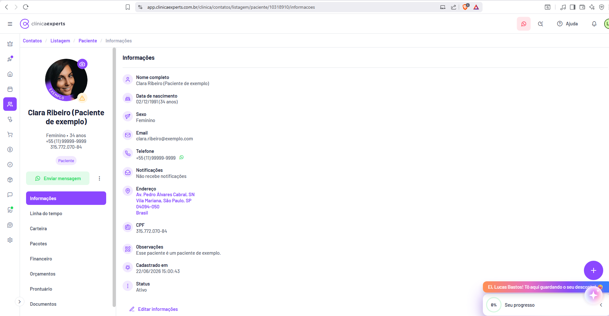
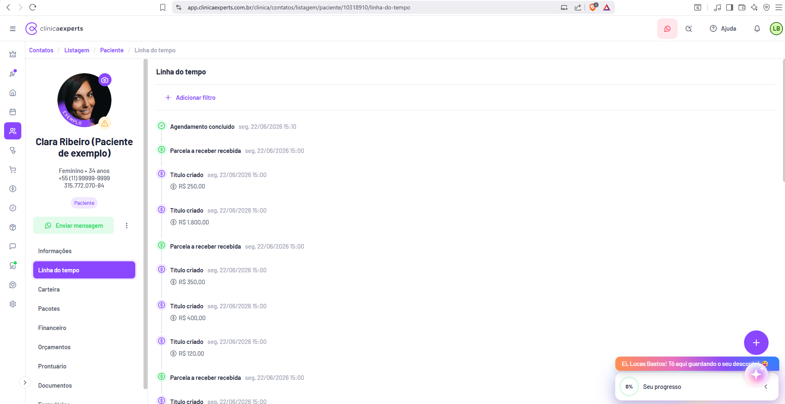
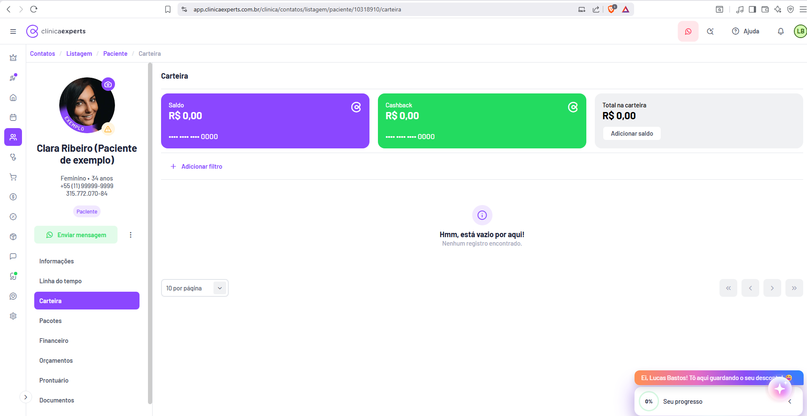
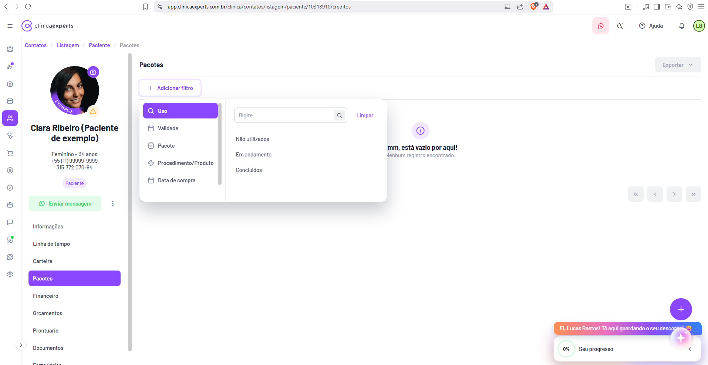

# Ficha do Paciente

| Metadado | Valor |
|---|---|
| **Página** | Ficha do Paciente (master-detail com abas) |
| **Produto** | Clínica Experts — SaaS de gestão de clínicas |
| **Domínio** | app.clinicaexperts.com.br |
| **Módulo** | Contatos → Pacientes |
| **Rota base** | `/clinica/contatos/listagem/paciente/{id}/{aba}` |
| **ID de exemplo** | `10318910` |
| **Abas (slugs de rota)** | `informacoes`, `linha-do-tempo`, `carteira`, `creditos` (label "Pacotes"), `financeiro`, `orcamentos` *(+ `prontuario`, `documentos` e demais no menu, fora do escopo)* |
| **Breadcrumb** | `Contatos / Listagem / Paciente / {Aba}` |
| **Idioma** | pt-BR |
| **Perfil de exemplo** | Clara Ribeiro (Paciente de exemplo) |
| **Telas cruzadas** | 02-telas-11-a-20.md (Telas 17–20); 03-telas-21-a-30.md (Telas 21–22) |
| **Cor primária** | Roxo (`#7C3AED` aprox., inferido) — abas/itens ativos e ações principais |
| **Layout** | Header global + sidebar de ícones + painel lateral fixo do paciente (coluna esquerda) + área de conteúdo da aba (direita) |

> **Observação sobre valores:** os valores exatos abaixo foram lidos diretamente das capturas em alta resolução. Onde o doc cruzado (Tela 21) diverge, prevalece a leitura desta spec (ex.: `Realizado R$ 2.431,00`, `Em aberto -R$ 1.480,00`, `Total do período R$ 1.231,00`, `28 registros`).

---

## 1. Cabeçalho comum da ficha (painel lateral do paciente)

Presente em **todas as abas**, na coluna esquerda do conteúdo (à direita da sidebar de ícones global). É o "master" do layout master-detail.

### 1.1 Elementos globais (fora da ficha, persistentes)

- **Header (topo):** logo **clínicaexperts** (símbolo "C" roxo + wordmark); botão hambúrguer (☰, colapsa sidebar). À direita: ícone **WhatsApp** (fundo rosa claro), ícone **busca/atalhos** (lupa), link **Ajuda** (ícone "?"), **sino** de notificações (com badge), avatar **"LB"** (Lucas Bastos, círculo verde).
- **Sidebar de ícones (extrema esquerda):** coroa (planos/upgrade), foguete/atalhos, casa, calendário (Agenda), **pessoas (Contatos — ativo/roxo)**, estetoscópio, carrinho, cifrão "$" (Financeiro), marketing, caixa/estoque, chat, automação (badge verde), coração/CRM, engrenagem (Configurações); seta ">" no rodapé para expandir rótulos.
- **Breadcrumb:** `Contatos / Listagem / Paciente / {Aba}` (em roxo, abaixo do header).
- **Botão flutuante "+"** (roxo, canto inferior direito) e **assistente de IA** (botão roxo abaixo dele).
- **Onboarding (canto inferior direito):** toast laranja **"Ei, Lucas Bastos! Tô aqui guardando o seu desconto! 😄"** e card **"Seu progresso 0%"** (com seta de recolher).

### 1.2 Painel lateral do paciente (coluna esquerda — texto exato)

- **Avatar/foto** circular (mulher), com **badge de status** (ícone roxo, canto superior direito), **selo "EXEMPLO"** em volta e **badge de alerta amarelo** (⚠, canto inferior — inferido: pendência/aviso cadastral).
- **Nome:** **Clara Ribeiro (Paciente de exemplo)** (em negrito, duas linhas).
- **Resumo (linhas centralizadas, cor cinza):**
  - **Feminino • 34 anos**
  - **+55 (11) 99999-9999**
  - **315.772.070-84** (CPF)
- **Badge:** **Paciente** (pílula lilás clara).
- **Ações:**
  - Botão verde **"Enviar mensagem"** (ícone WhatsApp) — abre conversa/WhatsApp.
  - Menu **"⋮"** (três pontos) ao lado — ações adicionais (editar, excluir, mesclar — inferido).

### 1.3 Menu de navegação da ficha (abas verticais, coluna esquerda)

Lista vertical; item ativo em **roxo preenchido**. Ordem exata observada:

| Label (UI) | Slug de rota | Escopo desta spec |
|---|---|---|
| **Informações** | `informacoes` | ✅ §2 |
| **Linha do tempo** | `linha-do-tempo` | ✅ §3 |
| **Carteira** | `carteira` | ✅ §4 |
| **Pacotes** | `creditos` | ✅ §5 |
| **Financeiro** | `financeiro` | ✅ §6 |
| **Orçamentos** | `orcamentos` | ✅ §7 |
| **Prontuário** | `prontuario` (inferido) | fora do escopo |
| **Documentos** | `documentos` (inferido) | fora do escopo |
| *(mais itens abaixo, cortados — ex.: Formulários)* | — | fora do escopo |

> **Nota de implementação:** o menu de abas é o "router" do master-detail. Cada aba é uma sub-rota dedicada (`/{id}/{slug}`), recarregando apenas a área de conteúdo. O painel lateral (avatar/nome/resumo/ações/menu) permanece montado entre abas (componente persistente; idealmente layout aninhado com `<Outlet>` por aba).

---

## 2. Aba — Informações

- **Rota:** `/clinica/contatos/listagem/paciente/10318910/informacoes`
- **Breadcrumb:** `Contatos / Listagem / Paciente / Informações`

### Propósito
Exibir os dados cadastrais completos do paciente (somente leitura) com ponto de entrada para edição.

### Layout
Coluna única à direita: título **"Informações"** + lista vertical de campos (cada um com ícone à esquerda, label em negrito e valor abaixo).

### Campos (label : valor — textos exatos)

| Ícone | Label | Valor |
|---|---|---|
| 👤 | **Nome completo** | Clara Ribeiro (Paciente de exemplo) |
| 🎂 | **Data de nascimento** | 02/12/1991 (34 anos) |
| ⚧ | **Sexo** | Feminino |
| ✉ | **Email** | clara.ribeiro@exemplo.com |
| 📞 | **Telefone** | +55 (11) 99999-9999 *(com ícone WhatsApp verde à direita)* |
| 🔔 | **Notificações** | Não recebe notificações |
| 📍 | **Endereço** | Av. Pedro Álvares Cabral, SN / Vila Mariana, São Paulo, SP / 04094-050 / Brasil *(4 linhas)* |
| 🆔 | **CPF** | 315.772.070-84 |
| 📝 | **Observações** | Esse paciente é um paciente de exemplo. |
| 🕐 | **Cadastrado em** | 22/06/2026 15:00:43 |
| ⚙ | **Status** | Ativo |

### Ações
- Link **"✏ Editar informações"** ao final da lista — abre formulário/modal de edição cadastral (inferido).

### Estados
- Estado único (dados preenchidos). Campos sem valor seriam ocultados ou exibidos como vazio (inferido).

---

## 3. Aba — Linha do tempo

- **Rota:** `/clinica/contatos/listagem/paciente/10318910/linha-do-tempo`
- **Breadcrumb:** `Contatos / Listagem / Paciente / Linha do tempo`

### Propósito
Feed cronológico (mais recente no topo) que agrega eventos de múltiplas origens do paciente: agendamentos da agenda e lançamentos/parcelas do financeiro.

### Layout
Título **"Linha do tempo"** + filtro + lista vertical de eventos. Cada item: **ícone de status circular** à esquerda + **título do evento** (negrito) + **timestamp** (cinza, formato `seg. 22/06/2026 15:10`) + opcionalmente um **valor** (`💲 R$ x.xxx,xx`) em segunda linha.

### Filtros
- Link **"+ Adicionar filtro"** (roxo) — filtra por tipo de evento/período (inferido).

### Eventos (ordem exata, do topo — textos e valores exatos)

| # | Ícone (cor) | Título | Timestamp | Valor |
|---|---|---|---|---|
| 1 | ✓ verde | **Agendamento concluído** | seg. 22/06/2026 15:10 | — |
| 2 | ✓ verde | **Parcela a receber recebida** | seg. 22/06/2026 15:00 | — |
| 3 | 💲 (cifrão) | **Título criado** | seg. 22/06/2026 15:00 | R$ 250,00 |
| 4 | 💲 | **Título criado** | seg. 22/06/2026 15:00 | R$ 1.800,00 |
| 5 | ✓ verde | **Parcela a receber recebida** | seg. 22/06/2026 15:00 | — |
| 6 | 💲 | **Título criado** | seg. 22/06/2026 15:00 | R$ 350,00 |
| 7 | 💲 | **Título criado** | seg. 22/06/2026 15:00 | R$ 400,00 |
| 8 | 💲 | **Título criado** | seg. 22/06/2026 15:00 | R$ 120,00 |
| 9 | ✓ verde | **Parcela a receber recebida** | seg. 22/06/2026 15:00 | — |
| 10 | 💲 | **Título criado** | seg. 22/06/2026 15:00 | *(cortado no rodapé)* |

### Tipos de evento observados / inferidos
- **Agendamento concluído** (origem: Agenda; ícone ✓ verde).
- **Parcela a receber recebida** (origem: Financeiro; ✓ verde).
- **Título criado** (origem: Financeiro; ícone cifrão; sempre acompanhado de valor).
- *(Inferido: outros como "Agendamento criado", "Orçamento criado", "Pacote adquirido", "Movimentação de carteira".)*

### Estados
- **Vazio (inferido):** padrão de empty state da plataforma ("Hmm, está vazio por aqui!" / "Nenhum registro encontrado.").
- Sem paginação visível (feed contínuo / scroll infinito — inferido).

---

## 4. Aba — Carteira

- **Rota:** `/clinica/contatos/listagem/paciente/10318910/carteira`
- **Breadcrumb:** `Contatos / Listagem / Paciente / Carteira`

### Propósito
Gerenciar a carteira digital do paciente: saldo, cashback e total consolidado, além do extrato de movimentações.

### Layout
Três **cards de saldo** no topo (lado a lado) + barra de filtro + área de extrato (estado vazio) + paginação.

### Cards de saldo (textos e valores exatos)

| Card | Cor de fundo | Label | Valor | Rodapé / ação |
|---|---|---|---|---|
| 1 | Roxo | **Saldo** | **R$ 0,00** | Máscara de cartão **`•••• •••• •••• 0000`** + ícone circular (logo) no canto |
| 2 | Verde | **Cashback** | **R$ 0,00** | Máscara **`•••• •••• •••• 0000`** + ícone circular |
| 3 | Branco | **Total na carteira** | **R$ 0,00** | Botão **"Adicionar saldo"** |

### Filtro e extrato
- Link **"+ Adicionar filtro"** (roxo).
- **Estado vazio (texto exato):** ícone informativo (i) em círculo lilás, título **"Hmm, está vazio por aqui!"**, subtítulo **"Nenhum registro encontrado."**

### Paginação
- Seletor **"10 por página"** (dropdown) à esquerda.
- Controles `«  ‹  ›  »` à direita (todos desabilitados no estado vazio).

### Ações
- **"Adicionar saldo"** — abre fluxo para creditar valor na carteira (inferido).

### Regras/cálculos (inferido)
- **Total na carteira = Saldo + Cashback.**
- **Saldo** = créditos disponíveis para abater em vendas/orçamentos (ver "Sem desconto ou uso de saldo" nos modais de orçamento, Telas 23–24).
- **Cashback** = crédito gerado por programa de fidelidade, possivelmente com regras de resgate distintas do Saldo.
- O extrato lista movimentações (entrada/crédito, saída/débito) que recompõem o saldo.

---

## 5. Aba — Pacotes

- **Rota:** `/clinica/contatos/listagem/paciente/10318910/creditos` *(slug `creditos`, label de UI "Pacotes")*
- **Breadcrumb:** `Contatos / Listagem / Paciente / Pacotes`

### Propósito
Listar os pacotes (créditos de procedimentos/sessões) adquiridos pelo paciente, com filtros por uso, validade, pacote, procedimento/produto e data de compra.

### Layout
Título **"Pacotes"** + botão **"Exportar"** (canto superior direito, dropdown, **desabilitado/cinza** no vazio) + botão **"+ Adicionar filtro"**. Na captura, o **popover de filtro está aberto** sobre o conteúdo; ao fundo, estado vazio.

### Popover de filtro (duas colunas — texto exato)

**Coluna esquerda (categorias de filtro):**
- **Uso** *(selecionado, roxo, ícone de lupa)*
- **Validade** *(ícone calendário)*
- **Pacote**
- **Procedimento/Produto**
- **Data de compra** *(ícone calendário)*

**Coluna direita (opções do filtro "Uso" ativo):**
- Campo de busca **"Digite"** (com ícone de lupa) + link **"Limpar"** (à direita).
- Opções (lista/checkbox):
  - **Não utilizados**
  - **Em andamento**
  - **Concluídos**

### Conteúdo (ao fundo, estado vazio — texto exato)
- Ícone informativo (i) em círculo lilás, título **"Hmm, está vazio por aqui!"** *(parcialmente coberto pelo popover)*, subtítulo **"Nenhum registro encontrado."**
- Paginação `«  ‹  ›  »` à direita.

### Ações
- **"+ Adicionar filtro"** — abre o popover de duas colunas.
- **"Exportar"** — gera relatório dos pacotes (habilita quando há registros — inferido).

### Regras/cálculos (inferido)
- **Uso** segmenta por estágio de consumo: *Não utilizados* (0 sessões usadas) / *Em andamento* (1+ usadas, restam) / *Concluídos* (todas usadas).
- **Créditos restantes = Total de sessões do pacote − Sessões utilizadas.**
- **Validade** controla expiração; pacote vencido com créditos restantes pode ser bloqueado (inferido).

---

## 6. Aba — Financeiro

- **Rota:** `/clinica/contatos/listagem/paciente/10318910/financeiro`
- **Breadcrumb:** `Contatos / Listagem / Paciente / Financeiro`

### Propósito
Extrato/lista de lançamentos financeiros vinculados ao paciente (receitas e despesas), com KPIs por situação e total do período.

### Layout
Título **"Financeiro"** + contador **"28 registros"** + barra de ações (filtro + busca) + linha de **5 cards-KPI** + **tabela de lançamentos** + paginação.

### Cabeçalho
- Título **"Financeiro"** · contador **"28 registros"**.
- Botão **"+ Adicionar filtro"** (roxo) · campo **"Buscar"** (à direita).

### Cards-KPI (rótulo + cor do ponto + valor — exatos)

| KPI | Cor do ponto | Valor | Estado |
|---|---|---|---|
| **Realizado** | verde | **R$ 2.431,00** | — |
| **A receber** | azul | **R$ 0,00** | — |
| **Em aberto** | amarelo | **-R$ 1.480,00** | — |
| **Em atraso** | vermelho | **R$ 280,00** | — |
| **Total do período** | azul | **R$ 1.231,00** | **selecionado** (borda inferior roxa) |

*(Cada KPI tem ícone "?" de ajuda ao lado do rótulo.)*

### Tabela de lançamentos

Colunas: **Vencimento** ◆ · **Execução** ◆ · **Descrição** ◆ · **Situação** · **Valor líq. (R$)** ◆ · ⚙ (engrenagem, configurar colunas) · **⋮** (ações por linha).

| Vencimento | Execução | Descrição | Situação | Valor líq. (R$) |
|---|---|---|---|---|
| 17/06 | 17/06 | Aluguel da Clínica | **Pago** (verde) | **-1.200,00** (vermelho) |
| 17/06 | 17/06 | Material de Escritório | **Pago** (verde) | **-150,00** (vermelho) |
| 17/06 | — | Renovação de Licenças | **Em atraso** (vermelho) | **-500,00** (vermelho) |
| 17/06 | 17/06 | Massagem Relaxante | **Recebido** (verde) | **150,00** (verde) |
| 17/06 | 17/06 | Preenchimento Facial | **Recebido** (verde) | **1.800,00** (verde) |
| 17/06 | — | Venda de Cremes Anti-idade | **Em atraso** (vermelho) | **350,00** (verde) |
| 18/06 | — | Drenagem Linfática | **Em atraso** (vermelho) | **180,00** (verde) |
| 18/06 | 18/06 | Microagulhamento *(cortado no rodapé)* | *(verde)* | *(verde)* |

> **Legenda de cores:** valores **vermelhos** = despesas/saídas (negativos); **verdes** = receitas/entradas (positivos). Badges de situação: **Pago**/**Recebido** (verde), **Em atraso** (vermelho/rosa), **Em aberto** (laranja — inferido pela KPI).

### Ações
- **"+ Adicionar filtro"**, **"Buscar"**.
- KPIs clicáveis (filtram a tabela por situação — inferido).
- Ordenação por coluna (ícones ◆).
- ⚙ configura colunas visíveis; **⋮** por linha (editar/baixar/excluir lançamento — inferido).

### Estados
- Linhas **"Em atraso"** destacadas (badge vermelho).
- KPI **"Total do período"** ativo por padrão.
- **Vazio (inferido):** empty state padrão da plataforma.

### Regras/cálculos (inferido)
- **Realizado** = soma dos lançamentos liquidados (Pago + Recebido) no período.
- **A receber** = receitas com vencimento futuro ainda não liquidadas.
- **Em aberto** = lançamentos pendentes (sem liquidação) — sinal negativo indica saldo líquido devedor do recorte.
- **Em atraso** = lançamentos vencidos e não liquidados.
- **Total do período** = saldo líquido do período = Σ(entradas) − Σ(saídas) do recorte filtrado.
- **Valor líq.** = valor bruto − descontos/taxas (valor efetivamente movimentado).

---

## 7. Aba — Orçamentos

- **Rota:** `/clinica/contatos/listagem/paciente/10318910/orcamentos`
- **Breadcrumb:** `Contatos / Listagem / Paciente / Orçamentos`

### Propósito
Listar e gerenciar os orçamentos do paciente. Na captura, **estado vazio por filtros**.

### Layout
Título **"Orçamentos"** + botão **"Exportar"** (canto superior direito, dropdown, **desabilitado/cinza**) + barra de ações (filtro + busca) + **empty state** centralizado + paginação.

### Cabeçalho e ações
- Botão **"Exportar"** (dropdown, cinza/desabilitado no vazio).
- Botão **"+ Adicionar filtro"** (roxo) · campo **"Buscar"** (à direita).

### Estado vazio (texto exato)
- Ícone de **lupa** em círculo lilás claro.
- Título: **"Oops, nada foi encontrado!"**
- Texto: **"Os filtros selecionados não correspondem a nenhum registro."**
- Botões abaixo:
  - **"Limpar filtros"** (contorno roxo) — remove filtros e reexibe registros.
  - **"+ Adicionar novo orçamento"** (roxo preenchido) — abre o modal de criação.

### Paginação
- Seletor **"25 por página"** (dropdown) à esquerda.
- Controles `«  ‹  ›  »` à direita.

### Fluxo de criação (cruzado — Telas 23/24)
- **"+ Adicionar novo orçamento"** abre o modal **"Novo orçamento"** com toggle **Personalizado** | **Pacote**:
  - **Personalizado** (Tela 23): Cliente*, Vendedor*, tabela de Procedimentos/Produtos (Nome / Qtd. / Valor / Desconto un. / Total), Desconto (**"Sem desconto ou uso de saldo"** — usa Saldo da carteira), Condições de pagamento, **Salvar**.
  - **Pacote** (Tela 24): Pacote*, Cliente*, Vendedor*, Desconto, Condições de pagamento, **Valor total** (R$), **Salvar**.

### Colunas da tabela (quando preenchida — inferido)
- Número/identificador, Data, Vendedor, Itens/Pacote, Valor total, Situação (rascunho/enviado/aprovado/recusado), ações.

---

## 8. Modelo de dados inferido

> Todas as tabelas abaixo são **(inferido)** a partir das telas. Tipos sugeridos; campos marcados `*` aparecem explicitamente na UI.

### 8.1 Paciente (`Patient`)

| Campo | Tipo | Origem / Exemplo |
|---|---|---|
| id | string/int | `10318910` (rota) |
| nomeCompleto* | string | "Clara Ribeiro (Paciente de exemplo)" |
| dataNascimento* | date | 02/12/1991 |
| idade (derivado) | int | 34 |
| sexo* | enum | "Feminino" |
| email* | string | clara.ribeiro@exemplo.com |
| telefone* | string (E.164) | +55 (11) 99999-9999 |
| whatsapp (flag) | bool | ícone WhatsApp presente |
| recebeNotificacoes* | bool | "Não recebe notificações" → false |
| endereco* | objeto | logradouro, número/SN, bairro, cidade, UF, CEP, país |
| cpf* | string | 315.772.070-84 |
| observacoes* | text | "Esse paciente é um paciente de exemplo." |
| etiquetas | string[] | (vazio na listagem) |
| isExemplo (flag) | bool | selo "EXEMPLO" |
| ativo* / status* | bool/enum | "Ativo" |
| criadoEm* | datetime | 22/06/2026 15:00:43 |
| avatarUrl | string | foto circular |

### 8.2 LinhaDoTempo / Evento (`TimelineEvent`)

| Campo | Tipo | Exemplo |
|---|---|---|
| id | string | — |
| pacienteId | FK | 10318910 |
| tipo | enum | `agendamento_concluido`, `parcela_recebida`, `titulo_criado` (+ inferidos) |
| titulo (label) | string | "Título criado" |
| ocorridoEm | datetime | 2026-06-22 15:00 (exibido "seg. 22/06/2026 15:00") |
| valor | money? | R$ 250,00 (presente em `titulo_criado`) |
| origem | enum | `agenda` \| `financeiro` |
| refId | FK | id do agendamento/lançamento de origem |
| statusIcon/cor | enum | verde (concluído/recebido), cifrão (título) |

### 8.3 Carteira / Saldo (`Wallet` + `WalletTransaction`)

**Wallet**

| Campo | Tipo | Exemplo |
|---|---|---|
| pacienteId | FK | 10318910 |
| saldo | money | R$ 0,00 |
| cashback | money | R$ 0,00 |
| total (derivado) | money | saldo + cashback = R$ 0,00 |
| numeroMascarado | string | •••• •••• •••• 0000 |

**WalletTransaction (extrato)**

| Campo | Tipo |
|---|---|
| id | string |
| walletId/pacienteId | FK |
| tipo | enum (`credito` \| `debito` \| `cashback`) |
| valor | money |
| descricao | string |
| criadoEm | datetime |
| refOrigem | FK (venda/orçamento/ajuste) |

### 8.4 Pacote / Crédito (`Package` + `PackageCredit`)

| Campo | Tipo | Exemplo |
|---|---|---|
| id | string | — |
| pacienteId | FK | 10318910 |
| pacoteNome | string | (catálogo de pacotes) |
| procedimentoProduto | FK | filtro "Procedimento/Produto" |
| totalSessoes | int | — |
| sessoesUtilizadas | int | — |
| creditosRestantes (derivado) | int | total − utilizadas |
| uso (derivado) | enum | `nao_utilizados` \| `em_andamento` \| `concluidos` |
| dataCompra | date | filtro "Data de compra" |
| validade | date | filtro "Validade" |

### 8.5 LançamentoFinanceiro (`FinancialEntry`)

| Campo | Tipo | Exemplo |
|---|---|---|
| id | string | — |
| pacienteId | FK | 10318910 |
| descricao | string | "Aluguel da Clínica", "Preenchimento Facial" |
| tipo | enum | `receita` \| `despesa` (sinal do valor) |
| vencimento | date | 17/06 |
| execucao | date? | 17/06 / null |
| situacao | enum | `pago`, `recebido`, `em_aberto`, `em_atraso` |
| valorLiquido | money | -1.200,00 / 1.800,00 |
| categoria | FK | (não exibida nesta aba) |
| metodoPagamento | FK | (não exibida nesta aba) |

### 8.6 Orçamento (`SaleQuote`)

| Campo | Tipo | Exemplo |
|---|---|---|
| id | string | — |
| pacienteId / clienteId* | FK | 10318910 / "Clara Ribeiro..." |
| tipo* | enum | `sale_quote` (param URL) → Personalizado \| Pacote |
| vendedor* | FK | "Lucas Bastos" |
| pacote* (se tipo=Pacote) | FK | — |
| itens[] | array | {nome, qtd, valor, descontoUn, total} |
| desconto | objeto | "Sem desconto ou uso de saldo" (R$ \| % \| saldo carteira) |
| condicoesPagamento[] | array | parcelas |
| valorTotal | money | R$ 0,00 |
| situacao | enum | rascunho/enviado/aprovado/recusado (inferido) |
| criadoEm | datetime | — |

---

## 9. Endpoints de API inferidos (por aba)

> Base inferida: `/api` ou `/clinica`. Todos com escopo de paciente `{id}`.

| Aba | Método | Endpoint (inferido) | Uso |
|---|---|---|---|
| Comum | GET | `/api/pacientes/{id}` | Carrega o cabeçalho/painel lateral |
| Informações | GET | `/api/pacientes/{id}` | Dados cadastrais completos |
| Informações | PUT/PATCH | `/api/pacientes/{id}` | "Editar informações" |
| Linha do tempo | GET | `/api/pacientes/{id}/linha-do-tempo?tipo=&periodo=` | Feed paginado/agregado |
| Carteira | GET | `/api/pacientes/{id}/carteira` | Saldo, cashback, total |
| Carteira | GET | `/api/pacientes/{id}/carteira/movimentacoes?page=&perPage=10` | Extrato |
| Carteira | POST | `/api/pacientes/{id}/carteira/saldo` | "Adicionar saldo" |
| Pacotes | GET | `/api/pacientes/{id}/creditos?uso=&validade=&pacote=&procedimento=&dataCompra=` | Lista de pacotes |
| Pacotes | GET | `/api/pacientes/{id}/creditos/export` | "Exportar" |
| Financeiro | GET | `/api/pacientes/{id}/financeiro?situacao=&busca=&periodo=` | Lançamentos + KPIs |
| Financeiro | GET | `/api/pacientes/{id}/financeiro/resumo` | KPIs (Realizado/A receber/Em aberto/Em atraso/Total) |
| Financeiro | PATCH | `/api/financeiro/lancamentos/{lid}` | Ações por linha (baixar/editar) |
| Orçamentos | GET | `/api/pacientes/{id}/orcamentos?busca=&filtros=` | Lista de orçamentos |
| Orçamentos | POST | `/api/pacientes/{id}/orcamentos` | "Adicionar novo orçamento" |
| Orçamentos | GET | `/api/pacientes/{id}/orcamentos/export` | "Exportar" |

---

## 10. Regras e cálculos consolidados

- **Carteira:** `Total na carteira = Saldo + Cashback`. Saldo é consumível em vendas/orçamentos via opção "uso de saldo". Cashback é crédito de fidelidade (regras de resgate distintas — inferido). Extrato recompõe o saldo somando créditos e subtraindo débitos.
- **Pacotes:** `Créditos restantes = Total de sessões − Sessões utilizadas`. Estágio de **Uso**: `Não utilizados` (0 usadas), `Em andamento` (0 < usadas < total), `Concluídos` (usadas = total). **Validade** pode invalidar créditos restantes.
- **Financeiro do paciente:** `Total do período = Σ(entradas liquidadas/previstas) − Σ(saídas)` no recorte filtrado. `Realizado` = liquidados; `A receber` = futuros não liquidados; `Em aberto` = pendentes; `Em atraso` = vencidos não liquidados. Sinal do valor define receita (+, verde) ou despesa (−, vermelho). `Valor líq.` desconta taxas/descontos.
- **Idade:** derivada de `dataNascimento` (02/12/1991 → 34 anos em 22/06/2026).

---

## 11. Fluxos principais

1. **Listagem → Ficha:** clicar no nome do paciente na listagem (`/clinica/contatos/listagem-pacientes`) abre `/{id}/informacoes` (aba padrão).
2. **Navegação entre abas:** clicar em um item do menu lateral troca a sub-rota e recarrega só o conteúdo; painel do paciente persiste.
3. **Editar cadastro:** Informações → "Editar informações" → formulário de edição → salvar → volta para Informações.
4. **Creditar carteira:** Carteira → "Adicionar saldo" → fluxo de crédito → atualiza cards Saldo/Total e extrato.
5. **Filtrar pacotes:** Pacotes → "+ Adicionar filtro" → popover duas colunas → escolher categoria (Uso/Validade/Pacote/Procedimento/Data de compra) → valores → aplica.
6. **Conciliar financeiro:** Financeiro → clicar KPI (filtra por situação) e/ou "+ Adicionar filtro" → ações por linha (⋮) para baixar/editar.
7. **Criar orçamento:** Orçamentos (vazio) → "+ Adicionar novo orçamento" → modal Personalizado/Pacote (Telas 23/24) → preencher cliente/vendedor/itens/desconto/condições → Salvar → orçamento entra na lista.
8. **Contato direto:** qualquer aba → "Enviar mensagem" (WhatsApp) a partir do painel lateral.

---

## 12. Notas de implementação (layout master-detail com abas)

- **Layout aninhado:** rota pai `/.../paciente/{id}` carrega o painel lateral (master) e renderiza a aba ativa via `<Outlet>`/slot; cada aba é uma rota filha (`informacoes`, `linha-do-tempo`, `carteira`, `creditos`, `financeiro`, `orcamentos`, ...). Slug ≠ label em **Pacotes** (`creditos`).
- **Estado persistente:** dados do cabeçalho (Paciente) carregados uma vez na rota pai e cacheados; abas consultam endpoints próprios sob demanda (lazy por aba).
- **Empty states padronizados:** dois variantes — sem dados ("Hmm, está vazio por aqui!" / "Nenhum registro encontrado." — Carteira/Pacotes) e sem resultados por filtro ("Oops, nada foi encontrado!" / "Os filtros selecionados não correspondem a nenhum registro." + "Limpar filtros" — Orçamentos).
- **Componentes reutilizáveis:** popover de filtro de duas colunas (Pacotes); cards-KPI clicáveis com borda inferior roxa de seleção (Financeiro); cards de saldo coloridos (Carteira); tabela com colunas ordenáveis (◆), configuração de colunas (⚙) e ações por linha (⋮); paginação padrão (seletor "N por página" + `« ‹ › »`).
- **Cores semânticas:** roxo = ação/seleção; verde = positivo/recebido/WhatsApp/cashback; vermelho = despesa/em atraso; laranja/amarelo = em aberto/aviso.
- **Botão "Exportar"** desabilitado quando a lista está vazia (Pacotes, Orçamentos).
- **Acessibilidade/i18n:** todos os textos em pt-BR; máscaras de CPF, telefone (+55) e moeda (R$ #.###,##).
