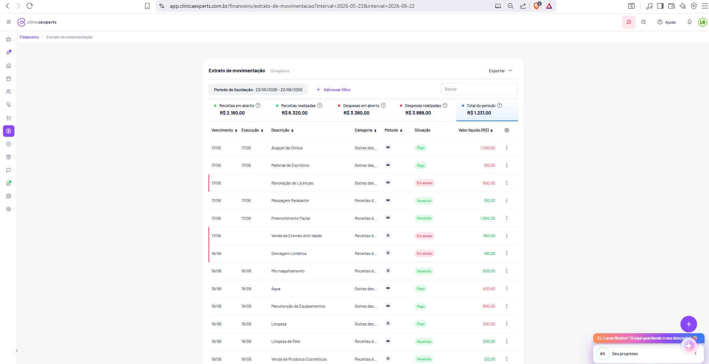

# Financeiro / Extrato de Movimentação

| Metadado | Valor |
|---|---|
| **Página** | Extrato de Movimentação |
| **Módulo** | Financeiro |
| **Rota** | `/financeiro/extrato-de-movimentacao` |
| **URL completa observada** | `app.clinicaexperts.com.br/financeiro/extrato-de-movimentacao?interval=2026-05-23&interval=2026-06-22` |
| **Breadcrumb** | Financeiro / Extrato de movimentação |
| **App** | Clínica Experts (app.clinicaexperts.com.br) |
| **Idioma** | pt-BR |
| **Tela de referência** | Tela 31 (`docs/04-telas-31-a-40.md`) |
| **Screenshot** | `Captura de tela 2026-06-22 153408.png` |
| **Data de captura** | 2026-06-22 |
| **Usuário logado** | Lucas Bastos (iniciais "LB") |



---

## 1. Identificação

- **Nome da página (título do card):** **"Extrato de movimentação"**
- **Badge de contagem ao lado do título:** **"30 registros"** (cinza, exato no print).
- **Rota da SPA:** `/financeiro/extrato-de-movimentacao`
- **Query string observada:** `?interval=2026-05-23&interval=2026-06-22` — dois parâmetros `interval` repetidos representando início e fim do período de liquidação (formato `YYYY-MM-DD`).
- **Breadcrumb (roxo, abaixo do header):** **"Financeiro / Extrato de movimentação"** — "Financeiro" é segmento clicável (inferido); "Extrato de movimentação" é o segmento atual.
- **Ícone ativo na sidebar:** cifrão/Financeiro (fundo roxo arredondado).
- **Identidade visual:** card branco central sobre fundo cinza claro, cantos arredondados, sombra leve.

---

## 2. Objetivo

Apresentar o **extrato/livro-caixa detalhado** da clínica: todas as **movimentações financeiras** (entradas/receitas e saídas/despesas) liquidadas ou previstas dentro de um período, com a **situação** de cada lançamento (Pago, Recebido, Em atraso) e o **valor líquido**.

Funções principais:

- Listar lançamentos de receita e despesa de um intervalo de **período de liquidação**.
- Consolidar, em cards de resumo, os totais de **receitas em aberto/realizadas**, **despesas em aberto/realizadas** e o **total líquido do período**.
- Permitir filtrar, buscar, ordenar, configurar colunas e exportar.
- Servir de ponto de entrada para ações por lançamento (editar, dar baixa, excluir — inferido) via menu `⋮`.

Diferença frente a telas irmãs (inferido, ref. `04-telas-31-a-40.md`):
- **Relatório de competência (Tela 32):** organiza por regime de competência (bruto x líquido); o extrato organiza por **liquidação/vencimento** com situação.
- **Fluxo de caixa diário/mensal (Telas 33/34):** agregam por dia/mês com gráfico; o extrato é **linha a linha**.

---

## 3. Navegação

- **Entrada:** menu lateral Financeiro → "Extrato de movimentação" (inferido); ou link direto pela rota.
- **Breadcrumb:** "Financeiro" → volta ao índice/dashboard do módulo Financeiro (inferido). "Extrato de movimentação" = página atual.
- **Header global (padrão do app):**
  - Esquerda: hambúrguer (☰) recolhe/expande sidebar; logotipo **clínicaexperts**.
  - Direita: ícone WhatsApp (círculo rosa), ícone de busca/atalho, link **"Ajuda"** (com "?"), sino de notificações, avatar **"LB"** (borda verde).
- **Sidebar vertical esquerda:** ícones empilhados; **Financeiro (cifrão)** ativo em roxo.
- **Saídas a partir desta tela (inferido):**
  - Botão **"Exportar"** → dropdown de formatos.
  - Botão flutuante **"+"** (canto inferior direito) → adicionar novo lançamento/movimentação.
  - Menu `⋮` por linha → editar/baixar/excluir lançamento.
  - Engrenagem do cabeçalho da tabela → configurar colunas visíveis.
- **Widget de onboarding (sobreposto, inferior direito):** faixa laranja **"Ei, Lucas Bastos! Tô aqui guardando o seu desconto!"** + card **"0%"** / **"Seu progresso"** (gamificação; não pertence a esta página).

---

## 4. Layout

Estrutura vertical do card principal (de cima para baixo):

1. **Cabeçalho do card:** título **"Extrato de movimentação"** + badge **"30 registros"** à esquerda; botão **"Exportar"** (com seta ▾) à direita.
2. **Barra de filtros (linha):** chip **"Período de liquidação: 23/05/2026 - 22/06/2026"**; link **"+ Adicionar filtro"** (roxo); campo de busca **"Buscar"** à direita.
3. **Faixa de indicadores:** 5 cards de resumo lado a lado, cada um com bolinha colorida + ícone de ajuda "?". O card **"Total do período"** está destacado/ativo (linha azul inferior).
4. **Cabeçalho da tabela:** colunas com seta de ordenação ↕; engrenagem (configurar colunas) à direita.
5. **Corpo da tabela:** linhas de movimentação com rolagem vertical.
6. **Rodapé/paginação (inferido — fora do recorte do print):** seletor "por página" e controles de paginação, conforme padrão das demais telas financeiras.

Grid: largura total do card; coluna de descrição é a mais larga; valores alinhados à direita.

---

## 5. Componentes

### 5.1 Cabeçalho

- **Título:** "Extrato de movimentação" (negrito).
- **Badge contador:** "30 registros" — pílula cinza claro, texto cinza.
- **Botão "Exportar":** secundário, com seta ▾ (dropdown). Formatos inferidos: PDF / Excel (XLSX) / CSV.

### 5.2 Cards de resumo (valores exatos do print)

5 cards, cada um: **bolinha colorida** + **rótulo** + **ícone "?"** (tooltip de ajuda) + **valor em R$**.

| Card | Bolinha | Valor exato | Estado |
|---|---|---|---|
| **Receitas em aberto** | verde | **R$ 2.180,00** | normal |
| **Receitas realizadas** | verde | **R$ 6.320,00** | normal |
| **Despesas em aberto** | vermelha | **R$ 3.380,00** | normal |
| **Despesas realizadas** | vermelha | **R$ 3.889,00** | normal |
| **Total do período** | azul | **R$ 1.231,00** | **ativo** (linha azul inferior) |

- Os cards são **clicáveis/alternáveis** (inferido): selecionar um card filtra/realça o recorte correspondente (o ativo é "Total do período").
- Conferência de cálculo: `Total do período = Receitas realizadas − Despesas realizadas = 6.320,00 − 3.889,00 = 2.431,00`. **O print exibe R$ 1.231,00** — divergência de R$ 1.200,00 frente a esse cálculo simples (ver Seção 13). O valor mostrado é o exato do print.

### 5.3 Badges de situação (coluna Situação)

| Texto exato | Cor | Significado |
|---|---|---|
| **Pago** | verde | despesa liquidada |
| **Recebido** | verde | receita liquidada |
| **Em atraso** | vermelho/rosa | lançamento vencido sem liquidação |

- Linhas **"Em atraso"** possuem **barra/realce vertical vermelho à esquerda** da linha.
- Badges previstos adicionais (inferido): "Em aberto"/"A receber"/"A pagar" para lançamentos futuros não vencidos.

### 5.4 Cores de valor (coluna Valor líquido)

- **Receitas:** valor em **verde**.
- **Despesas:** valor em **vermelho/laranja**.

### 5.5 Coluna Método

- Exibida como **ícone** (sem texto). Ícones distintos observados sugerem: máquina de cartão/cartão (ícone retangular) e PIX/outro (ícone circular). Tooltip com nome do método (inferido).

### 5.6 Botões / ícones de ação

- **"+ Adicionar filtro"** (link roxo).
- **Engrenagem** (cabeçalho da tabela) → configurar colunas visíveis.
- **`⋮`** por linha → menu de ações.
- **Setas ↕** em cada cabeçalho de coluna → ordenação.
- **Botão flutuante "+"** (roxo, inferior direito) → novo lançamento.

---

## 6. Tabela de movimentações

### 6.1 Colunas (ordem exata, esquerda → direita)

| # | Coluna (texto exato) | Conteúdo | Ordenável | Alinhamento |
|---|---|---|---|---|
| 1 | **Vencimento** | data `DD/MM` | ↕ sim | esquerda |
| 2 | **Execução** | data `DD/MM` ou vazio | ↕ sim | esquerda |
| 3 | **Descrição** | texto do lançamento | ↕ sim | esquerda |
| 4 | **Categoria** | nome (truncado com "...") | ↕ sim | esquerda |
| 5 | **Método** | ícone (sem texto) | ↕ sim | centro |
| 6 | **Situação** | badge colorido | ↕ sim | centro |
| 7 | **Valor líquido (R$)** | valor colorido | ↕ sim | direita |
| 8 | *(ações)* | menu `⋮` | não | direita |

> Observação: o título da coluna 2 aparece grafado **"Execução"** no print (atenção à grafia exibida; o texto renderizado é "Execução").

> Nota sobre escopo do prompt: o prompt pede colunas "data, descrição, categoria, conta, entrada, saída, saldo". **A UI real (print) NÃO possui colunas separadas de "Conta", "Entrada", "Saída" nem "Saldo acumulado"** — o extrato usa **Vencimento / Execução / Descrição / Categoria / Método / Situação / Valor líquido (R$)**. As colunas conceituais entrada/saída/saldo são tratadas como **inferência/derivação** (ver 6.5 e Seção 13), não como colunas existentes.

### 6.2 Dados de exemplo (linhas exatas do print)

| Vencimento | Execução | Descrição | Categoria | Situação | Valor líquido (R$) |
|---|---|---|---|---|---|
| 17/06 | 17/06 | Aluguel de Clínica | Outras des... | Pago | 1.200,00 |
| 17/06 | 17/06 | Material de Escritório | Outras des... | Pago | 150,00 |
| 17/06 | — | Renovação de Licenças | Outras des... | Em atraso | 500,00 |
| 17/06 | 17/06 | Massagem Relaxante | Receitas d... | Recebido | 150,00 |
| 17/06 | 17/06 | Preenchimento Facial | Receitas d... | Recebido | 1.800,00 |
| 18/06 | — | Venda de Cremes Anti-idade | Receitas d... | Em atraso | 350,00 |
| 18/06 | — | Drenagem Linfática | Receitas d... | Em atraso | 180,00 |
| 18/06 | 18/06 | Microagulhamento | Receitas d... | Recebido | 600,00 |
| 18/06 | 18/06 | Água | Outras des... | Pago | 400,00 |
| 19/06 | 19/06 | Manutenção de Equipamentos | Outras des... | Pago | 800,00 |
| 19/06 | 19/06 | Limpeza | Outras des... | Pago | 300,00 |
| 19/06 | 19/06 | Limpeza de Pele | Receitas d... | Recebido | 200,00 |
| 19/06 | 19/06 | Venda de Produtos Cosméticos | Receitas d... | Recebido | 120,00 |

(São 30 registros no total; o print exibe as ~13 primeiras linhas; demais via rolagem.)

### 6.3 Ordenação

- Cada cabeçalho possui seta ↕; clique alterna asc/desc (inferido).
- Ordenação padrão observada: por **Vencimento** crescente (17/06 → 18/06 → 19/06).
- Critério de desempate aparente: ordem de inserção/ID (inferido).

### 6.4 Paginação

- Não visível no recorte. Padrão das telas financeiras irmãs (inferido, ref. Telas 38–40): seletor **"25 por página"** e controles **« ‹ [1] › »**.
- Com 30 registros e 25/página, haveria 2 páginas (inferido).

### 6.5 Totais / saldo acumulado

- **A tabela não exibe coluna de saldo acumulado.** Os totais do período ficam nos **cards de resumo** (Seção 5.2).
- **Saldo acumulado linha a linha** é **derivado/inferido** (não renderizado na UI): ver fórmula na Seção 13. Para o livro-caixa real, o produto "Fluxo de caixa diário" (Tela 33) fornece saldo inicial/final por dia.

---

## 7. Formulários

Nenhum formulário inline na página. Formulários acionados por navegação/modal (inferido):

- **Novo lançamento** (via "+" flutuante ou rota de criação): campos prováveis — tipo (receita/despesa), descrição, categoria, conta financeira, método de pagamento, valor, vencimento, data de execução/liquidação, situação, observações.
- **Editar lançamento** (via `⋮` → Editar): mesmos campos pré-preenchidos.
- **Adicionar filtro** (via "+ Adicionar filtro"): popover com seletor de campo + operador + valor (inferido).
- **Configurar colunas** (engrenagem): checklist de colunas visíveis (inferido).

---

## 8. Filtros

### 8.1 Visíveis no print

- **Chip de período:** **"Período de liquidação: 23/05/2026 - 22/06/2026"** — intervalo de datas; corresponde à query `interval=2026-05-23&interval=2026-06-22`. Clicável para abrir seletor de datas (inferido).
- **"+ Adicionar filtro"** (roxo) → adiciona filtros extras.
- **Campo "Buscar"** (placeholder exato "Buscar") → busca textual (descrição/categoria/contato — inferido).

### 8.2 Filtros adicionais inferidos (via "+ Adicionar filtro")

- **Conta financeira** (Banco padrão, Caixa, …) — ref. Tela 36.
- **Categoria** (plano de categorias) — ref. Telas 35/37.
- **Tipo** (Receita / Despesa).
- **Situação** (Pago, Recebido, Em atraso, Em aberto).
- **Método de pagamento** — ref. Tela 38.
- **Base de data** (liquidação x vencimento x execução).

### 8.3 Cards de resumo como filtro rápido (inferido)

Clicar em um card (ex.: "Despesas em aberto") realça/filtra o recorte correspondente; estado ativo atual = **"Total do período"**.

---

## 9. Estados

- **Populado (print):** 30 registros, rolagem vertical, cards com totais preenchidos.
- **Vazio (inferido, padrão do app — ref. Telas 39/40):** ícone circular ⓘ roxo + **"Hmm, está vazio por aqui!"** + subtexto **"Nenhum registro encontrado."**; cards de resumo zerados (R$ 0,00); exportar desabilitado.
- **Carregando (inferido):** skeleton/placeholder nas linhas e cards.
- **Erro (inferido):** mensagem de falha + opção de tentar novamente.
- **Em atraso:** lançamentos sem data de **Execução** e vencidos → badge "Em atraso" + barra vertical vermelha.

---

## 10. Modais

Inferidos (não capturados no print):

- **Dropdown "Exportar":** lista de formatos (PDF / Excel / CSV).
- **Popover "Adicionar filtro":** seletor de campo/operador/valor.
- **Popover/menu engrenagem:** configurar colunas visíveis.
- **Menu `⋮` (por linha):** Editar, Dar baixa/Liquidar, Excluir (com confirmação).
- **Seletor de período (date range):** ao clicar no chip de período.
- **Modal de confirmação de exclusão:** "Tem certeza…" (padrão do app, inferido).

---

## 11. Modelo de dados

### 11.1 Movimentação / Lançamento (`movimentacao` / `lancamento`)

| Campo | Tipo | Origem | Observação |
|---|---|---|---|
| `id` | UUID/int | inferido | identificador |
| `tipo` | enum(`receita`,`despesa`) | inferido | define cor/sinal |
| `descricao` | string | print | ex.: "Aluguel de Clínica" |
| `categoria_id` | FK | inferido | → categoria |
| `categoria_nome` | string | print | ex.: "Outras despesas", "Receitas de serviços" (truncado "Outras des...", "Receitas d...") |
| `conta_id` | FK | inferido | → conta financeira (Banco padrão / Caixa) |
| `metodo_pagamento_id` | FK | inferido | → método (exibido como ícone) |
| `valor_bruto` | decimal(12,2) | inferido | valor antes de descontos |
| `valor_liquido` | decimal(12,2) | print | exibido na coluna "Valor líquido (R$)" |
| `data_vencimento` | date | print | coluna "Vencimento" (`DD/MM`) |
| `data_execucao` | date \| null | print | coluna "Execução"; null → em atraso |
| `data_liquidacao` | date \| null | inferido | base do filtro de período |
| `situacao` | enum(`pago`,`recebido`,`em_atraso`,`em_aberto`) | print | badge colorido |
| `contato_id` | FK \| null | inferido | paciente/fornecedor (ref. Tela 32) |
| `observacao` | string \| null | inferido | — |
| `created_at` / `updated_at` | datetime | inferido | auditoria |

### 11.2 Resumo do período (`extrato_resumo`)

| Campo | Tipo | Valor no print |
|---|---|---|
| `receitas_em_aberto` | decimal | 2180.00 |
| `receitas_realizadas` | decimal | 6320.00 |
| `despesas_em_aberto` | decimal | 3380.00 |
| `despesas_realizadas` | decimal | 3889.00 |
| `total_periodo` | decimal | 1231.00 |
| `total_registros` | int | 30 |

### 11.3 Entidades relacionadas (inferido)

- **ContaFinanceira:** `{ id, nome, tipo(conta_corrente|caixa), saldo_atual }` (Tela 36).
- **Categoria:** `{ id, descricao, parent_id, tipo, ativo }` (Tela 37).
- **MetodoPagamento:** `{ id, descricao, tipo, marca_bandeira, ativo }` (Tela 38).

---

## 12. Endpoints API inferidos

> Todos inferidos a partir de rotas/comportamento; prefixo provável `/api`.

| Método | Endpoint | Uso |
|---|---|---|
| GET | `/api/financeiro/extrato-de-movimentacao?interval=2026-05-23&interval=2026-06-22` | lista paginada de movimentações do período |
| GET | `/api/financeiro/extrato-de-movimentacao/resumo?interval=…&interval=…` | totais dos 5 cards de resumo |
| GET | `/api/financeiro/extrato-de-movimentacao/export?formato=pdf\|xlsx\|csv&interval=…` | exportação |
| GET | `/api/financeiro/lancamentos/{id}` | detalhe de um lançamento |
| POST | `/api/financeiro/lancamentos` | criar lançamento ("+") |
| PUT/PATCH | `/api/financeiro/lancamentos/{id}` | editar |
| POST | `/api/financeiro/lancamentos/{id}/baixar` | dar baixa/liquidar |
| DELETE | `/api/financeiro/lancamentos/{id}` | excluir |
| GET | `/api/financeiro/contas` | filtro por conta |
| GET | `/api/financeiro/categorias` | filtro por categoria |
| GET | `/api/financeiro/metodos-de-pagamento` | ícone/filtro de método |

**Parâmetros de query inferidos do GET de listagem:** `interval` (x2, início/fim), `page`, `per_page` (ex. 25), `sort` (campo), `order` (asc/desc), `search`, `conta_id`, `categoria_id`, `tipo`, `situacao`, `metodo_id`.

---

## 13. Regras e cálculos

### 13.1 Classificação de situação

- `data_execucao` preenchida → **Pago** (despesa) ou **Recebido** (receita).
- `data_execucao` nula **e** `data_vencimento < hoje` → **Em atraso** (badge vermelho + barra vertical vermelha).
- (Inferido) `data_execucao` nula e não vencido → **Em aberto**.

### 13.2 Sinais e cores

- Receita → valor positivo, cor verde.
- Despesa → valor exibido em vermelho/laranja (sinal negativo no cálculo de saldo).

### 13.3 Cards de resumo

- `receitas_em_aberto` = Σ receitas não liquidadas no período.
- `receitas_realizadas` = Σ receitas liquidadas (Recebido).
- `despesas_em_aberto` = Σ despesas não liquidadas.
- `despesas_realizadas` = Σ despesas liquidadas (Pago).
- `total_periodo` = resultado líquido do período (regra exata da plataforma).
  - Cálculo simples `realizadas`: `6.320,00 − 3.889,00 = 2.431,00`.
  - **Print exibe R$ 1.231,00** (diferença de R$ 1.200,00 — possivelmente exclui/inclui o lançamento "Aluguel de Clínica" R$ 1.200,00, ou considera previsões/aberto de forma específica). **Documentar valor do print; validar a fórmula oficial com backend** antes de implementar (regra exata = inferida).

### 13.4 Saldo acumulado linha a linha (derivado — NÃO renderizado)

Embora não exista coluna de saldo na UI, o saldo acumulado pode ser calculado para relatórios:

```
saldo_acumulado[0] = saldo_inicial_conta
para cada linha i (ordenada por data de liquidação/execução):
    delta = (tipo == receita) ? +valor_liquido : -valor_liquido
    saldo_acumulado[i] = saldo_acumulado[i-1] + delta
```

Considera-se apenas lançamentos **liquidados** (Pago/Recebido) para saldo de caixa real; lançamentos "Em aberto/Em atraso" entram apenas em projeção/previsão (inferido). O saldo final por dia é o exibido na Tela 33 (Fluxo de caixa diário).

### 13.5 Formatação

- Moeda: `R$ #.###,##` (separador de milhar ".", decimal ",").
- Datas na tabela: `DD/MM` (ano omitido, contexto do período).
- Categoria truncada com reticências quando excede a largura ("Outras des...", "Receitas d...").

---

## 14. Fluxos

1. **Consultar extrato do período:** usuário acessa a rota → sistema lê `interval` da URL → GET listagem + GET resumo → renderiza cards + tabela (30 registros).
2. **Alterar período:** clicar no chip "Período de liquidação" → seletor de datas → atualiza `interval` na URL → recarrega lista e resumo.
3. **Adicionar filtro:** "+ Adicionar filtro" → escolher campo/valor → refetch filtrado.
4. **Buscar:** digitar em "Buscar" → refetch por texto (debounce — inferido).
5. **Ordenar:** clicar seta ↕ de uma coluna → refetch ordenado (asc/desc).
6. **Configurar colunas:** engrenagem → marcar/desmarcar colunas → persiste preferência (inferido).
7. **Exportar:** "Exportar ▾" → escolher formato → download do período/filtro atual.
8. **Ações por lançamento:** `⋮` → Editar / Dar baixa / Excluir (este último com confirmação).
9. **Novo lançamento:** botão "+" flutuante → formulário → ao salvar, refetch da lista/resumo.
10. **Card de resumo como filtro rápido:** clicar card → realça/filtra recorte; card ativo = "Total do período".

---

## 15. Notas de implementação

- **Fonte de verdade dos totais:** os cards devem vir de um endpoint de **resumo** server-side (não somar no cliente apenas a página atual), pois há paginação sobre 30 registros.
- **Atenção à regra de `total_periodo`:** o print (R$ 1.231,00) **não** bate com `receitas_realizadas − despesas_realizadas` (R$ 2.431,00). Confirmar a fórmula oficial com o backend antes de codificar; manter o valor do print como referência de UI.
- **Query string com `interval` duplicado:** preservar o padrão `?interval=<inicio>&interval=<fim>` (array de datas) ao montar links e ao exportar.
- **Colunas inexistentes:** não criar colunas "Conta/Entrada/Saída/Saldo" só porque o briefing as menciona — a UI real usa Vencimento/Execução/Descrição/Categoria/Método/Situação/Valor líquido. Saldo/entrada/saída são derivações para relatório.
- **Coluna "Execução":** respeitar a grafia exibida ("Execução") e suportar valor nulo (lançamento não liquidado).
- **Método como ícone:** mapear `metodo_pagamento` → ícone + tooltip; normalizar bandeiras "Outro" (ref. Tela 38).
- **Realce de "Em atraso":** barra vertical vermelha à esquerda da linha + badge.
- **Acessibilidade:** tooltips "?" dos cards devem ter `aria-label`; badges precisam de texto além da cor (já têm: "Pago"/"Recebido"/"Em atraso").
- **i18n:** todos os textos em pt-BR; moeda BRL; locale `pt-BR` para datas/números.
- **Performance:** virtualizar a tabela em períodos com muitos registros; debounce na busca; cache do resumo por intervalo.
- **Padronização visual:** reaproveitar componentes de card de resumo, badge de situação e tabela usados nas Telas 32–40.
