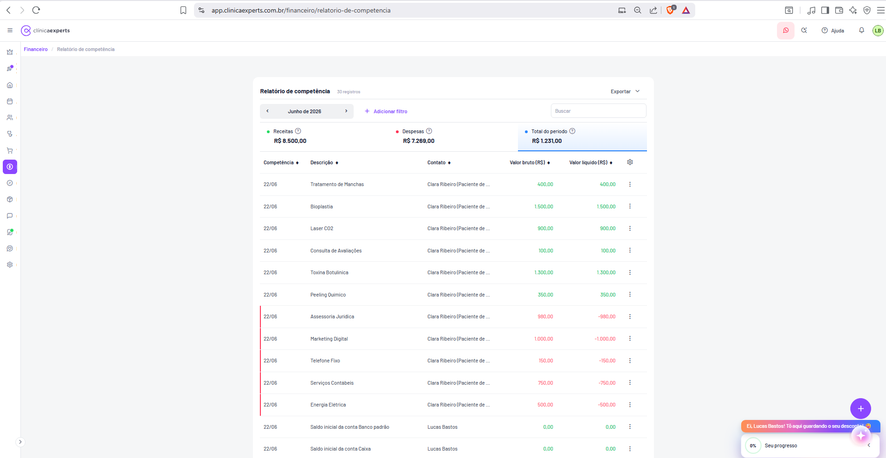

# Financeiro / Relatório de Competência

| Metadado | Valor |
|---|---|
| **Página** | Financeiro / Relatório de competência |
| **Rota** | `/financeiro/relatorio-de-competencia` |
| **URL completa** | `app.clinicaexperts.com.br/financeiro/relatorio-de-competencia` |
| **Módulo** | Financeiro |
| **Breadcrumb** | Financeiro / Relatório de competência |
| **Tela de referência (doc original)** | Tela 32 (`04-telas-31-a-40.md`) |
| **Tipo de página** | Relatório / Listagem com cards de resumo |
| **Autenticação** | Requerida (sessão de usuário logado — "LB" / Lucas Bastos) |
| **Idioma** | pt-BR |
| **Moeda** | BRL (R$) |
| **Período exibido no print** | Junho de 2026 |
| **Total de registros (print)** | 30 registros |



---

## 1. Identificação

- **Nome da página (título do card):** `Relatório de competência` (texto exato no cabeçalho do card).
- **Rota/URL:** `app.clinicaexperts.com.br/financeiro/relatorio-de-competencia` (sem query string visível no print).
- **Breadcrumb (em roxo, abaixo do header):** `Financeiro / Relatório de competência`.
  - O primeiro segmento `Financeiro` é link (navega ao índice do módulo) (inferido).
  - O segundo segmento `Relatório de competência` é o nó atual (não-clicável) (inferido).
- **Item de menu ativo:** ícone de **Financeiro** (cifrão) na sidebar vertical esquerda, destacado com fundo roxo arredondado.
- **Usuário logado:** avatar circular com iniciais `LB` (Lucas Bastos), borda verde, canto superior direito.
- **Badge de contagem (ao lado do título):** `30 registros` (texto cinza).

---

## 2. Objetivo

Apresentar os lançamentos financeiros da clínica pelo **regime de competência** — ou seja, organizados pela **data de competência** (data em que o fato gerador da receita/despesa ocorre, p.ex. data do procedimento prestado ou do serviço contratado), e **não** pela data de movimentação do caixa (recebimento/pagamento efetivo).

**Regime de competência vs. regime de caixa (contexto contábil):**

| Aspecto | Regime de competência (esta tela) | Regime de caixa (ex.: Fluxo de caixa diário/mensal) |
|---|---|---|
| Critério de data | Data do fato gerador (competência) | Data do efetivo recebimento/pagamento |
| Pergunta que responde | "Quanto eu gerei/devi neste mês?" | "Quanto entrou/saiu de dinheiro neste mês?" |
| Inclui valores ainda não pagos/recebidos | Sim (basta a competência cair no período) | Não (só o que liquidou) |
| Uso típico | Apuração de resultado (DRE), análise de margem | Gestão de liquidez/saldo |

- Esta tela é **complementar** ao **Extrato de movimentação** (Tela 31, regime de liquidação/caixa) e ao **Fluxo de caixa** (Telas 33/34, regime de caixa).
- Diferencia-se do extrato por **organizar por competência** e por **exibir Valor bruto e Valor líquido lado a lado**, com o contato vinculado a cada lançamento.
- Resultado do período = **Receitas − Despesas** dentro da competência selecionada (ver Seção 13).

---

## 3. Navegação

**Como se chega aqui:**
- Via sidebar **Financeiro** → submenu/relatórios → `Relatório de competência` (inferido — o submenu de relatórios financeiros não aparece neste print).
- Via URL direta `/financeiro/relatorio-de-competencia`.
- Via breadcrumb a partir de outra tela do módulo Financeiro (inferido).

**Para onde se navega a partir daqui:**
- Breadcrumb `Financeiro` → índice do módulo Financeiro (inferido).
- Setas `‹` / `›` do seletor de período → recarrega a mesma tela para o mês anterior/seguinte (inferido).
- Menu de ações `⋮` por linha → editar/excluir/visualizar lançamento (inferido — provável modal ou rota de edição do lançamento financeiro).
- Botão `Exportar` → gera arquivo (download), sem mudança de rota (inferido).
- Clique numa linha → abre detalhe do lançamento (inferido).

**Elementos globais persistentes** (presentes em todas as telas, ver `04-telas-31-a-40.md` "Elementos comuns"):
- Header do app (logo `clínicaexperts`, hambúrguer, WhatsApp, busca, `Ajuda`, sino, avatar `LB`).
- Sidebar vertical de ícones.
- Botão flutuante circular roxo `+` (canto inferior direito).
- Widget de onboarding laranja: `Ei, Lucas Bastos! Tô aqui guardando o seu desconto!` + card `0%` / `Seu progresso`.

---

## 4. Layout

Estrutura de cima para baixo, da esquerda para a direita:

1. **Header do app** (faixa branca no topo) — global.
2. **Breadcrumb** `Financeiro / Relatório de competência` — em roxo, logo abaixo do header.
3. **Área de conteúdo** — fundo cinza claro, com um único **card branco** central (cantos arredondados, sombra leve) ocupando a largura útil.

**Dentro do card** (ordem vertical):

1. **Linha de cabeçalho do card:**
   - Esquerda: título `Relatório de competência` (negrito) + badge cinza `30 registros`.
   - Direita: botão `Exportar` com ícone de seta para baixo `⌄`.
2. **Barra de filtros** (linha logo abaixo do cabeçalho):
   - Esquerda: seletor de período mensal — pílula com `‹` + rótulo central `Junho de 2026` + `›`.
   - Meio-esquerda: link roxo `+ Adicionar filtro`.
   - Direita: campo de busca com placeholder `Buscar`.
3. **Faixa de 3 cards de resumo** (lado a lado): `Receitas`, `Despesas`, `Total do período`.
4. **Tabela** de lançamentos (cabeçalho de colunas + linhas), com ícone de **engrenagem** (configurar colunas) à direita do cabeçalho da tabela.

A área da tabela possui **rolagem vertical** (30 registros; apenas ~13 visíveis no print).

**Sidebar vertical esquerda (ícones, de cima para baixo, aprox.):** coroa/destaque, foguete/automação, casa (início), agenda/carteira, pessoas, procedimentos, carrinho (PDV), **cifrão/financeiro (ativo, roxo)**, selo/CRM, cubo/estoque, balão de chat, marketing, suporte, engrenagem (configurações).

---

## 5. Componentes

### 5.1 Cards de resumo (3) — VALORES EXATOS do print

Cada card tem: bolinha colorida + rótulo + ícone de ajuda `?` (tooltip) + valor monetário.

| # | Rótulo (texto exato) | Cor da bolinha | Valor exato (Junho de 2026) | Observação |
|---|---|---|---|---|
| 1 | `Receitas` | Verde | `R$ 8.500,00` | Ícone `?` ao lado do rótulo |
| 2 | `Despesas` | Vermelha | `R$ 7.269,00` | Ícone `?` ao lado do rótulo |
| 3 | `Total do período` | Azul | `R$ 1.231,00` | **Card ativo/destacado** com linha/borda inferior azul |

- Conferência do cálculo: `8.500,00 − 7.269,00 = 1.231,00` ✓ (ver Seção 13).
- Os ícones `?` exibem tooltip explicativo ao hover (inferido — texto não visível no print).
- O card `Total do período` aparece selecionado (destaque azul), sugerindo que os cards funcionam como abas/filtros visuais (inferido).

### 5.2 Gráficos

- **Não há gráfico nesta tela.** Esta página é puramente tabular + cards de resumo (diferente das telas de Fluxo de caixa 33/34 e Relatório de categorias 35, que possuem gráficos).

### 5.3 Botões e controles

| Componente | Texto/Ícone exato | Tipo | Ação (inferida) |
|---|---|---|---|
| Exportar | `Exportar` + `⌄` | Botão dropdown | Abre menu de formatos de exportação (PDF/Excel/CSV) |
| Seletor mês anterior | `‹` | Botão ícone | Navega ao mês anterior |
| Rótulo do período | `Junho de 2026` | Label (clicável?) | Possível abertura de date picker de mês/ano |
| Seletor próximo mês | `›` | Botão ícone | Navega ao mês seguinte |
| Adicionar filtro | `+ Adicionar filtro` | Link/botão roxo | Abre painel/popover de filtros adicionais |
| Busca | placeholder `Buscar` | Campo texto | Filtra linhas por texto |
| Configurar colunas | ícone engrenagem `⚙` | Botão ícone | Abre menu de colunas visíveis |
| Ordenação por coluna | seta `⬍` em cada cabeçalho | Toggle | Ordena asc/desc pela coluna |
| Ações por linha | `⋮` | Menu kebab | Editar / excluir / ver lançamento |
| Botão flutuante | `+` (roxo, circular) | FAB global | Adicionar novo lançamento (inferido) |

---

## 6. Tabela

**Cabeçalho da tabela** (cada coluna com seta de ordenação `⬍`; engrenagem `⚙` no canto direito do cabeçalho):

| Ordem | Coluna (texto exato) | Tipo de dado | Alinhamento | Cor/condicional |
|---|---|---|---|---|
| 1 | `Competência` | Data (DD/MM) | Esquerda | Neutro |
| 2 | `Descrição` | Texto | Esquerda | Neutro |
| 3 | `Contato` | Texto (nome + papel) | Esquerda | Neutro |
| 4 | `Valor bruto (R$)` | Monetário | Direita | Verde (receita) / vermelho (despesa) |
| 5 | `Valor líquido (R$)` | Monetário | Direita | Verde positivo / vermelho negativo (com sinal `-`) |
| 6 | (ações) | — | Direita | Menu `⋮` |

> Observação: o campo **`Contato`** aparece truncado no print como `Clara Ribeiro (Paciente de ...` — o texto completo é cortado por largura de coluna (ellipsis). Valor completo provável: `Clara Ribeiro (Paciente de [nome da clínica/profissional])` (inferido).

**Dados de exemplo (linhas exatas do print — competência 22/06):**

| Competência | Descrição | Contato | Valor bruto (R$) | Valor líquido (R$) | Tipo |
|---|---|---|---|---|---|
| 22/06 | Tratamento de Manchas | Clara Ribeiro (Paciente de ... | 400,00 | 400,00 | Receita |
| 22/06 | Bioplastia | Clara Ribeiro (Paciente de ... | 1.500,00 | 1.500,00 | Receita |
| 22/06 | Laser CO2 | Clara Ribeiro (Paciente de ... | 900,00 | 900,00 | Receita |
| 22/06 | Consulta de Avaliações | Clara Ribeiro (Paciente de ... | 100,00 | 100,00 | Receita |
| 22/06 | Toxina Botulínica | Clara Ribeiro (Paciente de ... | 1.300,00 | 1.300,00 | Receita |
| 22/06 | Peeling Químico | Clara Ribeiro (Paciente de ... | 350,00 | 350,00 | Receita |
| 22/06 | Assessoria Jurídica | Clara Ribeiro (Paciente de ... | 980,00 | -980,00 | Despesa |
| 22/06 | Marketing Digital | Clara Ribeiro (Paciente de ... | 1.000,00 | -1.000,00 | Despesa |
| 22/06 | Telefone Fixo | Clara Ribeiro (Paciente de ... | 150,00 | -150,00 | Despesa |
| 22/06 | Serviços Contábeis | Clara Ribeiro (Paciente de ... | 750,00 | -750,00 | Despesa |
| 22/06 | Energia Elétrica | Clara Ribeiro (Paciente de ... | 500,00 | -500,00 | Despesa |
| 22/06 | Saldo inicial da conta Banco padrão | Lucas Bastos | 0,00 | 0,00 | Saldo inicial |
| 22/06 | Saldo inicial da conta Caixa | Lucas Bastos | 0,00 | 0,00 | Saldo inicial |

(As 17 linhas restantes — total de 30 — não aparecem no print; acessíveis via rolagem.)

**Formatação condicional observada:**
- Linhas de **receita**: valores em **verde**; valor líquido positivo (sem sinal).
- Linhas de **despesa**: valores em **vermelho**; valor líquido **negativo** com sinal `-`; **barra/realce vertical vermelho** à esquerda da linha.
- Linhas de **saldo inicial**: valor `0,00`, contato = nome do usuário (`Lucas Bastos`), sem realce de cor (neutro).

**Totais:**
- Os totais agregados são exibidos nos **cards de resumo** (Seção 5.1), não em uma linha de rodapé da tabela:
  - Total Receitas: `R$ 8.500,00`
  - Total Despesas: `R$ 7.269,00`
  - Total do período (resultado): `R$ 1.231,00`
- Não há linha de "Total" no rodapé da tabela no print (inferido — totalização está concentrada nos cards).

**Paginação:** não visível no print (a tabela aparenta usar rolagem contínua para os 30 registros) (inferido). Outras telas do módulo usam `25 por página`; é possível que esta também possua paginação fora da área visível (inferido).

---

## 7. Formulários

- **Não há formulário de cadastro/edição na própria página** (é uma tela de relatório/listagem).
- O único controle de entrada direta é o **campo de busca** (`Buscar`) — input de texto livre que filtra a tabela.
- Edição de um lançamento ocorre fora desta tela (via `⋮` → editar, provavelmente em modal ou rota dedicada do lançamento financeiro) (inferido).
- Inclusão de novo lançamento via FAB `+` (inferido).

---

## 8. Filtros

| Filtro | Controle | Valor no print | Comportamento (inferido) |
|---|---|---|---|
| **Período (mês de competência)** | Seletor `‹ Junho de 2026 ›` | `Junho de 2026` | Define a competência exibida; granularidade mensal; `‹`/`›` decrementam/incrementam o mês |
| **Filtros adicionais** | Link `+ Adicionar filtro` | (nenhum aplicado) | Abre popover para adicionar critérios: **categoria**, tipo (receita/despesa), contato, conta, valor etc. |
| **Busca textual** | Campo `Buscar` | (vazio) | Filtra por Descrição/Contato em tempo real |

- **Intervalo:** a navegação é por **mês** (não por intervalo livre de datas como no Extrato). Diferente da Tela 31, aqui o seletor é mensal (`Junho de 2026`), não um chip de intervalo `DD/MM/AAAA - DD/MM/AAAA`.
- **Categoria:** disponível via `+ Adicionar filtro` (inferido — categorias do plano de contas, ver Tela 37 "Categorias de contas").
- Filtros aplicados recalculam os 3 cards de resumo e a tabela (inferido).

---

## 9. Estados

| Estado | Descrição |
|---|---|
| **Populado** (print) | 30 registros; cards com valores; tabela com rolagem. |
| **Vazio** (inferido) | Mês sem lançamentos → padrão do sistema (ver Telas 39/40): ícone `ⓘ` roxo centralizado + `Hmm, está vazio por aqui!` + subtexto `Nenhum registro encontrado.`; cards de resumo zerados (`R$ 0,00`). |
| **Carregando** (inferido) | Skeleton/spinner enquanto busca dados da competência. |
| **Erro** (inferido) | Mensagem de falha ao carregar relatório + ação de tentar novamente. |
| **Filtro sem resultado** (inferido) | Busca/filtro sem correspondência → estado vazio com texto de "nenhum registro encontrado". |

---

## 10. Modais

Nenhum modal está aberto no print. Modais/popovers prováveis (inferido):

| Gatilho | Conteúdo (inferido) |
|---|---|
| `Exportar` `⌄` | Dropdown de formatos: PDF, Excel (XLSX), CSV |
| `+ Adicionar filtro` | Popover de seleção de campo + operador + valor (categoria, tipo, contato, conta, faixa de valor) |
| `⚙` (engrenagem) | Popover de seleção de colunas visíveis e ordem |
| `⋮` (ações por linha) | Menu: `Editar`, `Excluir`, `Ver detalhes` |
| Rótulo `Junho de 2026` | Date picker de mês/ano (inferido) |
| FAB `+` | Modal/rota de novo lançamento financeiro (inferido) |

---

## 11. Modelo de dados inferido

```ts
// Lançamento financeiro pelo regime de competência
interface LancamentoCompetencia {
  id: string;
  competencia: string;          // ISO date "2026-06-22" (exibido DD/MM)
  descricao: string;            // ex.: "Tratamento de Manchas"
  contato: {
    id: string;
    nome: string;               // ex.: "Clara Ribeiro"
    papel: string;              // ex.: "Paciente" | "Profissional" | usuário
  } | null;
  tipo: "receita" | "despesa" | "saldo_inicial";
  valorBruto: number;           // ex.: 980.00
  valorLiquido: number;         // ex.: -980.00 (negativo p/ despesa)
  categoria?: {                 // (inferido) plano de contas
    id: string;
    nome: string;               // ex.: "Receitas de serviços", "Outras despesas"
  };
  conta?: {                     // (inferido) conta financeira vinculada
    id: string;
    nome: string;               // ex.: "Banco padrão", "Caixa"
  };
}

// Resposta agregada do relatório
interface RelatorioCompetenciaResponse {
  periodo: { ano: number; mes: number };   // 2026 / 6
  resumo: {
    receitas: number;           // 8500.00
    despesas: number;           // 7269.00
    totalPeriodo: number;       // 1231.00  (receitas - despesas)
  };
  totalRegistros: number;       // 30
  itens: LancamentoCompetencia[];
}
```

**Notas do modelo:**
- `valorLiquido` pode diferir de `valorBruto` quando houver descontos/taxas (inferido — no print, receitas têm bruto = líquido; despesas têm líquido = −bruto).
- `tipo = "saldo_inicial"` para lançamentos `Saldo inicial da conta X` (valor `0,00`, contato = usuário).
- A diferença bruto/líquido é exibida lado a lado (característica distintiva desta tela).

---

## 12. Endpoints API inferidos

> Todos **inferidos** — base provável `app.clinicaexperts.com.br/api` (ou backend equivalente).

| Método | Endpoint (inferido) | Descrição |
|---|---|---|
| GET | `/api/financeiro/relatorio-de-competencia?ano=2026&mes=6` | Lista lançamentos + resumo da competência |
| GET | `/api/financeiro/relatorio-de-competencia?ano=2026&mes=6&q={texto}` | Com busca textual |
| GET | `/api/financeiro/relatorio-de-competencia?ano=2026&mes=6&categoria={id}&tipo={receita\|despesa}` | Com filtros adicionais |
| GET | `/api/financeiro/relatorio-de-competencia/export?ano=2026&mes=6&formato={pdf\|xlsx\|csv}` | Exportação |
| GET | `/api/financeiro/lancamentos/{id}` | Detalhe de um lançamento (via `⋮`/clique) |
| PUT/PATCH | `/api/financeiro/lancamentos/{id}` | Editar lançamento |
| DELETE | `/api/financeiro/lancamentos/{id}` | Excluir lançamento |

**Parâmetros de query prováveis:** `ano`, `mes`, `q` (busca), `categoria`, `tipo`, `contato`, `conta`, `ordenarPor`, `ordem` (asc/desc), `page`/`perPage`.

---

## 13. Regras / Cálculos

1. **Agrupamento por competência:** lançamentos entram no relatório se sua **data de competência** estiver dentro do mês selecionado (`Junho de 2026`), independentemente de já terem sido pagos/recebidos.

2. **Resultado do período (regra principal):**
   ```
   totalPeriodo = somaReceitas − somaDespesas
   ```
   Conferência com o print:
   ```
   Receitas  = 8.500,00
   Despesas  = 7.269,00
   Total     = 8.500,00 − 7.269,00 = 1.231,00  ✓
   ```

3. **Sinal do Valor líquido:**
   - Receita → líquido **positivo** (`+`), cor verde.
   - Despesa → líquido **negativo** (`−`), cor vermelha.
   - Saldo inicial → `0,00` (neutro).

4. **Soma de Receitas (card):** soma de `valorLiquido` (ou `valorBruto`) das linhas tipo receita. No print as receitas têm bruto = líquido, então: `400 + 1.500 + 900 + 100 + 1.300 + 350 + ... = 8.500,00` (linhas além das visíveis completam o total).

5. **Soma de Despesas (card):** soma dos valores absolutos das despesas = `7.269,00` (inclui `980 + 1.000 + 150 + 750 + 500 + ...`, mais linhas não visíveis).

6. **Bruto vs. Líquido:** `valorLiquido = valorBruto − descontos/taxas` (inferido). No print não há diferença bruto/líquido nas linhas visíveis.

7. **Formatação monetária:** padrão pt-BR — separador de milhar `.`, decimal `,`, prefixo `R$`, sempre 2 casas. Negativos com `-` antes do número.

8. **Realce vermelho de linha:** aplicado quando `tipo = "despesa"` (barra vertical à esquerda).

---

## 14. Fluxos

**Fluxo 1 — Consultar resultado de uma competência:**
1. Usuário acessa `/financeiro/relatorio-de-competencia`.
2. Sistema carrega o mês corrente (ou último selecionado) → exibe cards + tabela.
3. Usuário usa `‹`/`›` para navegar entre meses → cards e tabela recalculam.

**Fluxo 2 — Filtrar/buscar:**
1. Usuário digita em `Buscar` ou clica `+ Adicionar filtro`.
2. Tabela e cards de resumo são recalculados conforme o filtro (inferido).

**Fluxo 3 — Exportar:**
1. Usuário clica `Exportar` `⌄` → escolhe formato (PDF/Excel/CSV).
2. Sistema gera e baixa o arquivo da competência/filtros atuais (inferido).

**Fluxo 4 — Editar/excluir lançamento:**
1. Usuário clica `⋮` numa linha → menu de ações.
2. Seleciona Editar (abre modal/rota) ou Excluir (confirmação) (inferido).

**Fluxo 5 — Configurar colunas:**
1. Usuário clica engrenagem `⚙` → seleciona colunas visíveis → tabela ajusta (inferido).

**Fluxo 6 — Ordenar:**
1. Usuário clica na seta `⬍` de uma coluna → alterna ordenação asc/desc (inferido).

---

## 15. Notas de implementação

- **Distinção conceitual obrigatória:** esta tela é **regime de competência** — não confundir com Extrato de movimentação (Tela 31, liquidação) nem Fluxo de caixa (Telas 33/34, caixa). A data-chave é a **competência**, não vencimento/execução.
- **Seletor mensal (não intervalo):** ao contrário do Extrato (chip de intervalo de datas), aqui o filtro temporal é **mês a mês** (`Junho de 2026` com `‹`/`›`). Implementar navegação por mês/ano, não por range arbitrário.
- **Cards de resumo derivam dos dados filtrados:** Receitas, Despesas e Total do período devem recalcular sempre que mês/busca/filtros mudarem. Manter a invariante `Total = Receitas − Despesas`.
- **Card "Total do período" destacado:** linha/borda azul inferior sugere estado "ativo/selecionado". Confirmar se os cards são meramente informativos ou se funcionam como filtros clicáveis (no Extrato, Tela 31, os cards parecem alternar a visão). (inferido)
- **Truncamento de Contato:** coluna `Contato` usa ellipsis (`Clara Ribeiro (Paciente de ...`). Garantir tooltip com texto completo ao hover. (inferido)
- **Cores semânticas:** receita = verde, despesa = vermelho (com líquido negativo e barra vertical esquerda). Saldo inicial = neutro com valor `0,00`.
- **Lançamentos de saldo inicial:** `Saldo inicial da conta Banco padrão` / `Saldo inicial da conta Caixa` aparecem na competência com valor `0,00` e contato = usuário (`Lucas Bastos`). São registros de abertura de conta — tratar como tipo distinto (`saldo_inicial`) para não poluir somas de receita/despesa.
- **Engrenagem de colunas e ordenação:** todas as colunas exibem seta de ordenação; implementar ordenação client/server e persistência da preferência de colunas (inferido).
- **Exportação:** dropdown `Exportar` deve respeitar competência e filtros atuais; formatos prováveis PDF/Excel/CSV (inferido).
- **i18n/formatação:** locale `pt-BR`, moeda `BRL`, datas `DD/MM` na tabela e `MMMM de AAAA` no seletor de período.
- **Paginação:** confirmar se há paginação (`25 por página` como nas telas vizinhas) ou rolagem infinita para os 30 registros (inferido).
- **Elementos globais** (header, sidebar, FAB `+`, widget de onboarding) seguem o padrão descrito em `04-telas-31-a-40.md` → "Elementos comuns a todas as telas".
