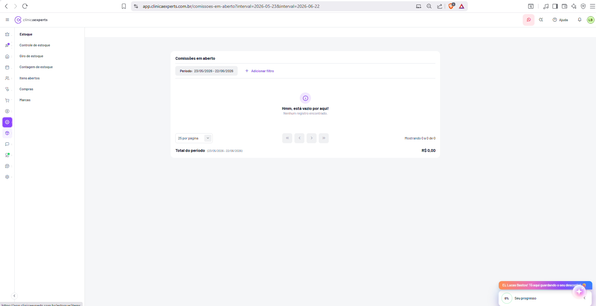

# Financeiro / Comissões em Aberto

| Metadado | Valor |
|---|---|
| **Página** | Comissões em aberto |
| **Módulo** | Financeiro (exibida na área de conteúdo sob o submenu de Estoque) |
| **Rota** | `/comissoes-em-aberto` |
| **URL completa (do print)** | `app.clinicaexperts.com.br/comissoes-em-aberto?interval=2026-05-23&interval=2026-06-22` |
| **Breadcrumb** | Financeiro / Comissões em aberto *(inferido)* |
| **Tela de referência** | Tela 39 (`docs/04-telas-31-a-40.md`) |
| **Imagem** | `` |
| **Estado no print** | Vazio (nenhuma comissão no período) |
| **Idioma** | pt-BR |
| **Perfil/permissão** | Financeiro / Admin *(inferido)* |
| **Data de captura** | 2026-06-22 |

---

## 1. Identificação

- **Nome da página:** Comissões em aberto
- **Título do card (texto exato):** `Comissões em aberto`
- **Rota:** `/comissoes-em-aberto`
- **URL observada:** `app.clinicaexperts.com.br/comissoes-em-aberto?interval=2026-05-23&interval=2026-06-22`
- **Query string:** dois parâmetros `interval` (data inicial `2026-05-23` e data final `2026-06-22`), formando o período de apuração `23/05/2026 - 22/06/2026`.
- **Módulo de pertencimento:** Financeiro. Observação: no print, o painel lateral secundário exibido é o submenu **"Estoque"** (Controle de estoque, Giro de estoque, Contagem de estoque, Itens abertos, Compras, Marcas), porém a rota é de nível raiz (`/comissoes-em-aberto`, sem prefixo `/financeiro/`). O ícone ativo na sidebar primária é o de Estoque/cubo (roxo destacado). A página conceitualmente pertence ao Financeiro (comissões a pagar) mas é acessada a partir do contexto de Estoque/Compras. *(inferido: o vínculo de menu é Estoque; o domínio de negócio é Financeiro.)*
- **Tipo de página:** listagem/relatório transacional com totalização e (quando populada) ação de pagamento.

---

## 2. Objetivo

Listar e apurar as **comissões de profissionais/vendedores a pagar** (comissões "em aberto", isto é, ainda não quitadas) dentro de um período selecionado, permitindo ao gestor financeiro:

- Visualizar cada comissão pendente, com o profissional beneficiário, a origem (procedimento/venda), a base de cálculo, o percentual aplicado e o valor da comissão.
- Conhecer o **total a pagar** no período (`Total do período`).
- **Quitar (pagar)** comissões individualmente ou em massa, gerando o lançamento financeiro correspondente (conta a pagar). *(inferido — no print não há registros para exibir a ação.)*
- Exportar a relação para conferência/auditoria. *(inferido)*

Regra de negócio central: a comissão é o valor devido a um profissional pela execução de um procedimento ou pela realização de uma venda, calculada como **base × percentual**. "Em aberto" significa `status = pendente` (ainda não paga). A categoria financeira correspondente, vista na Tela 37, é **Comissões → Comissões de profissionais / Comissões de vendedores**.

---

## 3. Navegação

- **Como se chega:** via submenu lateral (no print, o contexto é o submenu **Estoque**) ou via item de menu do Financeiro / atalho direto pela URL `/comissoes-em-aberto`. *(inferido: também acessível a partir de relatórios financeiros.)*
- **Sidebar primária (ícones):** ícone ativo = Estoque/cubo (roxo). Demais ícones padrão (coroa, foguete, início, agenda, pessoas, procedimentos, carrinho, financeiro/cifrão, CRM, chat, marketing, suporte, engrenagem).
- **Painel lateral secundário (submenu "Estoque"):**
  - `Controle de estoque` → `/estoque/items`
  - `Giro de estoque`
  - `Contagem de estoque`
  - `Itens abertos`
  - `Compras`
  - `Marcas`
  - *(Nota: "Comissões em aberto" não aparece destacado como item desse submenu no print, embora seja a página renderizada — provável item de submenu de Compras/Financeiro ou acesso direto. (inferido))*
- **Header padrão:** menu hambúrguer (☰), logo `clínicaexperts`, ícone WhatsApp, busca, link `Ajuda`, sino de notificações, avatar `LB` (Lucas Bastos).
- **Saídas de navegação (quando populada, inferido):**
  - Clique no nome do profissional → ficha do profissional.
  - Clique no procedimento/venda → detalhe da venda/atendimento de origem.
  - Ação "Pagar" → modal de pagamento → ao confirmar, redireciona/atualiza a lista e cria conta a pagar em Financeiro.
- **Botão flutuante "+"** (canto inferior direito): ação rápida de adicionar registro (padrão do app).

---

## 4. Layout

Estrutura de cima para baixo, dentro da área de conteúdo (fundo cinza claro, card branco centralizado com cantos arredondados e sombra leve):

1. **Header do app** (topo, fundo branco) — padrão.
2. **Painel lateral secundário** (coluna estreita à esquerda da área de conteúdo) — título `Estoque` + itens de navegação.
3. **Card principal** (centralizado):
   1. **Cabeçalho do card:** título `Comissões em aberto` (à esquerda). *(À direita, quando populada: botões de ação `Pagar`/`Exportar` — inferido; não visíveis no estado vazio.)*
   2. **Barra de filtros:** chip `Período: 23/05/2026 - 22/06/2026` + link `+ Adicionar filtro`.
   3. **Área de conteúdo / tabela:** no print, **estado vazio** centralizado (ícone ⓘ roxo + textos).
   4. **Rodapé de paginação:** seletor `25 por página` (esquerda) + controles de paginação `«` `‹` `›` `»` (desabilitados) + texto `Mostrando 0 a 0 de 0` (direita).
   5. **Linha de total:** `Total do período (23/05/2026 - 22/06/2026)` à esquerda + valor `R$ 0,00` à direita.
4. **Widget de onboarding/promoção** (canto inferior direito, sobreposto): faixa laranja `Ei, Lucas Bastos! Tô aqui guardando o seu desconto!` + card `0%` `Seu progresso`. *(elemento global, não pertence à página.)*

Larguras: card principal ocupa a faixa central; painel lateral secundário fixo à esquerda. Layout responsivo de uma coluna no card.

---

## 5. Componentes

### 5.1 Cabeçalho do card
- **Título (texto exato):** `Comissões em aberto`.
- **Botão `Pagar comissões`** *(inferido — texto provável; alternativas: `Pagar selecionadas`, `Pagar`)*: botão primário roxo, habilitado apenas quando houver itens selecionados. Não visível no estado vazio.
- **Botão `Exportar`** *(inferido — consistente com as demais telas Financeiro/Estoque)*: botão com rótulo `Exportar` + seta para baixo (dropdown com `PDF`, `Excel`, `CSV` — inferido). Esmaecido/desabilitado quando não há registros.

### 5.2 Cards de totais
No print **não há faixa de cards de resumo** (diferente das telas de Extrato/Competência). O único indicador de total é a **linha de total no rodapé do card**:

| Indicador | Texto exato | Valor exato (no print) |
|---|---|---|
| Total a pagar no período | `Total do período` (com `(23/05/2026 - 22/06/2026)` ao lado em fonte menor) | `R$ 0,00` |

*(inferido: quando populada, poderia exibir cards adicionais como "Comissões a pagar" e "Comissões pagas"; não confirmado no print.)*

### 5.3 Badges
- **Badge de contagem de registros** *(inferido — padrão das telas-irmãs, ex.: "30 registros")*: ao lado do título quando houver itens. Ausente no estado vazio.
- **Badge de status por linha (coluna Status):** valores prováveis:
  - `Em aberto` / `Pendente` — cor amarela/laranja *(inferido)*.
  - `Pago` — cor verde *(inferido)*.
  - `Cancelado` — cor cinza/vermelha *(inferido)*.

### 5.4 Ícone de estado vazio
- Ícone circular de informação **ⓘ** em roxo, centralizado.

### 5.5 Seletor de paginação
- Dropdown `25 por página` (opções típicas: 10, 25, 50, 100 — inferido).

---

## 6. Tabela

No estado vazio a tabela não é renderizada; a estrutura abaixo é **inferida** a partir do objetivo da tela e dos campos pedidos, alinhada ao padrão visual das demais telas Financeiro.

### 6.1 Colunas

| # | Coluna (texto exato esperado) | Conteúdo | Tipo/Formato | Ordenável |
|---|---|---|---|---|
| 1 | *(checkbox)* | Seleção em massa | checkbox | não |
| 2 | `Profissional` | Nome do profissional/vendedor beneficiário | texto (link p/ ficha) | sim |
| 3 | `Procedimento / Venda` | Origem da comissão (nome do procedimento ou descrição da venda) | texto (link p/ origem) | sim |
| 4 | `Data` | Data de referência (execução/competência da venda/atendimento) | `dd/mm/aaaa` | sim |
| 5 | `Base` | Valor base de cálculo da comissão | moeda `R$ #.###,##` | sim |
| 6 | `%` | Percentual de comissão aplicado | percentual `##,##%` | sim |
| 7 | `Valor comissão` | Valor calculado (`Base × %`) | moeda `R$ #.###,##` | sim |
| 8 | `Status` | Situação da comissão (badge) | badge (`Em aberto`/`Pago`) | sim |
| 9 | `Ações` | Menu/botão por linha | botão `Pagar` + menu `⋮` | não |

*(Todos os rótulos de coluna marcados como "esperado" são inferidos; o print só evidencia a existência da listagem, da paginação e do total.)*

### 6.2 Ações por linha
- **`Pagar`** (botão/link na coluna Ações): abre o **modal de pagamento da comissão** (ver seção 10). *(inferido)*
- **Menu `⋮`** *(inferido)*: opções como `Ver detalhes`, `Editar`, `Cancelar comissão`.

### 6.3 Seleção em massa
- **Checkbox no cabeçalho** seleciona/deseleciona todas as linhas da página.
- **Checkbox por linha** seleciona itens individuais.
- Ao haver seleção, habilita o botão `Pagar comissões` (cabeçalho) para **pagamento em lote**. *(inferido)*
- Barra de seleção mostrando "N selecionado(s)" e soma dos valores selecionados. *(inferido)*

### 6.4 Totais / rodapé
- **Linha de total (texto exato):** `Total do período` + período entre parênteses `(23/05/2026 - 22/06/2026)` + valor `R$ 0,00`.
- O total representa a **soma dos valores de comissão em aberto** no período filtrado.
- **Paginação:** `Mostrando 0 a 0 de 0` (formato `Mostrando X a Y de Z`); controles `«` (primeira) `‹` (anterior) `›` (próxima) `»` (última), desabilitados quando há ≤1 página.
- **Itens por página:** `25 por página`.

---

## 7. Formulários

A página é primariamente de listagem; não há formulário de cadastro na tela. Os formulários envolvidos são:

- **Formulário de filtro avançado** (acionado por `+ Adicionar filtro`) — ver seção 8.
- **Formulário do modal de pagamento** (ver seção 10): campos `Conta de origem`, `Método de pagamento`, `Data do pagamento`, `Valor`, `Observação`. *(inferido)*

A geração das comissões ocorre **fora desta tela** (ao concluir uma venda/atendimento com regra de comissão configurada), portanto não há "Adicionar comissão" manual evidente. *(inferido — pode existir lançamento manual via botão "+", não confirmado.)*

---

## 8. Filtros

### 8.1 Filtros visíveis no print
- **Período (chip ativo):** `Período: 23/05/2026 - 22/06/2026`.
  - Mapeado à query string `?interval=2026-05-23&interval=2026-06-22` (formato ISO `aaaa-mm-dd`, dois parâmetros `interval`: início e fim).
  - Clicável → abre seletor de intervalo de datas (date range picker). *(inferido)*
- **`+ Adicionar filtro`** (link roxo): abre painel/menu para adicionar filtros adicionais.

### 8.2 Filtros adicionais (inferidos, via "+ Adicionar filtro")
| Filtro | Tipo de controle | Valores |
|---|---|---|
| `Profissional` | select/autocomplete | lista de profissionais/vendedores |
| `Status` | select/checkbox | `Em aberto`, `Pago`, `Cancelado` |
| `Procedimento / Venda` | autocomplete | origem |
| `Conta financeira` | select | contas (Banco padrão, Caixa) |
| `Valor (mín/máx)` | range numérico | faixa de valor de comissão |

*(Observação: como a rota se chama "comissões **em aberto**", o status pode vir pré-fixado em `Em aberto`; o filtro de status pode existir para alternar a visualização. (inferido))*

---

## 9. Estados

### 9.1 Estado vazio (capturado no print)
- **Ícone:** ⓘ circular roxo, centralizado.
- **Título (texto exato):** `Hmm, está vazio por aqui!`
- **Subtexto (texto exato):** `Nenhum registro encontrado.`
- **Rodapé:** `Mostrando 0 a 0 de 0`; paginação desabilitada.
- **Total:** `Total do período (23/05/2026 - 22/06/2026)` → `R$ 0,00`.
- **Causa:** nenhuma comissão pendente no período `23/05/2026 - 22/06/2026`.

### 9.2 Estado populado *(inferido)*
- Tabela com linhas, badge de contagem ao lado do título, total > `R$ 0,00`, ações `Pagar` ativas, seleção em massa habilitada.

### 9.3 Estado de carregamento *(inferido)*
- Skeleton/placeholder de linhas enquanto carrega.

### 9.4 Estado de erro *(inferido)*
- Mensagem de falha ao carregar com botão "Tentar novamente".

### 9.5 Estado pós-pagamento *(inferido)*
- Comissão paga sai da listagem "em aberto" (ou muda badge para `Pago` se o filtro de status estiver "todos"); total recalculado; toast de sucesso.

---

## 10. Modais

### 10.1 Modal "Pagar comissão" *(inferido — não visível no print)*
- **Título:** `Pagar comissão` (ou `Registrar pagamento de comissão`).
- **Disparo:** botão `Pagar` da linha ou `Pagar comissões` (lote) no cabeçalho.
- **Resumo no topo:** profissional, origem (procedimento/venda), valor da comissão. Em lote: lista das comissões selecionadas + soma total.
- **Campos do formulário:**
  | Campo | Tipo | Obrigatório | Padrão |
  |---|---|---|---|
  | `Valor` | moeda | sim | valor da comissão (somatório, no lote) |
  | `Conta de origem` / `Conta financeira` | select | sim | conta padrão (ex.: Banco padrão) |
  | `Método de pagamento` | select | sim | (ex.: PIX, Transferência) |
  | `Data do pagamento` | date | sim | data atual (2026-06-22) |
  | `Categoria` | select | sim/auto | `Comissões → Comissões de profissionais` |
  | `Observação` | textarea | não | — |
- **Botões (texto inferido):** `Cancelar` (secundário) e `Confirmar pagamento` / `Pagar` (primário roxo).
- **Resultado:** marca a(s) comissão(ões) como `Pago`, cria conta a pagar/lançamento de despesa quitado e atualiza saldos.

### 10.2 Modal de confirmação de cancelamento *(inferido)*
- Para a ação "Cancelar comissão" do menu `⋮`.

---

## 11. Modelo de dados

### 11.1 Entidade `Comissao` *(inferido)*

| Campo | Tipo | Descrição |
|---|---|---|
| `id` | UUID / int | Identificador da comissão |
| `profissional_id` | FK → `Profissional` | Beneficiário da comissão |
| `venda_id` | FK → `Venda` (nullable) | Venda de origem |
| `procedimento_id` | FK → `Procedimento`/`Atendimento` (nullable) | Atendimento de origem |
| `origem_tipo` | enum (`venda`, `procedimento`) | Tipo da origem (procedimento/venda) |
| `data_referencia` | date | Data de execução/competência (coluna `Data`) |
| `base` | decimal(12,2) | Base de cálculo (coluna `Base`) |
| `percentual` | decimal(5,2) | Percentual aplicado (coluna `%`) |
| `valor_comissao` | decimal(12,2) | `base × percentual` (coluna `Valor comissão`) |
| `status` | enum (`em_aberto`/`pendente`, `pago`, `cancelado`) | Situação (coluna `Status`) |
| `data_pagamento` | datetime (nullable) | Quando foi paga |
| `conta_pagar_id` | FK → `ContaPagar`/`Lancamento` (nullable) | Lançamento gerado no pagamento |
| `conta_financeira_id` | FK → `Conta` (nullable) | Conta usada no pagamento |
| `metodo_pagamento_id` | FK → `MetodoPagamento` (nullable) | Método usado no pagamento |
| `categoria_id` | FK → `Categoria` | `Comissões de profissionais`/`de vendedores` |
| `created_at` / `updated_at` | datetime | Auditoria |

### 11.2 Relações
- `Comissao` **N:1** `Profissional` (um profissional possui muitas comissões).
- `Comissao` **N:1** `Venda` e/ou `N:1` `Procedimento`/`Atendimento` (a comissão deriva de uma venda **ou** de um procedimento).
- `Comissao` **N:1** `Categoria` (Comissões de profissionais/vendedores — ver Tela 37).
- `Comissao` **1:1/0..1** `ContaPagar`/`Lancamento` (criado ao pagar — ver seção 14).
- `Comissao` **N:1** `Conta` e `N:1` `MetodoPagamento` (preenchidos no pagamento).

### 11.3 Distinção profissional × vendedor
- A categoria pai `Comissões` (Tela 37) possui subcategorias `Comissões de profissionais` e `Comissões de vendedores`, sugerindo um campo discriminador (`tipo_beneficiario`: `profissional`/`vendedor`) ou que `Profissional` cubra ambos os papéis. *(inferido)*

---

## 12. Endpoints API (inferidos)

| Método | Endpoint *(inferido)* | Descrição |
|---|---|---|
| `GET` | `/api/comissoes?status=em_aberto&interval=2026-05-23&interval=2026-06-22&page=1&per_page=25` | Lista comissões em aberto do período (paginado) |
| `GET` | `/api/comissoes/totais?status=em_aberto&interval=...` | Total a pagar no período (`Total do período`) |
| `GET` | `/api/comissoes/{id}` | Detalhe de uma comissão |
| `POST` | `/api/comissoes/{id}/pagar` | Registra pagamento de uma comissão (body: conta, método, data, valor, observação) |
| `POST` | `/api/comissoes/pagar-lote` | Pagamento em massa (body: `ids[]`, conta, método, data) |
| `PATCH` | `/api/comissoes/{id}/cancelar` | Cancela uma comissão |
| `GET` | `/api/comissoes/export?formato=pdf\|xlsx\|csv&interval=...` | Exporta a relação |
| `GET` | `/api/profissionais?ativo=true` | Popular filtro de profissional |

- **Parâmetros de query comuns:** `interval` (×2, início/fim ISO), `status`, `profissional_id`, `page`, `per_page`, `sort`, `order`.
- **Resposta de listagem (inferida):** `{ data: [Comissao], meta: { total, page, per_page, total_periodo } }`.

---

## 13. Regras / cálculos

- **Cálculo da comissão:** `valor_comissao = base × (percentual / 100)`.
  - `base` = valor de referência (valor do procedimento/venda, ou valor líquido conforme regra configurada).
  - `percentual` = taxa de comissão do profissional para aquele procedimento/venda.
  - Arredondamento monetário a 2 casas (`R$`, padrão pt-BR com `.` milhar e `,` decimal).
- **"Em aberto":** `status ∈ {em_aberto, pendente}` e `data_pagamento = null`.
- **Total do período:** `Σ valor_comissao` das comissões em aberto cujo `data_referencia` ∈ intervalo `[interval_inicio, interval_fim]`. No print: `R$ 0,00` (conjunto vazio).
- **Filtro de período:** inclusivo nas duas pontas (`23/05/2026` a `22/06/2026`).
- **Geração:** comissões são criadas automaticamente ao concluir vendas/atendimentos com regra de comissão configurada para o profissional. *(inferido)*
- **Pagamento:** muda `status` para `pago`, grava `data_pagamento`, `conta_financeira_id`, `metodo_pagamento_id` e vincula o lançamento financeiro gerado.
- **Pagamento em lote:** soma os valores das comissões selecionadas; pode gerar um lançamento por comissão ou um lançamento agregado por profissional. *(inferido)*

---

## 14. Fluxos

### 14.1 Fluxo: apuração e visualização
1. Usuário acessa `/comissoes-em-aberto`.
2. Sistema aplica período padrão (últimos 30 dias → `23/05/2026 - 22/06/2026`).
3. `GET /api/comissoes?status=em_aberto&interval=...` retorna as comissões pendentes + total.
4. Tabela renderiza linhas e `Total do período`. Se vazio → estado `Hmm, está vazio por aqui!`.

### 14.2 Fluxo: pagamento de comissão (gera conta a pagar)
1. Usuário clica `Pagar` na linha (ou seleciona várias + `Pagar comissões`).
2. Abre **modal "Pagar comissão"** com conta, método, data e valor pré-preenchidos.
3. Usuário confirma (`Confirmar pagamento`).
4. `POST /api/comissoes/{id}/pagar` (ou `/pagar-lote`):
   - Marca a comissão como `pago`.
   - **Gera um lançamento de despesa / conta a pagar** na categoria `Comissões → Comissões de profissionais` (ou de vendedores), debitando a `Conta` escolhida e baixando-o como pago (quita imediatamente). Esse lançamento passa a aparecer no **Extrato de movimentação** (Tela 31) como despesa `Paga` e impacta o **Fluxo de caixa** (Telas 33/34) e o **Relatório de categorias** (Tela 35).
5. Lista é atualizada (comissão sai de "em aberto"); `Total do período` recalculado; toast de sucesso.

### 14.3 Fluxo: filtrar período
1. Usuário clica no chip `Período` → seleciona novo intervalo.
2. URL atualiza `?interval=...&interval=...`; lista e total recarregam.

### 14.4 Fluxo: exportar *(inferido)*
1. Usuário clica `Exportar` → escolhe formato → download.

---

## 15. Notas de implementação

- **Estado de captura:** o print mostra a página **vazia** no período `23/05/2026 - 22/06/2026`; a maior parte da estrutura de tabela, ações de pagamento e modal é **inferida** e deve ser validada com a tela populada.
- **Inconsistência de menu:** a rota é raiz (`/comissoes-em-aberto`, sem `/financeiro/`) e o submenu lateral exibido é o de **Estoque**, embora o domínio de negócio seja Financeiro. Verificar no roteamento real onde o item de menu está vinculado e se há breadcrumb. O ícone ativo na sidebar primária é o de Estoque.
- **Query string com `interval` duplicado:** confirmar serialização (dois parâmetros `interval` repetidos: o primeiro = data inicial, o segundo = data final, em ISO `aaaa-mm-dd`). Garantir que o backend aceite array de `interval`.
- **Formatação monetária:** pt-BR (`R$ 1.234,56`); zero exibido como `R$ 0,00`.
- **Categorias financeiras:** reaproveitar `Comissões de profissionais` / `Comissões de vendedores` (Tela 37) ao gerar o lançamento de pagamento.
- **Vínculo com Financeiro:** o pagamento deve refletir nas Telas 31 (Extrato), 33/34 (Fluxo de caixa), 35 (Relatório de categorias) e nos saldos das Contas (Tela 36).
- **Paginação:** padrão `25 por página`, formato `Mostrando X a Y de Z`.
- **Estado vazio (textos exatos):** `Hmm, está vazio por aqui!` / `Nenhum registro encontrado.` — reutilizar componente de empty-state padrão do app (idêntico à Tela 40).
- **Acessibilidade:** garantir foco/teclado no modal de pagamento e rótulos nas colunas de valor.
- **Permissão:** a ação `Pagar` deve exigir permissão de pagamento/financeiro. *(inferido)*
