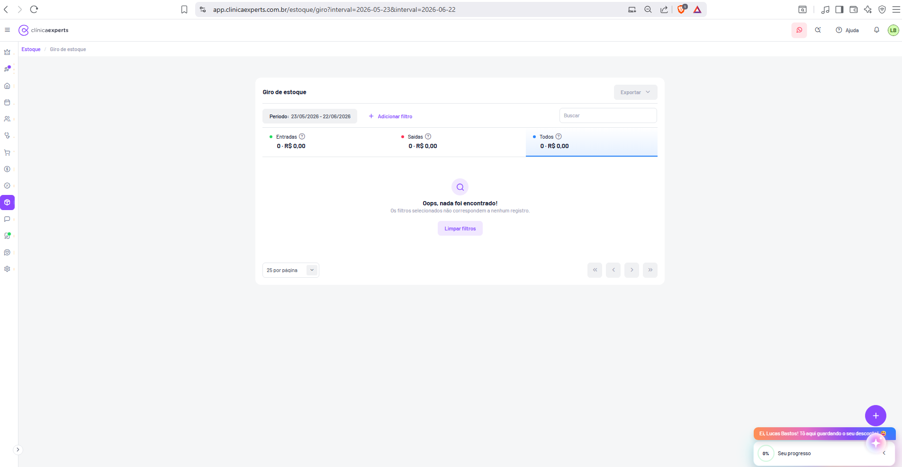

# Estoque / Giro de Estoque

| Metadado | Valor |
|---|---|
| **Módulo** | Estoque |
| **Página** | Giro de estoque |
| **Rota** | `/estoque/giro?interval=2026-05-23&interval=2026-06-22` |
| **URL completa** | `app.clinicaexperts.com.br/estoque/giro?interval=2026-05-23&interval=2026-06-22` |
| **Breadcrumb** | Estoque / Giro de estoque |
| **Tipo** | Relatório analítico (movimentação de estoque) |
| **Ícone sidebar** | Cubo (Estoque), destacado em roxo |
| **Permissões** | Acesso ao módulo Estoque (inferido) |
| **Idioma** | pt-BR |
| **Cross-ref** | `docs/05-telas-41-a-50.md` — Tela 41 |
| **Captura** | 2026-06-22 153554.png |



---

## 1. Identificação

- **Nome da tela (título do card):** **"Giro de estoque"** (texto exato).
- **Nome no breadcrumb / submenu:** **Estoque / Giro de estoque**.
- **Rota base:** `/estoque/giro`.
- **Query string observada:** `?interval=2026-05-23&interval=2026-06-22`
  - O parâmetro `interval` aparece **duas vezes**: a primeira ocorrência é a **data inicial** (`2026-05-23`) e a segunda é a **data final** (`2026-06-22`) do período (inferido pela ordem e pelo chip "Período: 23/05/2026 - 22/06/2026").
  - Formato de data na URL: `YYYY-MM-DD` (ISO). Na UI: `DD/MM/YYYY` (pt-BR).
- **Estado da captura:** período `23/05/2026 – 22/06/2026` sem nenhuma movimentação → **estado vazio** ("Oops, nada foi encontrado!").
- **Usuário logado:** Lucas Bastos (avatar **"LB"** no header).

---

## 2. Objetivo

Relatório de **giro de estoque** (movimentação de itens) dentro de um período: agrega e exibe as **entradas**, **saídas** e o **total geral** (Todos) das movimentações, mostrando para cada grupo a **quantidade** e o **valor financeiro (R$)**. Permite:

- Definir o **período** de análise (filtro de datas, refletido na URL via `interval`).
- Alternar a visão entre **Entradas**, **Saídas** e **Todos** (três cards-resumo que funcionam como abas/filtro de direção da movimentação).
- **Filtrar** adicionalmente (por item/categoria — "Adicionar filtro") e **buscar** texto.
- **Exportar** o relatório (botão "Exportar" com dropdown).
- Visualizar, em formato de **tabela paginada** (inferido), o detalhamento por item: saldo inicial, entradas, saídas, saldo final e índice de giro do período.

> Propósito de negócio: medir o **giro** (rotatividade) do estoque para apoiar reposição, identificar itens parados/excesso e dimensionar consumo por período.

---

## 3. Navegação (submenu Estoque)

- **Sidebar global (ícones verticais):** o ícone de **cubo (Estoque)** fica destacado em **roxo** quando se está em qualquer tela do módulo.
- **Breadcrumb:** logo abaixo do header — **Estoque** (roxo, clicável, leva ao módulo/primeira tela) **/** **Giro de estoque** (cinza, página atual).
- **Submenu do módulo Estoque (inferido a partir das Telas 41–47 do doc 05):** o módulo Estoque agrupa as seguintes telas/rotas:
  - **Giro de estoque** — `/estoque/giro` *(esta tela)*.
  - **Contagem de estoque** — `/estoque/contagem-estoque` (Tela 42).
  - **Itens abertos** — `/estoque/itens-aberto` (Tela 43).
  - *(Inferido)* Demais entradas do módulo: cadastro de produtos/itens, entradas/saídas de estoque, fornecedores — não visíveis nesta captura.
- **FAB** (botão flutuante roxo **"+"**, canto inferior direito): atalho de criação rápida (inferido: novo registro/movimentação).

> Observação: nesta tela específica **não** há submenu vertical secundário visível (ao contrário do módulo Comunicação/Configurações). A navegação interna do Estoque se dá pela sidebar global + breadcrumb (inferido).

---

## 4. Layout

Estrutura de cima para baixo:

1. **Header global** (faixa branca, fixo): hambúrguer + logo **clínicaexperts** à esquerda; à direita ícone WhatsApp (badge rosa "1"), ícone de busca, **"Ajuda"** (com `?`), sino de notificações, avatar **"LB"**.
2. **Breadcrumb:** **Estoque / Giro de estoque**.
3. **Área principal** (fundo cinza-claro `#f5f5f7` aprox.), com **um único card branco centralizado** (cantos arredondados, sombra leve) ocupando ~60% da largura, contendo:
   1. **Linha de cabeçalho do card:** título **"Giro de estoque"** (esquerda) + botão **"Exportar ▾"** (direita).
   2. **Barra de filtros:** chip **"Período: 23/05/2026 - 22/06/2026"** + link **"+ Adicionar filtro"** (esquerda) + campo **"Buscar"** (direita).
   3. **Faixa de três cards-resumo / abas:** **Entradas** | **Saídas** | **Todos** (Todos selecionado).
   4. **Corpo (tabela OU estado vazio):** na captura, **estado vazio** centralizado.
   5. **Rodapé do card:** seletor **"25 por página"** (esquerda) + paginação **« ‹ › »** (direita).
4. **Elementos flutuantes:** FAB **"+"** (inferior direito); widget de onboarding laranja **"Ei, Lucas Bastos! Tô aqui guardando o seu desconto!"** + card **"Seu progresso 0%"**.

---

## 5. Componentes (textos e valores exatos)

### 5.1 Título e ações
- **Título do card:** `Giro de estoque`.
- **Botão "Exportar"** — canto superior direito, com chevron **`▾`** (dropdown). Aparência **cinza/desabilitada** na captura (não há dados para exportar). Ação inferida: abre menu com formatos (CSV / Excel / PDF — inferido).

### 5.2 Cards-resumo / abas de tipo de movimentação (3 colunas)
Cada card exibe: **rótulo + ponto colorido + ícone de ajuda `(?)`** na linha superior e **`quantidade · valor`** na linha inferior.

| Card | Cor do ponto | Quantidade | Valor | Estado | Texto exato |
|---|---|---|---|---|---|
| **Entradas** | verde | 0 | R$ 0,00 | normal | `Entradas`  /  `0 · R$ 0,00` |
| **Saídas** | vermelho | 0 | R$ 0,00 | normal | `Saídas`  /  `0 · R$ 0,00` |
| **Todos** | azul | 0 | R$ 0,00 | **selecionado** (borda inferior roxa + fundo levemente destacado) | `Todos`  /  `0 · R$ 0,00` |

- Separador entre quantidade e valor: caractere **`·`** (ponto médio / middle dot).
- Cada card possui ícone de interrogação **`(?)`** que exibe **tooltip** explicativo (inferido: descreve o que conta como entrada/saída/todos).
- **Comportamento:** funcionam como **abas-filtro** — clicar alterna a tabela/listagem entre **Entradas**, **Saídas** e **Todos** (a aba ativa recebe sublinhado/borda inferior roxa).

### 5.3 Estado vazio (centro)
- Ícone de **lupa** em círculo **roxo-claro**.
- Título (negrito): **`Oops, nada foi encontrado!`**
- Subtexto: **`Os filtros selecionados não correspondem a nenhum registro.`**
- Botão (roxo-claro / outline): **`Limpar filtros`**.

### 5.4 Rodapé / paginação
- Seletor de tamanho de página (dropdown): **`25 por página`**.
- Controles de paginação (todos **desabilitados** sem dados):
  - **`«`** primeira página
  - **`‹`** página anterior
  - **`›`** próxima página
  - **`»`** última página

### 5.5 Badges / indicadores
- Pontos coloridos por tipo: **verde** (Entradas), **vermelho** (Saídas), **azul** (Todos).
- Chip de filtro de período (pill cinza-claro com texto roxo): `Período: 23/05/2026 - 22/06/2026`.

---

## 6. Tabela (corpo com dados)

> Na captura a tabela está **vazia** (estado vazio). As colunas abaixo são **inferidas** a partir do propósito "Giro de estoque" e do prompt; estrutura padronizada com as demais listagens do app (rodapé "25 por página" + paginação).

### 6.1 Colunas (inferido)

| # | Coluna | Descrição | Formato | Alinhamento |
|---|---|---|---|---|
| 1 | **Item** | Nome do produto/insumo de estoque | texto (+ categoria/unidade, inferido) | esquerda |
| 2 | **Saldo inicial** | Quantidade em estoque no **início** do período | número (un.) | direita |
| 3 | **Entradas** | Total de unidades que **entraram** no período | número (un.) — ponto verde | direita |
| 4 | **Saídas** | Total de unidades que **saíram** no período | número (un.) — ponto vermelho | direita |
| 5 | **Saldo final** | Quantidade em estoque no **fim** do período | número (un.) | direita |
| 6 | **Giro** | Índice de giro do item no período = `saídas / saldo médio` | número decimal (ex.: `2,50`) ou `–` quando saldo médio = 0 | direita |

- *(Inferido)* Colunas auxiliares possíveis: **Valor de entradas (R$)**, **Valor de saídas (R$)**, **Custo médio**, **Categoria** — coerente com os valores `R$` exibidos nos cards-resumo.

### 6.2 Linha de totais (rodapé da tabela, inferido)
- **Totais** somando colunas numéricas: Σ Saldo inicial, Σ Entradas, Σ Saídas, Σ Saldo final.
- **Giro total/médio** do estoque no período = `Σ saídas / Σ saldo médio` (média ponderada, inferido — não é soma simples da coluna giro).
- Os cards-resumo (§5.2) refletem os agregados de **quantidade · valor** para Entradas, Saídas e Todos.

### 6.3 Comportamento por aba
- **Entradas** selecionada → tabela mostra apenas itens/colunas relativos a entradas.
- **Saídas** selecionada → idem para saídas.
- **Todos** selecionada (estado da captura) → visão consolidada com todas as colunas (saldo inicial → giro).

---

## 7. Formulários

Esta tela **não possui formulário de criação/edição**. As únicas entradas do usuário são **controles de filtro** (período, item/categoria, busca) e o **seletor de tamanho de página**. Movimentações de estoque que alimentam este relatório são criadas em outras telas (ex.: "Abrir item" — Tela 44; entradas/saídas de estoque — inferido).

- **Filtro de período (date range picker, inferido):** ao clicar no chip **"Período: ..."** abre um seletor de intervalo de datas; ao confirmar, atualiza a URL (`interval=inicio&interval=fim`) e recarrega o relatório.
- **Campo de busca:** input texto, placeholder **"Buscar"**, busca por nome do item (inferido), debounce ~300ms (inferido).

---

## 8. Filtros

| Filtro | Tipo | Texto/Placeholder | Valor na captura | Reflexo na URL |
|---|---|---|---|---|
| **Período** | chip / date range picker | `Período: 23/05/2026 - 22/06/2026` | 23/05/2026 a 22/06/2026 | `interval=2026-05-23&interval=2026-06-22` |
| **Adicionar filtro** | link → menu de filtros | `+ Adicionar filtro` | nenhum extra aplicado | inferido: `?<campo>=<valor>` |
| **Busca** | input texto | placeholder `Buscar` | vazio | inferido: `?search=...` ou `?q=...` |
| **Tipo (aba)** | segmented / abas | `Entradas` / `Saídas` / `Todos` | **Todos** | inferido: `?type=all\|in\|out` |

- **Filtros adicionais (inferido via "+ Adicionar filtro"):** **Item**, **Categoria**, **Fornecedor**, **Local de estoque**, **Tipo de movimentação**.
- **Período é obrigatório** (sempre há um intervalo aplicado, refletido na URL).
- **"Limpar filtros"** (no estado vazio) remove filtros adicionais e/ou redefine o período padrão (inferido: últimos 30 dias — o intervalo da captura `23/05–22/06` ≈ 30 dias até "hoje" 22/06/2026).

---

## 9. Estados

| Estado | Descrição | UI |
|---|---|---|
| **Vazio (filtro sem resultado)** | *(estado da captura)* período/filtros sem nenhuma movimentação | Ícone lupa roxo-claro + **"Oops, nada foi encontrado!"** + **"Os filtros selecionados não correspondem a nenhum registro."** + botão **"Limpar filtros"**. Cards-resumo zerados (`0 · R$ 0,00`). Paginação e Exportar desabilitados. |
| **Vazio inicial** (inferido) | sem nenhuma movimentação cadastrada no sistema | provável **"Hmm, está vazio por aqui!"** / **"Nenhum registro encontrado."** (padrão das Telas 42/43) — inferido |
| **Com dados** (inferido) | há movimentações no período | tabela paginada (§6) + cards-resumo com totais reais + Exportar habilitado |
| **Carregando** (inferido) | requisição em andamento | skeleton/spinner no corpo do card |
| **Erro** (inferido) | falha ao carregar | mensagem de erro + opção de tentar novamente |

---

## 10. Modais

- **Nenhum modal nesta tela.**
- **Modal/popover de período (inferido):** o chip "Período" abre um **date range picker** (popover, não modal full-screen).
- **Dropdown "Exportar" (inferido):** menu suspenso com formatos de exportação (CSV / Excel / PDF) — não é modal.
- **Tooltips** dos ícones `(?)` dos cards-resumo (Entradas/Saídas/Todos) — popovers informativos.

---

## 11. Modelo de dados

### 11.1 `MovimentacaoEstoque` (registro base que alimenta o giro) — inferido

```ts
interface MovimentacaoEstoque {
  uuid: string;                 // identificador
  itemId: string;               // FK -> ItemEstoque
  tipo: 'entrada' | 'saida';    // direção da movimentação
  origem: 'compra' | 'venda' | 'ajuste' | 'contagem' | 'abertura' | 'transferencia'; // inferido
  quantidade: number;           // unidades movimentadas
  valorUnitario: number;        // custo/valor unitário (R$)
  valorTotal: number;           // quantidade * valorUnitario (R$)
  data: string;                 // ISO date/datetime da movimentação
  saldoApos: number;            // saldo do item após a movimentação (inferido)
  observacoes?: string;
  usuarioId: string;            // quem registrou
  clinicaId: string;            // multi-tenant
  createdAt: string;
  updatedAt: string;
}
```

### 11.2 `GiroEstoqueLinha` (linha agregada da tabela, por item/período) — inferido

```ts
interface GiroEstoqueLinha {
  itemId: string;
  itemNome: string;
  categoria?: string;
  unidade?: string;             // un., ml, cx...
  saldoInicial: number;         // saldo no início do período
  entradasQtd: number;
  entradasValor: number;        // R$
  saidasQtd: number;
  saidasValor: number;          // R$
  saldoFinal: number;           // saldoInicial + entradasQtd - saidasQtd
  saldoMedio: number;           // (saldoInicial + saldoFinal) / 2
  giro: number | null;          // saidasQtd / saldoMedio (null se saldoMedio = 0)
}
```

### 11.3 `GiroEstoqueResumo` (cards-resumo) — inferido

```ts
interface GiroEstoqueResumo {
  entradas: { quantidade: number; valor: number };  // ex.: { 0, 0.00 }
  saidas:   { quantidade: number; valor: number };
  todos:    { quantidade: number; valor: number };  // entradas + saidas
}
```

### 11.4 Filtro/consulta — inferido

```ts
interface GiroEstoqueQuery {
  intervalInicio: string;   // 'YYYY-MM-DD'  (interval[0])
  intervalFim: string;      // 'YYYY-MM-DD'  (interval[1])
  tipo?: 'all' | 'in' | 'out';   // aba selecionada (default 'all')
  itemId?: string;
  categoriaId?: string;
  search?: string;
  page?: number;
  perPage?: number;         // 25 (default observado)
}
```

---

## 12. Endpoints API (inferidos)

> Todos **inferidos** — não confirmados na captura.

| Método | Endpoint | Descrição |
|---|---|---|
| `GET` | `/api/estoque/giro?interval=2026-05-23&interval=2026-06-22&type=all&page=1&perPage=25` | Lista paginada das linhas de giro + objeto de resumo (cards). |
| `GET` | `/api/estoque/giro/resumo?interval=...&interval=...` | Apenas os agregados de Entradas/Saídas/Todos (quantidade · valor) — pode vir embutido na resposta acima. |
| `GET` | `/api/estoque/giro/export?interval=...&interval=...&type=all&format=csv\|xlsx\|pdf` | Exportação do relatório (botão "Exportar"). |
| `GET` | `/api/estoque/itens?search=...` | Autocomplete do filtro "Item" (inferido). |
| `GET` | `/api/estoque/categorias` | Opções do filtro "Categoria" (inferido). |

**Formato de resposta (inferido) de `GET /api/estoque/giro`:**

```json
{
  "resumo": {
    "entradas": { "quantidade": 0, "valor": 0.00 },
    "saidas":   { "quantidade": 0, "valor": 0.00 },
    "todos":    { "quantidade": 0, "valor": 0.00 }
  },
  "data": [],
  "pagination": { "page": 1, "perPage": 25, "total": 0, "totalPages": 0 }
}
```

---

## 13. Regras / cálculos

> Fórmulas de negócio (algumas inferidas).

1. **Saldo final** = `saldoInicial + entradasQtd − saidasQtd`.
2. **Saldo médio** = `(saldoInicial + saldoFinal) / 2`.
3. **Giro do item** = `saidasQtd / saldoMedio`.
   - Se `saldoMedio = 0` → giro indefinido → exibir **`–`** (ou `0`) — inferido.
   - Interpretação: quantas vezes o estoque "girou" (foi consumido e reposto) no período.
4. **Card "Todos"** = `Entradas + Saídas` (soma de quantidade e de valor).
5. **Valores monetários:** formato pt-BR `R$ #.##0,00`; separador de milhar `.`, decimal `,`.
6. **Período:** intervalo **inclusivo** `[início, fim]`; datas na URL em `YYYY-MM-DD`, exibidas em `DD/MM/YYYY`.
7. **Estado vazio:** quando `pagination.total = 0` → exibe "Oops, nada foi encontrado!" e zera os cards-resumo.
8. **Exportar:** desabilitado quando não há dados (`total = 0`).
9. **Multi-tenant:** todos os cálculos restritos à `clinicaId` do usuário logado (inferido).
10. **Giro total/médio** (linha de totais) = média ponderada `Σ saídas / Σ saldo médio`, não soma simples da coluna "Giro" (inferido).

---

## 14. Fluxos

1. **Abrir relatório:** usuário acessa `/estoque/giro` → app aplica período padrão (últimos ~30 dias, inferido) → `GET /api/estoque/giro` → renderiza cards-resumo + tabela ou estado vazio.
2. **Alterar período:** clica no chip "Período" → date range picker → confirma → URL atualiza (`interval=...&interval=...`) → recarrega.
3. **Alternar tipo:** clica em **Entradas** / **Saídas** / **Todos** → aba ativa muda (borda roxa) → tabela filtra por direção.
4. **Adicionar filtro:** clica **"+ Adicionar filtro"** → escolhe Item/Categoria → aplica → recarrega.
5. **Buscar:** digita em "Buscar" → filtra itens por nome (debounce) → recarrega.
6. **Estado vazio → Limpar filtros:** clica **"Limpar filtros"** → remove filtros adicionais e redefine período padrão → recarrega.
7. **Exportar:** clica **"Exportar ▾"** (habilitado só com dados) → escolhe formato → download.
8. **Paginar:** usa **« ‹ › »** e o seletor **"25 por página"** para navegar/ajustar a listagem.

---

## 15. Notas de implementação

- **Period via URL com chave repetida:** `interval` aparece **duas vezes** (`?interval=2026-05-23&interval=2026-06-22`). O backend/parser deve tratar `interval` como **array** `[início, fim]`, não sobrescrever. Garantir ordenação (índice 0 = início, 1 = fim).
- **Datas:** UI em `DD/MM/YYYY` (pt-BR), URL/API em ISO `YYYY-MM-DD`. Fuso da clínica: GMT-03:00 São Paulo (ver Tela 50 — Preferências do sistema).
- **Moeda:** formatar valores como `BRL` / `R$` (ver Preferências — moeda padrão `BRL - R$`).
- **Cards-resumo como abas:** o componente acumula **dois papéis** (KPI + filtro). A aba ativa ("Todos") tem borda inferior roxa e leve fundo destacado — manter consistência visual.
- **Separador `·`:** usar middle dot (U+00B7) entre quantidade e valor (`0 · R$ 0,00`).
- **Estado vazio (filtro):** copy exato — título `Oops, nada foi encontrado!` / subtítulo `Os filtros selecionados não correspondem a nenhum registro.` / botão `Limpar filtros`. Distinguir do vazio inicial (`Hmm, está vazio por aqui!` / `Nenhum registro encontrado.`), padrão das Telas 42/43.
- **Botões desabilitados sem dados:** "Exportar" e toda a paginação ficam cinza/inativos quando `total = 0`.
- **Paginação:** default **25 por página** (consistente com Estoque; note que Comunicação usa 10 — Tela 48).
- **Performance:** o cálculo de giro por item pode ser pesado (saldo inicial = reconstrução do estoque na data de início). Considerar agregação no banco/materialização ou snapshot de saldos por data (inferido).
- **Acessibilidade:** tooltips `(?)` dos cards devem ter texto alternativo; pontos coloridos (verde/vermelho/azul) precisam de rótulo textual para não depender só de cor.
- **Elementos globais ignorados na spec funcional, mas presentes:** FAB "+", widget de onboarding laranja ("Ei, Lucas Bastos!..."), card "Seu progresso 0%".
- **Cross-ref:** ver `docs/05-telas-41-a-50.md` — **Tela 41** (descrição original desta tela).
