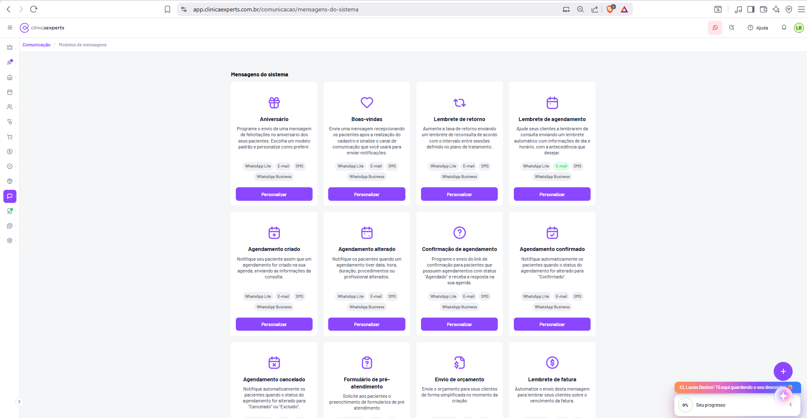

# Comunicação / Modelos de Mensagens

| Metadado | Valor |
|---|---|
| **Produto** | Clínica Experts (SaaS de gestão de clínicas) |
| **Domínio** | app.clinicaexperts.com.br |
| **Módulo** | Comunicação |
| **Página** | Modelos de mensagens — aba/seção **Mensagens do sistema** (automações) |
| **Rota** | `/comunicacao/mensagens/mensagens-do-sistema` |
| **Idioma** | pt-BR |
| **Referência cruzada** | `docs/05-telas-41-a-50.md` → Tela 49; `docs/01-telas-01-a-10.md` (chrome global, ícone WhatsApp no paciente / "Enviar formulário de pré atendimento" na Tela 9) |
| **Tipo de tela** | Catálogo / galeria de **cards** de templates de mensagens automáticas (gatilhos por evento) |
| **Estado capturado** | Lista de modelos do sistema (grade de cards); 6 cards totalmente visíveis, rolagem vertical para os demais |
| **Canais suportados** | WhatsApp Lite, E-mail, SMS, WhatsApp Business (badges por card) |
| **Usuário logado** | Lucas Bastos (avatar "LB") |
| **Data da captura** | 2026-06-22 |
| **Navegador** | Brave (chrome/abas/segundo monitor com jogo ignorados) |

---

## 1. Identificação

- **Nome da página:** Modelos de mensagens → seção **Mensagens do sistema**.
- **Título visível (H2/heading da área de conteúdo):** **"Mensagens do sistema"** (negrito, alinhado à esquerda, acima da grade de cards).
- **Breadcrumb (sob o header):** **"Comunicação / Modelos de mensagens"** — `Comunicação` em roxo (clicável), `Modelos de mensagens` em cinza (página atual).
- **Rota completa observada:** `app.clinicaexperts.com.br/comunicacao/mensagens/mensagens-do-sistema`.
  - Segmento base do módulo: `/comunicacao/mensagens/`.
  - Subrota/aba: `mensagens-do-sistema` (mensagens automáticas disparadas por eventos do sistema). Provável existência de subrotas-irmãs para outras categorias de templates (ex.: `campanhas`, `manuais`/`personalizadas`) (inferido).
- **Ícone de módulo na sidebar global:** balão de conversa (Comunicação), destacado em roxo; o ícone também exibe **badge verde** sobreposto (inferido — status de integração/notificação).
- **Item de submenu do módulo correspondente:** **"Modelos de mensagens"** (na Tela 48 / página 28 esse item aparece no submenu vertical "Comunicação", junto de "Canais de atendimento" e "Central de notificações"). Aqui ele é o item ativo (inferido — submenu não totalmente visível no recorte por causa do zoom-out).

---

## 2. Objetivo

Página de **gestão dos modelos/templates de mensagens automáticas do sistema**: comunicações disparadas automaticamente aos pacientes em resposta a **eventos** (aniversário, cadastro, criação/alteração/cancelamento de agendamento, formulário de pré-atendimento etc.). Cada modelo pode ser **personalizado** (texto, variáveis dinâmicas, canais, antecedência de envio) e **ativado/desativado**.

- A página funciona como **catálogo**: lista todos os gatilhos de automação suportados pelo produto, cada um representado por um card.
- Para cada card, o usuário escolhe **por quais canais** a mensagem é enviada (badges) e abre um **editor** ("Personalizar") para ajustar conteúdo e regras de disparo.
- É a contraparte de **automação** dos "Canais de atendimento" (página 28): os canais definem o *meio* (conexão WhatsApp/e-mail/SMS); os modelos do sistema definem *o que* e *quando* é enviado automaticamente.

---

## 3. Layout geral

Estrutura de três faixas horizontais herdada do chrome global (ver `docs/01-telas-01-a-10.md` › Elementos globais):

1. **Header (topo, branco, fixo):** hambúrguer (☰) + logo **clínicaexperts**; à direita, badge WhatsApp (suporte), busca, **Ajuda (?)**, sino (notificações), avatar **"LB"**.
2. **Sidebar global (coluna estreita de ícones à esquerda):** coroa, foguete (badge roxo), casa, agenda, pessoas, estetoscópio, carrinho, cifrão, percentual, cubo (estoque), **balão de conversa (Comunicação) — ativo em roxo**, e abaixo um ícone com badge verde; engrenagem (Configurações) no rodapé.
3. **Área principal (fundo cinza-claro `#f5f5f7`):**
   - **Breadcrumb** "Comunicação / Modelos de mensagens".
   - **Submenu vertical do módulo** (coluna à esquerda da área de conteúdo): "Canais de atendimento", **"Modelos de mensagens"** (ativo), "Central de notificações" (inferido pela Tela 48; recortado nesta captura).
   - **Heading "Mensagens do sistema"** + **grade (grid) de cards** de modelos.

**Grade de cards:**
- Disposição em **colunas** (no recorte capturado aparecem **2 colunas** totalmente legíveis; o layout é responsivo e tipicamente renderiza **3–4 cards por linha** em telas largas — aqui a janela está estreita/zoom-out, reduzindo a 2 colunas) (inferido).
- **Rolagem vertical** para acessar os cards abaixo da dobra.
- Cada card é um **cartão branco** com cantos arredondados, leve sombra, conteúdo **centralizado**.

**Componentes fixos:** FAB roxo "+" (canto inferior direito); widget laranja de onboarding **"Ei, Lucas Bastos! Tô aqui guardando o seu desconto!"** + card **"Seu progresso 0%"** (canto inferior direito, sobrepondo a grade).

---

## 4. Anatomia de um card de modelo

Cada card de mensagem do sistema segue a mesma estrutura vertical (de cima para baixo):

1. **Ícone ilustrativo** (contorno roxo, ~grande, centralizado) — representa o evento/gatilho.
2. **Título** (negrito, centralizado) — nome do gatilho (ex.: "Aniversário").
3. **Descrição** (texto cinza, 2–4 linhas, centralizado) — explica quando/como a mensagem é usada.
4. **Badges de canais** (chips cinza-claro, arredondados, centralizados, podendo quebrar em 2 linhas): **"WhatsApp Lite"**, **"E-mail"**, **"SMS"**, **"WhatsApp Business"**.
5. **Botão "Personalizar"** (roxo sólido, largura quase total, na base do card) — abre o editor do modelo.

> **Observação sobre os badges:** no estado capturado os 4 chips (WhatsApp Lite, E-mail, SMS, WhatsApp Business) aparecem em **todos** os cards de agendamento e de relacionamento. Eles representam os **canais disponíveis/suportados** para aquele modelo. A indicação de canal **ativo vs. inativo** é feita visualmente (ex.: chip preenchido/colorido = ativo; chip esmaecido = inativo) — distinção não conclusiva no recorte por causa do zoom-out, definida no editor (inferido). Não há toggle on/off visível **no próprio card** nesta captura; ativar/desativar e selecionar canais ocorre dentro de "Personalizar" (inferido).

---

## 5. Cards visíveis (textos EXATOS da imagem)

A grade capturada exibe **6 cards completamente legíveis**, em 2 colunas × 3 linhas. Os títulos e descrições abaixo foram lidos diretamente da imagem (zoom/recorte).

### Linha 1

#### Card 1 — **Aniversário**
- **Ícone:** presente/caixa de presente com laço (gift) — contorno roxo.
- **Descrição (exata):** "Programe o envio de uma mensagem de felicitações no aniversário dos seus pacientes. Escolha um modelo padrão e personalize como preferir."
- **Badges de canal:** **WhatsApp Lite · E-mail · SMS** (linha 1) · **WhatsApp Business** (linha 2).
- **Botão:** **"Personalizar"** (roxo).
- **Gatilho/evento (inferido):** data de aniversário do paciente (`patient.birthdate`) atinge o dia atual.

#### Card 2 — **Boas-vindas**
- **Ícone:** coração (heart) — contorno roxo.
- **Descrição (exata):** "Envie uma mensagem recepcionando os pacientes após a realização do cadastro e sinalize o canal de comunicação que você usará para enviar notificações."
- **Badges de canal:** **WhatsApp Lite · E-mail · SMS** · **WhatsApp Business**.
- **Botão:** **"Personalizar"** (roxo).
- **Gatilho/evento (inferido):** criação de um novo cadastro de paciente (`patient.created`).

### Linha 2

#### Card 3 — **Agendamento criado**
- **Ícone:** calendário com **"+"** (calendar-plus) — contorno roxo.
- **Descrição (exata):** "Notifique seu paciente assim que um agendamento for criado na sua agenda, enviando as informações da consulta."
- **Badges de canal:** **WhatsApp Lite · E-mail · SMS** · **WhatsApp Business**.
- **Botão:** **"Personalizar"** (roxo).
- **Gatilho/evento (inferido):** criação de agendamento (`appointment.created`).

#### Card 4 — **Agendamento alterado**
- **Ícone:** calendário (calendar) — contorno roxo.
- **Descrição (exata):** "Notifique os pacientes quando um agendamento tiver data, hora, duração, procedimentos ou profissional alterados."
- **Badges de canal:** **WhatsApp Lite · E-mail · SMS** · **WhatsApp Business**.
- **Botão:** **"Personalizar"** (roxo).
- **Gatilho/evento (inferido):** atualização de campos-chave do agendamento (`appointment.updated` — data, hora, duração, procedimentos ou profissional).

### Linha 3

#### Card 5 — **Agendamento cancelado**
- **Ícone:** calendário com **"×"** (calendar-x) — contorno roxo.
- **Descrição (exata):** 'Notifique automaticamente os pacientes quando o status do agendamento for alterado para "Cancelado" ou "Excluido".'
- **Badges de canal:** WhatsApp Lite · E-mail · SMS · WhatsApp Business (abaixo da dobra; padrão idêntico aos demais cards de agendamento) (inferido).
- **Botão:** **"Personalizar"** (roxo) (abaixo da dobra) (inferido).
- **Gatilho/evento (inferido):** mudança de status do agendamento para `Cancelado` ou `Excluído` (`appointment.cancelled` / `appointment.deleted`).

#### Card 6 — **Formulário de pré-atendimento**
- **Ícone:** prancheta/clipboard com **"?"** — contorno roxo.
- **Descrição (exata):** "Solicite aos pacientes o preenchimento de formulários de pré atendimento"
- **Badges de canal:** abaixo da dobra (inferido — provavelmente WhatsApp/E-mail/SMS, dado que o envio do formulário de pré-atendimento aparece como ação de WhatsApp na Tela 9).
- **Botão:** **"Personalizar"** (roxo) (abaixo da dobra) (inferido).
- **Gatilho/evento (inferido):** envio do link do formulário de pré-atendimento ao paciente (manual a partir do detalhe do evento — Tela 9 "Enviar formulário de pré atendimento" — e/ou automático antes da consulta).

---

## 6. Cards abaixo da dobra (não capturados — catálogo previsto)

Os cards a seguir **não aparecem** no recorte (ficam abaixo da rolagem), mas são esperados no catálogo de automações de uma agenda clínica e foram citados na referência (Tela 49). Todos os títulos abaixo são **(inferido)** — confirmar textos exatos no app:

- **Lembrete de retorno** (inferido) — lembra o paciente de retornar/reagendar após X dias da última consulta.
- **Lembrete de agendamento** / **Lembrete de consulta** (inferido) — lembra o paciente de um agendamento próximo (X horas/dias antes).
- **Confirmação de agendamento** (inferido) — solicita ao paciente que **confirme** presença (com resposta Sim/Não no WhatsApp).
- **Agendamento confirmado** (inferido) — avisa que o agendamento foi confirmado.
- **Lembrete de leitura** (inferido) — lembrete relacionado a leitura/visualização (ex.: documento, formulário).
- **Envio ao paciente** / **Envio de orçamento** (inferido) — envia documento/orçamento ao paciente.
- **Lembrete de fatura** (inferido) — lembra o paciente de fatura/parcela a vencer ou vencida (financeiro).
- **Aniversário de cadastro** / **Pós-atendimento** / **Pesquisa de satisfação** (inferido) — automações complementares comuns.

> Estes itens devem ser tratados como **placeholders de catálogo**; a fonte de verdade é a lista de gatilhos suportada pelo backend (ver §8/§9). Cada um, na UI, segue a mesma anatomia (ícone + título + descrição + badges + "Personalizar").

---

## 7. Editor de personalização (modal/tela "Personalizar") — inferido

Acionado pelo botão **"Personalizar"** de cada card. Não capturado nesta tela; especificação **inferida** a partir de padrões do produto e da natureza dos modelos.

### 7.1 Abertura
- Clique em "Personalizar" → abre **modal centralizado** ou **drawer lateral** (ou subrota `/comunicacao/mensagens/mensagens-do-sistema/{gatilho}/personalizar`) (inferido).
- Cabeçalho: nome do modelo (ex.: "Aniversário") + botão "×" (fechar).

### 7.2 Ativação geral
- **Toggle "Ativo / Inativo"** (switch) no topo do editor — liga/desliga a automação inteira (inferido). Quando inativo, nenhum disparo ocorre, independentemente dos canais.

### 7.3 Seleção de canais
- Lista de canais com **toggle por canal**: **WhatsApp Lite**, **E-mail**, **SMS**, **WhatsApp Business** (inferido).
- Cada canal habilitado expõe seu **próprio corpo de mensagem** (e-mail tem assunto + corpo HTML; WhatsApp/SMS têm texto simples; WhatsApp Business pode exigir **template homologado** pela Meta) (inferido).
- Disponibilidade de canal depende de o canal estar **conectado** em "Canais de atendimento" (página 28) (inferido).

### 7.4 Editor de conteúdo + variáveis dinâmicas
- **Campo de texto/rich-text** com o corpo da mensagem.
- **Variáveis dinâmicas** (placeholders) inseríveis via botão "Inserir variável" ou digitando `{`. Conjunto provável (inferido):
  - `{nome}` / `{nome_paciente}` — nome do paciente.
  - `{primeiro_nome}` — primeiro nome.
  - `{data}` / `{data_agendamento}` — data do agendamento.
  - `{hora}` / `{horario}` — horário.
  - `{procedimento}` — procedimento(s).
  - `{profissional}` — nome do profissional.
  - `{sala}` — sala de atendimento.
  - `{clinica}` / `{nome_clinica}` — nome da clínica.
  - `{endereco}` / `{telefone_clinica}` — dados de contato da clínica.
  - `{link_confirmacao}` — link/CTA de confirmação (cards de confirmação).
  - `{link_formulario}` — link do formulário de pré-atendimento.
  - `{valor}` / `{vencimento}` — para Lembrete de fatura.
- **Sintaxe exata das variáveis (chaves `{}` vs. `{{}}` vs. `[]`) a confirmar no app** (inferido — aqui assumido `{variavel}`).
- **Pré-visualização ("Preview")** com dados de exemplo (inferido).
- Botão **"Restaurar modelo padrão"** (inferido — coerente com a descrição do card Aniversário: "Escolha um modelo padrão e personalize como preferir").

### 7.5 Agendamento / antecedência de envio
- Para modelos baseados em tempo (Lembrete de retorno, Lembrete de agendamento, Confirmação, Lembrete de fatura): campo **"Antecedência de envio"** (ex.: enviar `24 horas` / `48 horas` / `X dias` antes do evento) + horário do dia para disparo (inferido).
- Para modelos baseados em evento imediato (Agendamento criado/alterado/cancelado, Boas-vindas): envio **no momento do evento** (sem antecedência) (inferido).
- Possível **janela de silêncio / horário comercial** para não enviar de madrugada (inferido).

### 7.6 Rodapé do editor
- Botões **"Cancelar"** e **"Salvar"** (roxo) (inferido).

---

## 8. Modelo de dados (inferido)

### 8.1 `ModeloMensagem` (template de mensagem do sistema)

| Campo | Tipo | Descrição |
|---|---|---|
| `id` / `uuid` | UUID | Identificador do modelo. |
| `gatilho` / `evento` | enum | Evento que dispara o modelo. Ex.: `aniversario`, `boas_vindas`, `agendamento_criado`, `agendamento_alterado`, `agendamento_cancelado`, `formulario_pre_atendimento`, `lembrete_retorno`, `lembrete_agendamento`, `confirmacao_agendamento`, `agendamento_confirmado`, `lembrete_fatura`. |
| `tipo` | enum | `sistema` (automação por evento) vs. `manual`/`campanha` (outras categorias). |
| `titulo` | string | Nome exibido no card (ex.: "Aniversário"). |
| `descricao` | string | Texto descritivo do card. |
| `icone` | string | Identificador do ícone (gift, heart, calendar-plus, calendar, calendar-x, clipboard-question). |
| `ativo` | boolean | Automação ligada/desligada (toggle geral). |
| `canais` | `CanalModelo[]` | Configuração por canal (ver 8.2). |
| `antecedencia` | objeto/null | `{ valor: int, unidade: 'horas'|'dias', momento_do_dia?: '09:00' }` para modelos temporais; `null` para eventos imediatos. |
| `created_at` / `updated_at` | datetime | Auditoria. |

### 8.2 `CanalModelo` (conteúdo por canal)

| Campo | Tipo | Descrição |
|---|---|---|
| `canal` | enum | `whatsapp_lite`, `email`, `sms`, `whatsapp_business`. |
| `ativo` | boolean | Canal habilitado para este modelo. |
| `assunto` | string/null | Assunto (apenas e-mail). |
| `conteudo` | text | Corpo da mensagem, com placeholders de variáveis. |
| `template_externo_id` | string/null | ID do template homologado (WhatsApp Business / Meta). |

### 8.3 `Variavel` (catálogo de variáveis disponíveis por gatilho)

| Campo | Tipo | Descrição |
|---|---|---|
| `chave` | string | Ex.: `nome`, `data`, `procedimento`. |
| `rotulo` | string | Rótulo amigável ("Nome do paciente"). |
| `gatilhos` | enum[] | Em quais modelos a variável é válida (depende do contexto do evento). |

### 8.4 `EnvioMensagem` / log de disparos (inferido)

| Campo | Tipo | Descrição |
|---|---|---|
| `id` | UUID | — |
| `modelo_id` | FK | Modelo que originou. |
| `paciente_id` | FK | Destinatário. |
| `canal` | enum | Canal usado. |
| `status` | enum | `agendado`, `enviado`, `entregue`, `lido`, `falhou`, `respondido`. |
| `agendado_para` | datetime | Quando deve disparar. |
| `enviado_em` | datetime | Quando disparou. |
| `payload` | json | Conteúdo renderizado (variáveis resolvidas). |

---

## 9. Endpoints de API (inferido)

> Caminhos e nomes **inferidos** — confirmar no backend. Provável REST sob `/api`.

| Método | Endpoint | Descrição |
|---|---|---|
| `GET` | `/api/comunicacao/modelos-mensagens?tipo=sistema` | Lista os modelos do sistema (alimenta a grade de cards). |
| `GET` | `/api/comunicacao/modelos-mensagens/{id}` | Detalhe/configuração completa de um modelo (para o editor). |
| `PUT` / `PATCH` | `/api/comunicacao/modelos-mensagens/{id}` | Salva personalização: `ativo`, `canais[]`, `antecedencia`, conteúdos. |
| `POST` | `/api/comunicacao/modelos-mensagens/{id}/restaurar-padrao` | Restaura o conteúdo padrão do modelo. |
| `GET` | `/api/comunicacao/modelos-mensagens/{id}/variaveis` | Lista variáveis dinâmicas válidas para o gatilho. |
| `POST` | `/api/comunicacao/modelos-mensagens/{id}/preview` | Renderiza pré-visualização com dados de exemplo. |
| `POST` | `/api/comunicacao/modelos-mensagens/{id}/teste` | Envia mensagem de teste para um número/e-mail (inferido). |
| `GET` | `/api/comunicacao/envios?modelo_id={id}` | Histórico/log de disparos (Central de notificações). |

**Disparo dos eventos:** o backend escuta eventos de domínio (`appointment.created/updated/cancelled`, `patient.created`, jobs diários de aniversário/lembrete) e enfileira o envio resolvendo o `ModeloMensagem` correspondente, se `ativo` e com canal habilitado/conectado (inferido).

---

## 10. Regras de negócio (inferido salvo onde lido)

1. **Gatilho por evento (imediato):** Boas-vindas (cadastro de paciente), Agendamento criado/alterado/cancelado disparam **no momento** do evento de domínio.
   - **Agendamento alterado** dispara somente quando mudam **data, hora, duração, procedimentos ou profissional** (texto do card) — alterações irrelevantes (ex.: observação) não disparam.
   - **Agendamento cancelado** dispara quando o status muda para **"Cancelado" ou "Excluido"** (texto do card).
2. **Gatilho por agenda/tempo:** Aniversário (job diário comparando `birthdate`), Lembretes e Confirmação (X horas/dias antes), Lembrete de fatura (antes/no vencimento) — controlados pelo campo **antecedência** (§7.5).
3. **Ativação em duas camadas:** o modelo precisa estar **`ativo`** **e** ter ao menos **um canal habilitado e conectado** (página 28). Sem canal conectado, o badge/canal fica indisponível (inferido).
4. **Resolução de canal (fallback):** se múltiplos canais ativos, provável ordem de prioridade (ex.: WhatsApp Business → WhatsApp Lite → E-mail → SMS) ou envio por todos os habilitados — **a confirmar** (inferido).
5. **Variáveis obrigatórias:** ausência de dado para uma variável (ex.: paciente sem telefone) deve degradar com elegância (pular canal/usar fallback) e registrar `falhou` no log (inferido).
6. **WhatsApp Business:** mensagens proativas exigem **template homologado** pela Meta; o editor deve vincular `template_externo_id` (inferido).
7. **Confirmação de agendamento (quando existir):** mensagem com CTA de confirmar/cancelar; a resposta do paciente atualiza o status do agendamento para **Confirmado** (relaciona-se aos status da Tela 7: Agendado/Confirmado/Não compareceu/Concluído/Cancelado) (inferido).
8. **LGPD / opt-out:** respeitar consentimento e descadastramento do paciente por canal (inferido).

---

## 11. Estados da tela

| Estado | Descrição |
|---|---|
| **Carregado (capturado)** | Grade de cards renderizada; 6 cards visíveis, rolagem para os demais. |
| **Carregando** | Skeletons de cards (placeholder cinza) enquanto `GET` da lista resolve (inferido). |
| **Card com automação ativa** | Indicação visual (badge/realce de canais ativos) (inferido — não conclusivo no recorte). |
| **Card com automação inativa** | Canais esmaecidos / chip "Inativo" (inferido). |
| **Canal não conectado** | Badge do canal desabilitado + tooltip "Conecte este canal em Canais de atendimento" (inferido). |
| **Editor aberto** | Modal/drawer "Personalizar" sobre a grade escurecida (inferido). |
| **Salvando** | Botão "Salvar" em estado de loading; toast de sucesso/erro ao concluir (inferido). |

---

## 12. Fluxos de usuário

### 12.1 Personalizar um modelo
1. Usuário acessa **Comunicação › Modelos de mensagens › Mensagens do sistema**.
2. Localiza o card desejado (ex.: **Aniversário**) e clica em **"Personalizar"**.
3. Abre o editor (§7): edita texto, insere variáveis (`{nome}`, `{data}`…), seleciona canais e (se aplicável) antecedência.
4. Usa **Preview** para validar; opcionalmente envia **teste**.
5. Clica **"Salvar"** → `PUT /modelos-mensagens/{id}` → toast de sucesso → editor fecha → card reflete a nova configuração.

### 12.2 Ativar / desativar uma automação
1. Abre "Personalizar" do card.
2. Aciona o **toggle "Ativo"** (geral) e/ou os **toggles de canal**.
3. Salva → automação passa a (não) disparar nos próximos eventos.
4. (Variante inferida) Se houver toggle diretamente no card, a alteração é **inline** e persistida via `PATCH`.

### 12.3 Conectar canal ausente
1. Ao tentar habilitar um canal indisponível, link/CTA leva a **"Canais de atendimento"** (página 28) para conectar (ex.: WhatsApp Business).
2. Após conectar, retorna ao editor e habilita o canal.

### 12.4 Navegação no módulo
- Submenu: alternar entre **"Canais de atendimento"** (página 28), **"Modelos de mensagens"** (esta) e **"Central de notificações"** (log de envios).

---

## 13. Comportamento responsivo e acessibilidade (inferido)

- **Grid responsivo:** 4 colunas (desktop largo) → 3 → 2 (janela estreita / zoom-out, como no capturado) → 1 (mobile). Cards mantêm proporção; descrição com altura uniforme por linha (inferido).
- **Cards:** área clicável principal no botão "Personalizar"; o card inteiro pode ser focável/clicável (inferido).
- **Acessibilidade:** ícones decorativos com `aria-hidden`; cada card como `article`/`region` com `aria-label` = título; badges com `aria-label` legível ("Canal: WhatsApp Business"); botões "Personalizar" com `aria-label` contextual ("Personalizar mensagem de Aniversário") (inferido).
- **Contraste:** botão roxo "Personalizar" com texto branco (ok); chips cinza com texto cinza-escuro.

---

## 14. Notas de implementação

- **Fonte de verdade do catálogo:** a lista de cards deve vir do backend (`GET …?tipo=sistema`), não hardcoded no front, para que novos gatilhos apareçam sem deploy de UI.
- **Renderização do card:** componente único `<CardModeloMensagem>` recebendo `{ icone, titulo, descricao, canais, ativo }`; o mapeamento `icone→componente SVG` é local no front.
- **Editor desacoplado:** carregar a configuração completa só ao abrir "Personalizar" (`GET /{id}`), mantendo a grade leve.
- **Validação de variáveis:** validar no front e no back que apenas variáveis do **catálogo do gatilho** sejam usadas; bloquear salvar com placeholders desconhecidos.
- **Idempotência de disparo:** garantir que o mesmo evento não dispare duplicado (chave idempotente por `modelo_id + entidade_id + evento`).
- **Dependência de canais:** o estado de cada badge depende de `GET` de canais conectados (página 28) — cachear/compartilhar esse estado entre as duas páginas do módulo.
- **WhatsApp Business vs. Lite:** tratar como canais distintos com regras distintas (Business exige template homologado; Lite é mensagem livre, sujeita a limites). Coerente com o banner de migração da Tela 48.
- **Reuso "Formulário de pré-atendimento":** este modelo conecta-se à ação manual "Enviar formulário de pré atendimento" do detalhe do evento (Tela 9 / `docs/01-telas-01-a-10.md`); manter o mesmo `link_formulario` e template entre o envio manual e o automático.

---

## 15. Pendências / a confirmar no app

1. **Quantidade total e títulos exatos** dos cards abaixo da dobra (§6 está majoritariamente inferido).
2. **Sintaxe exata das variáveis dinâmicas** (`{nome}` vs. `{{nome}}` vs. `[nome]`) e o **catálogo completo** por gatilho.
3. **Forma do editor:** modal, drawer ou subrota dedicada; existência de toggle inline no card.
4. **Distinção visual ativo/inativo** dos badges de canal (não conclusiva no recorte).
5. **Campo de antecedência:** unidades suportadas (horas/dias), horário de disparo e janela de silêncio.
6. **Regra de fallback/prioridade** quando múltiplos canais estão ativos.
7. **Submenu do módulo:** confirmar itens e item ativo ("Modelos de mensagens") — recortado por zoom-out nesta captura.
8. **Existência de outras abas** sob "Modelos de mensagens" além de "Mensagens do sistema" (ex.: campanhas/manuais).

> Nota de captura: a janela do app está em **zoom-out / largura reduzida** (metade esquerda do monitor; o segundo monitor com jogo foi ignorado). Por isso a grade mostra 2 colunas e o submenu do módulo aparece comprimido; textos dos 6 cards visíveis foram lidos por recorte ampliado e são **exatos**, demais são marcados **(inferido)**.
