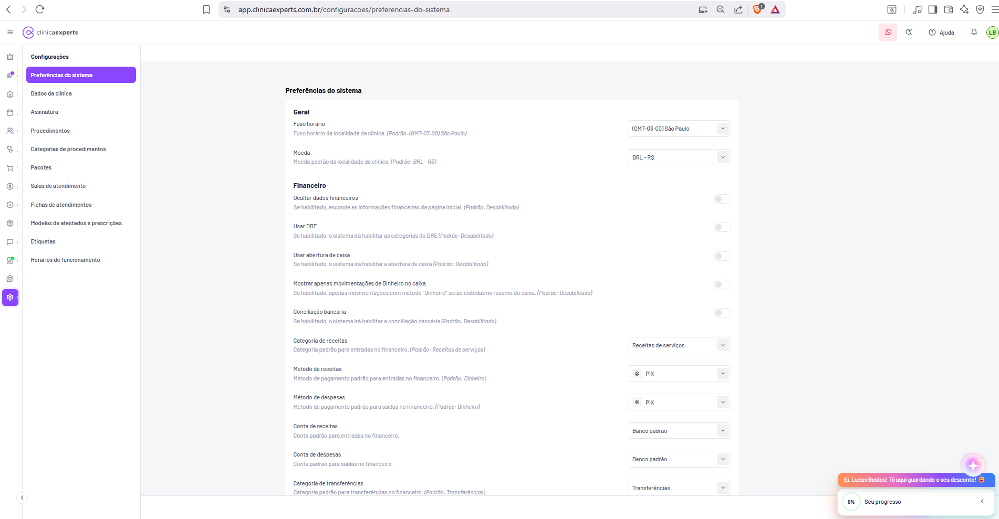

# Configurações / Preferências do Sistema



| Metadado | Valor |
|---|---|
| **Página** | Configurações / Preferências do sistema |
| **Rota** | `/configuracoes/preferencias-do-sistema` |
| **URL completa** | `https://app.clinicaexperts.com.br/configuracoes/preferencias-do-sistema` |
| **Módulo** | Configurações |
| **Breadcrumb / título** | Configurações › Preferências do sistema |
| **Item de submenu ativo** | Preferências do sistema |
| **Tipo de tela** | Formulário de preferências (lista de configurações em seções: rótulo+descrição à esquerda, controle à direita) |
| **Autenticação** | Requer login (usuário "LB" / Lucas Bastos no header) |
| **Idioma** | pt-BR |
| **Data da captura** | 2026-06-22 15:38 |
| **Zoom da captura** | Reduzido (zoom out) — ver §15; página tem rolagem além do recorte |
| **Documento-fonte cruzado** | `docs/05-telas-41-a-50.md` → Tela 50 |

> **Nota de captura:** a tela está com zoom reduzido (zoom out do navegador). Todos os rótulos, descrições e valores documentados abaixo foram lidos diretamente da imagem e são legíveis. Contudo, a página **continua abaixo do recorte** (há mais preferências acessíveis por rolagem); o último item parcialmente visível é **"Categoria de transferências"**. Itens abaixo desse ponto são marcados como **(inferido)** quando não totalmente visíveis.

---

## 1. Identificação

- **Nome da página:** Preferências do sistema
- **Rota:** `/configuracoes/preferencias-do-sistema`
- **Módulo pai:** Configurações (ícone de engrenagem destacado em roxo na sidebar global)
- **Posição na navegação:** primeiro item do submenu "Configurações"
- **Tipo:** Tela de configuração/preferências (sem tabela de dados; lista de toggles e dropdowns agrupados em seções)
- **Persistência:** preferências da clínica (escopo: tenant/clínica logada), pares chave→valor

---

## 2. Objetivo

Central de **configurações gerais e financeiras** da clínica. Permite definir:

- **Localidade:** fuso horário e moeda padrão da clínica.
- **Comportamento do módulo financeiro:** ocultação de dados financeiros na página inicial, uso de DRE, abertura de caixa, filtro de movimentações em dinheiro, conciliação bancária.
- **Valores padrão de lançamento:** categoria, método de pagamento e conta padrão para receitas, despesas e transferências — pré-preenchidos ao registrar movimentações no financeiro, agilizando lançamentos.

Cada preferência traz uma descrição explicativa e a indicação do valor "(Padrão: …)".

---

## 3. Navegação

### 3.1 Chrome global (compartilhado com todo o app)

- **Header (faixa branca, fixo):** hambúrguer (recolher sidebar) + logo **clínicaexperts**. À direita: ícone WhatsApp (badge rosa), busca, **"Ajuda"** (ícone "?"), sino (notificações), avatar **"LB"**.
- **Sidebar global (ícones verticais):** módulos do produto; **engrenagem (Configurações) destacada em roxo** nesta tela. Seta de recolher (`‹`/`›`) no rodapé.
- **FAB:** botão circular roxo **"+"** no canto inferior direito.
- **Widget de onboarding/upsell (canto inferior direito):** faixa laranja **"Ei, Lucas Bastos! Tô aqui guardando o seu desconto!"** + card **"Seu progresso"** com indicador **"0%"** e seta de expandir.

### 3.2 Submenu do módulo "Configurações" (coluna esquerda da área principal)

Cabeçalho do submenu: **"Configurações"** (negrito). Itens, de cima para baixo (textos exatos lidos da tela):

| Ordem | Item | Rota inferida | Estado |
|---|---|---|---|
| 1 | **Preferências do sistema** | `/configuracoes/preferencias-do-sistema` | **Ativo** (fundo/realce roxo) |
| 2 | **Dados da clínica** | `/configuracoes/dados-da-clinica` *(inferido)* | — |
| 3 | **Assinatura** | `/configuracoes/assinatura` *(inferido)* | — |
| 4 | **Procedimentos** | `/configuracoes/procedimentos` *(inferido)* | — |
| 5 | **Categorias de procedimentos** | `/configuracoes/categorias-de-procedimentos` *(inferido)* | — |
| 6 | **Pacotes** | `/configuracoes/pacotes` *(inferido)* | — |
| 7 | **Salas de atendimento** | `/configuracoes/salas-de-atendimento` *(inferido)* | — |
| 8 | **Fichas de atendimentos** | `/configuracoes/fichas-de-atendimentos` *(inferido)* | — |
| 9 | **Modelos de atestados e prescrições** | `/configuracoes/modelos-de-atestados-e-prescricoes` *(inferido)* | — |
| 10 | **Etiquetas** | `/configuracoes/etiquetas` *(inferido)* | — |
| 11 | **Horários de funcionamento** | `/configuracoes/horarios-de-funcionamento` *(inferido)* | — |

> O enunciado da tarefa cita um conjunto de itens (preferências, dados da clínica, procedimentos, categorias de procedimentos, pacotes, fichas de atendimentos, modelos de atestados e prescrições). A tela exibe esse conjunto **acrescido** de "Assinatura", "Salas de atendimento", "Etiquetas" e "Horários de funcionamento" — todos lidos diretamente da imagem.

---

## 4. Layout

```
┌───────────────────────────────────────────────────────────────────────────┐
│ HEADER GLOBAL (logo · WhatsApp · busca · Ajuda · sino · avatar LB)         │
├──────┬──────────────────┬─────────────────────────────────────────────────┤
│ Side │ Submenu          │ ÁREA PRINCIPAL                                    │
│ bar  │ "Configurações"  │                                                   │
│ glob │                  │  Preferências do sistema   (título da seção)      │
│ (eng │ • Preferências   │                                                   │
│  ren │   do sistema ◄   │  ── Geral ───────────────────────────────────     │
│  age │ • Dados da        │  Fuso horário        [ (GMT-03:00) São Paulo ▾]  │
│  m)  │   clínica         │  Moeda               [ BRL - R$              ▾]  │
│      │ • Assinatura      │                                                   │
│      │ • Procedimentos   │  ── Financeiro ──────────────────────────────    │
│      │ • Categorias …    │  Ocultar dados financeiros            ( ●○ off ) │
│      │ • Pacotes         │  Usar DRE                             ( ●○ off ) │
│      │ • Salas …         │  Usar abertura de caixa              ( ●○ off ) │
│      │ • Fichas …        │  Mostrar apenas mov. Dinheiro …      ( ●○ off ) │
│      │ • Modelos …       │  Conciliação bancária               ( ●○ off ) │
│      │ • Etiquetas       │  Categoria de receitas   [ Receitas de serv. ▾]  │
│      │ • Horários …      │  Método de receitas      [ ⊙ PIX            ▾]  │
│      │                   │  Método de despesas      [ ⊙ PIX            ▾]  │
│      │                   │  Conta de receitas       [ Banco padrão     ▾]  │
│      │                   │  Conta de despesas       [ Banco padrão     ▾]  │
│      │                   │  Categoria de transferências [ Transferências ▾]│
│      │                   │  ⋮ (rolagem — mais itens abaixo)                 │
└──────┴──────────────────┴─────────────────────────────────────────────────┘
                                                   [FAB +]   [widget progresso]
```

- **Estrutura de duas colunas internas:** submenu fixo à esquerda; conteúdo à direita.
- **Fundo:** cinza-claro (~`#f5f5f7`); conteúdo sem card branco delimitado (lista direta sobre o fundo) — diferente das telas de Estoque que usam card central.
- **Cada linha de preferência:** bloco à esquerda com **rótulo (negrito) + descrição (cinza, menor)**; controle alinhado à **direita** (toggle ou dropdown).
- **Cabeçalhos de seção** ("Geral", "Financeiro") em negrito, separando grupos.
- **Sem botão "Salvar" visível** no recorte — ver §13/§14 (salvamento por linha ou botão fora da viewport).

---

## 5. Componentes (seções e grupos de configuração)

### 5.1 Título de página
- Texto: **"Preferências do sistema"** — tipo: heading estático.

### 5.2 Seção "Geral"
- Cabeçalho: **"Geral"**.
- Controles: 2 **dropdowns (select)** — Fuso horário, Moeda.

### 5.3 Seção "Financeiro"
- Cabeçalho: **"Financeiro"**.
- Controles: 5 **toggles** (on/off) + 6 **dropdowns (select)** visíveis (+ itens por rolagem).
- Subgrupo conceitual (inferido pela lógica, não há sub-cabeçalho na tela):
  - **Comportamento/recursos** (toggles): Ocultar dados financeiros, Usar DRE, Usar abertura de caixa, Mostrar apenas movimentações de Dinheiro no caixa, Conciliação bancária.
  - **Padrões de lançamento** (dropdowns): Categoria de receitas, Método de receitas, Método de despesas, Conta de receitas, Conta de despesas, Categoria de transferências, e demais por rolagem.

### 5.4 Linha de preferência (componente repetido)
- **Coluna esquerda:** `Rótulo` (negrito) + `Descrição` (texto secundário com sufixo "(Padrão: …)").
- **Coluna direita:** controle:
  - **Toggle** (switch): círculo deslizante; estado off = cinza, on = roxo *(inferido)*.
  - **Select**: caixa com texto do valor + chevron `▾`; alguns com ícone à esquerda (ex.: marca PIX).

---

## 6. Tabelas

**Não há tabelas nesta página.** A tela é um formulário de preferências em lista. (Os controles dropdown abrem listas de opções, mas não são tabelas de dados.)

---

## 7. Formulários / Campos

Legenda de tipo: **Toggle** = switch on/off; **Select** = dropdown de seleção única.

### 7.1 Seção "Geral"

| # | Rótulo (exato) | Descrição (exata) | Tipo | Valor atual | Opções (visíveis/inferidas) | Default |
|---|---|---|---|---|---|---|
| G1 | **Fuso horário** | "Fuso horário da localidade da clínica. (Padrão: (GMT-03:00) São Paulo)" | Select | `(GMT-03:00) São Paulo` | Lista de fusos GMT *(inferido)* | `(GMT-03:00) São Paulo` |
| G2 | **Moeda** | "Moeda padrão da localidade da clínica. (Padrão: BRL - R$)" | Select | `BRL - R$` | Moedas ISO 4217 *(inferido)* | `BRL - R$` |

### 7.2 Seção "Financeiro"

| # | Rótulo (exato) | Descrição (exata) | Tipo | Estado/Valor atual | Opções (visíveis/inferidas) | Default |
|---|---|---|---|---|---|---|
| F1 | **Ocultar dados financeiros** | "Se habilitado, esconde as informações financeiras da página inicial. (Padrão: Desabilitado)" | Toggle | Off (desligado) | on / off | Desabilitado |
| F2 | **Usar DRE** | "Se habilitado, o sistema irá habilitar as categorias do DRE. (Padrão: Desabilitado)" | Toggle | Off | on / off | Desabilitado |
| F3 | **Usar abertura de caixa** | "Se habilitado, o sistema irá habilitar a abertura de caixa. (Padrão: Desabilitado)" | Toggle | Off | on / off | Desabilitado |
| F4 | **Mostrar apenas movimentações de Dinheiro no caixa** | "Se habilitado, apenas movimentações com método 'Dinheiro' serão exibidas no resumo do caixa. (Padrão: Desabilitado)" | Toggle | Off | on / off | Desabilitado |
| F5 | **Conciliação bancária** | "Se habilitado, o sistema irá habilitar a conciliação bancária. (Padrão: Desabilitado)" | Toggle | Off | on / off | Desabilitado |
| F6 | **Categoria de receitas** | "Categoria padrão para entradas no financeiro. (Padrão: Receitas de serviços)" | Select | `Receitas de serviços` | Categorias de receita cadastradas *(inferido)* | Receitas de serviços |
| F7 | **Método de receitas** | "Método de pagamento padrão para entradas no financeiro. (Padrão: Dinheiro)" | Select | `PIX` (com ícone PIX) | Dinheiro, PIX, Crédito, Débito, Boleto, … *(inferido)* | Dinheiro |
| F8 | **Método de despesas** | "Método de pagamento padrão para saídas no financeiro. (Padrão: Dinheiro)" | Select | `PIX` (com ícone PIX) | Dinheiro, PIX, Crédito, Débito, Boleto, … *(inferido)* | Dinheiro |
| F9 | **Conta de receitas** | "Conta padrão para entradas no financeiro." | Select | `Banco padrão` | Contas bancárias/caixa cadastradas *(inferido)* | (não exibido / "Banco padrão") |
| F10 | **Conta de despesas** | "Conta padrão para saídas no financeiro." | Select | `Banco padrão` | Contas bancárias/caixa cadastradas *(inferido)* | (não exibido / "Banco padrão") |
| F11 | **Categoria de transferências** | "Categoria padrão para transferências no financeiro. (Padrão: Transferências)" | Select | `Transferências` | Categorias de transferência *(inferido)* | Transferências |

> Observação: o valor atual de F7/F8 é **PIX**, mas o "(Padrão: Dinheiro)" indica que o usuário já alterou esse padrão da clínica. Isso confirma que as preferências são **persistidas por clínica** e podem divergir do default de fábrica.

### 7.3 Campos abaixo do recorte (inferido)

Por simetria com os pares receita/despesa, é provável existir, por rolagem:
- **Conta de transferências** *(inferido)* — Select.
- Demais preferências do módulo (ex.: numeração de documentos, integrações, NF-e) *(inferido)*.

---

## 8. Filtros

**Não há filtros nesta página** (não é tela de listagem). Não há campo de busca, chips de filtro nem "+ Adicionar filtro".

---

## 9. Estados

- **Estado padrão (carregado):** todas as preferências exibidas com seus valores atuais (toggles off; dropdowns com valores persistidos).
- **Toggle off (atual):** todos os 5 toggles financeiros estão desligados nesta captura.
- **Toggle on (inferido):** switch roxo, círculo à direita.
- **Loading (inferido):** skeleton/spinner ao buscar preferências da clínica.
- **Salvando (inferido):** indicador de salvamento por linha (spinner/toast) ou estado de botão "Salvando…".
- **Sucesso (inferido):** toast "Preferências atualizadas com sucesso" *(inferido)*.
- **Erro (inferido):** toast de erro + reversão do controle ao valor anterior *(inferido)*.
- **Dependências de estado (inferido):**
  - F4 ("Mostrar apenas movimentações de Dinheiro no caixa") faz sentido apenas quando F3 (abertura de caixa) está ativo — pode aparecer desabilitado/condicional *(inferido)*.
  - F2 (Usar DRE) habilita as categorias do DRE em outras telas do financeiro.

---

## 10. Modais

**Nenhum modal nativo da página visível.** As interações ocorrem inline (toggles e dropdowns abrem listas suspensas, não modais).

- **Dropdowns (popover/menu de opções):** ao clicar em um Select, abre lista de opções de seleção única *(inferido)*.
- **Modal de confirmação (inferido):** alguns toggles com impacto estrutural (ex.: "Usar DRE", "Conciliação bancária") podem exibir confirmação antes de aplicar *(inferido)*.

---

## 11. Modelo de dados

### 11.1 `PreferenciasSistema` (chave→valor por configuração)

Modelo de pares chave/valor, escopo por clínica (tenant):

```json
{
  "clinica_id": "uuid",
  "preferencias": {
    "fuso_horario": "(GMT-03:00) São Paulo",
    "moeda": "BRL",
    "ocultar_dados_financeiros": false,
    "usar_dre": false,
    "usar_abertura_caixa": false,
    "mostrar_apenas_dinheiro_caixa": false,
    "conciliacao_bancaria": false,
    "categoria_receitas_id": "uuid (Receitas de serviços)",
    "metodo_receitas": "PIX",
    "metodo_despesas": "PIX",
    "conta_receitas_id": "uuid (Banco padrão)",
    "conta_despesas_id": "uuid (Banco padrão)",
    "categoria_transferencias_id": "uuid (Transferências)"
  },
  "atualizado_em": "2026-06-22T15:38:00-03:00",
  "atualizado_por": "uuid (usuário LB)"
}
```

### 11.2 Dicionário de chaves (inferido)

| Chave (inferida) | Tipo | Valores | Default | Campo UI |
|---|---|---|---|---|
| `fuso_horario` | string (enum GMT) | identificadores de fuso | `(GMT-03:00) São Paulo` | G1 |
| `moeda` | string (ISO 4217) | `BRL`, … | `BRL` | G2 |
| `ocultar_dados_financeiros` | boolean | true/false | false | F1 |
| `usar_dre` | boolean | true/false | false | F2 |
| `usar_abertura_caixa` | boolean | true/false | false | F3 |
| `mostrar_apenas_dinheiro_caixa` | boolean | true/false | false | F4 |
| `conciliacao_bancaria` | boolean | true/false | false | F5 |
| `categoria_receitas_id` | uuid (FK Categoria) | — | "Receitas de serviços" | F6 |
| `metodo_receitas` | enum/uuid (Método pagamento) | Dinheiro, PIX, … | Dinheiro | F7 |
| `metodo_despesas` | enum/uuid (Método pagamento) | Dinheiro, PIX, … | Dinheiro | F8 |
| `conta_receitas_id` | uuid (FK Conta) | — | "Banco padrão" | F9 |
| `conta_despesas_id` | uuid (FK Conta) | — | "Banco padrão" | F10 |
| `categoria_transferencias_id` | uuid (FK Categoria) | — | "Transferências" | F11 |

### 11.3 Entidades relacionadas (FK; inferido)

- **Categoria** (receitas/despesas/transferências) — origem dos selects F6, F11.
- **MetodoPagamento** — F7, F8 (inclui Dinheiro, PIX, Crédito, Débito, Boleto).
- **ContaFinanceira** — F9, F10 ("Banco padrão").

---

## 12. Endpoints API (inferidos)

> Todos **(inferidos)** — não observáveis diretamente na captura.

| Ação | Método | Endpoint (inferido) | Payload / Resposta |
|---|---|---|---|
| Carregar preferências | `GET` | `/api/v1/configuracoes/preferencias-do-sistema` | Retorna objeto de preferências da clínica |
| Salvar todas as preferências | `PUT` | `/api/v1/configuracoes/preferencias-do-sistema` | Body com todas as chaves→valor |
| Salvar uma preferência (auto-save por linha) | `PATCH` | `/api/v1/configuracoes/preferencias-do-sistema` | `{ "chave": "usar_dre", "valor": true }` |
| Opções de categorias (receita) | `GET` | `/api/v1/financeiro/categorias?tipo=receita` | Lista para F6 |
| Opções de categorias (transferência) | `GET` | `/api/v1/financeiro/categorias?tipo=transferencia` | Lista para F11 |
| Opções de métodos de pagamento | `GET` | `/api/v1/financeiro/metodos-pagamento` | Lista para F7/F8 |
| Opções de contas | `GET` | `/api/v1/financeiro/contas` | Lista para F9/F10 |
| Opções de fusos horários | `GET` | `/api/v1/utils/fusos-horarios` | Lista para G1 |
| Opções de moedas | `GET` | `/api/v1/utils/moedas` | Lista para G2 |

---

## 13. Regras

- **Escopo por clínica (tenant):** as preferências são da clínica logada e afetam todos os usuários dela.
- **Defaults de fábrica:** cada preferência tem valor "(Padrão: …)" indicado na descrição; ao não configurar, vale o default.
- **Toggles iniciam desabilitados** por padrão (todos os 5 financeiros = Desabilitado).
- **Efeitos colaterais dos toggles:**
  - **F1 Ocultar dados financeiros** → esconde informações financeiras na página inicial/dashboard.
  - **F2 Usar DRE** → habilita as categorias do DRE no financeiro.
  - **F3 Usar abertura de caixa** → habilita rotina de abertura/fechamento de caixa.
  - **F4 Mostrar apenas Dinheiro no caixa** → filtra o resumo do caixa para método "Dinheiro" (dependente de F3, inferido).
  - **F5 Conciliação bancária** → habilita o módulo/recurso de conciliação bancária.
- **Padrões de lançamento (F6–F11):** pré-selecionam categoria/método/conta ao criar receita, despesa e transferência no financeiro (não bloqueiam alteração no lançamento).
- **Valor pode divergir do default:** F7/F8 estão em "PIX" embora o padrão de fábrica seja "Dinheiro" — confirma persistência da escolha do usuário.
- **Permissão (inferido):** edição restrita a perfis administrativos/gestor.
- **Validação (inferido):** selects exigem valor válido da lista; moeda/fuso de enums fechados.

---

## 14. Fluxos

### 14.1 Fluxo "Salvar preferência (toggle)"
1. Usuário clica em um toggle (ex.: "Usar DRE").
2. UI alterna o estado visual imediatamente (otimista).
3. `PATCH` da chave correspondente *(inferido)*.
4. **Sucesso:** mantém estado + toast de confirmação *(inferido)*.
5. **Erro:** reverte o toggle ao estado anterior + toast de erro *(inferido)*.
6. Recursos dependentes (DRE, caixa, conciliação) passam a refletir a mudança nas demais telas.

### 14.2 Fluxo "Salvar preferência (dropdown)"
1. Usuário abre o Select (ex.: "Método de receitas") e escolhe uma opção.
2. UI atualiza o valor exibido.
3. `PATCH`/`PUT` persistindo o novo valor *(inferido)*.
4. Confirmação por toast *(inferido)*.
5. Novo padrão passa a ser pré-selecionado nos próximos lançamentos financeiros.

### 14.3 Fluxo "Carregar página"
1. `GET` das preferências da clínica.
2. `GET` em paralelo das listas de opções (categorias, métodos, contas, fusos, moedas).
3. Renderiza seções "Geral" e "Financeiro" com valores persistidos.

### 14.4 Fluxo "Navegar no submenu"
1. Usuário clica em outro item ("Dados da clínica", "Procedimentos", etc.).
2. Roteamento para a respectiva rota de configuração; submenu marca o novo item como ativo.

> **Modelo de salvamento (inferido):** não há botão "Salvar" no recorte. Provável **auto-save por linha** (toggle/select dispara persistência imediata). Alternativamente, pode existir um botão "Salvar" no rodapé fora da viewport — registrar verificação ao acessar a tela em zoom normal.

---

## 15. Notas de implementação

- **Captura em zoom reduzido:** documentar/validar a página em zoom 100% para confirmar (a) existência ou não de botão "Salvar"/"Cancelar" no rodapé; (b) preferências adicionais abaixo de "Categoria de transferências" (provável "Conta de transferências" e outras). Os itens visíveis foram lidos integralmente.
- **Layout responsivo:** linha de preferência empilha rótulo+descrição à esquerda e controle à direita; em telas estreitas, controle pode ir abaixo da descrição *(inferido)*.
- **Toggles vs. dropdowns:** padronizar componente de switch (acessível, `role="switch"`, `aria-checked`) e de select (`aria-label` = rótulo da preferência).
- **Persistência chave→valor:** implementar como tabela de pares (`chave`, `valor`, `clinica_id`) ou colunas tipadas; preferir chave→valor pela natureza extensível das preferências.
- **Selects com ícone:** F7/F8 exibem ícone de marca (PIX) à esquerda do texto — o componente de método de pagamento renderiza ícone por método.
- **Dependência condicional:** avaliar exibir F4 desabilitado quando F3 estiver off (UX), conforme regra inferida.
- **Defaults de fábrica:** centralizar os valores "(Padrão: …)" num seed/constante para resetar preferências.
- **Auditoria:** registrar `atualizado_por` / `atualizado_em` por alteração (compliance de quem mudou config financeira sensível como DRE/conciliação).
- **i18n:** todos os textos em pt-BR; fuso e moeda preparados para outras localidades (enum aberto), embora o produto seja pt-BR.
- **Acessibilidade:** garantir que descrição "(Padrão: …)" seja associada ao controle via `aria-describedby`.
- **Diferença de layout vs. outras telas:** ao contrário das telas de Estoque/Comunicação (card branco central + paginação), esta tela usa lista direta de preferências sem card delimitado e sem rodapé de paginação.

---

*Spec da página "Configurações / Preferências do sistema" — cruzada com `docs/05-telas-41-a-50.md` (Tela 50). Inferências marcadas como (inferido).*
