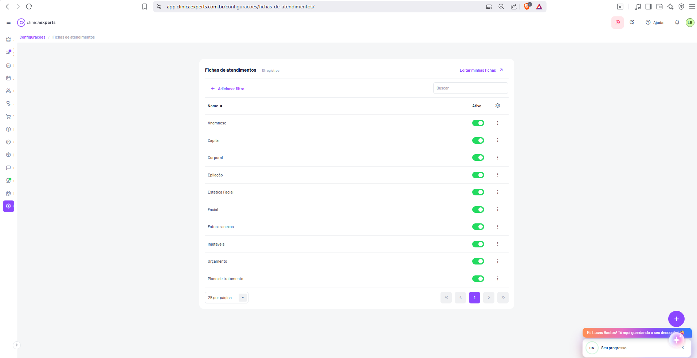

# Configurações / Fichas de Atendimentos

| Metadado | Valor |
|----------|-------|
| **Tela** | Configurações / Fichas de Atendimentos |
| **Rota** | `app.clinicaexperts.com.br/configuracoes/fichas-de-atendimentos/` |
| **Módulo** | Configurações |
| **Tipo** | Listagem (catálogo de modelos) + editor de ficha (inferido) |
| **Idioma** | pt-BR |
| **Perfil/acesso** | Administrador da clínica (inferido) |
| **Captura de referência** | `Captura de tela 2026-06-22 154000.png` |
| **Cruzamento** | `06-telas-51-a-58.md` → Tela 57 |
| **Registros na captura** | 10 registros, todos ativos, página única |
| **Usuário logado** | Lucas Bastos (avatar "LB") |
| **Data da captura** | 2026-06-22 |

---

## 1. Identificação

- **Nome da página:** Fichas de atendimentos
- **Título do card (texto exato):** **"Fichas de atendimentos"**
- **Contador (texto exato):** **"10 registros"** (em cinza, à direita do título)
- **Breadcrumb (texto exato):** `Configurações / Fichas de atendimentos` — sendo **"Configurações"** link clicável em roxo e **"Fichas de atendimentos"** o nó atual (cinza, não clicável).
- **Rota canônica:** `/configuracoes/fichas-de-atendimentos/` (com barra final).
- **Domínio:** `app.clinicaexperts.com.br`
- **Entidade gerenciada:** modelos/tipos de fichas de atendimento (formulários clínicos customizáveis — prontuário).

---

## 2. Objetivo

Gerenciar o **catálogo de modelos de fichas de atendimento** (formulários clínicos customizáveis usados como prontuário durante o atendimento). Cada ficha é um modelo de formulário — anamnese, avaliações por especialidade, captura de fotos/anexos, orçamento e plano de tratamento — que pode ser **ativado/desativado** e **editado** (estrutura de campos personalizável). *(inferido)* Os modelos servem de base para os formulários preenchidos pelo profissional no momento do atendimento e ficam vinculados a procedimentos/especialidades.

**Casos de uso principais:**

1. Visualizar todos os modelos de ficha disponíveis na clínica.
2. Ativar/desativar um modelo (toggle inline) sem precisar excluí-lo.
3. Buscar/filtrar modelos por nome.
4. Editar a estrutura de campos de uma ficha (form builder) *(inferido)*.
5. Criar uma nova ficha personalizada *(inferido — via FAB)*.
6. Duplicar e excluir modelos *(inferido — menu de ações ⋮)*.

**Modelos padrão presentes na captura (10):** Anamnese, Capilar, Corporal, Epilação, Estética Facial, Facial, Fotos e anexos, Injetáveis, Orçamento, Plano de tratamento.

---

## 3. Navegação

- **Como chegar:** Sidebar esquerda → ícone de engrenagem **Configurações** (destacado em roxo) → submenu/seção **"Fichas de atendimentos"**. *(inferido — submenu de Configurações)*
- **Breadcrumb:** clicar em **"Configurações"** retorna ao índice do módulo de configurações.
- **Saídas a partir desta tela:**
  - **"Editar minhas fichas" (↗)** → abre o editor/construtor de fichas (provavelmente nova aba/rota externa ou tela dedicada de personalização). *(inferido)*
  - **FAB "+"** → abre modal/fluxo de **nova ficha**. *(inferido)*
  - **Menu de ações ⋮ por linha** → editar / duplicar / excluir. *(inferido)*
  - **Clique no nome da ficha** → abre o editor da ficha selecionada. *(inferido)*
- **Elementos de chrome comuns** (ver `06-telas-51-a-58.md` › "Elementos comuns"): header superior, sidebar de ícones, widgets fixos inferior-direito, FAB roxo.

---

## 4. Layout

Estrutura de cima para baixo, dentro do **card branco centralizado** na área principal (fundo cinza-claro):

1. **Linha de cabeçalho do card:**
   - Esquerda: título **"Fichas de atendimentos"** + contador **"10 registros"**.
   - Direita: link **"Editar minhas fichas"** com ícone de seta diagonal externa (↗), em roxo.
2. **Barra de filtros/busca:**
   - Esquerda: **"+ Adicionar filtro"** (roxo).
   - Direita: campo **"Buscar"** (input com placeholder).
3. **Tabela/lista:**
   - Cabeçalho com coluna **"Nome"** (com ícone de ordenação ⇅) à esquerda e **"Ativo"** à direita; ícone de engrenagem (⚙) no canto direito do cabeçalho (configurar colunas).
   - 10 linhas, cada uma com: nome (esquerda), toggle Ativo (verde), menu de ações ⋮ (direita).
4. **Rodapé da tabela (paginação):**
   - Esquerda: seletor **"25 por página"** (dropdown).
   - Direita: controles de paginação **«  ‹  1  ›  »** (página "1" ativa, destaque roxo).
5. **FAB:** botão circular roxo **"+"** no canto inferior direito.

**Observações de layout:**

- A coluna "Nome" ocupa praticamente toda a largura; "Ativo" é uma coluna estreita alinhada à direita; o menu ⋮ fica após "Ativo".
- Os nomes das fichas aparecem em texto roxo/link (clicáveis). *(inferido)*

---

## 5. Componentes

| Componente | Texto exato / ícone | Tipo | Comportamento |
|-----------|---------------------|------|---------------|
| Título do card | "Fichas de atendimentos" | Texto (negrito) | Estático |
| Contador | "10 registros" | Texto (cinza) | Reflete total de registros |
| Link de edição | "Editar minhas fichas" + ↗ | Link roxo | Abre editor/construtor de fichas *(inferido)* |
| Adicionar filtro | "+ Adicionar filtro" | Botão/link roxo | Abre seletor de filtros |
| Busca | placeholder "Buscar" | Input texto | Filtra a lista por nome *(inferido)* |
| Cabeçalho ordenável | "Nome" + ⇅ | Header de coluna | Ordena asc/desc por nome |
| Config. de colunas | ⚙ (engrenagem) | Ícone botão | Configura colunas visíveis *(inferido)* |
| Toggle Ativo | switch verde | Toggle inline | Ativa/desativa o modelo *(inferido)* |
| Menu de ações | ⋮ (três pontos verticais) | Menu dropdown | Editar / Duplicar / Excluir *(inferido)* |
| Seletor de página | "25 por página" + ▾ | Dropdown | Define itens por página |
| Paginação | «  ‹  1  ›  » | Controles | Navega entre páginas |
| FAB | "+" | Botão flutuante roxo | Criar nova ficha *(inferido)* |

**Badges/estados visuais:**

- **Toggle Ativo verde (ligado):** indica modelo habilitado e disponível para uso no atendimento.
- **Toggle cinza (desligado):** *(inferido)* modelo desativado — não aparece como opção no atendimento, mas permanece no catálogo.
- Não há badges textuais de tipo na captura; "tipo"/"qtd. de campos"/"procedimentos vinculados" são colunas inferidas (ver §6).

> **Texto exato do botão "Nova ficha":** não há botão textual rotulado na captura — a criação ocorre pelo **FAB "+"** e/ou pelo link **"Editar minhas fichas"**. O rótulo "Nova ficha" / "Adicionar nova ficha de atendimento" é **(inferido)** por analogia às demais telas de Configurações (ex.: "+ Adicionar nova categoria de procedimento", Tela 54).

---

## 6. Tabela / Lista

### 6.1 Colunas visíveis na captura (exatas)

| Coluna | Cabeçalho exato | Ordenável | Conteúdo |
|--------|-----------------|-----------|----------|
| Nome | "Nome" | Sim (⇅) | Nome do modelo de ficha (texto roxo/link) |
| Ativo | "Ativo" | — | Toggle verde (todos ligados na captura) |
| Ações | — | — | Menu ⋮ por linha |

### 6.2 Linhas (dados exatos da captura — 10 registros)

| # | Nome | Ativo | Ações |
|---|------|-------|-------|
| 1 | Anamnese | ● ligado | ⋮ |
| 2 | Capilar | ● ligado | ⋮ |
| 3 | Corporal | ● ligado | ⋮ |
| 4 | Epilação | ● ligado | ⋮ |
| 5 | Estética Facial | ● ligado | ⋮ |
| 6 | Facial | ● ligado | ⋮ |
| 7 | Fotos e anexos | ● ligado | ⋮ |
| 8 | Injetáveis | ● ligado | ⋮ |
| 9 | Orçamento | ● ligado | ⋮ |
| 10 | Plano de tratamento | ● ligado | ⋮ |

### 6.3 Colunas adicionais propostas *(inferido — solicitadas na spec, não visíveis na captura)*

A captura mostra apenas **Nome** e **Ativo**. As colunas abaixo são **inferidas** e podem ser exibidas via o botão de configuração de colunas (⚙):

| Coluna (inferida) | Rótulo proposto | Conteúdo |
|-------------------|-----------------|----------|
| Tipo | "Tipo" | Categoria/natureza da ficha (ex.: Anamnese, Avaliação, Mídia, Financeiro) |
| Qtd. de campos | "Campos" | Número de campos definidos no modelo |
| Procedimentos vinculados | "Procedimentos" | Quantidade/lista de procedimentos associados ao modelo |

### 6.4 Ações por linha (menu ⋮) *(inferido)*

| Ação | Rótulo proposto | Efeito |
|------|-----------------|--------|
| Editar | "Editar" | Abre o construtor de formulário da ficha |
| Duplicar | "Duplicar" | Cria cópia do modelo (mesmos campos, novo nome) |
| Excluir | "Excluir" | Remove o modelo (com confirmação) |
| Ativar/Desativar | (espelha o toggle) | Alterna `ativo` |

---

## 7. Formulários — Editor de Ficha (Construtor / Form Builder) *(inferido)*

> Esta seção é **integralmente inferida**: a captura mostra apenas a listagem. O editor é acessado por **"Editar minhas fichas"**, pelo clique no nome ou pela ação "Editar" do menu ⋮.

### 7.1 Estrutura do editor

- **Cabeçalho da ficha:** campo **"Nome"** do modelo, toggle **"Ativo"** e seletor de **procedimentos/especialidades vinculados**.
- **Canvas central:** área de pré-visualização do formulário, com os campos empilhados na ordem de exibição.
- **Paleta lateral:** lista de **tipos de campo arrastáveis** (drag-and-drop) para o canvas.
- **Painel de propriedades:** ao selecionar um campo, edita rótulo, obrigatoriedade, opções, placeholder, ajuda, largura.

### 7.2 Tipos de campo suportados *(inferido)*

| Tipo | Identificador interno (proposto) | Descrição | Configurações |
|------|----------------------------------|-----------|---------------|
| Texto curto | `text` | Linha única | rótulo, obrigatório, placeholder, máx. caracteres |
| Texto longo | `textarea` | Múltiplas linhas (observações clínicas) | rótulo, obrigatório, linhas |
| Número | `number` | Valor numérico (peso, medidas) | min, max, casas decimais, unidade |
| Seleção única | `select` / `radio` | Lista de opções (uma) | opções, obrigatório |
| Seleção múltipla | `checkbox` / `multiselect` | Várias opções | opções, mín/máx seleções |
| Data | `date` | Seletor de data | formato, intervalo permitido |
| Sim/Não | `boolean` | Toggle/checkbox simples | valor padrão |
| Imagem / Anexo | `image` / `file` | Upload de foto(s) ou arquivo (ex.: ficha "Fotos e anexos") | múltiplos, formatos, tamanho máx. |
| Assinatura | `signature` | Captura de assinatura (consentimento) | obrigatório |
| Seção / Título | `section` | Agrupador/cabeçalho visual | título, descrição |
| Valor monetário | `currency` | Campo R$ (ex.: ficha "Orçamento") | moeda |

### 7.3 Recursos do builder *(inferido)*

- **Arrastar e soltar** para reordenar campos e inserir novos a partir da paleta.
- **Campos por seção/grupo** (organização visual do prontuário).
- **Obrigatoriedade** por campo (asterisco `*`).
- **Pré-visualização** de como o profissional verá a ficha.
- **Salvar** (botão roxo, padrão das telas de Configurações).

---

## 8. Filtros

- **"+ Adicionar filtro"** (roxo): abre seletor de critérios de filtro. *(comportamento idêntico às demais listagens de Configurações)*
- **Filtros inferidos disponíveis:**
  - **Ativo** (Sim/Não)
  - **Tipo** *(se a coluna inferida existir)*
  - **Procedimento vinculado** *(inferido)*
- **Busca textual:** campo **"Buscar"** filtra por **nome** da ficha. *(inferido)*
- **Ordenação:** pela coluna **"Nome"** (⇅), alternando ascendente/descendente.
- **Itens por página:** dropdown **"25 por página"** (outras opções inferidas: 10/25/50/100).

---

## 9. Estados

### 9.1 Estado populado (captura atual)

10 registros, todos ativos, paginação em página única ("1").

### 9.2 Estado vazio (empty state) *(inferido — padrão do app, ver Tela 54)*

- Ícone informativo circular (ⓘ).
- Título: **"Hmm, está vazio por aqui!"**
- Subtítulo: **"Nenhum registro encontrado."**
- Botão de ação roxo: **"+ Adicionar nova ficha de atendimento"** *(inferido por analogia)*.

### 9.3 Outros estados *(inferido)*

- **Carregando:** skeleton/placeholder de linhas.
- **Erro de carregamento:** mensagem de falha com opção de recarregar.
- **Busca sem resultados:** "Nenhum registro encontrado." mantendo barra de busca/filtros.
- **Salvando toggle:** indicador de loading no switch enquanto persiste.

---

## 10. Modais

> Nenhum modal aberto na captura. As estruturas abaixo são **inferidas** com base no padrão das Telas 53–58.

### 10.1 Modal "Nova ficha" *(inferido)*

- **Cabeçalho:** "Nova ficha de atendimento" + botão **"X"**.
- **Campos:**
  - **"Nome*"** — input texto, placeholder "Digite".
  - **"Tipo"** — dropdown "Pesquise/Selecione" *(inferido)*.
  - **"Procedimentos vinculados"** — multiselect "Pesquise/Selecione" *(inferido)*.
  - **"Ativo"** (com ⓘ) — toggle verde (ligado por padrão).
- **Rodapé:** botão **"Cadastrar"** ou **"Salvar"** (roxo, centralizado).
- Após cadastrar, pode redirecionar para o **construtor de formulário** (§7).

### 10.2 Construtor de formulário (modal grande / tela dedicada) *(inferido)*

- Acessível por **"Editar minhas fichas"** ou ação "Editar".
- Estrutura conforme §7 (paleta de tipos arrastáveis, canvas, painel de propriedades, salvar).

### 10.3 Confirmação de exclusão *(inferido)*

- Modal de confirmação: "Tem certeza que deseja excluir esta ficha?" + botões "Cancelar" / "Excluir".

---

## 11. Modelo de Dados *(inferido)*

### 11.1 `FichaAtendimento` (modelo de ficha)

| Campo | Tipo | Descrição |
|-------|------|-----------|
| `id` | int / uuid | Identificador único |
| `nome` | string | Nome do modelo (ex.: "Anamnese") — **obrigatório** |
| `tipo` | enum/string | Tipo/categoria da ficha *(inferido)* |
| `ativo` | boolean | Habilitada para uso (toggle) |
| `qtd_campos` | int (derivado) | Número de campos no modelo |
| `procedimentos_vinculados` | array\<int\> | IDs de procedimentos associados |
| `campos` | array\<CampoFicha\> | Definição dos campos (estrutura do formulário) |
| `padrao` | boolean | Indica modelo de sistema (pré-definido) vs. customizado |
| `ordem` | int | Ordem de exibição |
| `created_at` | datetime | Criação |
| `updated_at` | datetime | Última alteração |
| `clinica_id` | int | Tenant/clínica proprietária |

### 11.2 `CampoFicha` (campo do formulário)

| Campo | Tipo | Descrição |
|-------|------|-----------|
| `id` | int / uuid | Identificador único |
| `ficha_id` | int | FK → `FichaAtendimento` |
| `rotulo` | string | Label exibido |
| `tipo` | enum | `text`, `textarea`, `number`, `select`, `radio`, `checkbox`, `date`, `boolean`, `image`, `file`, `signature`, `currency`, `section` |
| `obrigatorio` | boolean | Campo obrigatório (`*`) |
| `placeholder` | string | Texto-guia |
| `opcoes` | array\<string\> | Opções (para select/radio/checkbox) |
| `ajuda` | string | Texto de ajuda (ⓘ) |
| `ordem` | int | Posição no formulário |
| `secao` | string | Agrupamento/seção |
| `config` | json | Configurações específicas do tipo (min/max, formatos, unidade) |

### 11.3 `RespostaFicha` (preenchimento no atendimento) *(inferido)*

| Campo | Tipo | Descrição |
|-------|------|-----------|
| `id` | int / uuid | Identificador |
| `ficha_id` | int | FK → modelo |
| `atendimento_id` | int | FK → atendimento/consulta |
| `paciente_id` | int | FK → paciente |
| `valores` | json | Mapa `campo_id → valor` preenchido |
| `preenchido_por` | int | FK → profissional |
| `created_at` | datetime | Data do preenchimento |

---

## 12. Endpoints de API *(inferido)*

> Padrão REST inferido a partir das rotas observadas no app.

| Método | Endpoint | Descrição |
|--------|----------|-----------|
| GET | `/api/configuracoes/fichas-de-atendimentos` | Lista modelos (paginação, busca, filtros, ordenação) |
| GET | `/api/configuracoes/fichas-de-atendimentos/{id}` | Detalhe de um modelo + campos |
| POST | `/api/configuracoes/fichas-de-atendimentos` | Cria nova ficha |
| PUT/PATCH | `/api/configuracoes/fichas-de-atendimentos/{id}` | Atualiza ficha (nome, vínculos) |
| PATCH | `/api/configuracoes/fichas-de-atendimentos/{id}/ativo` | Alterna toggle Ativo |
| POST | `/api/configuracoes/fichas-de-atendimentos/{id}/duplicar` | Duplica modelo |
| DELETE | `/api/configuracoes/fichas-de-atendimentos/{id}` | Exclui modelo |
| GET | `/api/configuracoes/fichas-de-atendimentos/{id}/campos` | Lista campos do modelo |
| PUT | `/api/configuracoes/fichas-de-atendimentos/{id}/campos` | Salva/reordena campos (form builder) |
| GET | `/api/configuracoes/fichas-de-atendimentos/export` | Exporta lista *(inferido)* |
| POST | `/api/atendimentos/{atendimentoId}/fichas/{fichaId}/respostas` | Salva preenchimento da ficha no atendimento |

**Parâmetros de query inferidos (listagem):** `?page=1&per_page=25&search=&sort=nome&order=asc&ativo=`

---

## 13. Regras de Negócio *(inferido salvo indicado)*

1. **Multi-tenant:** cada modelo pertence a uma `clinica_id`; visível apenas para a clínica proprietária.
2. **Ativo/Inativo:** apenas fichas com `ativo = true` aparecem como opção durante o atendimento. Desativar não exclui o modelo nem dados já preenchidos.
3. **Modelos padrão:** os 10 modelos exibidos são pré-definidos do sistema (`padrao = true`); podem ser personalizados ("Editar minhas fichas") e desativados, mas a exclusão pode ser restrita.
4. **Nome obrigatório e único** por clínica *(inferido)*.
5. **Vínculo com procedimento:** uma ficha pode ser associada a um ou mais procedimentos/especialidades; ao iniciar um atendimento de um procedimento, as fichas vinculadas e ativas ficam disponíveis/sugeridas para preenchimento.
6. **Preenchimento no atendimento:** os campos `obrigatorio = true` precisam ser preenchidos para concluir/salvar a ficha do atendimento *(inferido)*. As respostas são vinculadas a paciente + atendimento (prontuário).
7. **Exclusão segura:** excluir um modelo não deve apagar respostas históricas já preenchidas (soft delete / preservação do snapshot) *(inferido)*.
8. **Duplicação:** gera cópia independente dos campos, com novo nome (ex.: "Anamnese (cópia)").
9. **Campos de imagem/anexo** respeitam formatos e tamanho máximo definidos no `config` do campo.

---

## 14. Fluxos

### 14.1 Criar uma nova ficha *(inferido)*

1. Usuário clica no **FAB "+"** (ou em "Editar minhas fichas").
2. Abre modal **"Nova ficha"** → preenche **Nome**, opcionalmente **Tipo** e **Procedimentos vinculados**, mantém **Ativo** ligado.
3. Clica em **"Cadastrar"/"Salvar"** → `POST /fichas-de-atendimentos`.
4. Sistema redireciona ao **construtor de formulário** → usuário **arrasta tipos de campo** (texto, seleção, data, imagem…) para o canvas, define rótulos e obrigatoriedade.
5. Clica em **"Salvar"** → `PUT /fichas-de-atendimentos/{id}/campos`.
6. Retorna à listagem; nova ficha aparece com **toggle Ativo verde**.

### 14.2 Vincular ficha a procedimento e preencher no atendimento *(inferido)*

1. No editor da ficha, em **"Procedimentos vinculados"**, seleciona o(s) procedimento(s) → salva (`PATCH`).
2. Durante um **atendimento** desse procedimento, a ficha vinculada e ativa é exibida/sugerida ao profissional.
3. Profissional preenche os campos (validação de obrigatórios) e salva → `POST /atendimentos/{id}/fichas/{fichaId}/respostas`.
4. A ficha preenchida fica anexada ao **prontuário do paciente** naquele atendimento.

### 14.3 Ativar/desativar modelo

1. Usuário clica no **toggle Ativo** da linha → `PATCH .../ativo`.
2. Estado persiste; ficha inativa deixa de ser oferecida nos atendimentos.

### 14.4 Duplicar / Excluir *(inferido)*

- **Duplicar:** ⋮ → "Duplicar" → cópia criada e listada.
- **Excluir:** ⋮ → "Excluir" → modal de confirmação → `DELETE`; respostas históricas preservadas.

---

## 15. Notas de Implementação (Form Builder)

1. **Apenas a listagem é confirmada pela captura.** Todo o editor/construtor, colunas adicionais (Tipo, Campos, Procedimentos), modais e endpoints são **(inferidos)** — validar com o produto real antes de implementar.
2. **Drag-and-drop:** usar biblioteca robusta com suporte a teclado/acessibilidade (ex.: `dnd-kit`) para reordenar campos e arrastar da paleta. Persistir `ordem` por campo.
3. **Schema-driven rendering:** armazenar a estrutura como JSON (`campos[]`) e renderizar o formulário do atendimento dinamicamente a partir desse schema, evitando código por tipo de ficha.
4. **Versionamento de modelo:** ao editar um modelo já utilizado, preservar um **snapshot** da estrutura usada em respostas antigas para não corromper o histórico do prontuário (soft versioning).
5. **Validação dinâmica:** gerar validação (obrigatório, min/max, formato) a partir do `config` de cada `CampoFicha`; validar tanto no cliente quanto no servidor.
6. **Campos de mídia:** upload de imagens/anexos (ficha "Fotos e anexos") com pré-visualização, formatos permitidos (JPG/PNG/JPEG) e limite de tamanho — alinhar com o padrão de upload já usado em "Dados da Clínica" (Tela 51).
7. **Toggle inline otimista:** atualizar a UI imediatamente e reverter em caso de falha do `PATCH .../ativo`.
8. **Reuso de componentes:** tabela, busca, "+ Adicionar filtro", seletor "25 por página", paginação «‹1›» e FAB são **componentes compartilhados** entre as telas de Configurações — reaproveitar.
9. **Acessibilidade:** toggles e menu ⋮ navegáveis por teclado; cabeçalho de coluna ordenável com `aria-sort`.
10. **Multi-tenant:** todos os endpoints devem escopar por `clinica_id` do usuário autenticado.
11. **Performance:** `qtd_campos` e `procedimentos_vinculados` como contadores derivados/denormalizados para exibir colunas sem N+1.
